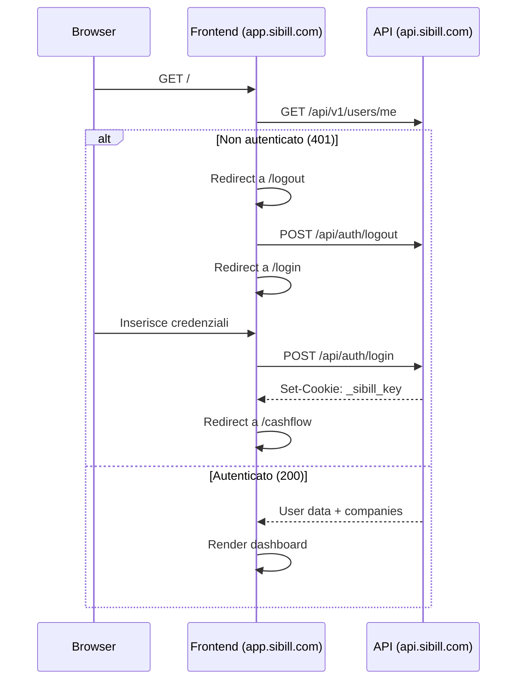

# Panoramica Tecnica — Sibill

**Data ricognizione:** 10 febbraio 2026
**URL:** https://app.sibill.com/
**Stato sottoscrizione:** TRIAL (scade 16/02/2026)
**Azienda:** WEISS S.R.L. (ID: `14196c00-6ac1-4bab-9874-9b01c2fe17a7`)

---

## Riepilogo Esecutivo

Questo documento e' parte di un progetto di reverse engineering completo di Sibill, piattaforma SaaS italiana di tesoreria aziendale. L'analisi e' stata condotta il 10 febbraio 2026 tramite navigazione automatizzata (Playwright) e analisi statica del codice JavaScript.

### Risultati chiave

| Metrica | Valore |
|---------|--------|
| **Pagine mappate** | 23 sezioni funzionali |
| **API endpoint documentati** | 67 endpoint REST (JSON:API) |
| **Entita' modello dati** | 19+ entita' con relazioni |
| **File JS analizzati** | 64 chunk (188 totali nel build) |
| **Screenshot catturati** | 69 |
| **Regole business estratte** | 30+ validazioni, 8 algoritmi, 13 enum |

### Scoperte principali

1. **Stack:** React 18 + Vite + MUI + Jotai + TanStack Query + Recharts
2. **Backend:** Probabilmente Elixir/Phoenix (🟡), non Ruby on Rails come ipotizzato inizialmente
3. **Banking:** Integrazione Open Banking via **Swan** (BaaS) — niente CBI/SEPA file-based tradizionale
4. **Auth:** Cookie-based session (`_sibill_key`), no JWT
5. **Fatturazione elettronica:** Integrazione SDI via delega Cassetto Fiscale (Agenzia Entrate)
6. **Paginazione:** Cursor-based (non offset/limit)

### Indice documentazione

| # | Documento | Descrizione | Dimensione |
|---|-----------|-------------|------------|
| 00 | [overview.md](00-overview.md) | Questo file — panoramica tecnica | ~9 KB |
| 01 | [app-map.md](01-app-map.md) | Mappa applicazione + diagramma navigazione | ~10 KB |
| 02 | [auth-sessioni.md](02-auth-sessioni.md) | Autenticazione, cookie, sessioni | ~17 KB |
| 03 | [data-model.md](03-data-model.md) | Modello dati ER con 19+ entita' | ~29 KB |
| 04 | [api-reference.md](04-api-reference.md) | Documentazione API (67 endpoint) | ~35 KB |
| 05 | [cash-flow.md](05-cash-flow.md) | Modulo cash flow e previsioni | ~13 KB |
| 06 | [riconciliazione.md](06-riconciliazione.md) | Riconciliazione bancaria | ~9 KB |
| 07 | [scadenzario.md](07-scadenzario.md) | Gestione scadenze e ricorrenze | ~9 KB |
| 08 | [pagamenti.md](08-pagamenti.md) | Disposizioni di pagamento | ~10 KB |
| 09 | [connessione-bancaria.md](09-connessione-bancaria.md) | Open Banking via Swan | ~14 KB |
| 10 | [formati-cbi-sepa.md](10-formati-cbi-sepa.md) | Formati integrazione bancaria | ~24 KB |
| 11 | [reportistica.md](11-reportistica.md) | Dashboard, report, export | ~11 KB |
| 12 | [javascript-analysis.md](12-javascript-analysis.md) | Analisi JS: 25+ librerie, componenti | ~25 KB |
| 13 | [regole-business.md](13-regole-business.md) | Regole business, validazioni, enum | ~26 KB |
| 14 | [test-verifica.md](14-test-verifica.md) | Verifiche effettuate e confidenza | ~15 KB |
| 15 | [mapping-gestionale.md](15-mapping-gestionale.md) | Mappatura verso gestionale target | ~29 KB |

**Dimensione totale documentazione:** ~275 KB

### Materiale raccolto per analisi offline

| Asset | Quantita' | Path |
|-------|-----------|------|
| Screenshot | 69 file | `assets/screenshots/` |
| File JS | 64 file | `assets/js-sources/` |
| API traces | 14 file (per sezione) | `assets/api-traces/` |
| HAR completo | 5.857 richieste (15 MB) | `assets/har/` |
| API requests filtrate | 1.243 richieste API (6 MB) | `assets/har/api-requests.json` |
| Catalogo API | JSON strutturato | `.tmp/api-catalog.json` |
| Storage data | Cookie + localStorage | `.tmp/storage-data.json` |

---

## Stack Tecnologico

| Componente | Tecnologia | Confidenza |
|---|---|---|
| **Framework frontend** | React (con Vite come bundler) | 🟢 Alta |
| **UI Library** | Material UI (MUI) + React Aria | 🟢 Alta |
| **Bundler** | Vite (confermato da struttura `/assets/index-*.js`) | 🟢 Alta |
| **Routing** | React Router (SPA client-side routing) | 🟢 Alta |
| **Architettura** | SPA (Single Page Application) | 🟢 Alta |
| **API Backend** | REST JSON:API (`api.sibill.com`) | 🟢 Alta |
| **CDN/Hosting** | Cloudflare (frontend) + Amazon S3/CloudFront (assets statici) | 🟢 Alta |
| **Error Tracking** | Sentry (`exceptions.sibill.com`, SDK v10.38.0) | 🟢 Alta |
| **Analytics** | Segment (`tracking.sibill.com`) | 🟢 Alta |
| **Font** | Public Sans (Google Fonts) | 🟢 Alta |

### Integrazioni Terze Parti

| Servizio | Tipo | Dettagli |
|---|---|---|
| **Intercom** | Chat/Support | App ID: `s8alsk5h`, API EU (`api-iam.eu.intercom.io`) |
| **HubSpot** | Marketing/CRM | Portal ID: `24972410` (EU) |
| **Customer.io** | Email Marketing | Site ID: `4edb875e094f7948741b` (EU) |
| **Hotjar** | Heatmap/Recording | hjid: `2748974` |
| **SatisMeter** | NPS/Feedback | - |
| **Segment** | Analytics Hub | Write key: `BV5jDAqT69LktXst1HxsNlqVEFs9lBck` |
| **Gist** | In-app messaging | - |
| **Sentry** | Error Monitoring | DSN: `exceptions.sibill.com` |
| **Facebook Pixel** | Ads Tracking | - |

---

## Autenticazione

| Proprietà | Valore | Confidenza |
|---|---|---|
| **Tipo** | Cookie-based session | 🟢 Alta |
| **Login endpoint** | `POST /api/auth/login` | 🟢 Alta |
| **Logout endpoint** | `POST /api/auth/logout` | 🟢 Alta |
| **User info endpoint** | `GET /api/v1/users/me?include=companies,companies.companyIdentity,companies.companySettings` | 🟢 Alta |
| **Token refresh** | `GET /api/v1/users/token` | 🟡 Media |
| **Cookie di sessione** | `_sibill_key` (httpOnly, secure) | 🟢 Alta |
| **Cookie locale** | `sibill_locale=it` | 🟢 Alta |
| **Company ID** | Salvato in `localStorage["sibill-company-id"]` | 🟢 Alta |

### Flusso di autenticazione



---

## Architettura dell'Applicazione

### Frontend

```
app.sibill.com (Cloudflare)
├── /assets/index-N-OxfZQQ.js         → Bundle principale React
├── /assets/index-C44KOzpR.css         → CSS principale
├── /assets/index-DT7u4BM2.js          → Core modules
├── /assets/index-D10DT0XY.js          → Additional modules
├── /assets/CashFlowPage--BaMgJEI.js   → Code splitting per pagina
├── /assets/Login-DLieno2m.js          → Code splitting login
└── /assets/*.js                        → ~60+ chunk JS (code splitting)
```

**Pattern di code splitting:** Vite produce chunk separati per ogni pagina/sezione. I nomi dei file JS rivelano la struttura dei componenti (es. `CashFlowPage`, `CartesianChart`, `BankAccountFilter`, `CategoryChip`, ecc.).

### Backend API

```
api.sibill.com (Cloudflare)
├── /api/auth/*          → Autenticazione (login, logout)
├── /api/v1/users/*      → Gestione utenti
├── /api/v1/companies/*  → Gestione aziende
├── /api/v1/accounts/*   → Conti bancari
├── /api/v1/transactions/* → Movimenti bancari
├── /api/v1/cashflow/*   → Cash flow e previsioni
├── /api/v1/categories/* → Categorie transazioni
├── /api/v1/payments/*   → Pagamenti
├── /api/v1/reconciliations/* → Riconciliazioni
├── /api/v1/recurrences/* → Ricorrenze
├── /api/v1/documents/*  → Fatture/documenti
├── /api/v1/counterparts/* → Clienti e fornitori
├── /api/v1/institutions/* → Istituti bancari
├── /api/v1/consents/*   → Consensi bancari (Open Banking)
├── /api/v1/subscriptions/* → Sottoscrizioni
├── /api/v1/cards/*      → Carte
└── /api/v1/user-bank-accounts/* → Conti bancari utente
```

**Formato API:** JSON:API (`application/vnd.api+json`)
**Pattern include:** L'API supporta il parametro `include` per eager loading delle relazioni (es. `?include=companies,companies.companyIdentity`).

### Infrastruttura

```
cdn.sibill.com (Amazon CloudFront/S3)
├── /next-integrations/   → Integrazioni Segment
└── /v1/projects/*/       → Configurazione Segment

tracking.sibill.com       → Segment Analytics proxy
exceptions.sibill.com     → Sentry proxy
```

---

## API Endpoints Scoperti

| Metodo | Endpoint | Descrizione | Confidenza |
|---|---|---|---|
| `POST` | `/api/auth/login` | Login utente | 🟢 Alta |
| `POST` | `/api/auth/logout` | Logout utente | 🟢 Alta |
| `GET` | `/api/v1/users/me` | Profilo utente + company | 🟢 Alta |
| `GET` | `/api/v1/users/token` | Refresh token | 🟡 Media |
| `GET` | `/api/v1/users/chat-token` | Token per Intercom chat | 🟢 Alta |
| `GET` | `/api/v1/companies/` | Lista aziende | 🟢 Alta |
| `GET` | `/api/v1/companies/{id}` | Dettaglio azienda | 🟢 Alta |
| `GET` | `/api/v1/company-users` | Utenti dell'azienda | 🟢 Alta |
| `GET` | `/api/v1/accounts` | Conti bancari | 🟢 Alta |
| `GET` | `/api/v1/accounts/metadata` | Metadati conti | 🟢 Alta |
| `GET` | `/api/v1/user-bank-accounts` | Conti bancari utente | 🟢 Alta |
| `GET` | `/api/v1/transactions` | Movimenti bancari | 🟢 Alta |
| `GET` | `/api/v1/transactions/metadata` | Metadati movimenti | 🟢 Alta |
| `GET` | `/api/v1/transactions/reconciliations` | Riconciliazioni transazioni | 🟢 Alta |
| `GET` | `/api/v1/cashflow/chart` | Dati grafico cashflow | 🟢 Alta |
| `GET` | `/api/v1/cashflow/table` | Dati tabella cashflow | 🟢 Alta |
| `GET` | `/api/v1/categories` | Categorie transazioni | 🟢 Alta |
| `GET` | `/api/v1/payments` | Pagamenti | 🟢 Alta |
| `GET` | `/api/v1/payments/metadata` | Metadati pagamenti | 🟢 Alta |
| `GET` | `/api/v1/reconciliations/` | Riconciliazioni automatiche | 🟢 Alta |
| `GET` | `/api/v1/recurrences` | Ricorrenze | 🟢 Alta |
| `GET` | `/api/v1/documents` | Fatture/documenti | 🟢 Alta |
| `GET` | `/api/v1/documents/metadata` | Metadati documenti | 🟢 Alta |
| `GET` | `/api/v1/documents-dashboard/summary` | Riepilogo dashboard fatture | 🟢 Alta |
| `GET` | `/api/v1/counterparts` | Clienti e fornitori | 🟢 Alta |
| `GET` | `/api/v1/counterparts/metadata` | Metadati clienti/fornitori | 🟢 Alta |
| `GET` | `/api/v1/counterparts/suggested` | Suggerimenti clienti/fornitori | 🟢 Alta |
| `GET` | `/api/v1/institutions` | Istituti bancari disponibili | 🟢 Alta |
| `GET` | `/api/v1/consents` | Consensi Open Banking | 🟢 Alta |
| `GET` | `/api/v1/subscriptions` | Sottoscrizioni/abbonamento | 🟢 Alta |
| `GET` | `/api/v1/cards` | Carte | 🟢 Alta |

---

## Materiale Raccolto

| Tipo | Quantità | Directory |
|---|---|---|
| Screenshot | 68 file | `assets/screenshots/` |
| File JS | 66 file | `assets/js-sources/` |
| Network requests | 5.857 totali, 1.243 API | `assets/har/` |
| Storage data | localStorage + cookies | `.tmp/storage-data.json` |
| Scout data (JSON) | Strutturato | `.tmp/scout-complete.json` |
| Navigation structure | Menu + links | `.tmp/nav-structure.json` |

---

## 🔵 NOTE

- **L'app è una SPA React moderna** con code splitting aggressivo tramite Vite. Ogni pagina ha il suo chunk JS, rendendo l'analisi del codice client-side più granulare.
- **L'API è JSON:API compliant**, il che significa che le relazioni tra entità sono esplicite e documentate nella struttura delle risposte.
- **Cloudflare protegge sia frontend che backend**, con cookie `_cfuvid` e `__cf_bm` per bot detection.
- **Il routing React segue un pattern gerarchico**: `/transactions/movements`, `/outstanding/recurrences/received`, `/invoices/profile/company-data`.
- **Il localStorage contiene informazioni utili** per l'analisi: company ID, user traits, cashflow period selezionato.
- **Il backend è probabilmente Elixir/Phoenix** (deducibile dai cursor base64 che contengono riferimenti a moduli Elixir, e dal pattern JSON:API). L'ipotesi iniziale Ruby on Rails è stata rivalutata dopo l'analisi approfondita dei cursor di paginazione. Confidenza: 🟡 Media.
