# Mappa dell'Applicazione — Sibill

**Data ricognizione:** 10 febbraio 2026
**Pagine effettive mappate:** 23
**Screenshot salvati:** 68 file (di cui ~23 pagine reali, il resto catch-all per URL inesistenti)

---

## Struttura del Menu di Navigazione

La navigazione principale di Sibill è organizzata in una **sidebar laterale sinistra** con le seguenti sezioni principali:

```mermaid
graph TD
    ROOT[app.sibill.com] --> CASHFLOW[Cashflow]
    ROOT --> TRANSACTIONS[Transazioni]
    ROOT --> OUTSTANDING[Scadenzario]
    ROOT --> INVOICES[Fatture]
    ROOT --> F24[F24]
    ROOT --> SETTINGS[Impostazioni]

    CASHFLOW --> CF_MAIN["/cashflow - Flussi di cassa"]
    CASHFLOW --> CF_CAT["/cashflow/categories - Categorie"]

    TRANSACTIONS --> TX_MOV["/transactions/movements - Movimenti"]
    TRANSACTIONS --> TX_PAY["/transactions/payments - Pagamenti"]
    TRANSACTIONS --> TX_RULES["/transactions/rules - Regole"]
    TRANSACTIONS --> RECON["/reconciliations - Riconciliazioni automatiche"]
    TRANSACTIONS --> ACCOUNTS["/accounts - Conti bancari"]

    OUTSTANDING --> OS_MAIN["/outstanding - Scadenzario"]
    OUTSTANDING --> OS_RECUR_PAY["/outstanding/recurrences/received - Ricorrenze Pagamenti"]
    OUTSTANDING --> OS_RECUR_INC["/outstanding/recurrences/issued - Ricorrenze Incassi"]
    OUTSTANDING --> OS_RULES["/outstanding/rules - Regole"]

    INVOICES --> INV_DASH["/invoices/dashboard - Situazione"]
    INVOICES --> INV_ISSUED["/invoices/issued - Emesse"]
    INVOICES --> INV_RECEIVED["/invoices/received - Ricevute"]
    INVOICES --> INV_BILLS["/invoices/bills - Corrispettivi"]
    INVOICES --> INV_COUNTER["/counterparts - Clienti e fornitori"]
    INVOICES --> INV_PROFILE["/invoices/profile - Profilo fatturazione"]
    INVOICES --> INV_CREATE["/invoices/info - Crea fattura"]
    INVOICES --> INV_IMPORT["/invoices/import - Carica fatture"]

    INV_PROFILE --> INV_PROF_CO["/invoices/profile/company-data - Dati azienda"]
    INV_PROFILE --> INV_PROF_DEF["/invoices/profile/defaults - Valori predefiniti"]

    F24 --> F24_MAIN["/f24 - Pagamento F24"]

    SETTINGS --> SET_TEAM["/settings/team - Team"]

    ROOT --> REFERRAL["/referral - Referral"]
```

---

## Elenco Completo delle Pagine

### 1. Cashflow (Flussi di Cassa)

| # | URL | Titolo | Screenshot | Componenti | Azioni |
|---|---|---|---|---|---|
| 1 | `/cashflow` | Flussi di cassa \| Sibill | `01-dashboard.png` | Tabelle, Grafici (183 SVG), Filtri | Aggiungi, Personalizza, Esporta, Filtro periodo, Filtro conti |
| 2 | `/cashflow/categories` | Categorie \| Sibill | `08-cashflow-categories.png` | Tabelle, Tabs (Cashflow/Categorie) | - |

**Nota:** La homepage dopo il login reindirizza a `/cashflow`. Questa è la dashboard principale con il grafico dei flussi di cassa e la tabella riepilogativa.

### 2. Transazioni

| # | URL | Titolo | Screenshot | Componenti | Azioni |
|---|---|---|---|---|---|
| 3 | `/transactions/movements` | Movimenti \| Sibill | `02-transactions-movements.png` | Tabella movimenti (212 righe visibili), Filtri (Data, Categoria, Conti, Status, Importo, Visibilità, Tipo, Categorizzazione), Input (30) | Scarica, Ricerca, Filtri |
| 4 | `/transactions/payments` | Pagamenti \| Sibill | `03-transactions-payments.png` | Tabella pagamenti | - |
| 5 | `/transactions/rules` | Regole transazioni | `06-transactions-rules.png` | - | - |
| 6 | `/reconciliations` | Riconciliazioni automatiche | `04-reconciliations.png` | Tabelle | - |
| 7 | `/accounts` | Conti \| Sibill | `05-accounts.png` | Tabella conti, Tabs con saldi (12.093,43 €, 10.190,17 €, 1.903,26 €) | Gestione conti |

**Tabs nella sezione Transazioni:** Movimenti, Pagamenti, Regole

### 3. Scadenzario

| # | URL | Titolo | Screenshot | Componenti | Azioni |
|---|---|---|---|---|---|
| 8 | `/outstanding` | Scadenzario | `09-outstanding.png` | Tabelle | - |
| 9 | `/outstanding/recurrences/received` | Ricorrenze (Pagamenti) | `10-outstanding-recurrences-received.png` | Tabelle, Input, Tabs (Pagamenti/Incassi) | - |
| 10 | `/outstanding/recurrences/issued` | Ricorrenze (Incassi) | `60-outstanding-recurrences-issued.png` | Tabelle | - |
| 11 | `/outstanding/rules` | Regole scadenzario | `11-outstanding-rules.png` | Tabelle | - |

**Tabs nella sezione Scadenzario:** Scadenzario, Ricorrenze, Regole

### 4. Fatture

| # | URL | Titolo | Screenshot | Componenti | Azioni |
|---|---|---|---|---|---|
| 12 | `/invoices/dashboard` | Situazione fatture | `12-invoices-dashboard.png` | Tabelle, Grafici | - |
| 13 | `/invoices/issued` | Emesse | `13-invoices-issued.png` | Tabella fatture emesse | - |
| 14 | `/invoices/received` | Ricevute | `14-invoices-received.png` | Tabella fatture ricevute | - |
| 15 | `/invoices/bills` | Corrispettivi | `15-invoices-bills.png` | Tabella corrispettivi | - |
| 16 | `/counterparts` | Clienti e fornitori | `16-counterparts.png` | Tabella clienti/fornitori | - |
| 17 | `/invoices/profile/company-data` | Profilo fatturazione - Dati azienda | `17-invoices-profile-company-data.png` | Form dati azienda | - |
| 18 | `/invoices/profile/defaults` | Profilo fatturazione - Valori predefiniti | `61-invoices-profile-defaults.png` | Form impostazioni | - |
| 19 | `/invoices/info` | Crea fattura | `18-invoices-info.png` | - | - |
| 20 | `/invoices/import` | Carica fatture | `19-invoices-import.png` | Upload area, Input | - |

### 5. F24

| # | URL | Titolo | Screenshot | Componenti | Azioni |
|---|---|---|---|---|---|
| 21 | `/f24` | F24 \| Sibill | `20-f24.png` | Tabelle, FAQ espandibili | Paga F24 |

**Nota:** Servizio di pagamento F24 tramite Sibill. La pagina contiene FAQ dettagliate sul servizio.

### 6. Impostazioni

| # | URL | Titolo | Screenshot | Componenti | Azioni |
|---|---|---|---|---|---|
| 22 | `/settings/team` | Team \| Sibill | `22-settings-team.png` | - | Gestione membri team |

### 7. Altro

| # | URL | Titolo | Screenshot | Componenti | Azioni |
|---|---|---|---|---|---|
| 23 | `/referral` | Programma Referral | `21-referral.png` | Tabelle, Input | Invita e ricevi 500€ |

---

## Navigazione Interna Scoperta

Dall'analisi dei link interni, la navigazione è organizzata così:

### Menu Sidebar (Navigazione Principale)

1. **Cashflow** → `/cashflow`
   - Categorie → `/cashflow/categories`
2. **Transazioni**
   - Movimenti → `/transactions/movements`
   - Pagamenti → `/transactions/payments`
   - Regole → `/transactions/rules`
3. **Riconciliazioni automatiche** → `/reconciliations`
4. **Gestisci conti** → `/accounts`
5. **Scadenzario** → `/outstanding`
   - Ricorrenze → `/outstanding/recurrences`
     - Pagamenti → `/outstanding/recurrences/received`
     - Incassi → `/outstanding/recurrences/issued`
   - Regole → `/outstanding/rules`
6. **Fatture**
   - Situazione → `/invoices` (redirect a `/invoices/dashboard`)
   - Emesse → `/invoices/issued`
   - Ricevute → `/invoices/received`
   - Corrispettivi → `/invoices/bills`
   - Clienti e fornitori → `/counterparts`
   - Profilo fatturazione → `/invoices/profile/company-data`
   - Crea fattura → `/invoices/info`
   - Carica fatture → `/invoices/import`
7. **F24** → `/f24` (con badge "Novità")
8. **Referral** → `/referral` (con testo "Ricevi 500 €")
9. **Impostazioni**
   - Team → `/settings/team`

---

## Dati Osservati nei Movimenti

Dalla pagina `/transactions/movements` sono stati osservati i seguenti tipi di transazione:

| Tipo | Esempio |
|---|---|
| **Bonifico** | Pagamento affitto, fornitori, incassi POS (Worldline) |
| **Commissioni** | Commissioni su bonifico, commissioni SEPA B2B |
| **Addebito diretto** | SDD Core (utenze, SEPA) |

### Categorie Osservate

- Gestione / Locazione
- Gestione / Commissioni
- Gestione / Utenze
- Incassi / Pos
- Finanziamenti, mutui, leasing
- Non categorizzata

### Filtri Disponibili nella Tabella Movimenti

| Filtro | Tipo |
|---|---|
| Ricerca (descrizioni e note) | Testo libero |
| Data | Range date |
| Categoria | Dropdown |
| Conti | Dropdown (multi-select) |
| Status | Dropdown |
| Importo | Range numerico |
| Visibilità | Dropdown |
| Tipo | Dropdown |
| Categorizzazione | Dropdown |

### Colonne Tabella Movimenti

| Colonna | Descrizione |
|---|---|
| Data | Data dell'operazione |
| Descrizione | Tipo operazione + descrizione dettagliata |
| Importo | Importo in EUR (positivo = entrata, negativo = uscita) |
| Categoria | Categoria assegnata (gerarchica: Macro / Sotto) |
| Verificato | Checkbox di verifica manuale |

---

## Conti Bancari Osservati

| IBAN (parziale) | Descrizione | Tipo |
|---|---|---|
| 07084 64990 000000751821 | Conto corrente | WEISS S.R.L. |
| 07084 64990 000000982285 | Conto corrente | WEISS S.R.L. |

**Saldi osservati (tabs nella pagina Conti):**
- Saldo totale: 12.093,43 €
- Saldo disponibile: 10.190,17 €
- Differenza: 1.903,26 €

---

## URL che Non Corrispondono a Pagine Reali

I seguenti URL provati non corrispondono a pagine specifiche (redirect alla home o pagina generica):

`/dashboard`, `/tesoreria`, `/cash-flow`, `/previsioni`, `/conti`, `/conti-bancari`, `/bank-accounts`, `/movimenti`, `/movements`, `/fatture`, `/fatturazione`, `/scadenzario`, `/scadenze`, `/deadlines`, `/riconciliazione`, `/reconciliation`, `/pagamenti`, `/payments`, `/carte`, `/cards`, `/report`, `/reports`, `/analytics`, `/impostazioni`, `/configurazione`, `/connessioni`, `/connections`, `/connessioni-bancarie`, `/clienti`, `/fornitori`, `/contatti`, `/categorie`, `/tags`

Queste URL portano tutte alla stessa pagina generica (catch-all React Router). L'app usa una struttura URL specifica che non corrisponde ai nomi italiani "ovvi".

---

## Mapping URL Reali → Sezioni

| Sezione | URL Reale | URL Alternativi (redirect) |
|---|---|---|
| Dashboard/Cashflow | `/cashflow` | `/`, `/dashboard`, `/cash-flow`, `/tesoreria` (tutti redirect qui) |
| Movimenti | `/transactions/movements` | `/transactions`, `/movimenti`, `/movements` |
| Pagamenti | `/transactions/payments` | `/pagamenti`, `/payments` |
| Conti | `/accounts` | `/conti`, `/bank-accounts`, `/conti-bancari` |
| Scadenzario | `/outstanding` | `/scadenzario`, `/scadenze`, `/deadlines` |
| Riconciliazioni | `/reconciliations` | `/riconciliazione`, `/reconciliation` |
| Fatture | `/invoices/dashboard` | `/invoices`, `/fatture`, `/fatturazione` |
| Impostazioni | `/settings/team` | `/settings`, `/impostazioni`, `/configurazione` |
