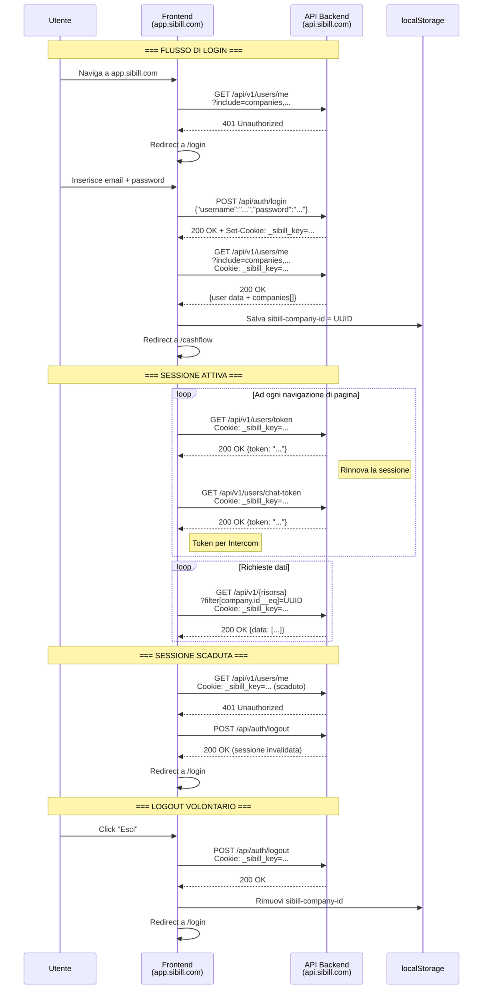

# Autenticazione e Sessioni — Sibill

**Data analisi:** 10 febbraio 2026
**Fonte dati:** HAR catturati, API traces (`01-auth-flow.json`), storage data, scout data
**Base URL API:** `https://api.sibill.com`

---

## Indice

1. [Panoramica del sistema di autenticazione](#1-panoramica-del-sistema-di-autenticazione)
2. [Flusso di login](#2-flusso-di-login)
3. [Cookie e gestione sessione](#3-cookie-e-gestione-sessione)
4. [Headers delle richieste API](#4-headers-delle-richieste-api)
5. [Refresh del token](#5-refresh-del-token)
6. [Gestione multi-company](#6-gestione-multi-company)
7. [Flusso di logout](#7-flusso-di-logout)
8. [Sequence diagram completo](#8-sequence-diagram-completo)
9. [Riepilogo livelli di confidenza](#9-riepilogo-livelli-di-confidenza)

---

## 1. Panoramica del sistema di autenticazione

Sibill utilizza un sistema di **autenticazione basato su cookie di sessione server-side**. Non viene utilizzato JWT client-side visibile -- il token di sessione e' incapsulato nel cookie `_sibill_key`, che e' `httpOnly` e quindi non accessibile da JavaScript. Confidenza: 🟢 Alta

| Proprieta' | Valore | Confidenza |
|---|---|---|
| **Tipo autenticazione** | Cookie-based session | 🟢 Alta |
| **Cookie di sessione** | `_sibill_key` | 🟢 Alta |
| **Dominio cookie sessione** | `api.sibill.com` | 🟢 Alta |
| **Protocollo** | HTTPS obbligatorio (cookie `secure`) | 🟢 Alta |
| **Formato API** | JSON:API (`application/vnd.api+json`) | 🟢 Alta |
| **Backend presunto** | Ruby on Rails o Elixir/Phoenix | 🟡 Media |

---

## 2. Flusso di login

### Endpoint di login

| Proprieta' | Valore |
|---|---|
| **Metodo** | `POST` |
| **URL** | `https://api.sibill.com/api/auth/login` |
| **Content-Type** | `application/vnd.api+json` |
| **Accept** | `application/vnd.api+json` |

### Request body

```json
{
  "username": "email@esempio.it",
  "password": "[REDACTED]"
}
```

Confidenza: 🟢 Alta -- osservato direttamente nella trace `01-auth-flow.json`.

### Response

- **Status:** `200 OK`
- **Body:** contiene un campo `token` (il valore e' stato redatto per sicurezza)
- **Set-Cookie:** il server imposta il cookie `_sibill_key` nella risposta

Confidenza: 🟢 Alta

### Comportamento post-login

Dopo il login riuscito:

1. Il browser riceve il cookie `_sibill_key` (impostato dal server con `Set-Cookie`)
2. Il frontend esegue immediatamente `GET /api/v1/users/me?include=companies,companies.companyIdentity,companies.companySettings`
3. Dalla risposta, il frontend estrae il company ID e lo salva in `localStorage["sibill-company-id"]`
4. L'utente viene reindirizzato a `/cashflow` (dashboard principale)

Confidenza: 🟢 Alta

### Gestione autenticazione fallita

Se il frontend tenta `GET /api/v1/users/me` senza sessione valida:

1. Il server risponde con **401 Unauthorized**
2. Il frontend reindirizza a `/logout`
3. Viene eseguito `POST /api/auth/logout` (pulizia lato server)
4. L'utente viene reindirizzato a `/login`

Confidenza: 🟢 Alta -- osservato nei status codes della trace (401 presente tra gli status osservati di `/api/v1/users/me`).

---

## 3. Cookie e gestione sessione

### Cookie applicativi Sibill

| Cookie | Dominio | httpOnly | Secure | SameSite | Scopo | Confidenza |
|---|---|---|---|---|---|---|
| `_sibill_key` | `api.sibill.com` | **Si** | **Si** | Lax | Sessione di autenticazione principale | 🟢 Alta |
| `sibill_locale` | `.sibill.com` | No | Si | Lax | Lingua dell'interfaccia (es. `it`) | 🟢 Alta |

### Cookie di terze parti (tracking/analytics)

| Cookie | Dominio | httpOnly | Secure | Scopo | Confidenza |
|---|---|---|---|---|---|
| `_cioanonid` | `.sibill.com` | No | No | Customer.io anonimo | 🟢 Alta |
| `_cioid` | `.sibill.com` | No | No | Customer.io utente identificato | 🟢 Alta |
| `__hstc` | `.sibill.com` | No | No | HubSpot tracking | 🟢 Alta |
| `hubspotutk` | `.sibill.com` | No | No | HubSpot user tracking | 🟢 Alta |
| `__hssrc` | `.sibill.com` | No | No | HubSpot session source | 🟢 Alta |
| `__hssc` | `.sibill.com` | No | No | HubSpot session counter | 🟢 Alta |
| `ajs_anonymous_id` | `.sibill.com` | No | No | Segment anonymous ID | 🟢 Alta |
| `ajs_user_id` | `.sibill.com` | No | No | Segment user ID | 🟢 Alta |
| `ajs_group_id` | `.sibill.com` | No | No | Segment group (company) ID | 🟢 Alta |
| `intercom-id-s8alsk5h` | `.sibill.com` | No | No | Intercom visitor ID | 🟢 Alta |
| `intercom-device-id-s8alsk5h` | `.sibill.com` | No | No | Intercom device fingerprint | 🟢 Alta |
| `intercom-session-s8alsk5h` | `.sibill.com` | No | No | Intercom session | 🟢 Alta |
| `_fbp` | `.sibill.com` | No | No | Facebook Pixel | 🟢 Alta |
| `_hjSessionUser_2748974` | `.sibill.com` | No | Si | Hotjar user session | 🟢 Alta |
| `_hjSession_2748974` | `.sibill.com` | No | Si | Hotjar session corrente | 🟢 Alta |
| `_hjHasCachedUserAttributes` | `app.sibill.com` | No | Si | Hotjar user attributes cache | 🟢 Alta |

### Cookie Cloudflare (protezione)

| Cookie | Dominio | httpOnly | Secure | SameSite | Scopo | Confidenza |
|---|---|---|---|---|---|---|
| `_cfuvid` | `.sibill.com` | Si | Si | None | Cloudflare visitor ID | 🟢 Alta |
| `__cf_bm` | `.hubspot.com` | Si | Si | None | Cloudflare bot management (HubSpot) | 🟢 Alta |
| `__cf_bm` | `.satismeter.com` | Si | Si | None | Cloudflare bot management (SatisMeter) | 🟢 Alta |
| `_cfuvid` | `.hubspot.com` | Si | Si | None | Cloudflare visitor (HubSpot) | 🟢 Alta |
| `_cfuvid` | `.hsforms.com` | Si | Si | None | Cloudflare visitor (HubSpot Forms) | 🟢 Alta |

### Considerazioni di sicurezza

- Il cookie `_sibill_key` e' impostato su `api.sibill.com` (non sul dominio wildcard `.sibill.com`), quindi **non viene inviato alle richieste verso `app.sibill.com`** (frontend statico). Viene inviato solo alle chiamate API verso `api.sibill.com`. Confidenza: 🟢 Alta
- `httpOnly: true` impedisce l'accesso al cookie da JavaScript, proteggendo da attacchi XSS. Confidenza: 🟢 Alta
- `secure: true` garantisce che il cookie venga trasmesso solo su HTTPS. Confidenza: 🟢 Alta
- `SameSite: Lax` protegge parzialmente da CSRF (il cookie non viene inviato nelle richieste cross-site POST, ma viene inviato nei link diretti). Confidenza: 🟢 Alta
- **Non e' stato osservato un cookie CSRF token** separato. La protezione CSRF potrebbe essere delegata interamente a `SameSite: Lax` o gestita tramite header custom. Confidenza: 🟡 Media

---

## 4. Headers delle richieste API

Tutte le richieste API osservate includono i seguenti headers:

| Header | Valore | Note | Confidenza |
|---|---|---|---|
| `Accept` | `application/vnd.api+json` | Standard JSON:API | 🟢 Alta |
| `Content-Type` | `application/vnd.api+json` | Standard JSON:API | 🟢 Alta |
| `Cookie` | `_sibill_key=...` | Inviato automaticamente dal browser | 🟢 Alta |

### Headers NON osservati

| Header | Note | Confidenza |
|---|---|---|
| `Authorization: Bearer ...` | Non utilizzato -- l'autenticazione e' interamente cookie-based | 🟢 Alta |
| `X-CSRF-Token` | Non osservato nelle trace | 🟡 Media |
| `X-Company-ID` | Il company ID non viene passato via header ma come filtro query param | 🟢 Alta |

---

## 5. Refresh del token

### Endpoint di refresh

| Proprieta' | Valore |
|---|---|
| **Metodo** | `GET` |
| **URL** | `https://api.sibill.com/api/v1/users/token` |
| **Accept** | `application/vnd.api+json` |

### Comportamento osservato

- L'endpoint `/api/v1/users/token` viene chiamato **60 volte** durante la sessione di navigazione analizzata
- Restituisce un campo `token` (il valore e' stato redatto)
- Status osservati: `200`, `0` (richieste cancellate/timeout)
- Il token restituito potrebbe essere usato per rinnovare la sessione cookie o per autenticarsi con servizi terzi (es. Intercom, Sentry)

Confidenza: 🟡 Media -- il meccanismo esatto di refresh non e' completamente chiaro. L'alta frequenza di chiamate (60 volte) suggerisce che venga chiamato periodicamente (es. ogni navigazione di pagina o tramite polling) piuttosto che solo alla scadenza.

### Token per chat (Intercom)

| Proprieta' | Valore |
|---|---|
| **Metodo** | `GET` |
| **URL** | `https://api.sibill.com/api/v1/users/chat-token` |

- Chiamato **62 volte** durante la sessione
- Restituisce un token specifico per l'integrazione Intercom
- Il backend genera un token HMAC per verificare l'identita' dell'utente con Intercom

Confidenza: 🟢 Alta

### Ipotesi sul meccanismo di refresh

Basandosi sul pattern osservato:

1. Il cookie `_sibill_key` ha una **durata limitata** (probabilmente 30-60 minuti, tipico di sessioni server-side). Confidenza: 🟡 Media
2. La chiamata a `/api/v1/users/token` serve a **estendere la sessione** -- il server potrebbe rinfrescare il cookie `_sibill_key` nella risposta. Confidenza: 🟡 Media
3. Il frontend chiama questo endpoint ad ogni navigazione di pagina come "heartbeat" per mantenere la sessione attiva. Confidenza: 🟡 Media
4. Se il refresh fallisce (401), il frontend reindirizza al logout. Confidenza: 🟡 Media

---

## 6. Gestione multi-company

Sibill supporta il concetto di **multi-company**: un singolo utente puo' appartenere a piu' aziende.

### Come viene identificata l'azienda corrente

| Meccanismo | Dettaglio | Confidenza |
|---|---|---|
| **Query parameter** | `filter[company.id__eq]=<UUID>` in quasi tutte le chiamate API | 🟢 Alta |
| **localStorage** | `sibill-company-id` contiene l'UUID dell'azienda selezionata | 🟢 Alta |
| **Segment group** | `ajs_group_id` nel cookie e localStorage contiene lo stesso UUID | 🟢 Alta |

### Flusso di selezione azienda

1. Al login, `GET /api/v1/users/me?include=companies,...` restituisce l'elenco delle aziende dell'utente
2. Il frontend seleziona automaticamente l'azienda (probabilmente l'ultima usata o la prima della lista)
3. L'UUID dell'azienda viene salvato in `localStorage["sibill-company-id"]`
4. Tutte le richieste API successive includono `filter[company.id__eq]=<UUID>` come query parameter

Confidenza: 🟢 Alta

### Company ID osservato

Il company ID rilevato nelle trace e': `14196c00-6ac1-4bab-9874-9b01c2fe17a7` (WEISS S.R.L.)

### Informazioni azienda dalla risposta API

L'endpoint `GET /api/v1/companies/{id}` restituisce:

| Campo | Tipo | Descrizione | Confidenza |
|---|---|---|---|
| `name` | string | Nome azienda | 🟢 Alta |
| `vatNumber` | string | Partita IVA | 🟢 Alta |
| `taxNumber` | string | Codice fiscale | 🟢 Alta |
| `country` | string | Paese | 🟢 Alta |
| `fiscalRegime` | string | Regime fiscale | 🟢 Alta |
| `features` | list | Funzionalita' abilitate per l'azienda | 🟢 Alta |
| `userFeatures` | list | Funzionalita' abilitate per l'utente | 🟢 Alta |
| `userRole` | string | Ruolo dell'utente nell'azienda | 🟢 Alta |
| `userStatus` | string | Stato dell'utente nell'azienda | 🟢 Alta |
| `groupVatNumber` | null/string | P.IVA di gruppo (per consolidamento) | 🟢 Alta |
| `logo` | null/string | Logo dell'azienda | 🟢 Alta |
| `logoUrls` | dict | URL del logo in varie dimensioni | 🟢 Alta |
| `leadSource` | null/string | Fonte di acquisizione | 🟢 Alta |

### Relazioni dell'azienda

| Relazione | Tipo | Entita' collegata | Confidenza |
|---|---|---|---|
| `companyIdentity` | belongs_to | `company-identity` | 🟢 Alta |
| `companySettings` | belongs_to | `company-settings` | 🟢 Alta |
| `consents` | has_many | `consent` | 🟢 Alta |
| `subscriptions` | has_many | `subscription` | 🟢 Alta |

### Dati utente dall'endpoint `/api/v1/users/me`

| Campo | Tipo | Descrizione | Confidenza |
|---|---|---|---|
| `email` | string | Email dell'utente | 🟢 Alta |
| `firstName` | string | Nome | 🟢 Alta |
| `lastName` | string | Cognome | 🟢 Alta |
| `phone` | string | Telefono | 🟢 Alta |
| `referralCode` | string | Codice referral | 🟢 Alta |
| `identificationStatus` | null/string | Stato di identificazione (KYC) | 🟢 Alta |
| `createdAt` | string | Data creazione account | 🟢 Alta |
| `updatedAt` | string | Ultimo aggiornamento | 🟢 Alta |

---

## 7. Flusso di logout

| Proprieta' | Valore |
|---|---|
| **Metodo** | `POST` |
| **URL** | `https://api.sibill.com/api/auth/logout` |

### Comportamento osservato

1. Il frontend chiama `POST /api/auth/logout`
2. Il server invalida la sessione (il cookie `_sibill_key` viene rimosso o invalidato)
3. Il frontend cancella i dati dal localStorage (company ID, user traits)
4. L'utente viene reindirizzato a `/login`

Confidenza: 🟢 Alta per l'endpoint, 🟡 Media per i dettagli di pulizia client-side (non osservato direttamente nella trace ma dedotto dal comportamento standard).

---

## 8. Sequence diagram completo



---

## 9. Riepilogo livelli di confidenza

| Deduzione | Confidenza | Fonte |
|---|---|---|
| Autenticazione basata su cookie `_sibill_key` | 🟢 Alta | Storage data, HAR, API traces |
| Login via `POST /api/auth/login` con username/password | 🟢 Alta | API trace `01-auth-flow.json` |
| Cookie `_sibill_key` e' httpOnly, secure, SameSite=Lax | 🟢 Alta | Storage data |
| Cookie limitato al dominio `api.sibill.com` | 🟢 Alta | Storage data |
| Logout via `POST /api/auth/logout` | 🟢 Alta | Overview doc, HAR |
| Verifica sessione via `GET /api/v1/users/me` (401 se scaduta) | 🟢 Alta | API trace, status codes |
| Refresh sessione via `GET /api/v1/users/token` | 🟡 Media | API trace (60 chiamate), ma meccanismo esatto non confermato |
| Chat token per Intercom via `GET /api/v1/users/chat-token` | 🟢 Alta | API trace |
| Company ID passato come query param `filter[company.id__eq]` | 🟢 Alta | Tutte le API traces |
| Company ID salvato in `localStorage["sibill-company-id"]` | 🟢 Alta | Storage data |
| Backend Ruby on Rails o Elixir/Phoenix | 🟡 Media | Pattern cookie e JSON:API tipici Rails; cursor Elixir suggerisce Phoenix |
| Durata sessione 30-60 minuti | 🟡 Media | Ipotesi basata su pattern standard server-side |
| Nessun token CSRF separato | 🟡 Media | Non osservato nelle trace, ma potrebbe essere in un header non catturato |
| Pulizia localStorage al logout | 🟡 Media | Comportamento standard, non osservato direttamente |
| Headers Accept/Content-Type: `application/vnd.api+json` | 🟢 Alta | Tutte le API traces |

---

## Note aggiuntive

### localStorage rilevante per l'autenticazione

| Chiave | Valore esempio | Scopo | Confidenza |
|---|---|---|---|
| `sibill-company-id` | `"14196c00-6ac1-4bab-9874-9b01c2fe17a7"` | Company attiva | 🟢 Alta |
| `ajs_user_id` | `"9852007b-9c80-4335-91f7-26902e73e58f"` | Segment user ID | 🟢 Alta |
| `ajs_group_id` | `"14196c00-6ac1-4bab-9874-9b01c2fe17a7"` | Segment group (= company ID) | 🟢 Alta |
| `ajs_group_properties` | `{name, subscriptionStatus, ...}` | Proprieta' azienda per analytics | 🟢 Alta |
| `ajs_user_traits` | `{email, firstName, lastName, phone, createdAt}` | Proprieta' utente per analytics | 🟢 Alta |
| `cashflow-last-selected-period` | `"2025-09-01/2026-08-31"` | Ultimo periodo selezionato | 🟢 Alta |

### sessionStorage

| Chiave | Scopo | Confidenza |
|---|---|---|
| `sentryReplaySession` | Sessione di replay Sentry per debugging | 🟢 Alta |
| `gist.web.isPersistingSession` | Persistenza sessione Gist messaging | 🟢 Alta |

### Subscription status

Dall'analisi del localStorage, lo `subscriptionStatus` dell'azienda e' `"TRIAL"`, confermando che l'account e' in fase di prova. Confidenza: 🟢 Alta
