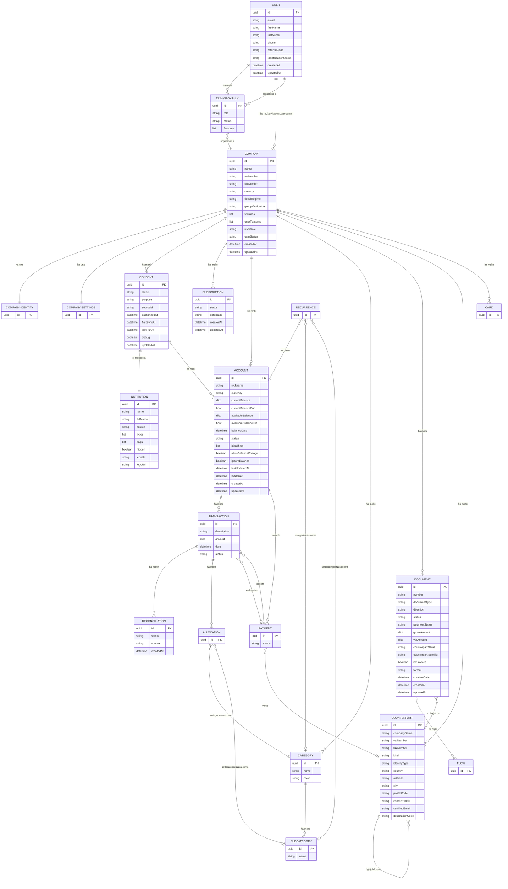

# Modello Dati — Sibill

**Data analisi:** 10 febbraio 2026
**Fonte dati:** API catalog (`api-catalog.json`), HAR analysis, API traces (14 sezioni)
**Formato API:** JSON:API (https://jsonapi.org/) con `application/vnd.api+json`

---

## Indice

1. [Panoramica delle entita'](#1-panoramica-delle-entita)
2. [Dettaglio entita'](#2-dettaglio-entita)
3. [Entita' osservate solo come include](#3-entita-osservate-solo-come-include)
4. [Diagramma ER](#4-diagramma-er)
5. [Pattern JSON:API](#5-pattern-jsonapi)
6. [Riepilogo livelli di confidenza](#6-riepilogo-livelli-di-confidenza)

---

## 1. Panoramica delle entita'

Dalle risposte API osservate durante la sessione di navigazione, sono state identificate le seguenti entita' JSON:API:

| # | Entita' (type) | Endpoint principale | Campi | Relazioni | Confidenza |
|---|---|---|---|---|---|
| 1 | `user` | `/api/v1/users/me` | 8 | 1 | 🟢 Alta |
| 2 | `company` | `/api/v1/companies/` | 15 | 4 | 🟢 Alta |
| 3 | `company-identity` | (inclusa in company) | n/d | n/d | 🟡 Media |
| 4 | `company-settings` | (inclusa in company) | n/d | n/d | 🟡 Media |
| 5 | `company-user` | `/api/v1/company-users` | 3 | 2 | 🟢 Alta |
| 6 | `account` | `/api/v1/accounts` | 18 | 2 | 🟢 Alta |
| 7 | `consent` | `/api/v1/consents` | 11 | 4 | 🟢 Alta |
| 8 | `institution` | `/api/v1/institutions` | 8 | 0 | 🟢 Alta |
| 9 | `subscription` | `/api/v1/subscriptions` | 4 | 1 | 🟢 Alta |
| 10 | `category` | `/api/v1/categories` | 2 | 2 | 🟢 Alta |
| 11 | `subcategory` | (inclusa in category) | 1 | 0 | 🟢 Alta |
| 12 | `transaction` | `/api/v1/transactions` | n/d* | n/d* | 🟡 Media |
| 13 | `document` | `/api/v1/documents` | 31 | 3 | 🟢 Alta |
| 14 | `counterpart` | `/api/v1/counterparts` | 18+ | 2 | 🟢 Alta |
| 15 | `payment` | `/api/v1/payments` | n/d* | n/d* | 🟡 Media |
| 16 | `reconciliation` | `/api/v1/reconciliations/` | 3 | 1 | 🟢 Alta |
| 17 | `recurrence` | `/api/v1/recurrences` | n/d* | n/d* | 🟡 Media |
| 18 | `flow` | (incluso in document) | n/d | n/d | 🟡 Media |
| 19 | `card` | `/api/v1/cards` | n/d* | n/d* | 🟡 Media |

*\*n/d = campi non dettagliati nella response structure catturata (entita' senza dati nella sessione analizzata o body non parsato)*

---

## 2. Dettaglio entita'

### 2.1 User

**Endpoint:** `GET /api/v1/users/me`
**Tipo JSON:API:** `user`
**Confidenza:** 🟢 Alta

| Campo | Tipo | Descrizione |
|---|---|---|
| `email` | string | Email dell'utente |
| `firstName` | string | Nome |
| `lastName` | string | Cognome |
| `phone` | string | Numero di telefono |
| `referralCode` | string | Codice referral personale |
| `identificationStatus` | null/string | Stato identificazione (KYC) |
| `createdAt` | string (ISO 8601) | Data creazione account |
| `updatedAt` | string (ISO 8601) | Ultimo aggiornamento |

| Relazione | Tipo | Entita' collegata |
|---|---|---|
| `companies` | has_many | `company` |

**Include tipico:** `companies,companies.companyIdentity,companies.companySettings`

---

### 2.2 Company

**Endpoint:** `GET /api/v1/companies/`, `GET /api/v1/companies/{id}`
**Tipo JSON:API:** `company`
**Confidenza:** 🟢 Alta

| Campo | Tipo | Descrizione |
|---|---|---|
| `name` | string | Nome azienda (es. "WEISS S.R.L.") |
| `vatNumber` | string | Partita IVA |
| `taxNumber` | string | Codice fiscale |
| `country` | string | Codice paese |
| `fiscalRegime` | string | Regime fiscale |
| `groupVatNumber` | null/string | P.IVA di gruppo |
| `logo` | null/string | Logo (base64 o URL) |
| `logoUrls` | dict | URL logo in varie dimensioni |
| `features` | list | Funzionalita' abilitate per l'azienda |
| `userFeatures` | list | Funzionalita' abilitate per l'utente corrente |
| `userRole` | string | Ruolo dell'utente nell'azienda (es. "ADMIN") |
| `userStatus` | string | Stato utente nell'azienda (es. "ACTIVE") |
| `leadSource` | null/string | Fonte di acquisizione |
| `createdAt` | string (ISO 8601) | Data creazione |
| `updatedAt` | string (ISO 8601) | Ultimo aggiornamento |

| Relazione | Tipo | Entita' collegata |
|---|---|---|
| `companyIdentity` | belongs_to | `company-identity` |
| `companySettings` | belongs_to | `company-settings` |
| `consents` | has_many | `consent` |
| `subscriptions` | has_many | `subscription` |

**Meta:** `has_documents` (boolean) -- indica se l'azienda ha documenti/fatture. Confidenza: 🟢 Alta

---

### 2.3 Company-User

**Endpoint:** `GET /api/v1/company-users`
**Tipo JSON:API:** `company-user`
**Confidenza:** 🟢 Alta

| Campo | Tipo | Descrizione |
|---|---|---|
| `role` | string | Ruolo nell'azienda (es. "ADMIN", "VIEWER") |
| `status` | string | Stato (es. "ACTIVE", "INVITED") |
| `features` | list | Funzionalita' abilitate per questo utente |

| Relazione | Tipo | Entita' collegata |
|---|---|---|
| `company` | belongs_to | `company` |
| `user` | belongs_to | `user` |

---

### 2.4 Account (Conto Bancario)

**Endpoint:** `GET /api/v1/accounts`
**Tipo JSON:API:** `account`
**Confidenza:** 🟢 Alta

| Campo | Tipo | Descrizione |
|---|---|---|
| `nickname` | string | Nome del conto (es. IBAN o nome personalizzato) |
| `currency` | string | Valuta (es. "EUR") |
| `currentBalance` | dict `{currency, amount}` | Saldo contabile corrente |
| `currentBalanceEur` | float | Saldo contabile in EUR |
| `availableBalance` | dict `{currency, amount}` | Saldo disponibile |
| `availableBalanceEur` | float | Saldo disponibile in EUR |
| `balanceDate` | string (ISO 8601) | Data ultimo aggiornamento saldo |
| `status` | string | Stato del conto (es. "ACTIVE") |
| `identifiers` | list `[{type, value}]` | Identificativi (IBAN, BIC, etc.) |
| `allowBalanceChange` | boolean | Permette modifica manuale saldo |
| `ignoreBalance` | boolean | Escludi dal calcolo saldi aggregati |
| `creditLimit` | null/dict | Fido bancario |
| `creditLimitEur` | null/float | Fido in EUR |
| `hiddenAt` | null/string | Data di nascondimento (se nascosto) |
| `cashbackAgreedAt` | null/string | Accettazione cashback |
| `lastUpdatedAt` | string (ISO 8601) | Ultima sincronizzazione |
| `createdAt` | string (ISO 8601) | Data creazione |
| `updatedAt` | string (ISO 8601) | Ultimo aggiornamento |

| Relazione | Tipo | Entita' collegata |
|---|---|---|
| `company` | belongs_to | `company` |
| `consent` | belongs_to | `consent` |

**Include tipico:** `consent.institution`

**Metadata endpoint:** `GET /api/v1/accounts/metadata` restituisce saldi aggregati:
```json
{
  "balances_converted": {
    "count": 2,
    "available": {"currency": "EUR", "amount": "10190.17"},
    "current": {"currency": "EUR", "amount": "12093.43"}
  },
  "balances": [{"count": 2, "available": {...}, "current": {...}}]
}
```
Confidenza: 🟢 Alta

---

### 2.5 Consent (Consenso Open Banking)

**Endpoint:** `GET /api/v1/consents`
**Tipo JSON:API:** `consent`
**Confidenza:** 🟢 Alta

| Campo | Tipo | Descrizione |
|---|---|---|
| `status` | string | Stato (AUTHORIZED, DISABLED, etc.) |
| `purpose` | string | Scopo del consenso |
| `sourceId` | string | ID sorgente (provider Open Banking) |
| `authorizedAt` | string (ISO 8601) | Data autorizzazione |
| `firstSyncAt` | string (ISO 8601) | Prima sincronizzazione |
| `lastRunAt` | string (ISO 8601) | Ultima esecuzione sync |
| `redirectUrl` | null/string | URL di redirect OAuth |
| `debug` | boolean | Flag debug |
| `userData` | list | Dati utente dal provider |
| `userInfo` | null/dict | Info utente aggiuntive |
| `updatedAt` | string (ISO 8601) | Ultimo aggiornamento |

| Relazione | Tipo | Entita' collegata |
|---|---|---|
| `company` | belongs_to | `company` |
| `institution` | belongs_to | `institution` |
| `user` | belongs_to | `user` |
| `accounts` | has_many | `account` |

**Filtri osservati:** `status__notIn`, `for_consent.id__empty`, `institution.id__empty`, `institution.types__contains`, `purpose__eq`

---

### 2.6 Institution (Istituto Bancario)

**Endpoint:** `GET /api/v1/institutions`
**Tipo JSON:API:** `institution`
**Confidenza:** 🟢 Alta

| Campo | Tipo | Descrizione |
|---|---|---|
| `name` | string | Nome istituto (es. "Conto Sibill") |
| `fullName` | null/string | Nome completo |
| `source` | string | Provider (es. "SWAN") |
| `types` | list | Tipi (es. ["BANKING"]) |
| `flags` | list | Flag (5 flag osservati) |
| `hidden` | boolean | Nascosto dal catalogo |
| `iconUrl` | string | URL icona |
| `logoUrl` | string | URL logo |

**Nessuna relazione esplicita** (ma e' inclusa tramite `consent.institution`).

---

### 2.7 Subscription

**Endpoint:** `GET /api/v1/subscriptions`
**Tipo JSON:API:** `subscription`
**Confidenza:** 🟢 Alta

| Campo | Tipo | Descrizione |
|---|---|---|
| `status` | string | Stato abbonamento (es. "TRIAL") |
| `externalId` | string | ID esterno (gateway pagamento) |
| `createdAt` | string (ISO 8601) | Data creazione |
| `updatedAt` | string (ISO 8601) | Ultimo aggiornamento |

| Relazione | Tipo | Entita' collegata |
|---|---|---|
| `company` | belongs_to | `company` |

---

### 2.8 Category

**Endpoint:** `GET /api/v1/categories`
**Tipo JSON:API:** `category`
**Confidenza:** 🟢 Alta

| Campo | Tipo | Descrizione |
|---|---|---|
| `name` | string | Nome categoria (es. "Gestione", "Incassi") |
| `color` | string | Colore hex per la UI |

| Relazione | Tipo | Entita' collegata |
|---|---|---|
| `company` | belongs_to | `company` |
| `subcategories` | has_many | `subcategory` |

**Include tipico:** `subcategories`

**Categorie osservate:** Gestione, Incassi, Finanziamenti/mutui/leasing, Personale, Non categorizzata (6 categorie totali). Confidenza: 🟢 Alta

---

### 2.9 Subcategory

**Tipo JSON:API:** `subcategory`
**Non ha endpoint diretto** -- inclusa tramite `?include=subcategories` di category.
**Confidenza:** 🟢 Alta

| Campo | Tipo | Descrizione |
|---|---|---|
| `name` | string | Nome sottocategoria (es. "Locazione", "Commissioni", "Utenze", "Pos") |

**Sottocategorie osservate (8 totali):** Locazione, Commissioni, Utenze, Pos, e altre.

---

### 2.10 Document (Fattura/Documento)

**Endpoint:** `GET /api/v1/documents`
**Tipo JSON:API:** `document`
**Confidenza:** 🟢 Alta

| Campo | Tipo | Descrizione |
|---|---|---|
| `number` | string | Numero fattura/documento |
| `documentType` | string | Tipo: INVOICE, CREDIT_NOTE, DEBIT_NOTE, PARCEL, SELF_INVOICE, BILL |
| `documentDirection` | null/string | Direzione del documento |
| `direction` | string | Direzione (ISSUED/RECEIVED) |
| `source` | string | Fonte del documento |
| `format` | string | Formato (es. elettronico) |
| `status` | string | Stato: CREATED, SENT, DELIVERED, NOT_DELIVERED, DRAFT, DISCARDED |
| `paymentStatus` | string | Stato pagamento |
| `deliveryStatus` | null/string | Stato consegna |
| `deliveryDate` | null/string | Data consegna |
| `creationDate` | string | Data creazione documento |
| `detectionDatetime` | null/string | Data rilevamento (per importazione automatica) |
| `grossAmount` | dict `{currency, amount}` | Importo lordo |
| `vatAmount` | dict `{currency, amount}` | Importo IVA |
| `vatAmountCompensation` | dict | Compensazione IVA |
| `vatCollection` | null/string | Regime IVA |
| `withholdingTax` | null/dict | Ritenuta d'acconto |
| `subjectToReverseCharge` | boolean | Soggetto a reverse charge |
| `isEInvoice` | boolean | E' una fattura elettronica |
| `eInvoiceType` | null/string | Tipo fattura elettronica (TD01, TD04, etc.) |
| `isInflow` | boolean | E' un'entrata |
| `isFromRecurrence` | boolean | Generata da ricorrenza |
| `counterpartName` | string | Nome controparte |
| `counterpartIdentifier` | string | Identificativo controparte (P.IVA/CF) |
| `hasAttachment` | boolean | Ha allegati |
| `lastEmail` | null/string | Ultima email associata |
| `notes` | null/string | Note |
| `editable` | boolean | Modificabile |
| `deletable` | boolean | Eliminabile |
| `duplicable` | boolean | Duplicabile |
| `hiddenAt` | null/string | Data nascondimento |
| `createdAt` | string (ISO 8601) | Data creazione record |
| `updatedAt` | string (ISO 8601) | Ultimo aggiornamento |

| Relazione | Tipo | Entita' collegata |
|---|---|---|
| `company` | belongs_to | `company` |
| `counterpart` | belongs_to | `counterpart` |
| `flows` | has_many | `flow` |

**Include tipico:** `flows,category,subcategory,counterpart`

**Filtri osservati:** `documentDirection__eq`, `documentType__in`, `status__in`, `status__notIn`, `company.id__eq`, `creationDate__gte/lte`, `hiddenAt__empty`

---

### 2.11 Counterpart (Controparte: Cliente/Fornitore)

**Endpoint:** `GET /api/v1/counterparts`
**Tipo JSON:API:** `counterpart`
**Confidenza:** 🟢 Alta

| Campo | Tipo | Descrizione |
|---|---|---|
| `companyName` | string | Ragione sociale |
| `vatNumber` | string | Partita IVA |
| `taxNumber` | null/string | Codice fiscale |
| `identityType` | string | Tipo identita' |
| `kind` | string | Tipo: VIRTUAL, REAL |
| `country` | string | Paese |
| `address` | string | Indirizzo |
| `addressCountry` | string | Paese indirizzo |
| `city` | string | Citta' |
| `postalCode` | string | CAP |
| `provinceCode` | null/string | Codice provincia |
| `contactEmail` | null/string | Email contatto |
| `contactPerson` | null/string | Persona di contatto |
| `certifiedEmail` | null/string | PEC |
| `destinationCode` | null/string | Codice destinatario SDI |
| `bankIdentifier` | null/string | Identificativo bancario (IBAN) |
| `paymentDate` | null/string | Data pagamento predefinita |
| `paymentMethod` | null/string | Metodo pagamento predefinito |
| `deliveryAddress` | null/string | Indirizzo di consegna |
| `deliveryCity` | null/string | Citta' consegna |
| `deliveryCountry` | null/string | Paese consegna |
| `deliveryPostalCode` | null/string | CAP consegna |

| Relazione | Tipo | Entita' collegata |
|---|---|---|
| `company` | belongs_to | `company` |
| `children` | has_many | `counterpart` |

**Filtri osservati:** `kind__eq`, `kind__neq`, `parent.id__empty`, `contactEmail__empty`

---

### 2.12 Reconciliation (Riconciliazione)

**Endpoint:** `GET /api/v1/reconciliations/`
**Tipo JSON:API:** `reconciliation`
**Confidenza:** 🟢 Alta

| Campo | Tipo | Descrizione |
|---|---|---|
| `status` | string | Stato della riconciliazione |
| `source` | string | Fonte (AUTOMATIC, MANUAL) |
| `createdAt` | string (ISO 8601) | Data creazione |

| Relazione | Tipo | Entita' collegata |
|---|---|---|
| `transaction` | belongs_to | `transaction` |

**Include tipico:** `transaction`

---

## 3. Entita' osservate solo come include

Le seguenti entita' sono state osservate nelle risposte API solo come `included` di altre entita', senza un endpoint diretto catturato con campi dettagliati.

### 3.1 Company-Identity

**Tipo JSON:API:** `company-identity`
**Inclusa in:** risposta di `companies/`, `users/me`
**Confidenza:** 🟡 Media -- i campi non sono stati estratti dalle trace catturate

Probabilmente contiene: dati identificativi dell'azienda (ragione sociale, indirizzo legale, etc.).

### 3.2 Company-Settings

**Tipo JSON:API:** `company-settings`
**Inclusa in:** risposta di `companies/`, `users/me`
**Confidenza:** 🟡 Media

Probabilmente contiene: impostazioni personalizzabili per l'azienda (valuta predefinita, formato numeri, etc.).

### 3.3 Flow (Scadenza/Flusso di Pagamento)

**Tipo JSON:API:** `flow`
**Incluso in:** risposta di `documents`
**Confidenza:** 🟡 Media

Rappresenta una scadenza di pagamento legata a un documento/fattura. Ogni documento puo' avere piu' flow (es. fattura con pagamento rateale).

### 3.4 Transaction (Transazione/Movimento)

**Tipo JSON:API:** `transaction`
**Endpoint:** `GET /api/v1/transactions`
**Confidenza:** 🟡 Media per i campi (la struttura dettagliata non e' stata parsata nelle trace)

**Include tipico (dall'endpoint transactions):**
`account,account.consent.institution,allocations,allocations.category,allocations.subcategory,attachments,card,category,reconciliations,subcategory,payment,payment.attachments`

Questo include rivela l'esistenza di ulteriori entita':
- `allocation` -- Allocazione di importo per categoria/sottocategoria (split categorizzazione)
- `attachment` -- Allegato (documento/file collegato)

### 3.5 Payment (Pagamento/Disposizione)

**Tipo JSON:API:** `payment`
**Endpoint:** `GET /api/v1/payments`
**Confidenza:** 🟡 Media

**Include tipico:**
`account,account.consent,account.consent.institution,counterpart,attachments,transactions,parent,retry_attempts`

Status osservati nei filtri: `ACCEPTED`, `PENDING`, `FAILED`, `SUCCEEDED`, `TIMEOUT`

Questo rivela entita' aggiuntive:
- `retry_attempts` -- Tentativi di ripetizione pagamento
- Relazione con `parent` (pagamento padre, per disposizioni raggruppate)

### 3.6 Card (Carta)

**Tipo JSON:API:** `card`
**Endpoint:** `GET /api/v1/cards`
**Confidenza:** 🟡 Media (nessuna carta presente nella sessione analizzata -- data array vuoto)

**Meta osservato:** `has_created_card` (boolean)

### 3.7 Recurrence (Ricorrenza)

**Tipo JSON:API:** `recurrence`
**Endpoint:** `GET /api/v1/recurrences`
**Confidenza:** 🟡 Media

**Include tipico:** `account,account.consent,account.consent.institution,category,subcategory`

### 3.8 User-Bank-Account

**Endpoint:** `GET /api/v1/user-bank-accounts`
**Confidenza:** 🟡 Media

**Filtri osservati:** `bankAccount.company.id__eq`, `source__eq`, `status__in`, `user.id__eq`
**Include tipico:** non specificato nelle trace

---

## 4. Diagramma ER



---

## 5. Pattern JSON:API

### 5.1 Struttura standard delle risposte

Tutte le risposte API seguono lo standard JSON:API. Confidenza: 🟢 Alta

**Risposta collection (lista):**
```json
{
  "data": [
    {
      "id": "uuid-entita",
      "type": "entity-type",
      "attributes": {
        "campo1": "valore1",
        "campo2": "valore2"
      },
      "relationships": {
        "relazione1": {
          "data": {"id": "uuid-relazione", "type": "related-type"},
          "links": {"self": "...", "related": "..."}
        },
        "relazione2": {
          "data": [{"id": "...", "type": "..."}],
          "links": {"self": "...", "related": "..."}
        }
      },
      "links": {
        "self": "/api/v1/entity-type/uuid-entita"
      }
    }
  ],
  "included": [
    {
      "id": "uuid-inclusa",
      "type": "included-type",
      "attributes": {"...": "..."}
    }
  ],
  "links": {
    "self": "url-corrente",
    "cursor": "token-paginazione"
  },
  "meta": {
    "page": {
      "size": 50,
      "cursor": "token-prossima-pagina"
    }
  }
}
```

**Risposta singola risorsa:**
```json
{
  "data": {
    "id": "uuid",
    "type": "entity-type",
    "attributes": {"...": "..."},
    "relationships": {"...": "..."}
  },
  "included": ["..."],
  "meta": {"...": "..."}
}
```

### 5.2 Relationships e Include

Il parametro `include` permette di caricare risorse correlate in una singola richiesta (eager loading). Confidenza: 🟢 Alta

**Esempi osservati:**

| Endpoint | Include | Effetto |
|---|---|---|
| `/api/v1/users/me` | `companies,companies.companyIdentity,companies.companySettings` | Carica aziende con identita' e impostazioni |
| `/api/v1/accounts` | `consent.institution` | Carica consenso e istituto bancario |
| `/api/v1/categories` | `subcategories` | Carica sottocategorie |
| `/api/v1/transactions` | `account,account.consent.institution,allocations,allocations.category,allocations.subcategory,attachments,card,category,reconciliations,subcategory,payment,payment.attachments` | Carica tutte le relazioni del movimento |
| `/api/v1/documents` | `flows,category,subcategory,counterpart` | Carica scadenze, categoria e controparte |
| `/api/v1/payments` | `account,account.consent,account.consent.institution,counterpart,attachments,transactions,parent,retry_attempts` | Carica conto, controparte, transazioni collegate |
| `/api/v1/reconciliations/` | `transaction` | Carica la transazione riconciliata |
| `/api/v1/recurrences` | `account,account.consent,account.consent.institution,category,subcategory` | Carica conto e categoria |
| `/api/v1/company-users` | `user` | Carica i dati utente |

Le relazioni nested (es. `account.consent.institution`) permettono di caricare catene di relazioni in una singola richiesta.

### 5.3 Paginazione

La paginazione usa **cursor-based pagination**. Confidenza: 🟢 Alta

| Parametro | Descrizione | Valori osservati |
|---|---|---|
| `page[size]` | Dimensione pagina | 20, 25, 50, 100 |
| `page[cursor]` | Token per la pagina successiva | Stringa base64 (codifica Elixir/Erlang) |

**Nota tecnica:** il cursor e' una stringa base64 che codifica una struttura dati Elixir/Erlang (`g3QAAAA...`). Questo suggerisce che il backend potrebbe usare **Elixir/Phoenix** piuttosto che Ruby on Rails, oppure un componente Elixir per la paginazione. Confidenza: 🟡 Media

La risposta include i token di paginazione in:
- `links.cursor` -- URL per la pagina successiva
- `meta.page.cursor` -- Token raw per la prossima pagina
- `meta.page.size` -- Dimensione della pagina

Se `cursor` e' `null`, non ci sono altre pagine.

### 5.4 Filtri

I filtri seguono un pattern consistente con operatori. Confidenza: 🟢 Alta

| Pattern filtro | Operatore | Esempio |
|---|---|---|
| `filter[campo__eq]` | Uguale | `filter[company.id__eq]=uuid` |
| `filter[campo__neq]` | Diverso | `filter[kind__neq]=VIRTUAL` |
| `filter[campo__in]` | In lista | `filter[status__in]=ACCEPTED,PENDING` |
| `filter[campo__notIn]` | Non in lista | `filter[status__notIn]=AUTHORIZED,DISABLED` |
| `filter[campo__gte]` | Maggiore o uguale | `filter[date__gte]=2025-08-31T22:00:00.000Z` |
| `filter[campo__lte]` | Minore o uguale | `filter[date__lte]=2026-08-31T21:59:59.999Z` |
| `filter[campo__empty]` | Vuoto/null | `filter[hiddenAt__empty]=true` |
| `filter[campo__contains]` | Contiene | `filter[types__contains]=BANKING` |

I filtri supportano anche relazioni nested: `filter[account.hiddenAt__empty]`, `filter[consent.status__neq]`, `filter[bankAccount.company.id__eq]`.

### 5.5 Ordinamento

| Parametro | Esempio | Descrizione |
|---|---|---|
| `sort` | `-date,-createdAt,-id` | Discendente (prefisso `-`). Multipli separati da virgola |
| `sort` | `-createdAt` | Singolo campo discendente |
| `sort` | `-searchDate,-creationDate,-createdAt,-id` | Ordinamento complesso per documenti |

### 5.6 Endpoint metadata

Diversi endpoint hanno un sotto-endpoint `/metadata` che restituisce aggregazioni/conteggi senza i dati completi. Confidenza: 🟢 Alta

| Endpoint metadata | Restituisce |
|---|---|
| `GET /api/v1/accounts/metadata` | Saldi aggregati (totale, disponibile, per valuta) |
| `GET /api/v1/transactions/metadata` | Totale transazioni, somme positive/negative, non categorizzate |
| `GET /api/v1/payments/metadata` | Conteggio pagamenti per stato |
| `GET /api/v1/counterparts/metadata` | Conteggio controparti |
| `GET /api/v1/documents/metadata` | Conteggio documenti per tipo |

---

## 6. Riepilogo livelli di confidenza

| Aspetto | Confidenza | Note |
|---|---|---|
| Entita' con endpoint diretto e campi estratti (user, company, account, category, document, counterpart, reconciliation, institution, subscription, company-user) | 🟢 Alta | Campi osservati nelle risposte API |
| Entita' osservate come `included` senza dettaglio campi (company-identity, company-settings, flow) | 🟡 Media | Tipo JSON:API confermato, ma campi non visibili |
| Entita' con endpoint ma senza dati nella sessione (card, recurrence, payment) | 🟡 Media | Endpoint confermato, parametri osservati, ma body non parsato in dettaglio |
| Entita' dedotte dalle catene di include (allocation, attachment, retry_attempts) | 🟡 Media | Esistenza confermata dal parametro include, ma struttura non osservata |
| Paginazione cursor-based | 🟢 Alta | Osservata in tutte le risposte collection |
| Pattern filtri con operatori | 🟢 Alta | Osservati in tutte le trace |
| Struttura JSON:API compliant | 🟢 Alta | Confermata da tutte le risposte |
| Backend Elixir/Phoenix (da formato cursor) | 🟡 Media | Il formato cursor e' tipico Elixir, ma potrebbe essere solo un componente |
| Esistenza entita' non osservate (bookkeeping-accounts, vat-books, tax-debit-credits, f24, payment-operations) | 🔴 Bassa | Menzionate nelle istruzioni ma non osservate nelle trace catturate |
