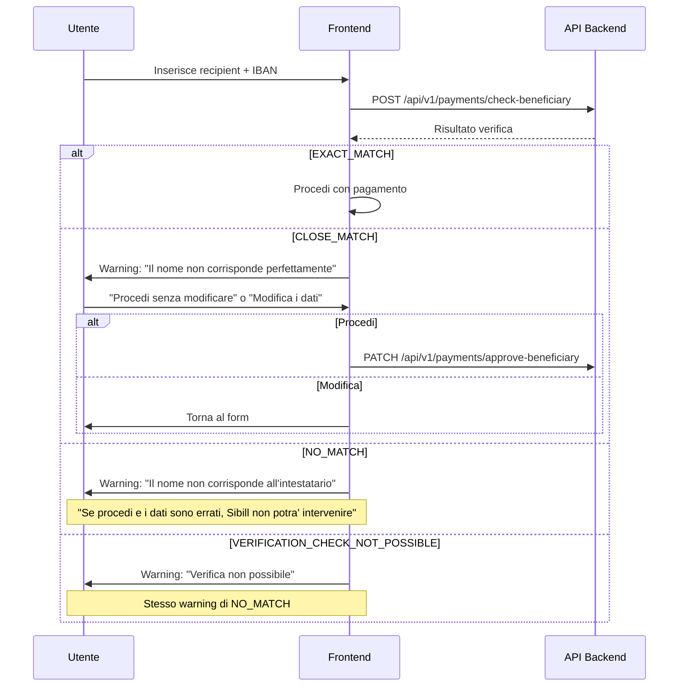
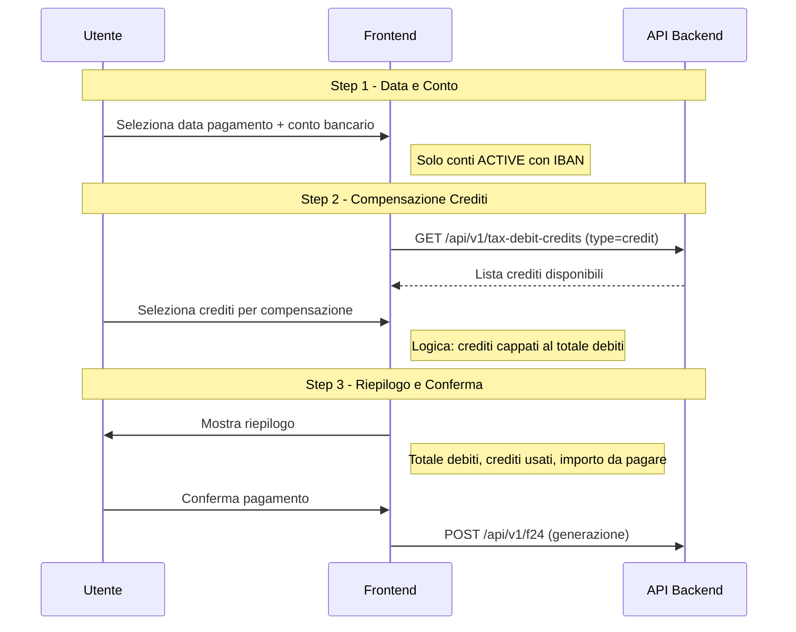

# Pagamenti — Analisi Funzionale

**Data analisi:** 10 febbraio 2026
**Modulo:** Pagamenti (Disposizioni di Pagamento)
**URL principale:** `/transactions/payments`
**URL F24:** `/f24`

---

## Panoramica

Il modulo Pagamenti gestisce le **disposizioni di pagamento** verso fornitori e terzi. Consente di creare, approvare e monitorare pagamenti come bonifici SEPA, RiBa, SDD, e pagamenti F24. Il modulo e' integrato con i conti bancari collegati tramite Open Banking per l'esecuzione diretta dei pagamenti.

Si trova sotto la sezione "Transazioni" nella sidebar, con tab dedicate per Movimenti, Pagamenti, Regole.

---

## Interfaccia

### Layout Principale

La pagina `/transactions/payments` presenta:

1. **Tabella pagamenti** — Lista di tutte le disposizioni con stato, importo, controparte, data
2. **Filtri** — Per stato, periodo, conto
3. **Azioni** — Crea pagamento, visualizza dettaglio

### 🎨 PATTERN UI/UX — Badge Stato Pagamento

I pagamenti mostrano badge colorati per stato:
- `PENDING` — In attesa (giallo/arancione)
- `ACCEPTED` — Accettato (blu)
- `SUCCEEDED` — Completato (verde)
- `FAILED` — Fallito (rosso)
- `TIMEOUT` — Scaduto (grigio)

### Pagina F24 (`/f24`)

La pagina F24 e' una sezione dedicata al pagamento del modello F24 (tributi e contributi). Contiene:
- Pulsante "Paga F24"
- FAQ espandibili sul servizio di pagamento F24
- Informazioni sul processo e le commissioni

---

## Entita' e Dati

### Entita' Coinvolte

| Entita' | Ruolo nel Modulo | Rif. Data Model |
|---|---|---|
| `payment` | Disposizione di pagamento | §3.5 |
| `transaction` | Transazione generata dal pagamento | §3.4 |
| `account` | Conto bancario di addebito | §2.4 |
| `counterpart` | Beneficiario del pagamento | §2.11 |
| `consent` | Consenso Open Banking per l'esecuzione | §2.5 |
| `attachment` | Allegati alla disposizione | (dedotto da include) |
| `retry_attempts` | Tentativi di ripetizione pagamento | (dedotto da include) |

### Struttura Include del Pagamento

L'include tipico per la lista pagamenti e' molto ricco:
```
include=account,account.consent,account.consent.institution,
        counterpart,attachments,transactions,parent,retry_attempts
```

Questo rivela:
- **`parent`** — Un pagamento puo' avere un pagamento "padre" (per disposizioni raggruppate/bulk)
- **`retry_attempts`** — I pagamenti falliti possono essere ripetuti con tracking dei tentativi
- **`transactions`** — Un pagamento genera una o piu' transazioni sul conto

### Stati del Pagamento

Confidenza: 🟢 Alta

| Stato | Descrizione | Tipico |
|---|---|---|
| `PENDING` | Disposizione in attesa di esecuzione | Pagamento appena creato |
| `ACCEPTED` | Disposizione accettata dalla banca | In fase di elaborazione |
| `SUCCEEDED` | Pagamento completato con successo | Addebito avvenuto |
| `FAILED` | Pagamento fallito | Fondi insufficienti, IBAN errato |
| `TIMEOUT` | Pagamento scaduto senza risposta | Timeout dalla banca |

### Dati Osservati

- **Pagamenti nell'account di test:** 0 (nessuna disposizione presente) 🟢
- **Polling TIMEOUT:** Il frontend fa polling sull'endpoint metadata filtrando per `status__in=TIMEOUT` (29 chiamate osservate), suggerendo un meccanismo di notifica per pagamenti problematici 🟢

---

## Logiche di Business

### LB-PAG-01: Ciclo di Vita del Pagamento

Confidenza: 🟡 Media (dedotto dalla struttura dati e dagli stati)

```
Flusso standard:
  CREAZIONE → PENDING → ACCEPTED → SUCCEEDED
                     ↘ FAILED (errore)
                     ↘ TIMEOUT (nessuna risposta)

Da FAILED: → possibile nuovo tentativo (retry_attempts)
Da TIMEOUT: → possibile nuovo tentativo (retry_attempts)
```

### LB-PAG-02: Pagamenti Raggruppati (Bulk)

Confidenza: 🟡 Media

La relazione `parent` nell'include suggerisce la possibilita' di raggruppare piu' pagamenti sotto un pagamento padre:
```
payment_padre (bulk)
  ├─ payment_figlio_1 (singolo beneficiario)
  ├─ payment_figlio_2 (singolo beneficiario)
  └─ payment_figlio_3 (singolo beneficiario)
```

Questo pattern e' tipico per le disposizioni SEPA batch, dove piu' bonifici vengono inviati in un unico file XML pain.001.

### LB-PAG-03: Validazione IBAN

Confidenza: 🟡 Media (endpoint menzionato nella documentazione progetto)

Sibill dispone di un endpoint dedicato per la validazione dell'IBAN:
```
POST /api/v1/payments/validate-iban
```

Questo endpoint probabilmente:
- Verifica la struttura formale dell'IBAN (lunghezza, check digit)
- Verifica il codice BIC/SWIFT associato
- Potrebbe verificare la raggiungibilita' del conto (se supportato)

> 🟡 **ATTENZIONE**: L'endpoint `validate-iban` non e' stato catturato nelle API traces perche' non sono stati creati pagamenti durante la sessione di analisi.

### LB-PAG-04: Retry Pagamenti Falliti

Confidenza: 🟡 Media

La relazione `retry_attempts` nell'include suggerisce che:
- I pagamenti falliti o in timeout possono essere ripetuti
- Ogni tentativo viene tracciato come entita' separata
- Il sistema tiene uno storico dei tentativi

### LB-PAG-05: Polling Pagamenti in Timeout

Confidenza: 🟢 Alta

Il frontend esegue polling periodico sull'endpoint metadata per verificare se ci sono pagamenti in TIMEOUT:
```
GET /api/v1/payments/metadata?filter[company.id__eq]=UUID&filter[status__in]=TIMEOUT
```

Con 29 occorrenze nella sessione analizzata, il polling avviene probabilmente ad ogni navigazione di pagina, suggerendo che i pagamenti in timeout richiedono attenzione immediata.

### LB-PAG-06: Tipi di Pagamento Supportati

Confidenza: 🟡 Media (dedotto dalla documentazione del progetto e dal contesto di mercato)

| Tipo | Descrizione | Formato |
|---|---|---|
| **Bonifico SEPA (SCT)** | Trasferimento di fondi SEPA | pain.001 XML |
| **RiBa** | Ricevuta Bancaria | Tracciato CBI |
| **SDD Core** | Addebito diretto SEPA consumatori | pain.008 XML |
| **SDD B2B** | Addebito diretto SEPA business | pain.008 XML |
| **F24** | Pagamento tributi e contributi | Servizio dedicato |
| **MAV** | Pagamento Mediante Avviso | 🔴 Non confermato |

### LB-PAG-07: F24 — Pagamento Tributi

Confidenza: 🟡 Media

Il modulo F24 (`/f24`) e' una sezione separata con le seguenti caratteristiche:
- Servizio di pagamento F24 tramite la piattaforma Sibill
- Pagina con FAQ dettagliate sul servizio
- Pulsante "Paga F24" per avviare il flusso
- Nessuna API specifica catturata durante la sessione

Il servizio F24 probabilmente richiede:
1. Compilazione del modello F24 (sezione erario, INPS, regioni, IMU, etc.)
2. Selezione del conto di addebito
3. Conferma e invio

---

## API Coinvolte

| Endpoint | Metodo | Scopo | Rif. API |
|---|---|---|---|
| `/api/v1/payments` | GET | Lista disposizioni di pagamento | §9 |
| `/api/v1/payments/metadata` | GET | Conteggio pagamenti per stato | §9 |
| `/api/v1/payments/validate-iban` | POST | Validazione IBAN | Non catturato |
| `/api/v1/counterparts` | GET | Beneficiari | §8 |
| `/api/v1/accounts` | GET | Conti bancari di addebito | §3 |

### Parametri Chiave per Lista Pagamenti

```
GET /api/v1/payments
  filter[company.id__eq]=UUID
  filter[status__in]=ACCEPTED,PENDING,FAILED,SUCCEEDED,TIMEOUT
  sort=-createdAt
  include=account,account.consent,account.consent.institution,
          counterpart,attachments,transactions,parent,retry_attempts
  page[size]=50
```

---

## Filtri e Ricerca

| Filtro | Tipo | Descrizione | Confidenza |
|---|---|---|---|
| Stato | Multi-select | ACCEPTED, PENDING, FAILED, SUCCEEDED, TIMEOUT | 🟢 Alta |
| Periodo | Range date | Filtra per data creazione | 🟡 Media |
| Conto | Select | Filtra per conto di addebito | 🟡 Media |
| Controparte | Ricerca | Filtra per beneficiario | 🟡 Media |

---

## Azioni Disponibili

| Azione | Descrizione | Tipo | Confidenza |
|---|---|---|---|
| **Visualizza pagamenti** | Lista disposizioni con stato | Read | 🟢 Alta |
| **Crea pagamento** | Nuova disposizione (bonifico, etc.) | Create | 🟡 Media |
| **Verifica IBAN** | Validazione IBAN beneficiario | Validate | 🟡 Media |
| **Retry pagamento** | Ripete un pagamento fallito/timeout | Create | 🟡 Media |
| **Paga F24** | Avvia pagamento modello F24 | Create | 🟡 Media |
| **Visualizza dettaglio** | Apre dettaglio di una disposizione | Read | 🟡 Media |
| **Scarica allegati** | Download file associati al pagamento | Download | 🟡 Media |

---

## Limitazioni Osservate

1. **Nessun pagamento nell'account di test:** L'array dei pagamenti e' vuoto, impedendo l'analisi della struttura dettagliata dell'entita' `payment`. 🟢

2. **Endpoint di scrittura non catturati:** La creazione di pagamenti (POST) non e' stata eseguita, quindi il flusso completo di creazione non e' documentato. 🟡

3. **Validazione IBAN non testata:** L'endpoint `validate-iban` non e' stato invocato durante l'analisi. 🟡

4. **F24 senza API:** La sezione F24 non ha generato chiamate API specifiche. Il servizio potrebbe essere gestito tramite un'integrazione esterna o un processo offline. 🟡

5. **Piano TRIAL:** Alcune funzionalita' di pagamento (es. generazione file SEPA, pagamenti bulk) potrebbero essere limitate nel piano trial. 🟡

6. **Generazione file SEPA:** Non e' stato possibile osservare la generazione di file XML pain.001 o tracciati CBI, che e' una delle funzionalita' chiave per il gestionale target. 🔴

---

## Note

- Il modulo Pagamenti e' uno dei piu' importanti per l'integrazione con i sistemi bancari. La capacita' di generare file SEPA XML (pain.001 per bonifici, pain.008 per SDD) e' fondamentale.
- La relazione `parent` nei pagamenti e' un pattern chiave per le disposizioni bulk, comuni nell'operativita' aziendale (es. stipendi, pagamento fornitori in blocco).
- Il polling per TIMEOUT suggerisce che Sibill gestisce i pagamenti in modo asincrono: la disposizione viene inviata alla banca e il sistema attende la conferma. Se la banca non risponde entro un timeout, il pagamento viene segnalato come TIMEOUT.
- L'integrazione con Open Banking (PSD2/PISP) e' confermata dalla relazione `consent` sui pagamenti, che suggerisce che i pagamenti vengono eseguiti tramite il consenso PSD2 dell'utente.
- Per un'analisi approfondita, sarebbe necessario creare un pagamento di test e osservare il flusso completo di creazione → approvazione → esecuzione.

---

## Aggiornamento Fase 4 — Analisi JS Deep Dive

**Data aggiornamento:** 10 febbraio 2026
**Fonte:** Analisi statica del bundle JS principale `index-N-OxfZQQ.js` (~4.5 MB)
**Metodologia:** Grep pattern + estrazione contesto da file minificato

### Sommario scoperte

L'analisi del JavaScript client-side ha rivelato la struttura completa del modulo Pagamenti, inclusi:
- **14 endpoint API** (di cui 8 non catturati in precedenza)
- **Form di creazione pagamento** con tutti i campi e validazioni
- **Flusso F24 completo** con debiti/crediti, sezioni tributarie, e generazione con compensazione
- **Pagamenti bulk** (payment-operations) con merge beneficiari
- **Verifica beneficiario** con check IBAN-nome intestatario
- **Metodi di pagamento** completi (enum interna + mapping FatturaPA)

---

### API Pagamenti — Catalogo Completo

Confidenza: 🟢 Alta (endpoint estratti direttamente dal codice JS)

#### Pagamenti Singoli

| Endpoint | Metodo | Scopo | Dettagli |
|---|---|---|---|
| `/api/v1/payments` | GET | Lista pagamenti | Filtri, paginazione cursor, include ricche |
| `/api/v1/payments` | POST | **Crea pagamento** | Serializza via JSON:API transformer `jje` |
| `/api/v1/payments/{id}` | GET | Dettaglio pagamento | Include: account, flows, company, counterpart |
| `/api/v1/payments/{id}` | PATCH | **Aggiorna pagamento** | Invia userData e flag debug |
| `/api/v1/payments/{id}/cancel` | POST | **Annulla pagamento** | Nessun body richiesto |
| `/api/v1/payments/{id}/change-status` | POST | **Cambia stato manualmente** | Body: `{status: "..."}` |
| `/api/v1/payments/metadata` | GET | Conteggio per stato | Usato per polling TIMEOUT |
| `/api/v1/payments/validate-iban` | POST | **Validazione IBAN** | Body: `{iban: "..."}` |
| `/api/v1/payments/check-beneficiary` | POST | **Verifica nome beneficiario** | Confronta nome con intestatario IBAN |
| `/api/v1/payments/approve-beneficiary` | PATCH | **Approva beneficiario** | Dopo check positivo/con warning |

#### Pagamenti Bulk (Payment Operations)

| Endpoint | Metodo | Scopo | Dettagli |
|---|---|---|---|
| `/api/v1/payment-operations` | POST | **Crea pagamento multiplo** | Serializza array di payments |
| `/api/v1/payment-operations/{id}` | GET | Dettaglio operazione | Include: account, payments, payments.flows |
| `/api/v1/payment-operations/{id}` | PATCH | **Aggiorna operazione** | Con userData e debug |
| `/api/v1/payments/{companyId}/bulk-payment-import-config` | GET | **Config import bulk** | Restituisce configurazione per import CSV/file |

#### F24 e Debiti/Crediti

| Endpoint | Metodo | Scopo | Dettagli |
|---|---|---|---|
| `/api/v1/f24` | GET | **Lista F24** | Filtro per company, ordinamento per createdAt desc |
| `/api/v1/tax-debit-credits` | GET | **Lista debiti/crediti** | Filtri per tipo (debit/credit), tribute, company |
| `/api/v1/tax-debit-credits` | POST | **Crea debito/credito** | Serializza via JSON:API transformer |

---

### Entita' Payment — Modello Dati

Confidenza: 🟢 Alta (estratto dal transformer JS `jje`)

```
Tipo JSON:API: "payment"

Relationships:
  - flows        → [flow]          (1:N - scadenze associate)
  - account      → account         (N:1 - conto di addebito)
  - company      → company         (N:1 - azienda)
  - counterpart  → counterpart     (N:1 - beneficiario)
  - parent       → payment         (N:1 - pagamento padre per bulk)
```

#### Entita' Payment Operation (Bulk)

```
Tipo JSON:API: "payment-operation"

Relationships:
  - payments     → [payment]       (1:N - pagamenti figli)
  - account      → account         (N:1 - conto di addebito)
  - company      → company         (N:1 - azienda)
```

---

### Form di Creazione Pagamento (Bonifico Singolo)

Confidenza: 🟢 Alta (schema Zod estratto direttamente dal JS)

Schema di validazione (`I7n`):

| Campo | Tipo | Obbligatorio | Validazione | Note |
|---|---|---|---|---|
| `recipient` | string | Si | min 1, **max 70 caratteri** (`fL=70`), no caratteri speciali (regex `wBe`) | Nome beneficiario |
| `amount` | `{amount: string, currency: string}` | Si | amount > 0, `decimalPlaces(2)` | Importo con valuta |
| `iban` | string | Si | min 1, transform → uppercase, rimuovi non-alfanumerici, validazione strutturale (`ci()` e `g2()`) | IBAN beneficiario |
| `paymentReason` | string | Si | min 1, **no underscore** (`_` vietato), max `{{maxLength}}` caratteri | Causale bonifico |
| `instant` | boolean | No | — | Bonifico istantaneo |
| `account` | string | Si | min 1 | ID conto di addebito |
| `sendSummary` | boolean | No | — | Invia notifica email al beneficiario |
| `payeeEmailAddress` | string[] | No | array di email valide | Email destinatario per notifica |
| `parent` | string | No | min 1 (se presente) | ID pagamento padre (per flussi da scadenzario) |

#### Messaggi di validazione

| Errore | Messaggio IT | Messaggio EN |
|---|---|---|
| Beneficiario troppo lungo | `Beneficiario non valido: puoi usare massimo {{limit}} caratteri` | `Invalid recipient: you can use a maximum of {{limit}} characters` |
| Causale con caratteri non validi | `Causale con caratteri non validi: modificala` | `Payment reason with invalid characters: edit it` |
| IBAN non valido | `IBAN non valido` (`Nst="Invalid IBAN"`) | `Invalid IBAN` |
| Importo non valido | (dedotto) Importo deve essere > 0 | Amount must be > 0 |

> 📐 **FORMULA/ALGORITMO — Validazione IBAN**: L'IBAN viene prima normalizzato (uppercase, rimozione caratteri non alfanumerici), poi validato con due funzioni: `ci()` (probabilmente check digit MOD-97) e `g2()` (probabilmente validazione formato per paese). La validazione avviene anche **lato server** tramite `POST /api/v1/payments/validate-iban`.

#### Lunghezza massima nome beneficiario

Confidenza: 🟢 Alta

```javascript
fL = 70;  // max caratteri per recipient

function Fln(t) {
    return t && wLe(t) ? 140 : 44;
}
```

Il valore base e' **70 caratteri** per il nome del beneficiario. La funzione `Fln` suggerisce che in certi contesti (probabilmente PDF payment o altri tipi di pagamento) il limite puo' essere **140** o **44** caratteri.

---

### Verifica Beneficiario (Name Check)

Confidenza: 🟢 Alta (flusso completo estratto dal JS)

Sibill implementa un sistema di **verifica del nome del beneficiario** confrontandolo con l'intestatario registrato dell'IBAN. Questo e' un requisito della direttiva europea sul **Verification of Payee (VoP)**.

#### Flusso



#### Risultati della verifica

| Risultato | Descrizione IT | Azione |
|---|---|---|
| `EXACT_MATCH` | (nessun warning) | Procedi normalmente |
| `CLOSE_MATCH` | "Il nome non corrisponde perfettamente a quello registrato per questo IBAN" | Warning, utente puo' procedere o modificare |
| `NO_MATCH` | "Il nome inserito non corrisponde all'intestatario di questo IBAN" | Warning forte: "Sibill non potra' intervenire o provvedere al rimborso" |
| `VERIFICATION_CHECK_NOT_POSSIBLE` | (verifica non eseguibile) | Warning: "Sibill non potra' intervenire" |

---

### Bonifico Istantaneo (Instant Transfer)

Confidenza: 🟢 Alta

Il form di pagamento include un toggle opzionale per **bonifico istantaneo**:

- **Label:** "Bonifico istantaneo" / "Instant transfer"
- **Helper:** "In caso di errori effettueremo un bonifico ordinario"
- **Warning IBAN non compatibile:** "Questo IBAN non accetta bonifici istantanei: verra' inviato un bonifico ordinario"
- **Bulk:** "Per i bonifici che non supportano l'istantaneo, invieremo un bonifico ordinario"

Il fallback da istantaneo a ordinario e' gestito **automaticamente dal backend**.

---

### Pagamento tramite PDF

Confidenza: 🟢 Alta

Sibill supporta il pagamento caricando direttamente un documento PDF:

- **Titolo:** "Paga un file PDF" / "Pay via PDF"
- **Descrizione:** "Carica un documento da pagare (cedolini, proforma, preventivo, altro)"
- **Formato:** Drag & drop, max **5 MB**
- **Form:** Stesso form del bonifico singolo (recipient, IBAN, amount, reason, instant, email)
- **Ricerca controparte:** "Ricerca clienti e fornitori" con lookup per nome, CF, P.IVA

---

### Pagamenti Bulk (Multipli)

Confidenza: 🟢 Alta (struttura completa estratta dal JS)

#### Panoramica

Il pagamento bulk (`/api/v1/payment-operations`) consente di disporre **piu' bonifici simultaneamente**. L'entita' e' di tipo `"payment-operation"` e contiene una lista di pagamenti figli.

#### Accesso

- **Menu:** "Pagamento multiplo" / "Bulk payment"
- **Descrizione:** "Disponi piu' bonifici simultaneamente"
- **Chunk JS dedicato:** `bulk-payment-import-CUCqRH7Z.js`, `BulkPaymentContent-BOvLqH04.js`, `BulkPaymentPage-C8YSTDHB.js`

#### Funzionalita'

| Feature | Descrizione | Confidenza |
|---|---|---|
| **Merge beneficiari** | Toggle "Unisci bonifici con stesso beneficiario" — raggruppa pagamenti allo stesso IBAN | 🟢 Alta |
| **Split/Merge** | Possibilita' di dividere o unire i bonifici. Warning: "Cambiando questa impostazione, perderai le modifiche inserite" | 🟢 Alta |
| **Import config** | `GET /api/v1/payments/{companyId}/bulk-payment-import-config` — configurazione per import da file | 🟢 Alta |
| **Aggiunta manuale** | Pulsante "Aggiungi pagamento" per aggiungere righe manualmente | 🟢 Alta |
| **Instant bulk** | Bonifici istantanei multipli con fallback automatico per IBAN non compatibili | 🟢 Alta |
| **Notifica email** | "Avvisa i beneficiari con indirizzo email" — invio notifica ai destinatari | 🟢 Alta |

#### Campi per riga di pagamento bulk

| Campo | Label IT | Label EN | Validazione |
|---|---|---|---|
| `recipient` | Beneficiario | Recipient | Max `{{limit}}` caratteri |
| `iban` | IBAN | IBAN | Validazione IBAN |
| `paymentReason` | Causale | Payment reason | No caratteri non validi |
| `payeeEmailAddress` | Email | Email | Email valida |
| `amount` | Importo | Amount | Numerico > 0 |

#### Errori specifici bulk

| Errore | Messaggio IT |
|---|---|
| Beneficiario troppo lungo | `Beneficiario non valido: puoi usare massimo {{limit}} caratteri o deselezionare la riga` |
| Causale con caratteri non validi | `Causale con caratteri non validi: modificala o deseleziona la riga` |
| Causale mancante | `Causale mancante: aggiungi il motivo del bonifico o deseleziona la riga` |
| IBAN non valido | `IBAN non valido: inserisci l'IBAN corretto o deseleziona la riga` |
| Errore generico | `Risolvi il problema o deseleziona la riga per proseguire` |

#### Riepilogo bulk

```
Schermata riepilogo:
- Numero bonifici da effettuare
- Importo totale
- Conto di addebito
- Toggle "Avvisa i beneficiari con indirizzo email"
- Pulsanti: "Annulla" | "Paga"
```

---

### Flusso F24 — Analisi Completa

Confidenza: 🟢 Alta (struttura, form e logica estratti dal JS)

#### Architettura F24

Il modulo F24 in Sibill ha **due modalita' distinte**:

1. **Gestione Debiti/Crediti** — CRUD interno per tracciare obblighi fiscali
2. **Generazione e Pagamento F24** — Wizard a 3 step per generare il pagamento effettivo
3. **Upload F24 PDF** — Servizio esterno di pagamento tramite upload del modello pre-compilato

#### Sezioni Tributarie F24

Confidenza: 🟢 Alta (enum `xc` estratta dal JS)

```javascript
xc = {
    ERARIO: "erario",
    INPS: "inps",
    REGIONI: "regioni",
    IMU_ALTRI_ENTI: "imu_altri_enti",
    INAIL: "inail",
    ALTRI_ENTI: "altri_enti"
}
```

| Sezione | Label IT | Campi specifici |
|---|---|---|
| **Erario** | Erario | codiceTributo, codiceUfficio, codiceAtto, annoPeriodoRiferimento, rateazioneRegioneProvMeseRif |
| **INPS** | INPS | codiceSede, causaleContributo, matricolaCodiceFiliale, periodoRiferimentoInizio, periodoRiferimentoFine |
| **Regioni** | Regioni | (sezione non completamente implementata - `throw new Error("Section type not yet implemented")`) |
| **IMU e altri enti** | Imu e altri enti locali | (sezione non completamente implementata) |
| **INAIL** | Altri enti (INAIL) | (sezione non completamente implementata) |
| **Altri Enti** | Altri Enti | (sezione non completamente implementata) |

> 🟡 **ATTENZIONE**: Solo le sezioni **Erario** e **INPS** sono completamente implementate nel codice. Le altre sezioni lanciano un errore `"Section type not yet implemented"`. Questo potrebbe indicare sviluppo in corso o funzionalita' non ancora rilasciate.

#### Form Aggiungi Debito — Sezione Erario

Confidenza: 🟢 Alta (schema Zod `gWn` estratto dal JS)

| Campo | Label IT | Tipo | Obbligatorio | Validazione |
|---|---|---|---|---|
| `sectionType` | (preset) | literal "erario" | Si | — |
| `type` | Debito/Credito | enum | Si | "debit" o "credit" |
| `codiceTributo` | Codice Tributo | string | Si | min 1, lookup con autocomplete |
| `description` | Descrizione | string | No | — |
| `annoPeriodoRiferimento` | Anno di Riferimento | string | No | regex `/^\d{4}$/` (4 cifre) |
| `rateazioneRegioneProvMeseRif` | Rateazione/Regione/Prov/Mese Rif | string | No | — |
| `amount` | Importo | number | Si | positivo > 0, 2 decimali |
| `scadenza` | Scadenza | date | No | — |
| `codiceUfficio` | Codice Ufficio | string | No | Solo sezione Erario |
| `codiceAtto` | Codice Atto | string | No | Solo sezione Erario |
| `bookkeepingAccountId` | Conto contabile | string | Si | min 1 |

Default values:
```javascript
mWn = {
    sectionType: "erario",
    codiceTributo: "",
    description: "",
    annoPeriodoRiferimento: "",
    rateazioneRegioneProvMeseRif: "",
    amount: 0,
    validFrom: null,
    validUntil: null,
    scadenza: null,
    codiceUfficio: "",
    codiceAtto: "",
    bookkeepingAccountId: ""
}
```

#### Form Aggiungi Debito — Sezione INPS

Confidenza: 🟢 Alta (schema Zod `Tx` estratto dal JS)

| Campo | Label IT | Tipo | Obbligatorio | Validazione |
|---|---|---|---|---|
| `sectionType` | (preset) | literal "inps" | Si | — |
| `type` | Debito/Credito | enum | Si | "debit" o "credit" |
| `codiceSede` | Codice Sede | string | No | Lookup con autocomplete |
| `description` | Descrizione | string | No | — |
| `causaleContributo` | Causale Contributo | string | Si | Lookup con autocomplete |
| `matricolaCodiceFiliale` | Matricola/Codice Filiale | string | No | — |
| `periodoRiferimentoInizio` | Periodo Riferimento Inizio | string | No | regex `/^(0[1-9]|1[0-2])\d{4}$/` (MMYYYY) |
| `periodoRiferimentoFine` | Periodo Riferimento Fine | string | No | regex `/^(0[1-9]|1[0-2])\d{4}$/` (MMYYYY) |
| `amount` | Importo | number | Si | positivo > 0, 2 decimali |
| `scadenza` | Scadenza | date | No | — |
| `bookkeepingAccountId` | Conto contabile | string | Si | min 1 |

#### Payload API Debito/Credito — Sezione Erario

Confidenza: 🟢 Alta (funzione `NKn` estratta dal JS)

```json
{
    "companyId": "UUID",
    "bookkeepingAccountId": "UUID",
    "sectionType": "erario",
    "tribute": "1040",
    "debitAmount": "100.00",     // null se credito
    "creditAmount": null,         // null se debito
    "validFrom": "2026-01-01",
    "dueDate": "2026-02-16",
    "description": "1040",
    "codiceUfficio": "...",
    "codiceAtto": "...",
    "details": {
        "codice_tributo": "1040",
        "codice_ufficio": "...",
        "codice_atto": "...",
        "anno_periodo_riferimento": "2026",
        "rateazione_regione_prov_mese_rif": null,
        "importo_a_debito_versato": "100.00",
        "importo_a_credito_compensato": null
    }
}
```

#### Payload API Debito/Credito — Sezione INPS

Confidenza: 🟢 Alta (funzione `OKn` estratta dal JS)

```json
{
    "companyId": "UUID",
    "bookkeepingAccountId": "UUID",
    "sectionType": "inps",
    "tribute": "DM10",
    "debitAmount": "500.00",
    "creditAmount": null,
    "validFrom": "2026-01-01",
    "dueDate": "2026-02-16",
    "description": "DM10",
    "details": {
        "codice_sede": "...",
        "causale_contributo": "DM10",
        "matricola_codice_filiale": "...",
        "periodo_riferimento_da": "012026",
        "periodo_riferimento_a": "012026",
        "importo_a_debito_versato": "500.00",
        "importo_a_credito_compensato": null
    }
}
```

#### Wizard Generazione e Pagamento F24

Confidenza: 🟢 Alta (componenti `BWn`, `VWn`, `jWn` estratti dal JS)



**Step 1 — Data e Conto Bancario:**
- Campo: Data di pagamento (date picker)
- Campo: Conto bancario (select dropdown)
- Filtro conti: solo conti con `status === ACTIVE` e almeno un identificatore di tipo `"IBAN"`
- Display: `"{{nickname}} - {{IBAN}}"` oppure `"Account - {{IBAN}}"`

**Step 2 — Selezione Crediti per Compensazione:**
- Mostra debiti selezionati e totale
- Lista crediti disponibili con checkbox
- Logica di capping: i crediti vengono applicati fino a coprire il totale debiti
- Se un credito eccede il residuo, viene usato parzialmente
- Warning: "Hai gia' compensato tutti i debiti. Non puoi aggiungere altri crediti"
- Display per ogni credito: `"{{usedAmount}} di {{totalAmount}}"`

> 📐 **FORMULA/ALGORITMO — Compensazione F24**: La logica di compensazione e' sequenziale: per ogni credito selezionato, si prende il minimo tra l'importo del credito e il residuo da pagare. I crediti vengono applicati nell'ordine di selezione dell'utente. Il residuo `f = totalDebits - totalCreditsUsed` e' l'importo effettivo da pagare.

**Step 3 — Riepilogo:**
- Totale Debiti
- Crediti Utilizzati
- Importo da Pagare (= debiti - crediti)
- Data Pagamento
- Conto Bancario
- Pulsanti: "Indietro" | "Conferma Pagamento"

#### Servizio F24 via Upload PDF

Confidenza: 🟢 Alta (testo FAQ e flusso estratti dal JS)

Sibill offre un **servizio gestito** per il pagamento F24 tramite upload del PDF:

| Aspetto | Dettaglio |
|---|---|
| **Formato accettato** | Solo PDF nativo (no scansioni, foto, immagini) |
| **Pricing con Sibill Account** | Gratuito e illimitato |
| **Pricing senza Sibill Account** | €10/mese (1 F24), €15/mese (2-3 F24), €25/mese (3+ F24) |
| **Deadline minima** | 24 ore lavorative prima della scadenza |
| **Stesso giorno** | Entro le 13:00 con sovrapprezzo urgenza; dopo le 13:00 non garantito |
| **Pagamenti futuri** | Si, si possono inviare F24 con scadenze future |
| **Compensazione** | Si, il PDF contiene gia' le info per la compensazione |
| **Ricevuta** | Generata alla 1° e 15° del mese (con Sibill Account) o 5-7 giorni lavorativi (senza) |
| **Metodo addebito** | Con account: bonifico su IBAN dedicato Sibill. Senza: addebito diretto SDD (solo IBAN italiano) |

---

### Stati del Pagamento — Dettaglio Completo

Confidenza: 🟢 Alta (enum estratte dal JS)

#### Stati disposizione pagamento (payment)

| Stato | Label IT | Label EN | Descrizione |
|---|---|---|---|
| `PENDING` | In attesa | Waiting response | Pagamento creato, in attesa di elaborazione |
| `ACCEPTED` | Disposto | Disposed | Accettato dalla banca, in elaborazione |
| `SUCCEEDED` | Completato | Succeded (sic) | Pagamento eseguito con successo |
| `FAILED` | Fallito | Failed | Pagamento rifiutato/fallito |
| `CANCELED` | Cancellato | Deleted | Pagamento annullato dall'utente |
| `TIMEOUT` | Da verificare | To be verified | Nessuna conferma dalla banca |

#### Messaggi di stato per l'utente

| Stato | Messaggio IT |
|---|---|
| `FAILED` | "C'e' stato un problema con il pagamento. Prima di fare un nuovo tentativo, verifica nel tuo home banking lo stato del bonifico." |
| `PENDING` | "Hai recentemente disposto un pagamento in stato non completato verso lo stesso destinatario. Prima di procedere, verifica di non pagare due volte." |
| `TIMEOUT` | "Questo pagamento non e' stato ancora confermato dalla tua banca. Verifica nel tuo conto se l'addebito e' avvenuto. Se confermato, puoi aggiornare manualmente lo stato a Pagato." |
| (generico) | "Siamo in attesa della conferma dalla tua banca. La scadenza verra' automaticamente riconciliata quando il pagamento sara' completato." |

---

### Retry Pagamenti

Confidenza: 🟢 Alta

| Aspetto | Dettaglio |
|---|---|
| **Messaggio retry** | "Il pagamento precedente non e' andato a buon fine. Puoi reinviarlo con gli stessi dati." |
| **Modifica dati** | I dati NON possono essere modificati. "Se devi correggere destinatario, importo o causale, clicca su 'Annulla' e crea un nuovo bonifico" |
| **Limite retry** | Un solo retry consentito: "Hai gia' ripetuto il bonifico. Verifica lo stato del nuovo pagamento." |
| **Conto disconnesso** | "Non e' possibile ripetere il pagamento perche' il conto selezionato non e' collegato. Prima di procedere, riconnetti il conto." |

---

### Metodi di Pagamento — Enum Complete

Confidenza: 🟢 Alta (enum estratte dal JS)

#### Enum Interna (`wi`)

```javascript
wi = {
    Transfer: "TRANSFER",     // Bonifico
    Cash: "CASH",             // Contanti
    Card: "CARD",             // Carta
    Check: "CHECK",           // Assegno
    Postal: "POSTAL",         // Bollettino
    Riba: "RIBA",             // Ricevuta Bancaria
    Sdd: "SDD",               // SEPA Direct Debit
    FiscalCredit: "FISCAL_CREDIT",  // Credito Fiscale
    Deferred: "DEFERRED",     // Senza Incasso
    TaxForm: "TAX_FORM",      // F24
    Other: "OTHER"            // Altro
}
```

#### Mapping FatturaPA → Interno (`Zi` → `wi`)

| Codice FatturaPA | Descrizione IT | Metodo Interno |
|---|---|---|
| MP01 | Contanti | Cash |
| MP02 | Assegno | Check |
| MP03 | Assegno circolare | Check |
| MP04 | Contanti presso Tesoreria | Cash |
| MP05 | Bonifico | Transfer |
| MP06 | Vaglia cambiario | — |
| MP07 | Bollettino bancario | — |
| MP08 | Carta di pagamento | Card |
| MP09 | RID | Sdd |
| MP10 | RID utenze | Sdd |
| MP11 | RID veloce | Sdd |
| MP12 | RIBA | Riba |
| MP13 | MAV | — |
| MP14 | Quietanza erario | — |
| MP15-MP18 | (vari) | — |
| MP19 | SEPA Direct Debit | Sdd |
| MP20 | SEPA Direct Debit CORE | Sdd |
| MP21 | SEPA Direct Debit B2B | Sdd |
| MP22 | Trattenuta | — |
| MP23 | PagoPA | — |

> 🔵 **NOTA**: Il mapping da codici FatturaPA a metodi interni e' implementato nelle funzioni `Uun` (FatturaPA → interno) e `Vun` (interno → FatturaPA). I metodi non mappati fallback su `Other`.

---

### Ricevuta di Pagamento (Receipt)

Confidenza: 🟢 Alta

Dopo un pagamento completato, l'utente puo' scaricare la ricevuta con:

| Campo | Label IT |
|---|---|
| account | Conto |
| amount | Importo |
| recipient | Beneficiario |
| identifier | IBAN |
| execution_date | Data esecuzione |

---

### SEPA XML e CBI — Note dal JS

Confidenza: 🟡 Media

L'analisi del bundle JS **non ha rivelato logica di generazione SEPA XML client-side**. I riferimenti a pain.001, pain.008, SEPA sono presenti solo come:
- Stringhe di label UI (es. "SEPA Direct Debit", "SEPA Direct Debit CORE", "SEPA Direct Debit B2B")
- Codici FatturaPA (MP19-MP21)
- Documentazione/FAQ inline

> 🔵 **NOTA**: Come gia' documentato in `docs/10-formati-cbi-sepa.md`, Sibill usa **Open Banking via SWAN (PISP)** per l'esecuzione dei pagamenti, non la generazione di file SEPA XML lato client. Il backend si occupa della comunicazione con SWAN che gestisce il protocollo bancario.

---

### Pagamento da Scadenzario (Flow Payment)

Confidenza: 🟢 Alta

Il modulo pagamenti si integra con lo scadenzario. Quando l'utente paga una scadenza:

- Il form mostra "Altre scadenze dallo stesso fornitore ({{count}})"
- E' possibile pagare piu' scadenze dello stesso fornitore in un unico bonifico
- Il campo `parent` nel pagamento traccia la relazione con la scadenza
- **Validazione importi:** "La somma degli importi dei documenti selezionati e' inferiore a zero" / "...e' uguale a zero, non c'e' nulla da pagare"
- L'importo residuo puo' essere salvato in una nuova scadenza o aggiunto a una esistente

---

### Riepilogo Livelli di Confidenza

| Scoperta | Confidenza | Fonte |
|---|---|---|
| API Pagamenti (14 endpoint) | 🟢 Alta | Codice JS diretto |
| Form creazione pagamento (campi e validazioni) | 🟢 Alta | Schema Zod nel JS |
| Verifica beneficiario (VoP) | 🟢 Alta | Codice JS diretto |
| Pagamenti bulk (struttura e flusso) | 🟢 Alta | Codice JS diretto |
| F24 Debiti/Crediti (sezioni Erario e INPS) | 🟢 Alta | Schema Zod e transformer nel JS |
| F24 Wizard 3 step (generazione e pagamento) | 🟢 Alta | Componenti React nel JS |
| F24 Upload PDF (servizio e pricing) | 🟢 Alta | Testo FAQ nel JS |
| Metodi di pagamento (enum + mapping) | 🟢 Alta | Enum JS dirette |
| Retry pagamenti (limite e regole) | 🟢 Alta | Testo UI nel JS |
| Sezioni F24 non implementate (Regioni, IMU, INAIL) | 🟡 Media | Errore nel codice, potrebbe essere un WIP |
| Assenza generazione SEPA XML client-side | 🟡 Media | Assenza di codice, ma potrebbe essere server-side |
