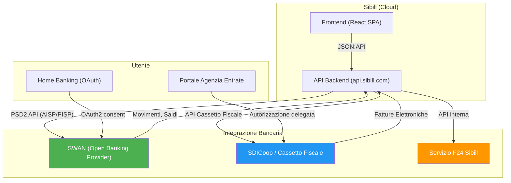
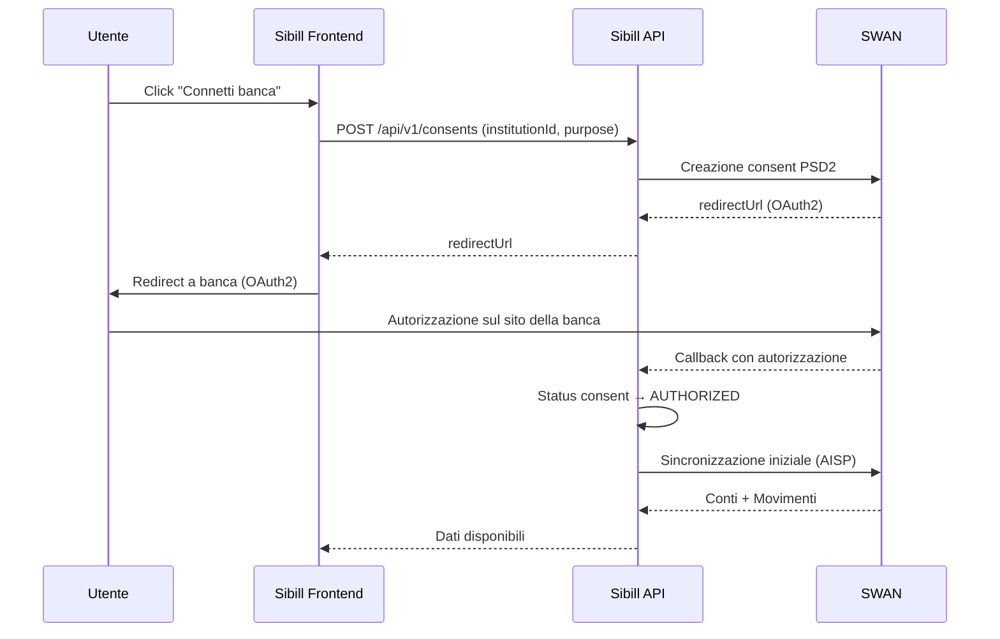
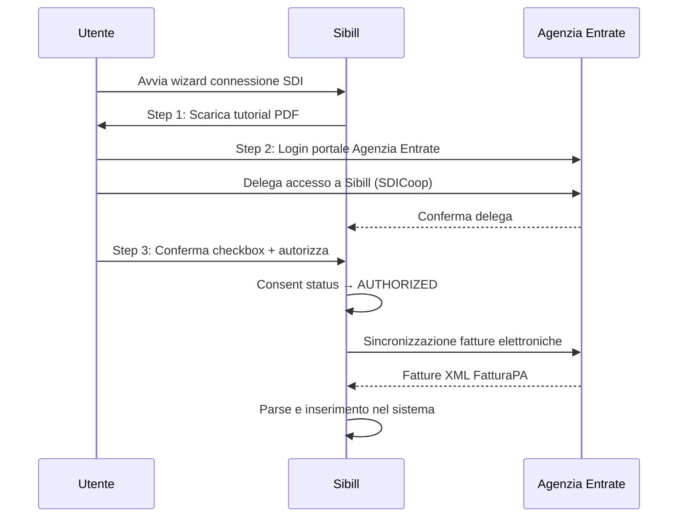
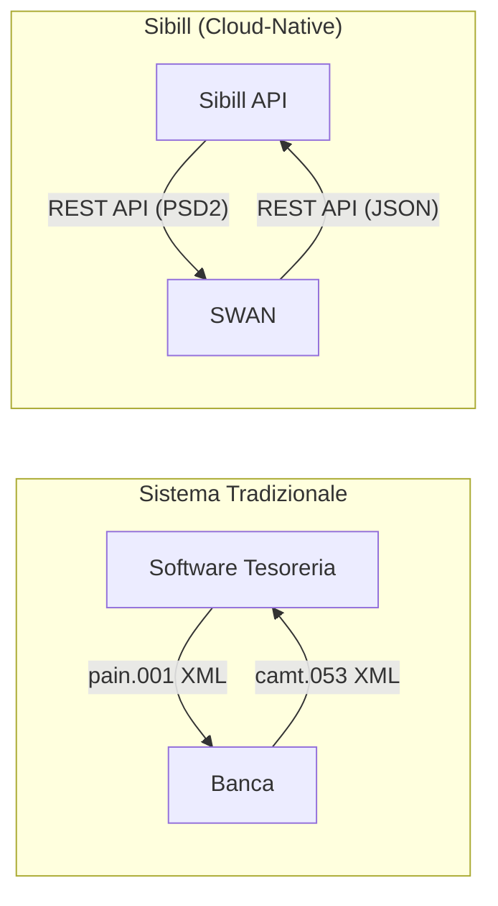

# Formati di Integrazione Bancaria — Sibill

**Data analisi:** 10 febbraio 2026
**Fonti:** API traces (14 sezioni), JavaScript analysis (64 file), API catalog, data model
**Metodologia:** Analisi delle API intercettate, codice JS client-side, e struttura UI

---

## Indice

1. [Riepilogo esecutivo](#1-riepilogo-esecutivo)
2. [Architettura di integrazione bancaria](#2-architettura-di-integrazione-bancaria)
3. [Open Banking via SWAN (PSD2)](#3-open-banking-via-swan-psd2)
4. [Fatturazione elettronica (SDI)](#4-fatturazione-elettronica-sdi)
5. [Formati di export](#5-formati-di-export)
6. [Formati di import](#6-formati-di-import)
7. [Pagamenti (F24 e disposizioni)](#7-pagamenti-f24-e-disposizioni)
8. [Tipi di Pagamento/Transazione Referenziati nell'App](#8-tipi-di-pagamentotransazione-referenziati-nellapp)
9. [Formati CBI e SEPA XML — Stato](#9-formati-cbi-e-sepa-xml--stato)
10. [Formato dati interno (JSON:API)](#10-formato-dati-interno-jsonapi)
11. [Riepilogo formati identificati](#11-riepilogo-formati-identificati)

---

## 1. Riepilogo esecutivo

> 🏦 **FORMATO BANCARIO — Scoperta chiave**: Sibill è una piattaforma **cloud-native** che **non utilizza i tradizionali flussi CBI o file SEPA XML** per lo scambio dati. L'integrazione bancaria avviene interamente tramite **API Open Banking (PSD2)** attraverso il provider **SWAN**. Questa è una differenza architetturale fondamentale rispetto ai software di tesoreria legacy.

**Implicazioni per il gestionale target:**
- I formati CBI (pain.001, pain.008, camt.053, camt.054) NON sono osservabili in Sibill
- Il gestionale target dovrà implementare il supporto CBI/SEPA autonomamente se richiesto dai clienti con banche tradizionali
- L'approccio Open Banking di Sibill è più moderno ma meno compatibile con l'ecosistema bancario italiano tradizionale

---

## 2. Architettura di integrazione bancaria

### 2.1 Diagramma architetturale


Confidenza: 🟢 Alta

### 2.2 Canali di integrazione identificati

| Canale | Provider | Protocollo | Direzione | Dati | Confidenza |
|---|---|---|---|---|---|
| **Open Banking (AISP)** | SWAN | PSD2 REST API | Lettura | Movimenti, saldi, conti | 🟢 Alta |
| **Open Banking (PISP)** | SWAN | PSD2 REST API | Scrittura | Disposizioni pagamento | 🟡 Media |
| **SDI / Cassetto Fiscale** | Agenzia Entrate | API delegata | Lettura | Fatture elettroniche | 🟢 Alta |
| **Import fatture** | Diretto | Upload file | Scrittura | Fatture (XML FE) | 🟡 Media |
| **Export cashflow** | Diretto | HTTP GET (xlsx) | Lettura | Report Excel | 🟢 Alta |
| **F24** | Sibill interno | API dedicata | Scrittura | Pagamenti F24 | 🟡 Media |

---

## 3. Open Banking via SWAN (PSD2)

### 3.1 Provider: SWAN

> 🏦 **FORMATO BANCARIO — Open Banking**: Sibill utilizza **SWAN** come unico provider Open Banking osservato. SWAN è un provider europeo di Banking-as-a-Service che offre API PSD2.

**Evidenze dall'API:**
- `GET /api/v1/institutions` → filtro `source__eq=SWAN`, `types__contains=BANKING`
- Istituto osservato: `"Conto Sibill"` (con source: `"SWAN"`)
- `GET /api/v1/user-bank-accounts` → filtro `source__eq=SWAN`

**Tipo di integrazione:** AISP (Account Information Service Provider) per lettura movimenti e saldi. Probabilmente anche PISP (Payment Initiation Service Provider) per i pagamenti.

Confidenza: 🟢 Alta

### 3.2 Flusso di autorizzazione Open Banking


Confidenza: 🟢 Alta (basato su struttura API e flusso consent)

### 3.3 Entità Open Banking

| Entità API | Campi chiave | Descrizione |
|---|---|---|
| `consent` | status, purpose, sourceId, authorizedAt, firstSyncAt, lastRunAt | Consenso PSD2 per accesso dati bancari |
| `institution` | name, source, types, flags, iconUrl, logoUrl | Istituto bancario nel catalogo SWAN |
| `account` | identifiers (IBAN, BIC), currency, currentBalance, availableBalance, status | Conto bancario sincronizzato |
| `user-bank-account` | source, status | Associazione utente-conto (permessi) |

### 3.4 Stati del consent

| Stato | Significato | Confidenza |
|---|---|---|
| `AUTHORIZED` | Consenso attivo, sincronizzazione in corso | 🟢 Alta |
| `DISABLED` | Consenso disabilitato/revocato | 🟢 Alta |
| `(altri)` | In attesa, errore, scaduto | 🟡 Media |

> 🟡 **ATTENZIONE**: Il filtro `status__notIn=AUTHORIZED,DISABLED` viene usato per trovare consent in stati "anomali" (pendenti, in errore). Questo endpoint viene chiamato **211 volte** nella sessione, suggerendo un polling frequente.

### 3.5 Formato dati movimenti (da SWAN)

I movimenti bancari arrivano come entità `transaction` via API. Struttura include:

```
transaction
├── account (conto di appartenenza)
│   └── consent.institution (banca)
├── allocations[] (split categorizzazione)
│   ├── category
│   └── subcategory
├── reconciliations[] (riconciliazioni)
├── payment (se legato a un pagamento)
├── card (se pagamento con carta)
└── attachments[] (allegati)
```

**Filtri osservati per movimenti:**
- `filter[account.hiddenAt__empty]=true` — escludi conti nascosti
- `filter[account.id__in]=...` — filtra per conti specifici
- `sort=-date,-createdAt,-id` — ordinamento cronologico inverso

Confidenza: 🟢 Alta

### 3.6 Formato saldi

```json
{
  "currentBalance": {"currency": "EUR", "amount": "12093.43"},
  "availableBalance": {"currency": "EUR", "amount": "10190.17"},
  "balanceDate": "2026-02-09T23:00:00.000Z"
}
```

I saldi aggregati vengono calcolati dall'endpoint `/api/v1/accounts/metadata`:
```json
{
  "balances_converted": {
    "count": 2,
    "available": {"currency": "EUR", "amount": "10190.17"},
    "current": {"currency": "EUR", "amount": "12093.43"}
  }
}
```
Confidenza: 🟢 Alta

---

## 4. Fatturazione elettronica (SDI)

### 4.1 Integrazione Cassetto Fiscale

> 🏦 **FORMATO BANCARIO — E-Invoicing**: L'integrazione con il Sistema di Interscambio (SDI) avviene tramite delega al Cassetto Fiscale dell'Agenzia delle Entrate. Sibill non gestisce direttamente i file XML FatturaPA ma li riceve tramite API delegata.

**File JS:** `AddAccountingConsent-DQhKurMl.js`

**Wizard autorizzazione (3 step):**

| Step | Azione | Dettaglio |
|---|---|---|
| 1 | Download tutorial PDF | `/static/documents/Sibill Tutorial - Cassetto Fiscale.pdf` |
| 2 | Login Agenzia Entrate | `https://iampe.agenziaentrate.gov.it/sam/UI/Login?realm=/agenziaentrate` |
| 3 | Conferma autorizzazione | Checkbox obbligatoria + pulsante conferma |

**Flusso tecnico:**

Confidenza: 🟢 Alta

### 4.2 Tipi di documento supportati

| Tipo | Codice API | Formato FE | Confidenza |
|---|---|---|---|
| **Fattura** | `INVOICE` | TD01 | 🟢 Alta |
| **Nota di credito** | `CREDIT_NOTE` | TD04 | 🟢 Alta |
| **Nota di debito** | `DEBIT_NOTE` | TD05 | 🟡 Media |
| **Parcella** | `PARCEL` | TD06 | 🟡 Media |
| **Autofattura** | `SELF_INVOICE` | TD16-TD28 | 🟡 Media |
| **Corrispettivo** | `BILL` | - | 🟢 Alta |

### 4.3 Campi fattura elettronica osservati

Dall'entità `document` dell'API:

| Campo | Tipo | Rilevanza FE | Confidenza |
|---|---|---|---|
| `isEInvoice` | boolean | Indica se è fattura elettronica SDI | 🟢 Alta |
| `eInvoiceType` | string/null | Tipo FatturaPA (TD01, TD04, etc.) | 🟢 Alta |
| `format` | string | Formato del documento (elettronico, cartaceo) | 🟢 Alta |
| `deliveryStatus` | string/null | Stato consegna SDI | 🟢 Alta |
| `deliveryDate` | string/null | Data consegna SDI | 🟢 Alta |
| `detectionDatetime` | string/null | Data rilevamento automatico | 🟢 Alta |
| `counterpartIdentifier` | string | P.IVA / Codice Fiscale | 🟢 Alta |
| `source` | string | Fonte del documento (SDI, manuale, import) | 🟢 Alta |
| `subjectToReverseCharge` | boolean | Reverse charge | 🟢 Alta |
| `withholdingTax` | dict/null | Ritenuta d'acconto | 🟢 Alta |
| `vatCollection` | string/null | Regime IVA (es. split payment) | 🟡 Media |
| `vatAmount` | dict | Importo IVA | 🟢 Alta |
| `vatAmountCompensation` | dict | Compensazione IVA | 🟡 Media |
| `grossAmount` | dict | Importo lordo | 🟢 Alta |

### 4.4 Direzione e stati documenti

**Direzioni:**
- `ISSUED` — Emesse (fatture attive)
- `RECEIVED` — Ricevute (fatture passive)

**Stati documento:**

| Stato | Significato | Confidenza |
|---|---|---|
| `DRAFT` | Bozza | 🟢 Alta |
| `CREATED` | Creato | 🟢 Alta |
| `SENT` | Inviato (a SDI) | 🟢 Alta |
| `DELIVERED` | Consegnato (da SDI al destinatario) | 🟢 Alta |
| `NOT_DELIVERED` | Non consegnato | 🟢 Alta |
| `DISCARDED` | Scartato | 🟢 Alta |

### 4.5 Controparte (dati per fatturazione)

Dall'entità `counterpart`, i campi rilevanti per la fattura elettronica:

| Campo | Uso FE |
|---|---|
| `vatNumber` | Partita IVA |
| `taxNumber` | Codice Fiscale |
| `certifiedEmail` | PEC destinatario |
| `destinationCode` | Codice destinatario SDI (7 caratteri) |
| `identityType` | Tipo soggetto (persona fisica / giuridica) |
| `companyName` | Ragione sociale |
| `address`, `city`, `postalCode`, `provinceCode` | Sede legale |

Confidenza: 🟢 Alta

---

## 5. Formati di export

### 5.1 Export Cash Flow (Excel/XLSX)

> 🏦 **FORMATO BANCARIO — Export XLSX**: L'unico formato di export file effettivamente identificato è l'export del cash flow in formato Excel.

**File JS:** `CashNavigationTabs-DVUea4A9.js`
**Endpoint:** `GET /api/v1/cashflow/table`
**Header differente:** `Accept: application/vnd.openxmlformats-officedocument.spreadsheetml.sheet` (invece di `application/vnd.api+json`)

**Meccanismo:**
```pseudocode
function exportCashflowExcel():
    response = api.get("/api/v1/cashflow/table", {
        headers: { Accept: "application/vnd.openxmlformats-officedocument.spreadsheetml.sheet" },
        responseType: "blob",
        params: { ...currentFilters }  // stessi filtri della vista corrente
    })
    blob = new Blob([response.data])
    saveAs(blob, "cashflow.xlsx")
    track("CASHFLOW_EXPORTED")
```

**Parametri export (stessi della vista):**
- `filter[company.id__eq]` — Company ID
- `filter[date__gte]` / `filter[date__lte]` — Intervallo date
- `filter[hiddenAt__empty]` — Escludi nascosti
- `timezone` — Timezone (Europe/Rome)
- `includeBudgets`, `includeOverdue`, `includePastdue` — Toggle opzionali

Confidenza: 🟢 Alta

### 5.2 Export non osservati ma probabili

| Export probabile | Endpoint stimato | Formato | Confidenza |
|---|---|---|---|
| Movimenti (transactions) | `GET /api/v1/transactions` con Accept xlsx | XLSX / CSV | 🔴 Bassa |
| Fatture (documents) | `GET /api/v1/documents/{id}/download` | XML FatturaPA / PDF | 🔴 Bassa |
| Scadenzario (outstanding) | Endpoint non identificato | XLSX / CSV | 🔴 Bassa |
| Report contabile | Endpoint non identificato | PDF | 🔴 Bassa |

> 🟡 **ATTENZIONE**: La pagina movimenti ha un pulsante "Scarica" (osservato in `01-app-map.md`), ma l'endpoint di download non è stato catturato nelle API traces. Potrebbe usare lo stesso pattern del cashflow export (Accept header diverso).

### 5.3 Dashboard fatture — Dati strutturati (non file)

L'endpoint `GET /api/v1/documents-dashboard/summary` restituisce dati aggregati utili per la reportistica, ma come JSON (non come file):

```json
{
  "revenueSummary": {
    "data": [{"month": 1, "year": 2026, "revenuesAmount": {...}, "costsAmount": {...}}],
    "totals": {"revenuesAmount": {...}, "costsAmount": {...}, "netAmount": {...}}
  },
  "taxesSummary": {
    "data": [...],
    "totals": {"vatDebitAmount": {...}, "vatCreditAmount": {...}, "netAmount": {...}}
  },
  "customers": [{"counterpartName": "...", "amount": {...}, "amountPercentage": 25.5}],
  "suppliers": [{"counterpartName": "...", "amount": {...}, "amountPercentage": 10.2}]
}
```
Confidenza: 🟢 Alta

---

## 6. Formati di import

### 6.1 Import fatture

**Pagina:** `/invoices/import` (osservata in `01-app-map.md`)
**Componenti UI:** Upload area + Input

> 🏦 **FORMATO BANCARIO — Import FE**: La pagina di import fatture suggerisce l'accettazione di file XML FatturaPA e/o file in formato proprietario.

**Dettagli tecnici non catturati:** L'endpoint POST per l'upload non è stato intercettato nelle API traces (la sessione di raccolta dati ha osservato solo operazioni GET). Endpoint probabile: `POST /api/v1/documents/import`.

**Formati accettati (stimati):**

| Formato | Descrizione | Confidenza |
|---|---|---|
| XML FatturaPA | Fattura elettronica italiana (SDI) | 🟡 Media |
| XML p7m | Fattura elettronica firmata | 🔴 Bassa |
| ZIP di XML | Pacchetto multiplo di fatture | 🔴 Bassa |

### 6.2 Nessun import di movimenti bancari via file

Non sono stati identificati endpoint o UI per l'import manuale di movimenti bancari tramite file (CBI, CSV, MT940, etc.). L'acquisizione movimenti avviene **esclusivamente** via Open Banking (SWAN).

> 🟡 **ATTENZIONE**: Questa è una limitazione significativa rispetto a software di tesoreria tradizionali che supportano l'import di estratti conto in formato CBI o SWIFT MT940/MT942. Per il gestionale target, questa funzionalità potrebbe essere necessaria per clienti con banche non coperte da Open Banking.

Confidenza: 🟢 Alta (assenza confermata)

---

## 7. Pagamenti (F24 e disposizioni)

### 7.1 Disposizioni di pagamento

**Entità API:** `payment`
**Endpoint:** `GET /api/v1/payments`

**Include osservato:**
```
account,account.consent,account.consent.institution,
counterpart,attachments,transactions,parent,retry_attempts
```

Questo rivela che i pagamenti:
- Sono collegati a un **conto di origine** (account via consent/institution)
- Hanno una **controparte** destinataria
- Generano **transazioni** corrispondenti
- Possono avere un **parent** (pagamenti raggruppati)
- Supportano **retry_attempts** (tentativi di ripetizione)

**Stati pagamento:**

| Stato | Significato | Confidenza |
|---|---|---|
| `PENDING` | In attesa di esecuzione | 🟢 Alta |
| `ACCEPTED` | Accettato dalla banca | 🟢 Alta |
| `SUCCEEDED` | Completato con successo | 🟢 Alta |
| `FAILED` | Fallito | 🟢 Alta |
| `TIMEOUT` | Scaduto (timeout) | 🟢 Alta |

> 🏦 **FORMATO BANCARIO — Pagamenti**: Le disposizioni di pagamento NON generano file SEPA XML (pain.001). Vengono eseguite tramite API SWAN (PISP — Payment Initiation Service Provider). Il formato è API-to-API, non file-based.

Confidenza: 🟡 Media (la struttura completa del payment non è stata parsata)

### 7.2 Pagamento F24

**Pagina:** `/f24`
**API traces catturate:** 0 (nessuna chiamata API specifica osservata)

La pagina F24 contiene:
- FAQ statiche sul servizio di pagamento F24
- Badge "Novità" nel menu
- Pulsante "Paga F24"

> 🏦 **FORMATO BANCARIO — F24**: Il servizio di pagamento F24 è un servizio integrato di Sibill. NON genera un file F24 in formato CBI tradizionale (tracciato standard ABI per F24 telematico). La sottomissione avviene tramite API interna Sibill → banca.

**Flusso ipotizzato:**
1. Utente compila i dati F24 nella UI
2. Sibill invia la richiesta via API interna
3. Il pagamento viene eseguito tramite il circuito bancario di SWAN

Confidenza: 🔴 Bassa (nessuna API catturata; basato solo sulla UI)

---

## 8. Tipi di Pagamento/Transazione Referenziati nell'App

### 8.1 Tipi di pagamento identificati nell'UI e nel JS

> 🏦 **FORMATO BANCARIO — Tipi pagamento**: L'interfaccia di Sibill e la documentazione interna (FAQ F24, regole di categorizzazione) **referenziano** i seguenti tipi di pagamento, anche se l'esecuzione effettiva avviene tramite API SWAN.

**Fonte:** `docs/08-pagamenti.md` (LB-PAG-06), regole di categorizzazione (TransactionType), stringhe JS

| Tipo | Descrizione | Formato teorico | Implementazione Sibill | Confidenza |
|---|---|---|---|---|
| **Bonifico SEPA (SCT)** | Trasferimento fondi SEPA | pain.001 XML | API SWAN (PISP) | 🟡 Media |
| **RiBa** | Ricevuta Bancaria | Tracciato CBI | Non confermato | 🔴 Bassa |
| **SDD Core** | Addebito diretto SEPA consumatori | pain.008 XML | Non osservato | 🔴 Bassa |
| **SDD B2B** | Addebito diretto SEPA business | pain.008 XML | Non osservato | 🔴 Bassa |
| **F24** | Pagamento tributi e contributi | Tracciato CBI F24 | Servizio dedicato Sibill | 🟡 Media |
| **MAV** | Pagamento Mediante Avviso | Bollettino bancario | Non confermato | 🔴 Bassa |

**Nota importante:** Questi tipi sono usati come **label/filtri nell'UI** (es. nelle regole di categorizzazione con condizione `TransactionType → filtra per tipo transazione (bonifico, SDD, etc.)`), ma **non si traducono in generazione di file CBI/SEPA**. Sibill esegue i pagamenti interamente via API SWAN (PISP), non tramite file.

### 8.2 Endpoint di export identificati

> 🏦 **FORMATO BANCARIO — Export**: Oltre all'export XLSX del cashflow (sezione 5.1), esiste un endpoint generico di esportazione.

| Endpoint | Descritto in | Formato | Osservato nelle traces | Confidenza |
|---|---|---|---|---|
| `GET /api/v1/cashflow/table` (Accept: xlsx) | docs/12, docs/04 | XLSX | Si | 🟢 Alta |
| `GET /api/v1/exports/*` | docs/04 | Sconosciuto | No | 🔴 Bassa |
| `POST /api/v1/documents/import` | docs/04 | XML FatturaPA (stimato) | No | 🟡 Media |

L'endpoint `GET /api/v1/exports/*` è stato osservato nell'API reference ma **non è stato catturato nelle API traces**. Potrebbe gestire export di movimenti, fatture, scadenzario in formati XLSX/CSV/PDF.

---

## 9. Formati CBI e SEPA XML — Stato

### 9.1 Assenza di file CBI/SEPA

> 🏦 **FORMATO BANCARIO — CBI/SEPA assenti**: **NESSUN formato CBI o SEPA XML è stato identificato** nell'applicazione Sibill. Non sono presenti:
> - File pain.001 (Credit Transfer Initiation)
> - File pain.008 (Direct Debit Initiation)
> - File camt.053 (Bank to Customer Statement)
> - File camt.054 (Debit/Credit Notification)
> - Tracciati CBI standard (RiBa, MAV, Bonifico)

**Directory `assets/integration-formats/`:** Vuota — nessun file di integrazione bancaria è stato scaricato.
**Directory `assets/reports/`:** Vuota — nessun report è stato scaricato.

Confidenza: 🟢 Alta (assenza confermata da analisi completa JS, API, e UI)

### 9.2 Motivo dell'assenza

Sibill è progettata come piattaforma **cloud-native** che bypassa il layer di file tradizionale:



| Aspetto | Tradizionale (CBI/SEPA) | Sibill (Open Banking) |
|---|---|---|
| **Protocollo** | File XML via canale bancario | REST API via Internet |
| **Autenticazione** | Certificati digitali CBI | OAuth2 (PSD2 consent) |
| **Frequenza sync** | Batch (1-2 volte/giorno) | Near real-time |
| **Formati** | pain.001, camt.053, RiBa, F24 | JSON:API proprietario |
| **Intermediario** | Banca + CBI (consortium) | SWAN (Banking-as-a-Service) |
| **Copertura banche** | Tutte le banche italiane CBI | Solo banche supportate da SWAN |

### 9.3 Implicazioni per il gestionale target

Per il gestionale target che deve supportare clienti con banche italiane tradizionali, sarà necessario implementare:

| Formato | Priorità | Uso | Descrizione |
|---|---|---|---|
| `pain.001.001.03` | Alta | Bonifici SEPA | Customer Credit Transfer Initiation |
| `pain.002.001.03` | Media | Esito bonifici | Payment Status Report |
| `pain.008.001.02` | Media | SDD (addebiti diretti) | Customer Direct Debit Initiation |
| `camt.053.001.02` | Alta | Estratto conto | Bank to Customer Statement |
| `camt.054.001.02` | Media | Notifiche | Debit/Credit Notification |
| Tracciato RiBa CBI | Bassa | Ricevute bancarie | Formato proprietario CBI |
| Tracciato F24 CBI | Media | Pagamento tributi | Formato ABI per F24 telematico |

---

## 10. Formato dati interno (JSON:API)

### 10.1 Struttura monetaria standard

Sibill usa un formato monetario consistente in tutta l'API:

```json
{
  "amount": "12093.43",
  "currency": "EUR"
}
```

- `amount` è sempre una **stringa** (non float) — per evitare errori di precisione
- Lato client, viene convertito in `BigNumber` per i calcoli
- La valuta è sempre specificata esplicitamente

Confidenza: 🟢 Alta

### 10.2 Formato date

| Contesto | Formato | Esempio |
|---|---|---|
| Timestamp API | ISO 8601 con timezone | `2026-02-09T23:00:00.000Z` |
| Data documento | ISO date | `2026-01-15` |
| Range cashflow | ISO timestamp UTC | `2025-08-31T22:00:00.000Z` (= 1 settembre in Europe/Rome) |
| Timezone | IANA | `Europe/Rome` |

> 🟡 **ATTENZIONE**: Le date del cashflow sono in UTC, con offset per timezone. Il 1 settembre 2025 in Europe/Rome (UTC+2) diventa `2025-08-31T22:00:00.000Z`. Questo è un pattern critico da replicare nel gestionale.

### 10.3 Paginazione cursor-based (formato Elixir)

Il cursor di paginazione è una stringa base64 che codifica una struttura Elixir/Erlang:

```
g3QAAAABdwpjcmVhdGVkX2F0dAAAAA13C21pY3Jvc2Vjb25k...
```

Quando decodificato (base64 → Erlang Term Format), contiene:
- `created_at` — Timestamp dell'ultimo elemento
- `id` — UUID dell'ultimo elemento (per ordinamenti secondari)
- Campi aggiuntivi per sort complessi (es. `flow_id`, `creation_date`, `search_date`)

> 🟡 **ATTENZIONE**: Questo formato cursor suggerisce che il backend è scritto in **Elixir/Phoenix** (non Ruby on Rails come inizialmente ipotizzato). Il formato Erlang Term è nativo dell'ecosistema Elixir/Erlang.

Confidenza: 🟡 Media

---

## 11. Riepilogo formati identificati

### 11.1 Tabella riassuntiva

| # | Formato | Direzione | Canale | Stato | Confidenza |
|---|---|---|---|---|---|
| 1 | **JSON:API** (application/vnd.api+json) | Input/Output | REST API | Confermato — formato primario per tutti i dati | 🟢 Alta |
| 2 | **XLSX** (Excel) | Export | HTTP GET con Accept header | Confermato — export cashflow | 🟢 Alta |
| 3 | **XML FatturaPA** | Import | Upload file / SDI auto-sync | Probabile — per import fatture | 🟡 Media |
| 4 | **JSON SWAN** | Input | PSD2 API | Confermato — movimenti e saldi bancari | 🟢 Alta |
| 5 | **OAuth2 Token** | Auth | Redirect flow | Confermato — consenso Open Banking | 🟢 Alta |
| 6 | **PDF Tutorial** | Statico | Download | Confermato — tutorial Cassetto Fiscale | 🟢 Alta |
| 7 | **pain.001 SEPA XML** | — | — | ❌ **NON PRESENTE** | 🟢 Alta (assenza) |
| 8 | **pain.008 SEPA XML** | — | — | ❌ **NON PRESENTE** | 🟢 Alta (assenza) |
| 9 | **camt.053 SEPA XML** | — | — | ❌ **NON PRESENTE** | 🟢 Alta (assenza) |
| 10 | **camt.054 SEPA XML** | — | — | ❌ **NON PRESENTE** | 🟢 Alta (assenza) |
| 11 | **Tracciato CBI** | — | — | ❌ **NON PRESENTE** | 🟢 Alta (assenza) |
| 12 | **F24 telematico CBI** | — | — | ❌ **NON PRESENTE** | 🟢 Alta (assenza) |
| 13 | **CSV** | — | — | ❌ **NON OSSERVATO** | 🟡 Media (assenza) |
| 14 | **MT940/MT942 SWIFT** | — | — | ❌ **NON PRESENTE** | 🟢 Alta (assenza) |

### 11.2 Gap rispetto alle necessità del gestionale target

| Funzionalità | Sibill | Gestionale target | Gap |
|---|---|---|---|
| Acquisizione movimenti | Open Banking (SWAN) | Open Banking + CBI/CSV import | **Import file necessario** |
| Disposizioni pagamento | API SWAN (PISP) | API + pain.001 XML | **Generazione SEPA necessaria** |
| Estratto conto | API SWAN (JSON) | API + camt.053 parsing | **Parser SEPA necessario** |
| Fatture elettroniche | SDI via Cassetto Fiscale | SDI + import XML manuale | Simile |
| F24 | Servizio Sibill dedicato | Generazione tracciato CBI F24 | **Tracciato CBI necessario** |
| Export movimenti | Solo cashflow XLSX | XLSX + CSV + PDF | **Export multipli necessari** |
| RiBa | Non supportato | Generazione tracciato RiBa | **Implementazione necessaria** |
| SDD | Non osservato | pain.008 XML | **Implementazione necessaria** |
