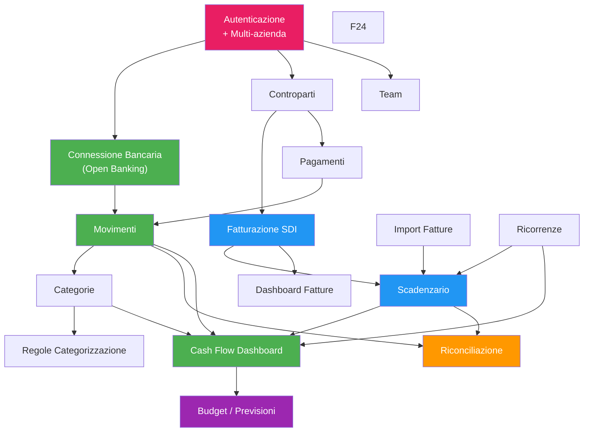

# Mappatura Funzionalita' verso il Gestionale Target

**Data analisi:** 10 febbraio 2026
**Fonti:** Tutti i documenti di analisi (docs/00 - docs/13), API catalog, JS analysis
**Scopo:** Per ogni funzionalita' di Sibill, valutare complessita' implementativa e priorita' per il gestionale target

---

## Indice

1. [Criteri di valutazione](#1-criteri-di-valutazione)
2. [Tabella riassuntiva](#2-tabella-riassuntiva)
3. [Dettaglio per modulo](#3-dettaglio-per-modulo)
4. [Dipendenze tra moduli](#4-dipendenze-tra-moduli)
5. [Suggerimenti architetturali](#5-suggerimenti-architetturali)
6. [Roadmap implementativa suggerita](#6-roadmap-implementativa-suggerita)

---

## 1. Criteri di valutazione

### 1.1 Complessita' implementativa

| Livello | Significato | Effort stimato |
|---|---|---|
| **Bassa** | Logica semplice, CRUD standard, UI tabellare | 1-2 settimane |
| **Media** | Logica di business non banale, integrazioni esterne, UI interattiva | 2-4 settimane |
| **Alta** | Algoritmi complessi, integrazioni critiche, UI avanzata (grafici, drag & drop) | 4-8+ settimane |

### 1.2 Priorita' per il gestionale

| Livello | Significato |
|---|---|
| **P0 — Critica** | Funzionalita' core senza la quale il gestionale non e' utilizzabile |
| **P1 — Alta** | Funzionalita' importante che la maggior parte degli utenti si aspetta |
| **P2 — Media** | Funzionalita' utile, puo' essere aggiunta in una fase successiva |
| **P3 — Bassa** | Nice-to-have, differenziante ma non essenziale |

---

## 2. Tabella riassuntiva

| # | Funzionalita' | Modulo Sibill | Complessita' | Priorita' | Note |
|---|---|---|---|---|---|
| 1 | **Connessione bancaria (Open Banking)** | Conti | Alta | P0 | Integrazione PSD2 fondamentale |
| 2 | **Visualizzazione movimenti** | Transazioni | Media | P0 | Tabella filtrata con categorizzazione |
| 3 | **Categorizzazione transazioni** | Transazioni / Categorie | Media | P1 | Categorie/sottocategorie gerarchiche |
| 4 | **Regole di categorizzazione automatica** | Transazioni / Regole | Media | P1 | Condizioni + azioni configurabili |
| 5 | **Dashboard cash flow** | Cashflow | Alta | P0 | Grafico + tabella con aggregazioni |
| 6 | **Budget / Previsioni** | Cashflow | Alta | P2 | Budget per categoria/mese con suggerimenti |
| 7 | **Export cash flow Excel** | Cashflow | Bassa | P1 | XLSX con stessi filtri della vista |
| 8 | **Riconciliazione bancaria** | Riconciliazioni | Alta | P1 | Matching transazioni-scadenze (auto + manuale) |
| 9 | **Scadenzario** | Outstanding | Media | P0 | Gestione scadenze attive/passive |
| 10 | **Ricorrenze** | Outstanding / Ricorrenze | Media | P2 | Pagamenti/incassi periodici |
| 11 | **Pagamenti (disposizioni)** | Pagamenti | Alta | P1 | Creazione, esecuzione, tracking pagamenti |
| 12 | **Pagamento F24** | F24 | Alta | P2 | Servizio dedicato per tributi |
| 13 | **Fatturazione elettronica (SDI)** | Fatture | Alta | P1 | Integrazione Cassetto Fiscale + creazione FE |
| 14 | **Dashboard fatture** | Fatture | Media | P2 | Ricavi/costi/IVA con top clienti/fornitori |
| 15 | **Import fatture** | Fatture | Media | P1 | Upload file XML FatturaPA |
| 16 | **Gestione clienti/fornitori** | Controparti | Media | P0 | Anagrafica con dati fatturazione |
| 17 | **Gestione team** | Impostazioni | Bassa | P2 | Ruoli (ADMIN, VIEWER), inviti |
| 18 | **Multi-azienda** | Impostazioni | Media | P1 | Selezione company, dati segregati |
| 19 | **Profilo fatturazione** | Fatture / Profile | Bassa | P1 | Dati azienda + valori predefiniti |
| 20 | **Programma referral** | Referral | Bassa | P3 | Invita e ricevi bonus |

---

## 3. Dettaglio per modulo

### 3.1 Connessione Bancaria (Open Banking)

**Cosa fa Sibill:**
- Connessione a conti bancari tramite SWAN (provider PSD2)
- Wizard OAuth2 per autorizzazione consent
- Sincronizzazione automatica movimenti e saldi
- Supporto multi-conto e multi-banca
- Gestione stati consent (AUTHORIZED, DISABLED, etc.)
- Visualizzazione saldi aggregati (corrente + disponibile)
- Possibilita' di nascondere conti (`hiddenAt`)
- Esclusione conti dal calcolo saldi (`ignoreBalance`)

**Complessita':** Alta
- Richiede contratto con provider Open Banking (SWAN, Fabrick, Tink, etc.)
- Implementazione flusso OAuth2 con redirect
- Gestione rinnovi consent (scadenza PSD2: 90 giorni max)
- Sincronizzazione asincrona e gestione errori
- Multi-valuta (anche se EUR predominante)

**Priorita':** P0 — Senza dati bancari il gestionale non ha senso

**Note implementative:**
- Valutare provider alternativi a SWAN per il mercato italiano: **Fabrick** (ex CBI Globe), **Tink**, **Plaid**
- Fabrick e' particolarmente rilevante perche' copre le banche italiane via CBI
- Prevedere anche import manuale via file (CBI, CSV, MT940) per banche non coperte
- L'entita' `account` ha 18 campi — replicare la struttura completa

**API da implementare:**
- `GET /accounts` — Lista conti con saldi
- `GET /accounts/metadata` — Saldi aggregati
- `POST /consents` — Avvio connessione
- `GET /consents` — Stato connessioni
- Webhook per notifiche sync completata

---

### 3.2 Visualizzazione Movimenti

**Cosa fa Sibill:**
- Tabella movimenti con 212+ righe visibili (virtual scroll implicito)
- 9 filtri: data, categoria, conti, status, importo, visibilita', tipo, categorizzazione, ricerca testo
- Ordinamento per data (discendente di default)
- Include ricco: account, allocations, category, subcategory, reconciliations, payment, attachments
- Checkbox "Verificato" per verifica manuale
- Paginazione cursor-based (page size 50)

**Complessita':** Media
- La tabella e' standard ma richiede filtri combinati performanti
- Il pattern `allocations` (split categorizzazione) aggiunge complessita'
- La riconciliazione inline (da lista movimenti) e' un pattern avanzato

**Priorita':** P0 — Funzionalita' core

**Note implementative:**
- Usare virtual scrolling per grandi dataset (react-virtuoso nel frontend)
- Implementare filtri server-side con operatori (`__eq`, `__in`, `__gte`, etc.)
- La categorizzazione split (allocation) permette di assegnare un movimento a piu' categorie — valutare se necessario
- Endpoint metadata per totali senza caricare tutti i dati

---

### 3.3 Categorizzazione Transazioni

**Cosa fa Sibill:**
- Categorie gerarchiche a 2 livelli: Categoria → Sottocategoria
- Categorie con colore personalizzabile (hex)
- Nome max 255 caratteri (validazione Zod)
- CRUD completo per categorie e sottocategorie
- Ricerca con filtro regex case-insensitive
- Eliminazione con gestione side effects (transazioni, fatture, regole, budget, ricorrenze)
- Opzioni eliminazione sottocategoria: "rimuovi categorizzazione" o "assegna a padre"
- Chip categorizzazione con indicatore automatico (icona robot)
- Lista virtualizzata per performance

**Complessita':** Media
- La struttura a 2 livelli e' semplice
- La complessita' sta nella gestione side effects dell'eliminazione
- Il pattern "allocations" per split categorizzazione aggiunge un livello

**Priorita':** P1 — Essenziale per l'analisi dei flussi di cassa

**Note implementative:**
- Replicare il sistema a 2 livelli (non di piu' — Sibill si ferma a 2)
- Implementare le azioni di eliminazione con side effects atomici (transazione DB)
- Il colore categoria e' usato nei grafici — mantenere consistenza
- Prevedere categorie di sistema predefinite (come "Non categorizzata")

---

### 3.4 Regole di Categorizzazione Automatica

**Cosa fa Sibill:**
- Condizioni: Account, Keywords, TransactionType
- Azione: SetCategory (categoria + sottocategoria)
- Direzione: Inflow / Outflow
- Applicazione automatica ai nuovi movimenti
- Tracking: `TRANSACTION_CATEGORY_ASSIGNED` (automatico)

**Complessita':** Media
- Motore di regole con condizioni AND (tutte devono matchare)
- Pattern keywords richiede matching testo nella descrizione
- Riapplicazione regole a movimenti esistenti (batch)

**Priorita':** P1 — Riduce lavoro manuale significativamente

**Note implementative:**
- Implementare engine di regole semplice: condizioni come filtri, azione come assignment
- Ordine di esecuzione regole: prima regola che matcha vince (o priorita' esplicita)
- Prevedere "dry run" per testare regole prima di applicarle

---

### 3.5 Dashboard Cash Flow

**Cosa fa Sibill:**
- Grafico ComposedChart (Recharts): barre (entrate/uscite) + linea (bilancio)
- Linea bilancio divisa: continua (passato) + tratteggiata (futuro)
- Tabella con righe espandibili per categoria/sottocategoria
- Periodo selezionabile: min gen 2020, max +5 anni
- Range: 3-12 mesi
- Filtri: conti, periodo, budget, scaduti, passato dovuto
- Aggregazione: transazioni + outstanding + pastdue per mese/categoria
- Scroll sincronizzato tra header, body e footer
- Aside panel con dettaglio transazioni/scadenze per cella selezionata
- Ordinamento categorie: alfabetico o per importo
- Visibilita' categorie con override localStorage

**Complessita':** Alta
- Grafico complesso con dati aggregati da piu' fonti
- Scroll sync custom tra pannelli
- Aside panel reattivo alla selezione
- Calcolo aggregazioni lato server (chart + table endpoint)
- Budget con suggerimenti basati su storico

**Priorita':** P0 — E' la homepage e il valore principale di Sibill

**Note implementative:**
- **Backend**: endpoint `/cashflow/chart` (saldi mensili) e `/cashflow/table` (dettaglio per categoria)
- **Frontend**: Recharts e' una buona scelta (o Chart.js / Apache ECharts come alternative)
- La separazione past/future nella linea bilancio e' un pattern UX efficace da replicare
- Il scroll sync richiede implementazione custom (no libreria standard)
- I toggle `includeBudgets`, `includeOverdue`, `includePastdue` condizionano sia chart che table

**📐 Algoritmi da replicare (da docs/13):**
- Aggregazione cash flow (sezione 4.5)
- Calcolo linea bilancio (sezione 4.7)
- Calcolo dominio Y (sezione 4.8)
- Inversione segno outflow (sezione 4.9)

---

### 3.6 Budget / Previsioni

**Cosa fa Sibill:**
- Budget per categoria o sottocategoria, per mese, per direzione (inflow/outflow)
- Solo numeri interi (maxDecimalPlaces: 0), solo positivi
- Conflitti livello: budget categoria sovrascrive sottocategorie e viceversa
- Estensione budget su piu' mesi (feature "extend")
- 3 suggerimenti automatici: mese precedente, media 3 mesi, stesso mese anno precedente
- Calcolo residuo: budget - (actual + outstanding + pastdue)
- Percentuale completamento con BigNumber (ROUND_CEIL)
- Eliminazione budget futuri (dal mese corrente in poi)
- Feature gated (richiede piano a pagamento)

**Complessita':** Alta
- Logica di conflitto tra livelli
- Suggerimenti basati su dati storici
- Estensione batch su piu' mesi
- UI inline editing nelle celle della tabella cash flow

**Priorita':** P2 — Importante ma non bloccante per MVP

**Note implementative:**
- Endpoint CRUD: `GET/POST/PATCH/DELETE /api/v1/budgets`
- I suggerimenti possono essere calcolati lato client (come fa Sibill) o lato server
- Il conflitto livelli deve essere gestito atomicamente (elimina vecchi + crea nuovi)
- Feature gating: puo' essere un flag a livello di piano/subscription

---

### 3.7 Export Cash Flow Excel

**Cosa fa Sibill:**
- Stesso endpoint della tabella (`/api/v1/cashflow/table`) con Accept header XLSX
- Stessi filtri della vista corrente
- Download come blob → saveAs
- Evento tracking: `CASHFLOW_EXPORTED`

**Complessita':** Bassa
- Pattern standard: API genera XLSX server-side
- Libreria server: Apache POI (Java), openpyxl (Python), exceljs (Node)

**Priorita':** P1 — Gli utenti si aspettano l'export

**Note implementative:**
- Implementare lo stesso pattern: endpoint dati con Accept header diverso
- Estendere a tutti i moduli (movimenti, fatture, scadenzario)
- Aggiungere anche CSV come formato alternativo

---

### 3.8 Riconciliazione Bancaria

**Cosa fa Sibill:**
- Riconciliazione automatica: matching transazioni ↔ scadenze (flow)
- Riconciliazione manuale: pagina dedicata `/reconciliations`
- Entita' `reconciliation` con source: AUTOMATIC / MANUAL
- Endpoint `transactions/reconciliations` per stato riconciliazione batch
- Pattern: frontend carica movimenti → chiede riconciliazioni per quegli ID
- Stato verifica: `TO_VERIFY` (suggerimento da confermare)

**Complessita':** Alta
- Algoritmo di matching automatico (importo, data, descrizione)
- Gestione matching 1:1, 1:N, N:1
- UI per conferma/rifiuto suggerimenti
- Impatto su stato pagamento delle fatture

**Priorita':** P1 — Funzionalita' chiave per la tesoreria

**Note implementative:**
- L'algoritmo di matching non e' osservabile dal frontend (e' server-side)
- Implementare con scoring: match su importo (peso alto), data (medio), descrizione/riferimento (medio)
- Soglia di tolleranza configurabile (es. ±1 giorno, ±0.01 EUR)
- Prevedere regole di riconciliazione personalizzabili (come per categorizzazione)

---

### 3.9 Scadenzario

**Cosa fa Sibill:**
- Pagina `/outstanding` per gestione scadenze
- Entita' `flow` collegata a `document` (fattura)
- Scadenze con stato pagamento (ToPay, etc.)
- Regole scadenzario (`/outstanding/rules`)
- Filtri per stato, importo, data scadenza
- Integrazione con cash flow (outstanding e pastdue nel grafico)

**Complessita':** Media
- Struttura dati legata alle fatture (flow = scadenza di una fattura)
- Regole di generazione scadenze da documenti
- Gestione stati e transizioni

**Priorita':** P0 — Fondamentale per la gestione dei pagamenti

**Note implementative:**
- Lo scadenzario e' alimentato dalle fatture (ogni fattura genera 1+ flow/scadenze)
- I flow compaiono nel cash flow previsionale come "outstanding"
- Le scadenze passate non pagate diventano "pastdue" (scaduti)
- Prevedere scadenze manuali (non legate a fatture)

---

### 3.10 Ricorrenze

**Cosa fa Sibill:**
- Pagamenti e incassi ricorrenti
- Tabs: Pagamenti ricevuti (`/outstanding/recurrences/received`) e Incassi emessi (`/outstanding/recurrences/issued`)
- Collegate a: account, category, subcategory
- Alimentano il cash flow previsionale

**Complessita':** Media
- CRUD con frequenza (giornaliera, settimanale, mensile, annuale)
- Generazione automatica scadenze
- Impatto su previsioni cash flow

**Priorita':** P2 — Utile per previsioni accurate

**Note implementative:**
- Schedulare generazione automatica scadenze dal template ricorrenza
- Collegare al cash flow come fonte previsionale aggiuntiva

---

### 3.11 Pagamenti (Disposizioni)

**Cosa fa Sibill:**
- Lista pagamenti con stati: PENDING, ACCEPTED, SUCCEEDED, FAILED, TIMEOUT
- Esecuzione pagamenti tramite SWAN (PISP)
- Collegamento a: account, counterpart, transactions, parent, retry_attempts
- Polling status TIMEOUT (29 chiamate metadata osservate)
- Pagamenti raggruppati (relazione `parent`)
- Tentativi di ripetizione (retry_attempts)

**Complessita':** Alta
- Integrazione con provider pagamento (PISP)
- Workflow approvazione (in aziende multi-utente)
- Gestione errori e retry
- Generazione disposizioni (per CBI: file pain.001)

**Priorita':** P1 — Funzionalita' di tesoreria essenziale

**Note implementative:**
- Se si usa Open Banking: integrare con provider PISP
- Se si supporta CBI: generare file pain.001 XML
- Prevedere workflow approvazione: creazione → approvazione → esecuzione
- Il pattern `retry_attempts` suggerisce gestione resiliente dei fallimenti
- Il `parent` suggerisce raggruppamento di piu' pagamenti in un unico batch

---

### 3.12 Pagamento F24

**Cosa fa Sibill:**
- Servizio dedicato per pagamento F24
- Pagina con FAQ e pulsante "Paga F24"
- Badge "Novita'" nel menu
- Nessuna API catturata — flusso non analizzato

**Complessita':** Alta
- Integrazione con circuito bancario per F24 telematico
- Validazione complessa del modello F24 (sezioni, codici tributo)
- Conformita' normativa

**Priorita':** P2 — Necessario per aziende, ma puo' essere fase 2

**Note implementative:**
- Opzione 1: Integrazione con provider che offre F24 as-a-service
- Opzione 2: Generazione tracciato CBI F24 + invio alla banca
- La validazione dei codici tributo richiede tabelle aggiornate dall'Agenzia Entrate

---

### 3.13 Fatturazione Elettronica (SDI)

**Cosa fa Sibill:**
- Integrazione con Cassetto Fiscale per ricezione fatture elettroniche
- Wizard autorizzazione SDI in 3 step
- Creazione fatture (`/invoices/info`)
- 6 tipi documento: Invoice, CreditNote, DebitNote, Parcel, SelfInvoice, Bill
- 6 stati: DRAFT, CREATED, SENT, DELIVERED, NOT_DELIVERED, DISCARDED
- Campi FE: reverse charge, ritenuta d'acconto, regime IVA, tipo FE (TD01-TD28)
- Dashboard con ricavi, costi, IVA, top clienti/fornitori
- 31 campi nell'entita' `document`

**Complessita':** Alta
- Generazione XML FatturaPA conforme
- Integrazione con SDI (invio/ricezione)
- Gestione notifiche SDI (RC, NS, MC, etc.)
- Validazione IVA, reverse charge, ritenute
- UI complessa per creazione fattura

**Priorita':** P1 — Necessaria per la gestione completa del ciclo attivo/passivo

**Note implementative:**
- Valutare provider intermediario SDI (Aruba, Fatture in Cloud API, Fatturapertutti)
- La generazione XML FatturaPA e' complessa — usare librerie dedicate
- Il campo `isEInvoice` distingue fatture elettroniche da manuali
- Il campo `isFromRecurrence` indica fatture generate automaticamente da ricorrenze
- L'entita' `flow` (scadenza) collegata al documento alimenta lo scadenzario

---

### 3.14 Dashboard Fatture

**Cosa fa Sibill:**
- Endpoint `/documents-dashboard/summary` con dati aggregati per anno
- Revenue summary: ricavi e costi per mese + totali
- Tax summary: IVA a debito e credito per mese + netto
- Top customers e suppliers con importo e percentuale
- Filtri per anno, tipo documento, stato

**Complessita':** Media
- Query aggregate server-side
- Grafici (ipotizzati, basati sulla pagina)
- Tabelle riepilogative

**Priorita':** P2 — Utile ma non bloccante

**Note implementative:**
- Implementare come API di aggregazione dedicata (non calcolare client-side)
- I dati `amountPercentage` sono pre-calcolati server-side

---

### 3.15 Import Fatture

**Cosa fa Sibill:**
- Pagina `/invoices/import` con area upload
- Formato accettato: XML FatturaPA (stimato)
- Endpoint probabile: `POST /api/v1/documents/import`

**Complessita':** Media
- Parsing XML FatturaPA
- Validazione struttura e coerenza
- Estrazione dati (controparte, importi, scadenze)
- Creazione automatica entita' collegate (counterpart, flow)

**Priorita':** P1 — Necessaria per utenti senza integrazione SDI

**Note implementative:**
- Parser XML FatturaPA con libreria dedicata
- Auto-creazione controparte se non esistente (match su P.IVA)
- Generazione automatica scadenze dal campo `DettaglioPagamento`
- Gestione duplicati (check su numero fattura + P.IVA + data)

---

### 3.16 Gestione Clienti/Fornitori (Controparti)

**Cosa fa Sibill:**
- Entita' `counterpart` con 18+ campi
- Tipi: VIRTUAL (auto-creati da movimenti) e REAL (manuali/da fatture)
- Struttura gerarchica: parent → children
- Campi fatturazione: PEC, codice destinatario SDI, metodo pagamento
- Suggerimenti controparti (`/counterparts/suggested`)
- Filtro per tipo, stato, email contatto

**Complessita':** Media
- CRUD standard ma con molti campi
- Auto-creazione da fatture
- Merge duplicati (VIRTUAL → REAL)
- Suggerimenti basati su dati esistenti

**Priorita':** P0 — Anagrafica base per fatturazione e pagamenti

**Note implementative:**
- Il pattern VIRTUAL/REAL e' elegante: i movimenti bancari creano automaticamente controparti "virtuali" che l'utente puo' poi arricchire
- La struttura parent/children supporta gruppi societari
- I campi `paymentDate` e `paymentMethod` sono default per nuove fatture

---

### 3.17 Gestione Team

**Cosa fa Sibill:**
- Entita' `company-user` con ruolo e stato
- Ruoli: ADMIN, VIEWER (almeno)
- Stati: ACTIVE, INVITED
- Features per utente (gating granulare)
- Pagina `/settings/team`

**Complessita':** Bassa
- RBAC semplice a 2-3 ruoli
- Inviti via email
- Feature gating per utente

**Priorita':** P2 — Necessaria per team, non per singolo utente

**Note implementative:**
- Implementare RBAC con ruoli predefiniti
- Il campo `features` suggerisce gating granulare per funzionalita'

---

### 3.18 Multi-azienda

**Cosa fa Sibill:**
- Un utente puo' appartenere a piu' aziende
- Company ID salvato in `localStorage["sibill-company-id"]`
- Quasi tutti gli endpoint filtrano per `filter[company.id__eq]`
- Entita' `company` con: name, vatNumber, taxNumber, features, fiscalRegime

**Complessita':** Media
- Segregazione dati per company in tutte le query
- Selezione company in UI
- Features diverse per company (piano diverso)

**Priorita':** P1 — Necessaria per commercialisti e studi professionali

**Note implementative:**
- Implementare tenant isolation a livello di company
- Il pattern `filter[company.id__eq]` e' efficace — mantenerlo
- Le `features` e `userFeatures` permettono gating diverso per azienda/utente

---

### 3.19 Profilo Fatturazione

**Cosa fa Sibill:**
- Due sotto-pagine: Dati azienda + Valori predefiniti
- Company identity: dati anagrafici per fatturazione
- Company settings: default per nuove fatture
- Collegati a `company` via relazioni `companyIdentity` e `companySettings`

**Complessita':** Bassa
- Form con salvataggio dati azienda
- Default per creazione documenti

**Priorita':** P1 — Necessario per emissione fatture

---

### 3.20 Programma Referral

**Cosa fa Sibill:**
- Pagina `/referral` con codice referral personale
- "Invita e ricevi 500 EUR"
- Tabella referral (probabilmente inviti e stato)

**Complessita':** Bassa
**Priorita':** P3 — Nice-to-have commerciale

---

## 4. Dipendenze tra moduli

**Legenda colori:**
- 🔴 Rosa: Fondamenta (devono esistere prima di tutto)
- 🟢 Verde: Moduli core (funzionalita' principali)
- 🔵 Blu: Moduli importanti (seconda ondata)
- 🟠 Arancione: Moduli avanzati (terza ondata)
- 🟣 Viola: Moduli premium (quarta ondata)

---

## 5. Suggerimenti architetturali

### 5.1 Stack tecnologico suggerito

Basandomi sull'analisi dello stack Sibill e sulle istruzioni in CLAUDE.md:

| Layer | Tecnologia | Motivazione |
|---|---|---|
| **Frontend** | Next.js + React + Tailwind CSS | Come da CLAUDE.md. Alternative: Vite + React (come Sibill) |
| **Backend** | FastAPI (Python) | Come da CLAUDE.md. Alternative: Elixir/Phoenix (come Sibill), Rails |
| **Database** | PostgreSQL | Standard per dati finanziari, supporto JSON nativo |
| **API Format** | JSON:API | Mantenere compatibilita' con pattern Sibill |
| **State Management** | Jotai (o Zustand) | Pattern confermato efficace in Sibill |
| **Data Fetching** | TanStack Query | Pattern confermato efficace in Sibill |
| **Grafici** | Recharts (o Apache ECharts) | Recharts confermato adeguato per cash flow |
| **Form** | react-hook-form + Zod | Pattern confermato efficace in Sibill |
| **Date** | date-fns | Leggera, modulare, testata in Sibill |
| **Aritmetica** | decimal.js (o BigNumber.js) | OBBLIGATORIO per importi monetari |

### 5.2 Pattern architetturali da replicare

| Pattern | Descrizione | Perche' replicarlo |
|---|---|---|
| **Endpoint metadata** | `/resource/metadata` per aggregazioni senza dati completi | Ottimizza performance UI (contatori, totali) |
| **Cursor-based pagination** | Paginazione con token opaco | Piu' robusto di offset-based per dati che cambiano |
| **Filtri con operatori** | `filter[campo__eq]`, `__in`, `__gte`, etc. | Flessibile e consistente |
| **Include eager loading** | `?include=a,a.b,c` | Riduce N+1 queries |
| **Feature gating** | `features` + `userFeatures` su company/user | Permette piani e permessi granulari |
| **localStorage persistence** | Preferenze UI in localStorage (Jotai atoms) | UX fluida senza salvataggi server |
| **Content negotiation** | Stesso endpoint, Accept header diverso per export | Elegante per XLSX/CSV export |
| **Visibility overrides** | Override locali per mostrare/nascondere categorie | Personalizzazione senza modificare dati |

### 5.3 Pattern da migliorare rispetto a Sibill

| Aspetto | Sibill | Suggerimento per il gestionale |
|---|---|---|
| **Import file bancari** | Solo Open Banking | Aggiungere import CBI, CSV, MT940 |
| **Export formati** | Solo XLSX cashflow | Aggiungere XLSX/CSV/PDF per tutti i moduli |
| **Generazione SEPA** | Non presente | Implementare pain.001, pain.008 |
| **Offline access** | Nessuno | Valutare PWA con cache dati |
| **API write** | Solo via UI (non documentata) | Documentare API pubblica completa |
| **Webhook** | Non osservati | Implementare webhook per eventi (sync, pagamento, fattura) |
| **Batch operations** | Non osservate | Implementare azioni batch (categorizza N movimenti, approva N pagamenti) |

### 5.4 Considerazioni sulla sicurezza

| Aspetto | Pattern Sibill | Raccomandazione |
|---|---|---|
| **Auth** | Cookie httpOnly secure | Mantenere — piu' sicuro di JWT in localStorage |
| **Company isolation** | Filtro company.id su ogni query | Implementare a livello middleware, non solo query |
| **RBAC** | ADMIN / VIEWER | Estendere con ruoli personalizzabili |
| **Audit trail** | Non osservato | Implementare log di tutte le operazioni finanziarie |
| **Encryption** | HTTPS (Cloudflare) | Aggiungere encryption at rest per dati sensibili |

---

## 6. Roadmap implementativa suggerita

### Fase 1 — Fondamenta (4-6 settimane)

| # | Modulo | Effort | Dipendenze |
|---|---|---|---|
| 1.1 | Autenticazione + Multi-azienda | 2 sett | - |
| 1.2 | Anagrafica controparti (CRUD) | 1 sett | 1.1 |
| 1.3 | Categorie e sottocategorie | 1 sett | 1.1 |
| 1.4 | Database schema + API layer base | 2 sett | - |

**Output:** Sistema autenticato con dati base.

### Fase 2 — Core Banking (6-8 settimane)

| # | Modulo | Effort | Dipendenze |
|---|---|---|---|
| 2.1 | Connessione bancaria (Open Banking) | 4 sett | Fase 1 |
| 2.2 | Movimenti bancari + filtri | 2 sett | 2.1 |
| 2.3 | Import movimenti via file (CBI/CSV) | 2 sett | 2.2 |

**Output:** Movimenti bancari disponibili.

### Fase 3 — Cash Flow + Scadenzario (6-8 settimane)

| # | Modulo | Effort | Dipendenze |
|---|---|---|---|
| 3.1 | Dashboard cash flow (grafico + tabella) | 4 sett | Fase 2 |
| 3.2 | Scadenzario | 2 sett | Fase 1 |
| 3.3 | Categorizzazione (manuale + regole) | 2 sett | 2.2, 1.3 |

**Output:** Vista cash flow funzionante con scadenze.

### Fase 4 — Fatturazione + Riconciliazione (6-8 settimane)

| # | Modulo | Effort | Dipendenze |
|---|---|---|---|
| 4.1 | Fatturazione elettronica (SDI) | 4 sett | 1.2 |
| 4.2 | Import fatture (XML FatturaPA) | 2 sett | 4.1 |
| 4.3 | Riconciliazione bancaria | 3 sett | 2.2, 3.2 |
| 4.4 | Export XLSX (tutti i moduli) | 1 sett | Fase 3 |

**Output:** Ciclo completo: fattura → scadenza → pagamento → riconciliazione.

### Fase 5 — Funzionalita' Avanzate (4-6 settimane)

| # | Modulo | Effort | Dipendenze |
|---|---|---|---|
| 5.1 | Budget e previsioni | 3 sett | 3.1 |
| 5.2 | Ricorrenze | 2 sett | 3.2 |
| 5.3 | Pagamenti (disposizioni) | 3 sett | 2.1, 1.2 |
| 5.4 | Gestione team + RBAC | 1 sett | Fase 1 |

**Output:** Funzionalita' complete.

### Fase 6 — Specializzazioni (3-4 settimane)

| # | Modulo | Effort | Dipendenze |
|---|---|---|---|
| 6.1 | F24 | 2 sett | 2.1 |
| 6.2 | Generazione SEPA XML (pain.001) | 2 sett | 5.3 |
| 6.3 | Dashboard fatture | 1 sett | 4.1 |
| 6.4 | Profilo fatturazione | 1 sett | 4.1 |

**Output:** Prodotto completo.

### Effort totale stimato

| Fase | Durata | Effort cumulativo |
|---|---|---|
| Fase 1 — Fondamenta | 4-6 sett | 4-6 sett |
| Fase 2 — Core Banking | 6-8 sett | 10-14 sett |
| Fase 3 — Cash Flow | 6-8 sett | 16-22 sett |
| Fase 4 — Fatturazione | 6-8 sett | 22-30 sett |
| Fase 5 — Avanzate | 4-6 sett | 26-36 sett |
| Fase 6 — Specializzazioni | 3-4 sett | 29-40 sett |

**Totale:** ~29-40 settimane (7-10 mesi) per un team di 2-3 sviluppatori full-stack.

> 🟡 **ATTENZIONE**: Le stime sono indicative e assumono sviluppatori esperti con familiarita' con lo stack scelto. Le integrazioni esterne (Open Banking, SDI) possono introdurre ritardi significativi dovuti a contratti, certificazioni, e tempi di risposta dei provider.
