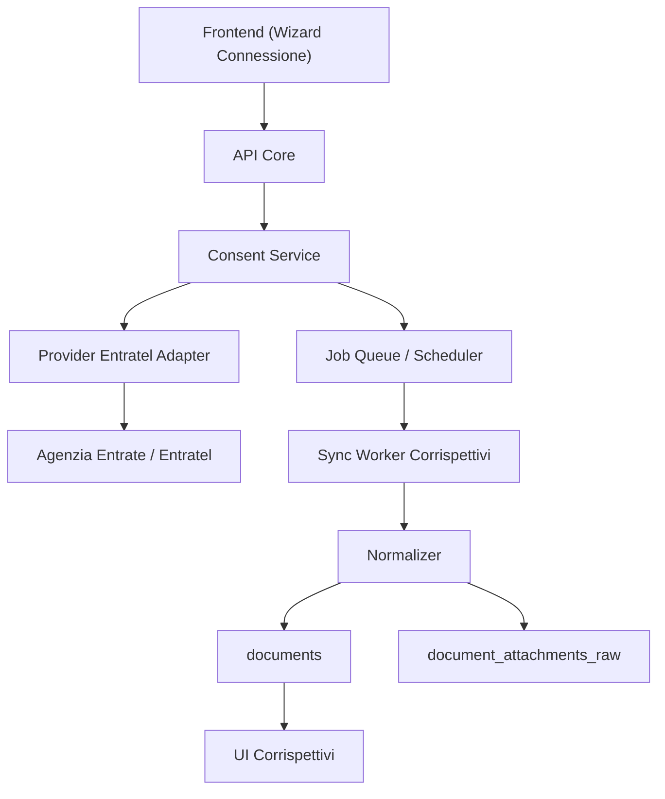
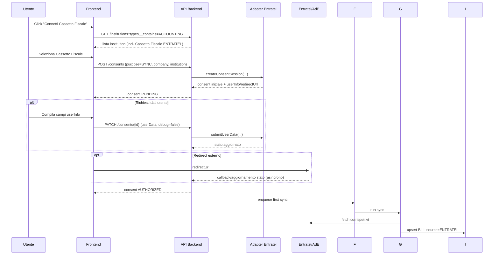
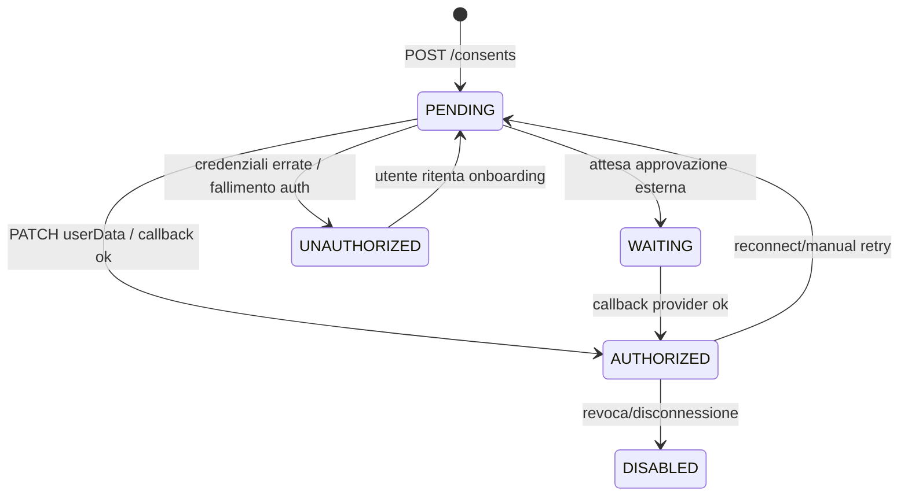

# Implementazione Corrispettivi ENTRATEL

**Data:** 11 febbraio 2026  
**Obiettivo:** fornire una specifica tecnica eseguibile per implementare onboarding e import corrispettivi via ENTRATEL, replicando il comportamento osservato in Sibill.

---

## 1. Contesto e obiettivo

In ambiente analizzato, i corrispettivi sono importati con questa catena:

1. consenso ACCOUNTING su institution `Cassetto Fiscale` (source `ENTRATEL`)
2. sincronizzazione backend verso provider fiscale
3. normalizzazione su `documents` con `documentType=BILL` e `source=ENTRATEL`
4. download dettaglio tecnico tramite `documents/{id}/attachment` (URL prefirmata)

Questo documento descrive come implementare lo stesso modello in un prodotto proprio.

---

## 2. Evidenze reverse-engineered (base di progetto)

### 2.1 Endpoint e flussi osservati

- discovery istituzioni: `GET /api/v1/institutions`
- creazione consenso: `POST /api/v1/consents`
- aggiornamento consenso/autorizzazione: `PATCH /api/v1/consents/{id}` con `userData`
- polling stato consenso: `GET /api/v1/consents` con filtri su company/type/purpose/status
- lettura corrispettivi: `GET /api/v1/documents?filter[documentType__in]=BILL`
- allegato tecnico: `GET /api/v1/documents/{id}/attachment`

### 2.2 Tipi e campi chiave

- institution ENTRATEL: `name = "Cassetto Fiscale"`, `source = "ENTRATEL"`, `types = ["ACCOUNTING"]`
- consent: `purpose = "SYNC"`, stati osservati `AUTHORIZED` (enum presenti: `AUTHORIZED`, `WAITING`, `PENDING`, `UNAUTHORIZED`, `DISABLED`)
- documento corrispettivo: `documentType = BILL`, `direction = ISSUED`, `source = ENTRATEL`

---

## 3. Architettura target



---

## 4. Onboarding ENTRATEL end-to-end

## 4.1 Sequenza funzionale



## 4.2 Contratti API da implementare

### A) Lista istituzioni accounting

`GET /api/v1/institutions?filter[types__contains]=ACCOUNTING`

Requisito minimo risposta:

- `id`
- `name`
- `source`
- `types`
- `flags`

### B) Crea consent

`POST /api/v1/consents`

Esempio payload:

```json
{
  "data": {
    "type": "consent",
    "attributes": {
      "purpose": "SYNC"
    },
    "relationships": {
      "company": { "data": { "id": "<companyId>", "type": "company" } },
      "institution": { "data": { "id": "<institutionId>", "type": "institution" } }
    }
  }
}
```

Risposta attesa:

- `id`, `status`
- `redirectUrl` opzionale
- `userInfo` opzionale (schema campi dinamici)
- `institution`

### C) Aggiorna consent (userData / authorize)

`PATCH /api/v1/consents/{consentId}`

Esempio payload:

```json
{
  "data": {
    "id": "<consentId>",
    "type": "consent",
    "attributes": {
      "userData": [
        { "key": "username", "value": "..." },
        { "key": "password", "value": "..." }
      ],
      "debug": false
    },
    "relationships": {}
  }
}
```

### D) Polling stato consent

`GET /api/v1/consents?filter[company.id__eq]=...&filter[institution.types__contains]=ACCOUNTING&filter[purpose__eq]=SYNC&include=institution,accounts,user&page[size]=100`

---

## 5. State machine consent



Regole operative:

- onboarding completato solo con `status=AUTHORIZED`
- prima sync lanciata una sola volta su transizione `!=AUTHORIZED -> AUTHORIZED`
- blocco import quando `status in (DISABLED, UNAUTHORIZED)` salvo retry esplicito

---

## 6. Pipeline import corrispettivi

## 6.1 Scheduler e trigger

Trigger minimi:

1. `onConsentAuthorized` -> run immediato (first sync)
2. scheduler periodico (es. ogni 2h)
3. run manuale da UI (opzionale)

## 6.2 Flusso worker

1. lock per `companyId + consentId` (evita run concorrenti)
2. fetch range date (delta da `lastSuccessfulSyncAt`)
3. chiamata adapter ENTRATEL
4. validazione payload
5. normalizzazione + upsert documenti
6. salvataggio raw attachment tecnico
7. aggiornamento metadati sync (`lastRunAt`, `firstSyncAt` se null)

## 6.3 Idempotenza

Chiave idempotente raccomandata:

- `companyId + source(ENTRATEL) + externalEventId`
- se `externalEventId` non affidabile: `companyId + deviceId + businessDate + grossTotal`

Upsert:

- se record esiste -> update campi variabili e mantieni `createdAt`
- se nuovo -> insert completo + attachment raw

---

## 7. Data model minimo consigliato

## 7.1 Consents

Campi minimi:

- `id`, `company_id`, `institution_id`
- `purpose` (`SYNC`/`IMPORT`)
- `status`
- `redirect_url`
- `user_data` (JSON cifrato)
- `authorized_at`, `first_sync_at`, `last_run_at`
- `last_error_code`, `last_error_message`

## 7.2 Documents (corrispettivi)

Campi minimi:

- `id`
- `company_id`
- `document_type = BILL`
- `direction = ISSUED`
- `source = ENTRATEL`
- `number` (derivato, es. `<matricola>-<yyyy-mm-dd>`)
- `creation_date` (data corrispettivo)
- `search_date`
- `gross_total`, `net_total`, `vat_total`, `currency`
- `status` (es. `CREATED`)
- `external_id` (id invio provider)

## 7.3 Attachments raw

- `document_id`
- `storage_key` (es. `entratel/document/<idInvio>.json`)
- `mime_type`
- `checksum`
- `size`
- `extracted_at`

---

## 8. Mapping payload ENTRATEL -> documento gestionale

Dato osservato nel file tecnico raw:

- `idInvio`
- `matricolaDispositivo`
- `timeRilevazione`
- blocco `datiContabiliRT_MC` con importi e conteggi

Mapping iniziale suggerito:

- `external_id` <- `idInvio`
- `number` <- `matricolaDispositivo + " - " + data`
- `creation_date` <- data derivata da `timeRilevazione` (timezone Italy)
- `gross_total` <- totale corrispettivo giornaliero
- `source` <- `ENTRATEL`
- `document_type` <- `BILL`

Nota: il naming dei campi contabili interni puo' cambiare per tipo dispositivo RT. Implementare parser versionato.

---

## 9. Sicurezza e compliance

1. cifrare `userData` at-rest (KMS o envelope encryption)
2. non loggare mai credenziali/raw secrets
3. segregare accesso storage raw con policy least privilege
4. audit trail su eventi consenso (`CREATED`, `AUTHORIZED`, `DISABLED`, `SYNC_RUN`)
5. retention raw configurabile (es. 24 mesi)
6. firma checksum attachment per integrita'

---

## 14. Nota Implementativa (Questo Repo)

In questa codebase l'import dei corrispettivi **non** avviene dalla sezione "Corrispettivi" (accreditamento/gestione dispositivi), ma tramite la SPA:

- **Fatture e Corrispettivi** -> **Consultazioni e Download massivi** (`/cons/mass-web/`)
- Route: `#/richieste/corrispettivi` (creazione richiesta guidata) e `#/risposte/elenco` (download risposta)

Caratteristica fondamentale: il flusso e' **asincrono**.

1. La richiesta viene inviata e AdE restituisce un **identificativo richiesta** (es. `130226...`).
2. Il file prodotto e' disponibile successivamente in "Risposte" (finestra temporale indicata da AdE: **entro 5 giorni**).

### 14.1 Config/Credenziali

In questa codebase le credenziali **devono** essere inserite da UI:

- credenziali salvate cifrate in `integration_configs.encrypted_credentials` (richiede `FERNET_KEY`).

Nota: e' possibile configurare un URL di login alternativo in `integration_configs.config.ade_login_url`
(oppure via env `ADE_LOGIN_URL`), ma **non** sono supportate credenziali via `.env`/file.

### 14.2 Stato / Pending requests

Le richieste corrispettivi in attesa sono salvate in:

- `integration_configs.config.ade_pending_corrispettivi_requests` (lista di oggetti con `id`, `date_from`, `date_to`, `tipo`, `created_at`)

La prima esecuzione di sync puo' ritornare `pending=true` con `external_request_id`.
Una successiva esecuzione con lo stesso range tenta il download della risposta e l'import nel DB.

### 14.3 Riferimenti Codice

- Navigazione/utenza di lavoro: `backend/app/services/ade_portal/client.py`
- Sync corrispettivi (mass-web): `backend/app/services/ade_integration_service.py`
- Parser XML corrispettivi (ZIP -> XML -> ReceiptImport): `backend/app/services/ade_integration_service.py`

---

## 10. Error handling e retry policy

Classificare errori adapter:

- `AUTH_INVALID_CREDENTIALS` -> stato `UNAUTHORIZED`, richiesta azione utente
- `AUTH_2FA_REQUIRED` -> `WAITING`
- `PROVIDER_TEMPORARY_ERROR` -> retry exponenziale (max N tentativi)
- `RATE_LIMIT` -> requeue con backoff
- `DATA_SCHEMA_MISMATCH` -> warning + quarantena record

Policy consigliata:

- retry automatico solo su errori transient
- no retry automatico su credenziali errate
- dead-letter queue dopo soglia tentativi

---

## 11. Osservabilita'

Metriche minime:

- `consent_authorization_success_rate`
- `sync_run_success_rate`
- `sync_run_duration_ms`
- `documents_imported_count`
- `documents_upserted_count`
- `documents_failed_count`
- `attachment_download_error_count`

Log strutturati:

- `companyId`, `consentId`, `syncRunId`, `providerRequestId`, `errorCode`

Alert:

- first sync non completata entro 3 ore da `authorizedAt`
- >X sync fallite consecutive per company
- spike errori autenticazione

---

## 12. Piano di implementazione (fasi)

### Fase 1 - Consent onboarding

- endpoint institutions + consents (GET/POST/PATCH)
- UI wizard con campi dinamici `userInfo`
- polling stato e transizioni UI

Deliverable: consenso ENTRATEL che arriva a `AUTHORIZED`.

### Fase 2 - Sync backend

- adapter ENTRATEL (stub + provider reale)
- worker + scheduler + lock
- first sync on authorization

Deliverable: salvataggio raw e creazione primi `BILL`.

### Fase 3 - Lista e dettaglio corrispettivi

- endpoint lista `documents` filtrata `BILL`
- endpoint `documents/{id}/attachment` con URL prefirmata
- UI tab Corrispettivi

Deliverable: visualizzazione e download allegato tecnico.

### Fase 4 - Hardening produzione

- cifratura, audit, retry evoluti
- monitoraggio + alerting
- test di carico e resilienza

Deliverable: readiness produzione.

---

## 13. Test plan minimo

## 13.1 Test funzionali

1. creazione consent ENTRATEL con institution corretta
2. passaggio `PENDING -> AUTHORIZED`
3. first sync entro SLA
4. import record nuovi + update record esistenti (idempotenza)
5. download attachment valido

## 13.2 Test negativi

1. credenziali errate -> `UNAUTHORIZED`
2. provider down -> retry + no data corruption
3. payload malformato -> quarantena + alert
4. rinnovo/disabilitazione consenso -> stop sync

## 13.3 Test non funzionali

1. performance import massivo (giorni con alto volume)
2. race condition su run concorrenti
3. sicurezza logging e cifratura

---

## 14. Checklist go-live

- [ ] institution ENTRATEL configurata per tenant
- [ ] state machine consent validata
- [ ] first sync automatica verificata
- [ ] idempotenza verificata su doppio run
- [ ] metriche + alert attivi
- [ ] runbook incident pronto
- [ ] rollback plan definito

---

## 15. Note importanti

1. Il flusso SDICoop (`Cassetto Fiscale SDI`) e il flusso ENTRATEL sono distinti; per i corrispettivi osservati e' ENTRATEL.
2. Nel codice analizzato l'autorizzazione passa da `PATCH /consents/{id}` con `userData` (non da `PUT /authorize`).
3. Il formato attachment osservato per corrispettivi e' JSON tecnico su storage (path `entratel/document/...`), anche se in UI il bottone puo' essere etichettato "XML".
