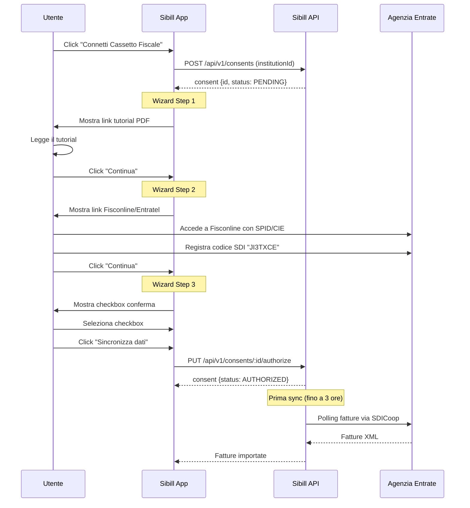

# Reverse Engineering — Fatture e Cassetto Fiscale SDI

**Data analisi:** 10 febbraio 2026
**Modulo:** Fatturazione Elettronica e Connessione Cassetto Fiscale
**Analista:** T1 — FE Inspector

---

## 1. Intermediario SDI

### Sibill e' l'intermediario SDI diretto

Confidenza: 🟢 Alta

**Sibill S.r.l.** opera come **intermediario accreditato diretto** presso l'Agenzia delle Entrate per il Sistema di Interscambio (SDI). Non utilizza intermediari terzi.

| Dato | Valore | Fonte |
|---|---|---|
| **Codice SDI (destinatario)** | `JI3TXCE` | Variabile `VITE_SDI_CODE` nel bundle JS |
| **Protocollo** | SDICoop (Web-service cooperativo) | Enum `B6` e flusso wizard nel codice |
| **Tipo canale** | Canale ministeriale accreditato | Pagina marketing sibill.com/fatturazione |
| **Accreditamento** | Diretto con Agenzia delle Entrate | Codice a 7 caratteri = canale SDICoop accreditato |

### Evidenze nel codice sorgente

1. **Variabile ambiente Vite:**
```
VITE_SDI_CODE:"JI3TXCE"
```
Hardcoded nella configurazione del bundle. 🟢

2. **Costante JS esportata:**
```js
const BBe = "JI3TXCE";
```
Usata nel componente UI che mostra il codice SDI all'utente. 🟢

3. **Traduzione UI (copia codice):**
```
copy_sdi.button: "SDI code: {{code}}"
copy_sdi.info_tooltip_1: "Use this code on Entratel to receive your invoices on Sibill"
```
L'utente copia il codice JI3TXCE e lo registra su Entratel. 🟢

### Catena tecnologica completa

```
Fornitore → SDI (Agenzia Entrate) → Canale SDICoop JI3TXCE → Sibill Backend (api.sibill.com) → Sibill Frontend (app.sibill.com)
```

Non ci sono intermediari terzi nella catena. Sibill ha un accreditamento diretto SDICoop con l'Agenzia delle Entrate.

---

## 2. Metodi di Connessione al Cassetto Fiscale

Sibill supporta **due metodi** per connettersi al Cassetto Fiscale, piu' un adapter di test:

### 2.1 Metodo SDICoop (Primario)

Confidenza: 🟢 Alta

| Campo | Valore |
|---|---|
| **Institution name** | "Cassetto Fiscale SDI" |
| **Institution source** | `SDICOOP` |
| **Funzione JS check** | `SLe = t => t.name === "Cassetto Fiscale SDI"` |

**Flusso:** L'utente registra il codice SDI di Sibill sul portale dell'Agenzia delle Entrate, poi conferma su Sibill.

### 2.2 Metodo Entratel (Alternativo)

Confidenza: 🟡 Media

| Campo | Valore |
|---|---|
| **Institution name** | "Cassetto Fiscale" |
| **Institution source** | `ENTRATEL` |
| **Funzione JS check** | `X0e = t => t.name === "Cassetto Fiscale"` |

**Flusso:** Redirect-based con inserimento credenziali Entratel. Flusso analogo alla connessione bancaria (OAuth-like).

### 2.3 Mock Adapter (Test)

| Campo | Valore |
|---|---|
| **Institution name** | "Mock accounting adapter" |
| **Institution source** | `MOCK` |
| **Funzione JS check** | `Xer = t => t.name === "Mock accounting adapter"` |

---

## 3. Wizard SDICoop — Flusso Dettagliato

Confidenza: 🟢 Alta

Il wizard SDICoop e' implementato nel file `AddAccountingConsent-DQhKurMl.js` come un MUI Stepper verticale a 3 step.

### Diagramma del flusso



### Step 1: Apri la guida

- **Azione:** Mostra un link per scaricare il PDF tutorial
- **URL tutorial:** `${window.location.protocol}//${window.location.host}/static/documents/Sibill Tutorial - Cassetto Fiscale.pdf`
- **Testo:** "Il link si aprira' in una nuova scheda del browser, ti consigliamo di tenerlo sempre aperto per seguire correttamente la procedura"
- **Traduzione key:** `sdicoop_authorization.step1`

### Step 2: Accedi a Fisconline

- **Azione:** L'utente accede al portale dell'Agenzia delle Entrate
- **URL Fisconline:** `https://iampe.agenziaentrate.gov.it/sam/UI/Login?realm=/agenziaentrate`
- **Testo:** "Questo link si aprira' in una nuova scheda, accedi con SPID, credenziali o il metodo che usi abitualmente. Segui tutti i passi descritti nella guida per completare il flusso."
- **Traduzione key:** `sdicoop_authorization.step2`
- **Nota:** L'utente deve registrare manualmente il codice SDI **JI3TXCE** come codice destinatario sul portale dell'Agenzia Entrate

### Step 3: Conferma e sincronizza

- **Azione:** L'utente conferma di aver completato la procedura
- **Checkbox obbligatoria:** "Confermo di aver completato il processo di collegamento del Cassetto Fiscale"
- **Alert:** "La prima sincronizzazione puo' richiedere fino a 3 ore."
- **Pulsante:** "Sincronizza dati" (disabilitato fino a checkbox selezionata E step 3 raggiunto)
- **Traduzione key:** `sdicoop_authorization.step3`

### Stato macchina del Consent

```mermaid
stateDiagram-v2
    [*] --> CREATING: Click "Connetti"
    CREATING --> CONSENT_SCREEN: Se userInfo presente
    CREATING --> AUTHORIZATION: Se no userInfo
    CONSENT_SCREEN --> AUTHORIZATION: Continua
    AUTHORIZATION --> AUTHORIZED: Conferma wizard + API call

    note right of CREATING: POST /api/v1/consents
    note right of AUTHORIZATION: PUT consents/:id/authorize
```

**Validazione pulsante "Sincronizza dati":**
```
disabled = step !== 2 || !checkboxConfirmed || backOperationInProgress || mutationInProgress
```

---

## 4. Enumerazioni Chiave

### 4.1 Institution Source (`$O`)

Confidenza: 🟢 Alta

| Valore | Uso | Tipo |
|---|---|---|
| `ENTRATEL` | Connessione Cassetto Fiscale via Entratel | ACCOUNTING |
| `FABRICK` | Provider Open Banking (Fabrick) | BANKING |
| `MOCK` | Adapter di test | ACCOUNTING |
| `PAYPAL` | Connessione PayPal | BANKING |
| `SDICOOP` | Connessione SDI via SDICoop | ACCOUNTING |
| `SHOPIFY` | Connessione Shopify | BANKING |
| `STRIPE` | Connessione Stripe | BANKING |
| `SWAN` | Provider Open Banking principale | BANKING |
| `SUMUP` | Connessione SumUp | BANKING |
| `TSPAY` | Connessione TSPay | BANKING |
| `USER` | Conto manuale (inserito dall'utente) | BANKING |
| `YAPILY` | Provider Open Banking (Yapily) | BANKING |

> 🔵 **NOTA:** Sibill usa **3 provider Open Banking** in parallelo: SWAN (primario), FABRICK e YAPILY. Per la fatturazione usa SDICOOP ed ENTRATEL. Per i pagamenti integra PAYPAL, STRIPE, SHOPIFY, SUMUP, TSPAY.

### 4.2 Institution Type (`Yf`)

| Valore | Significato |
|---|---|
| `ACCOUNTING` | Fatturazione / Cassetto Fiscale |
| `BANKING` | Conti bancari / Open Banking |

### 4.3 Document Source (`B6`)

Confidenza: 🟢 Alta

| Valore | Significato |
|---|---|
| `USER` | Documento caricato manualmente dall'utente |
| `SDICOOP` | Documento ricevuto via SDI (canale SDICoop) |
| `ENTRATEL` | Documento importato via Entratel |

---

## 5. API Coinvolte

### 5.1 Fatture / Documenti

| Endpoint | Metodo | Scopo | Confidenza |
|---|---|---|---|
| `/api/v1/documents` | GET | Lista documenti con filtri | 🟢 |
| `/api/v1/documents-dashboard/summary` | GET | Riepilogo dashboard (clienti, fornitori, ricavi, IVA) | 🟢 |
| `/api/v1/documents/metadata` | GET | Metadata/totali documenti | 🟢 |

### 5.2 Connessione Cassetto Fiscale

| Endpoint | Metodo | Scopo | Confidenza |
|---|---|---|---|
| `/api/v1/institutions?filter[types__contains]=ACCOUNTING` | GET | Lista istituzioni ACCOUNTING | 🟡 (non catturato direttamente) |
| `/api/v1/consents` | POST | Crea consent per connessione | 🟡 (dedotto dal codice) |
| `/api/v1/consents/:id/authorize` | PUT | Autorizza consent SDICoop | 🟡 (dedotto dal codice) |
| `/api/v1/consents` | GET | Lista consents (usato per verificare stato) | 🟢 |

### 5.3 Modello dati Document

Confidenza: 🟢 Alta

```
GET /api/v1/documents
  filter[documentDirection__eq] = ISSUED | RECEIVED
  filter[documentType__in] = INVOICE,CREDIT_NOTE,DEBIT_NOTE,PARCEL,SELF_INVOICE
  filter[status__in] = CREATED,SENT,DELIVERED,NOT_DELIVERED
  filter[company.id__eq] = UUID
  include = flows,category,subcategory,counterpart
  sort = -searchDate,-creationDate,-createdAt,-id
  page[size] = 50
```

**Campi principali della risposta:**

| Campo | Tipo | Descrizione |
|---|---|---|
| `documentType` | enum | INVOICE, CREDIT_NOTE, DEBIT_NOTE, BILL, SELF_INVOICE, PARCEL, DELIVERY_NOTE, QUOTE |
| `direction` | string | Direzione (ISSUED/RECEIVED) |
| `source` | enum | USER, SDICOOP, ENTRATEL — identifica come il documento e' entrato nel sistema |
| `status` | enum | CREATED, DELIVERED, DISCARDED, DRAFT, NOT_DELIVERED, REFUSED, SENT |
| `isEInvoice` | boolean | E' una fattura elettronica |
| `eInvoiceType` | string | Tipo documento SDI (TD01, TD02, TD04, etc.) |
| `grossAmount` | money | Importo lordo |
| `vatAmount` | money | IVA |
| `paymentStatus` | string | Stato pagamento |
| `counterpartName` | string | Nome controparte |
| `subjectToReverseCharge` | boolean | Soggetto a reverse charge |
| `deliveryStatus` | string | Stato consegna SDI |

---

## 6. Funzionalita' Fatturazione

### 6.1 Tipi di documento supportati

Confidenza: 🟢 Alta

| Tipo SDI | Codice | Descrizione |
|---|---|---|
| TD01 | INVOICE / SELF_INVOICE | Fattura / Per conto |
| TD02 | INVOICE | Acconto/anticipo su fattura |
| TD04 | CREDIT_NOTE | Nota di credito |
| TD05 | DEBIT_NOTE | Nota di debito |
| TD06 | - | Parcella |
| TD16 | SELF_INVOICE | Integrazione reverse charge interno |
| TD17 | SELF_INVOICE | Acquisto servizi dall'estero |
| TD18 | SELF_INVOICE | Acquisto beni UE |
| TD19 | SELF_INVOICE | Acquisto beni esteri gia' in Italia |
| TD24 | INVOICE | Fattura differita |
| TD26 | SELF_INVOICE | Cessione beni ammortizzabili |
| TD27 | SELF_INVOICE | Autoconsumo/cessione gratuita |
| TD29 | SELF_INVOICE | Comunicazione fattura omessa/irregolare |

### 6.2 Sibill Invoicing (Emissione Fatture)

Confidenza: 🟢 Alta

Sibill offre un modulo di **emissione fatture elettroniche** (add-on a pagamento):
- Costo: 4,99 EUR/mese (promo 12 mesi) → 10 EUR/mese
- Emissione illimitata di documenti
- Invio diretto al SDI
- Copie di cortesia
- Gestione bozze, DDT, preventivi

### 6.3 Import/Upload Fatture

Sibill supporta:
- **Upload XML/P7M** — Fino a 100 file, max 5 MB ciascuno
- **Upload PDF per autofatture** — OCR per estrarre dati
- **Importazione automatica da SDI** — Via canale SDICoop
- **Importazione da Entratel** — Via credenziali Entratel

---

## 7. UI / Codice SDI

### 7.1 Componente "Copia codice SDI"

Confidenza: 🟢 Alta

Nella sezione fatture, Sibill mostra un bottone per copiare il codice SDI:

```
"SDI code: JI3TXCE"    [click per copiare]
```

Con tooltip:
```
"Usa questo codice su Entratel per ricevere le tue fatture su Sibill"
"Scopri di piu'"
```

### 7.2 Recupero credenziali Entratel

Link alla guida Notion per il recupero credenziali:
```
https://sibill.notion.site/Cassetto-Fiscale-dcfcfd8296a54f48895043d8e4b39c7a
```

---

## 8. Funzioni Helper Chiave (JS)

Confidenza: 🟢 Alta

| Funzione | Definizione | Scopo |
|---|---|---|
| `wLe` | `t => t.source === $O.SWAN` | Check se institution e' SWAN |
| `SLe` | `t => t.name === "Cassetto Fiscale SDI"` | Check se institution e' SDICoop |
| `X0e` | `t => t.name === "Cassetto Fiscale"` | Check se institution e' Entratel |
| `Xer` | `t => t.name === "Mock accounting adapter"` | Check se institution e' Mock |
| `ELe` | `t => t.flags.includes(d8.PAYMENTS)` | Check se institution supporta pagamenti |
| `VP` | `t => t.status === _o.Authorized` | Check se consent e' autorizzato |
| `Oa` | `t => !!t.institution && wLe(t.institution)` | Check se consent e' SWAN |

---

## 9. Riepilogo

### Chi e' l'intermediario SDI?

**Sibill stessa.** Non usa intermediari terzi. Ha un accreditamento diretto con l'Agenzia delle Entrate tramite protocollo SDICoop, con codice destinatario **JI3TXCE**.

### Come funziona la connessione?

1. L'utente clicca "Connetti Cassetto Fiscale" su Sibill
2. Sibill crea un consent (institution di tipo ACCOUNTING, source SDICOOP)
3. L'utente segue un wizard a 3 step per registrare il codice JI3TXCE su Entratel/Fisconline
4. L'utente conferma su Sibill
5. Sibill inizia a ricevere le fatture via canale SDICoop (prima sync fino a 3 ore)

### Livelli di confidenza

| Affermazione | Confidenza |
|---|---|
| Sibill e' intermediario SDI diretto | 🟢 Alta |
| Codice SDI = JI3TXCE | 🟢 Alta |
| Protocollo = SDICoop | 🟢 Alta |
| Wizard a 3 step | 🟢 Alta |
| Metodo alternativo Entratel | 🟡 Media (presente nel codice, non testato live) |
| API POST/PUT consent | 🟡 Media (dedotte dal codice, non catturate come trace) |
| Prima sync fino a 3 ore | 🟢 Alta (testo UI esplicito) |
| Nessun intermediario terzo | 🟢 Alta (nessuna evidenza di partner nel codice/config) |

---

## Fonti

- `assets/js-sources/AddAccountingConsent-DQhKurMl.js` — Wizard SDICoop
- `assets/js-sources/AddAccountingAction-BdJNGAXU.js` — Azione connessione accounting
- `assets/js-sources/index-N-OxfZQQ.js` — Bundle principale (enum, traduzioni, helper)
- `assets/api-traces/11-fatture.json` — API traces sezione fatture
- `assets/api-traces/08-conti.json` — API traces sezione conti (modello institution/consent)
- Web search: pagina sibill.com/fatturazione conferma accreditamento
