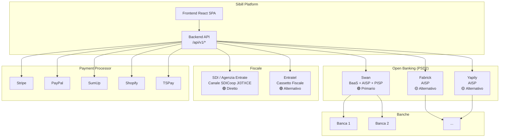

# Integrazioni e Partner Tecnologici — Sibill

**Data analisi:** 10 febbraio 2026
**Fonti:** T1 (FE Inspector — Cassetto Fiscale/SDI), T2 (OB Inspector — Open Banking/Swan)
**Riferimenti:** `docs/RE-fatture-cassetto-fiscale.md`, `docs/RE-open-banking.md`

---

## 1. Riepilogo Partner e Provider

### 1.1 Tabella riepilogativa

| Funzionalita' | Partner/Provider | Tipo | Confidenza | Ruolo |
|----------------|-----------------|------|------------|-------|
| **Fatturazione SDI** | Sibill (diretto) | Intermediario accreditato SDICoop | 🟢 Alta | Ricezione/invio fatture via SDI |
| **Cassetto Fiscale** | Agenzia Entrate (Entratel) | Portale istituzionale | 🟢 Alta | Importazione fatture da Entratel |
| **Open Banking (primario)** | Swan (swan.io) | BaaS + AISP + PISP | 🟢 Alta | Connessione bancaria, saldi, movimenti |
| **Open Banking (alternativo)** | Fabrick | AISP italiano | 🟡 Media | Provider OB per banche italiane |
| **Open Banking (alternativo)** | Yapily (Visa) | AISP europeo | 🟡 Media | Provider OB per banche EU |
| **Conto BaaS** | Swan | Banking-as-a-Service | 🟢 Alta | "Conto Sibill" con carte e IBAN |
| **Pagamenti (PISP)** | Swan | Payment Initiation | 🟢 Alta | Disposizione F24 e pagamenti |
| **Pagamenti online** | Stripe | Payment processor | 🟢 Alta | Integrazione pagamenti Stripe |
| **Pagamenti online** | PayPal | Payment processor | 🟢 Alta | Integrazione pagamenti PayPal |
| **E-commerce** | Shopify | Piattaforma e-commerce | 🟢 Alta | Importazione dati vendite |
| **POS** | SumUp | POS/Terminal | 🟢 Alta | Importazione transazioni POS |
| **Pagamenti** | TSPay | Payment provider | 🔴 Bassa | Non identificato con certezza |

### 1.2 Mappa architetturale dei provider



---

## 2. Analisi dettagliata per integrazione

### 2.1 Fatturazione Elettronica (SDI)

**Partner: Sibill (intermediario diretto)**

Sibill e' accreditata direttamente come intermediario SDICoop presso l'Agenzia delle Entrate. Non si appoggia a terzi.

| Aspetto | Dettaglio |
|---------|-----------|
| **Codice SDI** | `JI3TXCE` |
| **Protocollo** | SDICoop (Web-service cooperativo) |
| **Direzione** | Ricezione + invio (con add-on Invoicing) |
| **Costo add-on** | 4,99 EUR/mese (promo) → 10 EUR/mese |
| **Metodo alternativo** | Entratel (redirect con credenziali) |
| **Prima sync** | Fino a 3 ore |

**Flusso utente:**
1. L'utente registra il codice `JI3TXCE` su Entratel/Fisconline (wizard 3 step)
2. Sibill inizia a ricevere le fatture via SDICoop
3. Le fatture appaiono automaticamente nella sezione documenti

**Implicazione per il gestionale:** Per replicare questa integrazione servono due percorsi:
- **Opzione A (complessa):** Accreditamento SDICoop proprio — richiede registrazione come intermediario presso AdE, implementazione web-service SDI, certificati digitali. Costo: alto, tempo: 3-6 mesi.
- **Opzione B (pratica):** Integrazione con intermediario terzo esistente (Aruba, InfoCert, TeamSystem) via API — costo contenuto, tempo: 1-2 mesi.
- **Opzione C (ibrida):** Import/export file XML SDI tramite intermediario terzo + matching automatico nel gestionale.

### 2.2 Open Banking (PSD2)

**Partner primario: Swan (swan.io)**

Swan e' un BaaS francese con licenza di istituto di moneta elettronica. Fornisce a Sibill:
- **AISP** — Lettura conti e movimenti bancari
- **PISP** — Disposizione pagamenti (F24, bonifici)
- **BaaS** — "Conto Sibill" con IBAN, carte virtuali/fisiche, web banking

| Aspetto | Dettaglio |
|---------|-----------|
| **Dominio API** | `api.swan.io` (mediato dal backend Sibill) |
| **Standard** | PSD2 / Open Banking |
| **Sync frequenza** | Max 4 req/giorno (standard PSD2) |
| **Consent validita'** | ~90 giorni (standard PSD2) |
| **OAuth flow** | Redirect a sito banca → callback `/consent/callback` |
| **Conto BaaS** | IBAN Swan, carte, limiti di spesa |

**Provider alternativi nel codice:**
- **Fabrick** — Provider Open Banking italiano (Sella Group). Presente nell'enum `$O` ma non osservato in uso attivo. Probabilmente usato per banche non coperte da Swan o per clienti italiani specifici.
- **Yapily** — Provider Open Banking europeo (acquisito da Visa). Stessa situazione di Fabrick.

**Auth flags delle istituzioni:**

| Flag | Significato |
|------|-------------|
| `CBI` | Supporta flussi CBI (Corporate Banking Interbancario) |
| `IMPORT` | Supporta importazione manuale movimenti |
| `MULTI_AUTH` | Richiede verifica consent esistenti prima di crearne uno nuovo |
| `PSU_ID` | Richiede identificativo Payment Service User |
| `PSU_CORPORATE_ID` | Richiede identificativo PSU corporate |

**Implicazione per il gestionale:**

| Opzione | Provider | Pro | Contro | Costo stimato |
|---------|----------|-----|--------|---------------|
| **Swan** | swan.io | BaaS completo, PISP, carte | Francese, meno banche IT native | Da negoziare |
| **Fabrick** | fabrick.com | Italiano (Sella), forte copertura IT | Solo AISP, no BaaS | Da negoziare |
| **Yapily** | yapily.com | Ampia copertura EU (Visa) | No BaaS, prezzi enterprise | Da negoziare |
| **Nordigen (GoCardless)** | nordigen.com | Free tier per AISP | Solo lettura, no pagamenti | Gratuito / freemium |
| **Tink** | tink.com | Acquisito da Visa, stabile | Enterprise-only | Alto |

### 2.3 Payment Processor

Sibill integra 5 payment processor per importare transazioni:

| Provider | Tipo | Funzione in Sibill | Complessita' integrazione |
|----------|------|-------------------|--------------------------|
| **Stripe** | Pagamenti online | Import transazioni Stripe | Bassa (API matura) |
| **PayPal** | Pagamenti online | Import transazioni PayPal | Bassa (API matura) |
| **Shopify** | E-commerce | Import dati vendite | Media (API commerce) |
| **SumUp** | POS/Terminal | Import transazioni POS | Media |
| **TSPay** | Sconosciuto | Da verificare | Non determinabile |

---

## 3. Enum completo dei Source Type

L'enum `$O` nel codice JS definisce tutti i provider integrati:

```typescript
enum InstitutionSource {
  // Open Banking
  SWAN = "SWAN",           // BaaS + AISP + PISP (primario)
  FABRICK = "FABRICK",     // AISP italiano (alternativo)
  YAPILY = "YAPILY",       // AISP europeo (alternativo)

  // Fiscale
  SDICOOP = "SDICOOP",     // SDI — fatturazione elettronica
  ENTRATEL = "ENTRATEL",   // Cassetto Fiscale AdE

  // Payment Processor
  STRIPE = "STRIPE",
  PAYPAL = "PAYPAL",
  SHOPIFY = "SHOPIFY",
  SUMUP = "SUMUP",
  TSPAY = "TSPAY",

  // Altro
  USER = "USER",           // Inserimento manuale
  MOCK = "MOCK"            // Test/sviluppo
}

enum InstitutionType {
  ACCOUNTING = "ACCOUNTING",  // Fatturazione
  BANKING = "BANKING"         // Conti bancari
}
```

---

## 4. Raccomandazioni per il Gestionale Target

### 4.1 Priorita' di implementazione

| # | Integrazione | Priorita' | Complessita' | Tempo stimato |
|---|-------------|-----------|-------------|---------------|
| 1 | **Import movimenti bancari** (AISP) | Alta | Media | 2-3 mesi |
| 2 | **Fatturazione SDI** (via intermediario) | Alta | Media-Alta | 2-4 mesi |
| 3 | **Import Stripe/PayPal** | Media | Bassa | 1-2 mesi |
| 4 | **Disposizione pagamenti** (PISP) | Media | Alta | 3-4 mesi |
| 5 | **Conto BaaS** | Bassa | Molto Alta | 6+ mesi |
| 6 | **Import POS** (SumUp) | Bassa | Media | 1-2 mesi |
| 7 | **Import e-commerce** (Shopify) | Bassa | Media | 1-2 mesi |

### 4.2 Scelta provider Open Banking

**Raccomandazione: Fabrick (prima scelta) + Yapily (fallback)**

Motivazione:
- **Fabrick** e' italiano (Sella Group), ha ottima copertura delle banche italiane, ed e' gia' presente nel codebase di Sibill — suggerendo che funziona bene per il mercato IT
- **Yapily** come backup per banche europee non coperte da Fabrick
- Swan e' eccellente ma il suo punto di forza e' il BaaS (conto + carte), che probabilmente non serve per un gestionale di tesoreria puro
- **Nordigen** (GoCardless) come alternativa low-cost per MVP / solo lettura

### 4.3 Scelta provider SDI

**Raccomandazione: Intermediario terzo (Aruba / InfoCert)**

Motivazione:
- L'accreditamento diretto SDICoop (come fa Sibill) richiede un investimento significativo in infrastruttura e certificazioni
- Per un gestionale, e' piu' pratico integrarsi via API con un intermediario gia' accreditato
- Aruba e InfoCert hanno API documentate e pricing accessibile
- L'alternativa e' l'import manuale di file XML SDI (immediato, zero costi)

### 4.4 Pattern architetturali da replicare

| Pattern Sibill | Descrizione | Raccomandazione |
|----------------|-------------|-----------------|
| **Backend Proxy** | Tutte le chiamate a provider passano dal backend | ✅ Replicare — disaccoppia frontend da provider |
| **JSON:API** | Standard per serializzazione dati | ✅ Considerare — buona struttura ma verbose |
| **Consent State Machine** | 5 stati per gestire il ciclo di vita PSD2 | ✅ Replicare — necessario per compliance PSD2 |
| **Source Enum** | Enum che identifica il provider di ogni risorsa | ✅ Replicare — fondamentale per multi-provider |
| **OAuth Redirect** | Redirect con callback per autorizzazione | ✅ Standard PSD2, obbligatorio |
| **Consent Polling** | Verifica stato consent ad ogni navigazione | 🟡 Ottimizzare — troppo aggressivo in Sibill (211 req/sessione) |
| **Multi-provider** | Supporto simultaneo di 3+ provider OB | ✅ Buona architettura per flessibilita' |

---

## 5. Requisiti Regolamentari

| Integrazione | Requisito | Ente | Note |
|-------------|-----------|------|------|
| **AISP** (lettura conti) | Registrazione come TPP o utilizzo di TPP registrato | Banca d'Italia / EBA | Se si usa un provider come Fabrick, il requisito e' soddisfatto dal provider |
| **PISP** (pagamenti) | Registrazione come TPP o utilizzo di TPP registrato | Banca d'Italia / EBA | Stesso discorso — il provider gestisce la compliance |
| **SDICoop** | Accreditamento come intermediario SDI | Agenzia delle Entrate | Necessario solo se si vuole il canale diretto. Evitabile con intermediario terzo |
| **BaaS** (conto) | Partnership con istituto di moneta elettronica | Banca d'Italia | Molto complesso — solo se strettamente necessario |
| **GDPR** | Consenso utente per accesso dati bancari | Garante Privacy | Standard PSD2 — consent con scadenza 90gg |

---

## 6. Stima costi integrazione

| Integrazione | Setup (una tantum) | Costo ricorrente | Note |
|-------------|-------------------|------------------|------|
| **Open Banking AISP** (Fabrick/Yapily) | 5K-15K EUR | 0.01-0.05 EUR/chiamata | Pricing tipico provider OB |
| **Open Banking PISP** | 10K-25K EUR | 0.10-0.50 EUR/pagamento | Richiede SCA (Strong Customer Auth) |
| **SDI via intermediario** | 2K-5K EUR | 50-200 EUR/mese | Dipende dal volume fatture |
| **SDI diretto** (SDICoop) | 30K-50K EUR | Infrastruttura interna | Sconsigliato per un gestionale |
| **Stripe/PayPal API** | 1K-3K EUR | Incluso nei costi del processor | API gratuite, si pagano le transazioni |
| **BaaS** (conto) | 50K+ EUR | Revenue sharing | Complesso, da valutare caso per caso |

> 🟡 **ATTENZIONE:** I costi sono stime indicative basate su pricing pubblico dei provider. I costi effettivi dipendono dal volume e dalla negoziazione commerciale.

---

## 7. Confidenza complessiva

| Area | Livello | Note |
|------|---------|------|
| Sibill = intermediario SDI diretto | 🟢 Alta | Codice JI3TXCE confermato da JS e UI |
| Swan = provider OB primario | 🟢 Alta | Confermato da API, JS, traduzioni |
| Fabrick/Yapily = provider alternativi | 🟡 Media | Presenti nell'enum, non osservati attivi |
| Flusso OAuth completo | 🟢 Alta | Ricostruito da JS e API traces |
| Conto Sibill = Swan BaaS | 🟢 Alta | Confermato da traduzioni e gestione carte |
| TSPay = provider sconosciuto | 🔴 Bassa | Solo nell'enum, nessuna altra evidenza |
| Costi stimati | 🟡 Media | Basati su pricing pubblico, non verificati |

---

## Fonti

| Documento | Contenuto |
|-----------|-----------|
| `docs/RE-fatture-cassetto-fiscale.md` | Analisi completa SDI / Cassetto Fiscale |
| `docs/RE-open-banking.md` | Analisi completa Open Banking / Swan |
| `.tmp/fe-inspector-findings.json` | Findings strutturati T1 |
| `.tmp/ob-inspector-findings.json` | Findings strutturati T2 |
| `assets/js-sources/index-N-OxfZQQ.js` | Bundle JS principale |
| `assets/api-traces/08-conti.json` | API traces conti bancari |
| `assets/api-traces/11-fatture.json` | API traces fatture |
