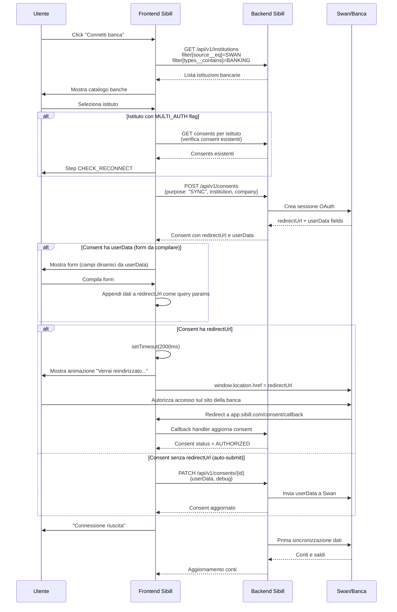
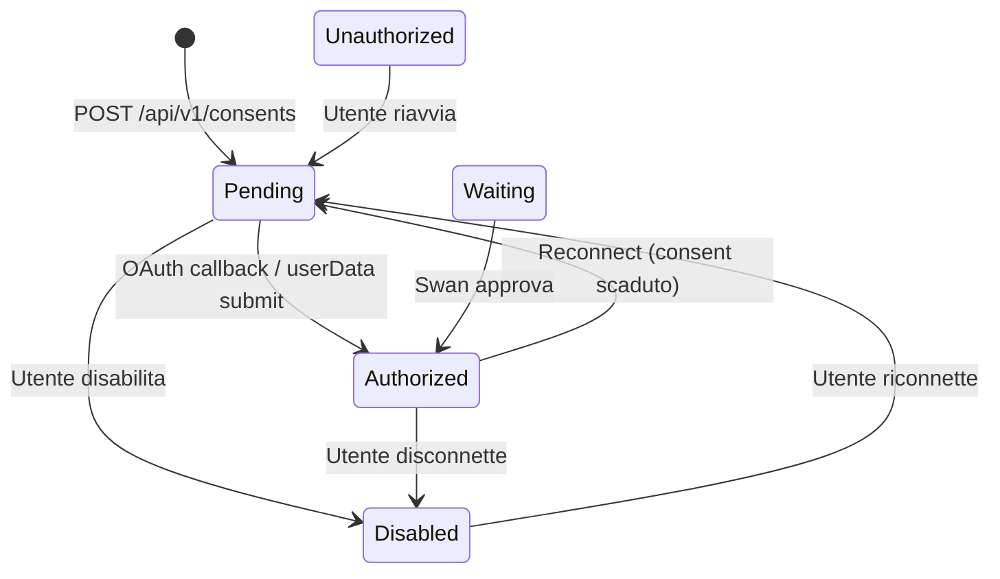
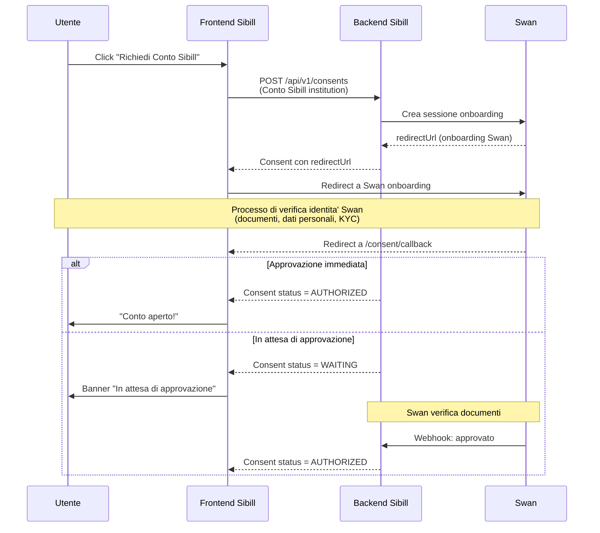

# Open Banking — Reverse Engineering Sibill

**Data analisi:** 10 febbraio 2026
**Analista:** T2 — OB Inspector
**Fonti:** Analisi JS bundle (`index-N-OxfZQQ.js`), API traces (`08-conti.json`), documentazione esistente (`09-connessione-bancaria.md`, `12-javascript-analysis.md`)

---

## 1. Provider Confermato: Swan

### Identificazione

**Swan** (swan.io) e' il provider Open Banking primario di Sibill. 🟢 **Confidenza Alta**

Swan e' un operatore BaaS (Banking-as-a-Service) francese con licenza di istituto di moneta elettronica, che offre:
- **AISP** (Account Information Service Provider) — Lettura conti e movimenti
- **PISP** (Payment Initiation Service Provider) — Disposizione pagamenti
- **BaaS** — Conto proprio "Conto Sibill" erogato tramite infrastruttura Swan

### Evidenze

| # | Evidenza | Fonte | Confidenza |
|---|----------|-------|------------|
| 1 | `filter[source__eq]=SWAN` nelle API institutions e user-bank-accounts | API traces `08-conti.json` | 🟢 Alta |
| 2 | Funzione JS `wLe=t=>t.source===$O.SWAN` identifica istituzioni Swan | Bundle JS | 🟢 Alta |
| 3 | `PLe()` fetcha specificamente institutions con `source=SWAN, type=BANKING` | Bundle JS | 🟢 Alta |
| 4 | Traduzioni IT: "Accedi a conto Swan®", "Usa tutte le funzionalita' offerte da Swan" | Bundle JS (i18n) | 🟢 Alta |
| 5 | URL help center: `support.swan.io/hc/it/articles/20535223697053-Licenza-di-moneta-elettronica-e-money-di-Swan` | Bundle JS | 🟢 Alta |
| 6 | Gestione carte (virtuali, fisiche, single-use) tramite portale Swan | Bundle JS | 🟢 Alta |
| 7 | Analytics events: `SWAN_MORE_INFO_BANNER_CLICKED`, `SWAN_DASHBOARD_CLICKED`, `SWAN_CLOSE_BANNER_CLICKED` | Bundle JS | 🟢 Alta |

### Dominio API Swan

Il dominio API di Swan **non e' direttamente osservabile** dal frontend. Tutte le chiamate passano attraverso il backend Sibill (`/api/v1/*`), che funge da proxy/aggregatore. Il dominio di Swan e' noto pubblicamente come `api.swan.io` (documentazione Swan).

> 🔵 **NOTA**: Questa e' un'architettura deliberata. Il frontend non comunica mai direttamente con Swan — il backend Sibill media tutte le interazioni. Questo:
> - Nasconde le credenziali API Swan
> - Permette a Sibill di normalizzare le risposte di provider diversi
> - Consente di aggiungere logica di business (es. aggregazione saldi)
> - Protegge da cambiamenti nelle API dei provider

---

## 2. Provider Alternativi

Dall'analisi del bundle JS, l'enum `$O` (source types) contiene **12 valori**, di cui 3 sono provider Open Banking:

### 2.1 Enum Source (`$O`) Completo

```typescript
enum Source {
  ENTRATEL = "ENTRATEL",    // Portale Agenzia Entrate
  FABRICK = "FABRICK",      // Open Banking provider italiano
  MOCK = "MOCK",            // Mock per test/sviluppo
  PAYPAL = "PAYPAL",        // Payment processor
  SDICOOP = "SDICOOP",      // Sistema di Interscambio SDI
  SHOPIFY = "SHOPIFY",      // E-commerce platform
  STRIPE = "STRIPE",        // Payment processor
  SWAN = "SWAN",            // BaaS/Open Banking (primario)
  SUMUP = "SUMUP",          // POS/Payment terminal
  TSPAY = "TSPAY",          // Payment provider
  USER = "USER",            // Inserimento manuale utente
  YAPILY = "YAPILY"         // Open Banking provider EU
}
```

### 2.2 Provider Open Banking Alternativi

| Provider | Tipo | Stato | Evidenze | Confidenza |
|----------|------|-------|----------|------------|
| **FABRICK** | Open Banking provider italiano | Presente ma inattivo | Enum `$O`, nessun uso attivo nelle API traces o nel frontend | 🟡 Media |
| **YAPILY** | Open Banking provider EU (Visa) | Presente ma inattivo | Enum `$O`, nessun uso attivo nelle API traces o nel frontend | 🟡 Media |

> 🟡 **ATTENZIONE**: FABRICK e YAPILY sono presenti nell'enum ma **non sono stati osservati in uso** nell'account di test. Possibili spiegazioni:
> - Sono provider alternativi per banche non coperte da Swan
> - Sono in fase di deprecazione a favore di Swan
> - Sono riservati a clienti enterprise o geografie specifiche
> - L'account di test non ha conti collegati tramite questi provider

### 2.3 Altri Provider (Non Open Banking)

| Provider | Tipo | Ruolo in Sibill |
|----------|------|-----------------|
| STRIPE | Payment processor | Pagamenti online |
| PAYPAL | Payment processor | Pagamenti PayPal |
| SHOPIFY | E-commerce | Importazione dati e-commerce |
| SUMUP | POS/Terminal | Importazione transazioni POS |
| TSPAY | Payment (sconosciuto) | Da verificare |
| ENTRATEL | Agenzia Entrate | Cassetto Fiscale |
| SDICOOP | SDI | Fatturazione elettronica |
| USER | Manuale | Inserimento manuale utente |
| MOCK | Test | Ambiente di sviluppo/test |

---

## 3. Flusso OAuth Completo

### 3.1 Diagramma Sequenza



### 3.2 Step del Wizard

| Step | Nome | Descrizione | Condizione |
|------|------|-------------|------------|
| 1 | `SELECT_INSTITUTION` | Selezione banca dal catalogo | Sempre |
| 2 | `CHECK_RECONNECT` | Verifica consent esistenti | Se istituto ha flag `MULTI_AUTH` |
| 3 | `CONSENT_SCREEN` | Form userData (se presente) | Se consent ha `userData` |
| 4 | `REDIRECT` | Redirect a banca/Swan | Se consent ha `redirectUrl` |
| 5 | `AUTHORIZED` | Connessione completata | Dopo autorizzazione |

### 3.3 Wizard States (dopo autorizzazione)

| State | Significato | Progressione UI |
|-------|-------------|-----------------|
| `connect` | Inizio connessione | `first_connection` |
| `connected_waiting` | Connessione riuscita, sync in corso | `first_connection` → `completed` |
| `connected_waiting_with_history` | Connessione con storico | `completed` |
| `reconnect` | Riconnessione consent scaduto | `completed` (se ha storico) |
| `connected` | Completamente connesso | `completed` |

### 3.4 Route di Callback

| Route | File JS | Scopo |
|-------|---------|-------|
| `/consent/callback` | `ConsentsRedirect-mdqm1Dna.js` | Callback OAuth per connessione bancaria |
| `/payment/callback` | (chunk dedicato) | Callback per disposizione pagamento (PISP) |

---

## 4. API Coinvolte

### 4.1 Institutions

| Metodo | Endpoint | Descrizione |
|--------|----------|-------------|
| `GET` | `/api/v1/institutions` | Lista istituzioni bancarie |
| `GET` | `/api/v1/institutions/{id}` | Dettaglio singola istituzione |

**Filtri supportati:**

| Filtro | Tipo | Esempio | Descrizione |
|--------|------|---------|-------------|
| `types__contains` | string | `BANKING` | Filtra per tipo (BANKING, ACCOUNTING) |
| `source__eq` | string | `SWAN` | Filtra per provider |
| `source__notIn` | array | `["MOCK"]` | Esclude provider specifici |
| `hidden` | boolean | `false` | Filtra istituzioni nascoste |
| `search` | string | `"Intesa"` | Ricerca per nome (iLikeAnd, split per spazio) |

**Risposta:**

```json
{
  "data": [{
    "type": "institution",
    "id": "uuid",
    "attributes": {
      "name": "Conto Sibill",
      "fullName": null,
      "source": "SWAN",
      "types": ["BANKING"],
      "flags": ["CBI", "IMPORT", "MULTI_AUTH", "PSU_ID", "PSU_CORPORATE_ID"],
      "hidden": false,
      "iconUrl": "https://...",
      "logoUrl": "https://..."
    }
  }],
  "meta": {
    "page": { "size": 20, "cursor": "..." }
  }
}
```

**Flag Istituzione (`d8`):**

| Flag | Significato | Confidenza |
|------|-------------|------------|
| `CBI` | Supporta flussi CBI | 🟢 Alta |
| `IMPORT` | Supporta importazione manuale (pulsante import visibile) | 🟢 Alta |
| `MULTI_AUTH` | Richiede verifica consent esistenti prima di crearne uno nuovo | 🟢 Alta |
| `PSU_ID` | Richiede identificativo PSU (Payment Service User) | 🟡 Media |
| `PSU_CORPORATE_ID` | Richiede identificativo PSU corporate | 🟡 Media |

### 4.2 Consents

| Metodo | Endpoint | Descrizione |
|--------|----------|-------------|
| `GET` | `/api/v1/consents` | Lista consensi |
| `GET` | `/api/v1/consents/{id}?include=institution` | Dettaglio consent |
| `POST` | `/api/v1/consents` | Creazione consent |
| `PATCH` | `/api/v1/consents/{id}` | Aggiornamento consent (userData, status) |
| `DELETE` | `/api/v1/consents/{id}` | Eliminazione consent |

**Creazione Consent (POST):**

```json
{
  "data": {
    "type": "consent",
    "attributes": {
      "purpose": "SYNC"
    },
    "relationships": {
      "company": { "data": { "id": "uuid", "type": "company" } },
      "institution": { "data": { "id": "uuid", "type": "institution" } },
      "forConsent": { "data": { "id": "uuid", "type": "consent" } }
    }
  }
}
```

- `purpose`: `"SYNC"` (sincronizzazione) o `"IMPORT"` (importazione)
- `forConsent`: Opzionale — se presente, il nuovo consent e' collegato a uno esistente (es. per CBI import)

**Aggiornamento Consent (PATCH):**

```json
{
  "data": {
    "type": "consent",
    "id": "uuid",
    "attributes": {
      "userData": [...],
      "debug": false
    }
  }
}
```

**Consent Status (`_o`):**

| Status | Significato | Transizione |
|--------|-------------|-------------|
| `Pending` | In attesa di autorizzazione | → Authorized, Disabled |
| `Authorized` | Autorizzato e attivo | → Disabled, Pending (reconnect) |
| `Disabled` | Disabilitato dall'utente | → Pending (riconnessione) |
| `Waiting` | In attesa di approvazione Swan | → Authorized |
| `Unauthorized` | Non autorizzato | → Pending (riconnessione) |



### 4.3 Accounts

| Metodo | Endpoint | Descrizione |
|--------|----------|-------------|
| `GET` | `/api/v1/accounts` | Lista conti bancari |
| `GET` | `/api/v1/accounts/metadata` | Saldi aggregati |
| `POST` | `/api/v1/accounts` | Creazione conto manuale |
| `GET` | `/api/v1/accounts` (Accept: xlsx) | Export conti in Excel |

### 4.4 User-Bank-Accounts

| Metodo | Endpoint | Descrizione |
|--------|----------|-------------|
| `GET` | `/api/v1/user-bank-accounts` | Associazione utente-conto (permessi) |

**Filtri osservati:**
- `bankAccount.company.id__eq` — Filtra per azienda
- `source__eq` — Filtra per provider (`SWAN`)
- `status__in` — Filtra per stato (`INVITATION_SENT`, `BINDING_USER_ERROR`)
- `user.id__eq` — Filtra per utente

**User-Bank-Account Status (`QS`):**

| Status | Significato |
|--------|-------------|
| `ENABLED` | Attivo |
| `SUSPENDED` | Sospeso |
| `DISABLED` | Disabilitato |
| `BINDING_USER_ERROR` | Errore nel binding utente |
| `INVITATION_SENT` | Invito inviato (onboarding Swan) |

---

## 5. Conto Sibill (Swan BaaS)

Sibill offre un **conto proprio** tramite l'infrastruttura Swan Banking-as-a-Service. 🟢 **Confidenza Alta**

### 5.1 Caratteristiche

| Feature | Descrizione | Confidenza |
|---------|-------------|------------|
| **Conto corrente** | Conto IBAN erogato da Swan | 🟢 Alta |
| **Carte** | Virtuali, fisiche, single-use | 🟢 Alta |
| **Web Banking** | Accesso al portale Swan® dall'interno di Sibill | 🟢 Alta |
| **Ricarica** | Top-up tramite bonifico | 🟢 Alta |
| **Limiti di spesa** | Mensile, settimanale, giornaliero, sempre | 🟢 Alta |
| **Onboarding** | Processo di verifica identita' via Swan | 🟢 Alta |

### 5.2 Gestione Carte

```
Tipi carta:
- VIRTUAL — Carta virtuale
- PHYSICAL — Carta fisica
- SINGLE_USE_VIRTUAL — Carta virtuale monouso

Azioni disponibili:
- show_number — Mostra numeri carta
- show_pin — Mostra PIN
- delete — Elimina carta
- temporary_suspend — Blocca carta
- resume — Sblocca carta
- access_swan_portal — Accedi al portale Swan®

Limiti configurabili:
- MONTHLY — Limite mensile
- WEEKLY — Limite settimanale
- DAILY — Limite giornaliero
- ALWAYS — Limite complessivo
```

### 5.3 Accesso Portale Swan

L'utente puo' accedere al portale Swan® direttamente da Sibill:

```
// Accesso web banking Swan
const url = consent.userInfo.text;  // URL del portale Swan
window.open(url, "_blank");

// Traduzioni
IT: "Accedi a conto Swan®" / "Usa tutte le funzionalita' offerte da Swan"
EN: "Access Swan® account" / "Use all features offered by Swan"
```

### 5.4 Flusso Onboarding Conto Sibill



---

## 6. Formato Dati Movimenti

### 6.1 Account (Conto Bancario)

Confidenza: 🟢 Alta

```json
{
  "type": "account",
  "id": "uuid",
  "attributes": {
    "nickname": "string (spesso IBAN)",
    "currency": "EUR",
    "currentBalance": { "currency": "EUR", "amount": "12093.43" },
    "currentBalanceEur": 12093.43,
    "availableBalance": { "currency": "EUR", "amount": "10190.17" },
    "availableBalanceEur": 10190.17,
    "balanceDate": "2026-02-10T12:00:00Z",
    "status": "ACTIVE",
    "identifiers": [{ "type": "IBAN", "value": "IT..." }, { "type": "BIC", "value": "..." }],
    "allowBalanceChange": false,
    "ignoreBalance": false,
    "creditLimit": null,
    "creditLimitEur": null,
    "hiddenAt": null,
    "cashbackAgreedAt": null,
    "lastUpdatedAt": "2026-02-10T12:00:00Z"
  },
  "relationships": {
    "company": { "data": { "id": "uuid", "type": "company" } },
    "consent": { "data": { "id": "uuid", "type": "consent" } }
  }
}
```

### 6.2 Saldi Aggregati

```
GET /api/v1/accounts/metadata
  filter[company.id__eq]=UUID
  filter[ignoreBalance__eq]=false
  filter[consent.status__neq]=DISABLED

Response:
{
  "balances_converted": {
    "count": 2,
    "available": { "currency": "EUR", "amount": "10190.17" },
    "current": { "currency": "EUR", "amount": "12093.43" }
  }
}
```

📐 **FORMULA:**
```
Saldo contabile aggregato = SUM(account.currentBalanceEur)
    WHERE ignoreBalance = false
    AND consent.status != DISABLED

Saldo disponibile aggregato = SUM(account.availableBalanceEur)
    WHERE (stessi filtri)

Differenza = Saldo contabile - Saldo disponibile
    (= operazioni in attesa / non ancora addebitate)
```

---

## 7. Sincronizzazione

### 7.1 Frequenza

Confidenza: 🟡 Media

| Aspetto | Valore | Fonte |
|---------|--------|-------|
| Frequenza sync | Probabilmente ogni 4-6 ore | Standard PSD2 (max 4 req/giorno) |
| Sync manuale | Disponibile (pulsante refresh) | UI analysis |
| Polling consent | Ogni navigazione di pagina (211 chiamate/sessione) | API traces |

### 7.2 Polling Consent

Il frontend verifica lo stato dei consent ad **ogni navigazione di pagina**:

```
GET /api/v1/consents
  filter[company.id__eq]=UUID
  filter[status__notIn]=AUTHORIZED,DISABLED
  filter[for_consent.id__empty]=true
  include=accounts
```

Questo serve per:
- Rilevare consent scaduti che richiedono rinnovo
- Mostrare alert per consent in pending
- Aggiornare lo stato di connessione in tempo reale

> 🔵 **NOTA**: 211 chiamate al consent endpoint in una singola sessione indicano un pattern di polling aggressivo. I consent PSD2 hanno tipicamente una validita' di 90 giorni.

---

## 8. Traduzioni Rilevanti (i18n)

### 8.1 Consent / Autorizzazione

| Chiave | IT | EN |
|--------|----|----|
| `redirecting` | Verrai reindirizzato al sito di **{{institution}}** per completare l'autorizzazione | You will be redirected to the **{{institution}}** website to complete the authorization |
| `success_accounting` | Autorizzazione completata | Authorization completed |
| `connected_waiting` | Connessione riuscita. Stiamo recuperando i documenti... | Connection successful. We are retrieving the documents... |

### 8.2 Swan Portal

| Chiave | IT | EN |
|--------|----|----|
| `access_swan_portal` | Accedi al conto Swan® | Access your Swan® account |
| `open_web_banking_title` | Accedi a conto Swan® | Access Swan® account |
| `open_web_banking_description` | Usa tutte le funzionalita' offerte da Swan | Use all features offered by Swan |
| `info_access_swan_portal` | Per visualizzare lo stato, numeri della carta e altre opzioni di sicurezza | To view your status, card numbers, and other security options |
| `top_up_account_title` | Ricarica conto | Top up account |
| `top_up_account_description` | Effettua un bonifico al conto Sibill | Make a bank transfer to your Sibill account |

### 8.3 F24 Payments (PISP)

| Chiave | IT | EN |
|--------|----|----|
| `redirect_protected_page` | 🔒 Ti reindirizzeremo su una pagina protetta. | 🔒 You will be redirected to a secure page. |
| `payment_loading` | Stiamo preparando il pagamento. Verrai reindirizzato al sito del conto per autorizzarlo. | We are preparing the payment. You will be redirected to the account site to authorise it. |
| `redirecting` | Ti stiamo reindirizzando ai sistemi del tuo conto per verificare il pagamento... | You are being redirected to your account systems to verify your payment... |

---

## 9. Architettura Tecnica

### 9.1 Diagramma Architettura

```mermaid
graph TB
    subgraph "Frontend (React SPA)"
        UI[UI Components]
        QC[TanStack Query Cache]
        JOTAI[Jotai State]
    end

    subgraph "Backend Sibill"
        API["/api/v1/*"]
        AUTH[Auth Layer]
        PROXY[Provider Proxy]
    end

    subgraph "Provider Open Banking"
        SWAN[Swan API<br/>api.swan.io]
        FAB[Fabrick API<br/>(non osservato)]
        YAP[Yapily API<br/>(non osservato)]
    end

    subgraph "Provider Pagamenti"
        STRIPE[Stripe]
        PAYPAL[PayPal]
        SUMUP[SumUp]
    end

    subgraph "Provider Fiscali"
        SDI[SDICOOP<br/>SDI]
        ENT[ENTRATEL<br/>Ag. Entrate]
    end

    subgraph "Banche"
        B1[Banca 1]
        B2[Banca 2]
        BN[Banca N]
    end

    UI --> QC --> API
    API --> AUTH --> PROXY
    PROXY --> SWAN
    PROXY --> FAB
    PROXY --> YAP
    PROXY --> STRIPE
    PROXY --> PAYPAL
    PROXY --> SUMUP
    PROXY --> SDI
    PROXY --> ENT

    SWAN --> B1
    SWAN --> B2
    SWAN --> BN
```

### 9.2 Pattern Frontend

| Pattern | Implementazione | Uso |
|---------|-----------------|-----|
| **API Proxy** | Tutte le chiamate passano da `/api/v1/*` | Nasconde provider, normalizza dati |
| **JSON:API** | `jsonapi-serializer` per serialize/deserialize | Standard per tutte le API |
| **OAuth Redirect** | `window.location.href` con delay 2s | Redirect alla banca per autorizzazione |
| **Consent Polling** | `GET /api/v1/consents` ad ogni navigazione | Monitoraggio stato consent |
| **Cursor Pagination** | `page[size]` + `page[cursor]` | Paginazione istituzioni e conti |
| **Feature Detection** | `Oa(consent)` checks source===SWAN | Logica specifica per Swan |

---

## 10. Limitazioni dell'Analisi

| # | Limitazione | Impatto | Confidenza |
|---|-------------|---------|------------|
| 1 | **No accesso diretto a Swan API** | Il dominio esatto delle API Swan non e' verificabile dal frontend | 🟡 Media |
| 2 | **No navigazione Playwright** | Non e' stato possibile navigare live la webapp per catturare il wizard completo | 🟡 Media |
| 3 | **FABRICK/YAPILY non testati** | Non e' chiaro se sono attivi per altri clienti/banche | 🔴 Bassa |
| 4 | **Frequenza sync non confermata** | Il valore esatto della frequenza di sincronizzazione richiede osservazione prolungata | 🟡 Media |
| 5 | **Scadenza consent** | Il periodo di validita' dei consent non e' osservabile dal JS | 🟡 Media |
| 6 | **ConsentsRedirect handler** | Il file `ConsentsRedirect-mdqm1Dna.js` non e' stato scaricato negli assets | 🟡 Media |
| 7 | **Pagine legali** | Privacy policy e ToS non accessibili per verificare menzioni Swan come sub-processor | 🟡 Media |

---

## 11. Mappatura verso Gestionale Target

### 11.1 Funzionalita' da Replicare

| Funzionalita' Sibill | Complessita' | Dipendenza Provider | Note |
|-----------------------|-------------|---------------------|------|
| Catalogo banche | Media | Si (API provider) | Serve un aggregatore come Swan/Fabrick/Yapily |
| Connessione OAuth | Alta | Si (OAuth2 + PSD2) | Implementazione standard PSD2 AISP |
| Sincronizzazione movimenti | Media | Si (AISP) | Standard PSD2, max 4 req/giorno |
| Saldi aggregati | Bassa | No (calcolo locale) | Formula semplice: SUM dove ignoreBalance=false |
| Multi-banca/multi-conto | Media | Parziale | Modello dati: Company → Consent → Account |
| Conto proprio (BaaS) | Molto Alta | Si (BaaS provider) | Richiede partnership con BaaS come Swan |
| Carte di pagamento | Molto Alta | Si (BaaS provider) | Gestite interamente da Swan |
| Pagamento F24 (PISP) | Alta | Si (PISP) | Richiede licenza PISP o provider |
| Gestione permessi utente | Media | No (logica interna) | user-bank-account con RBAC |

### 11.2 Scelte Architetturali Consigliate

1. **Provider Open Banking**: Valutare Fabrick (italiano, gia' nel codebase Sibill) o Yapily come alternativa a Swan
2. **Architettura Proxy**: Replicare il pattern di proxy backend (`/api/v1/*`) per disaccoppiare frontend da provider
3. **JSON:API**: Adottare lo stesso standard per coerenza
4. **Consent Management**: Implementare state machine completa per gestire il ciclo di vita dei consent PSD2
5. **Conto BaaS**: Se necessario, valutare Swan o Treezor come provider BaaS

---

## 12. File di Riferimento

| File | Contenuto |
|------|-----------|
| `assets/js-sources/index-N-OxfZQQ.js` | Bundle JS principale (4.5 MB) — enum source, logica consent, flussi |
| `assets/js-sources/AddBankingAction-wIQlfJAD.js` | Componente aggiunta connessione bancaria |
| `assets/api-traces/08-conti.json` | API traces sezione conti (5 endpoint, 298 richieste) |
| `docs/09-connessione-bancaria.md` | Documentazione funzionale connessione bancaria |
| `docs/12-javascript-analysis.md` | Analisi JS bundle completo |
| `.tmp/ob-inspector-findings.json` | Findings strutturati di questa analisi |
