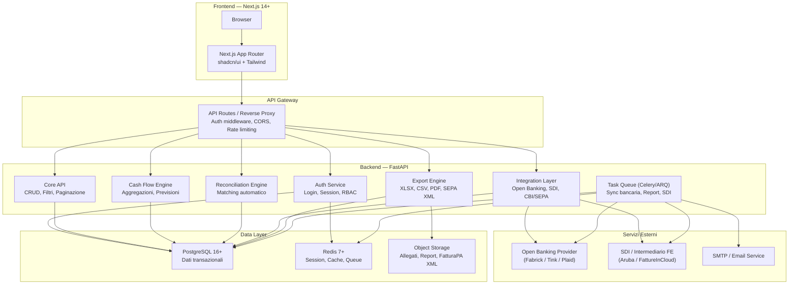
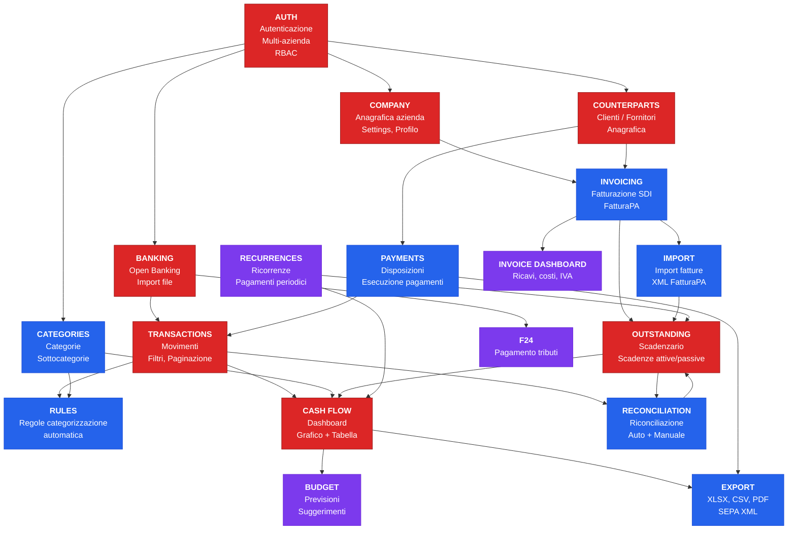

# PRD-00: Panoramica del Gestionale di Tesoreria

**Versione:** 1.0
**Data:** 10 febbraio 2026
**Basato su:** Reverse engineering Sibill (docs/00-15)
**Stack target:** Next.js 14+ (App Router), FastAPI, PostgreSQL 16+, Redis, shadcn/ui, TanStack Query, Recharts

---

## 1. Vision e Obiettivi

### 1.1 Vision

Costruire un **gestionale di tesoreria aziendale** moderno, open-source-friendly e integrabile, che replichi e migliori le funzionalita' core di Sibill (piattaforma italiana di cash management). Il gestionale sara' orientato a PMI, studi professionali e commercialisti che necessitano di:

- Visibilita' in tempo reale sulla posizione di cassa
- Riconciliazione bancaria automatizzata
- Gestione scadenzario e pagamenti
- Previsioni di cash flow basate su dati storici e budget
- Fatturazione elettronica (SDI) integrata
- Connessione bancaria via Open Banking (PSD2) e formati file tradizionali (CBI, SEPA)

### 1.2 Obiettivi strategici

| # | Obiettivo | Metrica di successo |
|---|-----------|---------------------|
| O1 | Parita' funzionale con Sibill per le feature core (cash flow, movimenti, scadenzario) | 100% delle feature P0 implementate |
| O2 | Miglioramento su import/export file bancari (CBI, SEPA XML, CSV, MT940) | [MIGLIORAMENTO] Sibill usa solo Open Banking via Swan |
| O3 | API pubblica documentata e utilizzabile da terzi | OpenAPI spec completa per tutti gli endpoint |
| O4 | Multi-azienda nativo con segregazione dati | Isolamento completo per company_id |
| O5 | Audit trail completo per operazioni finanziarie | [MIGLIORAMENTO] Non osservato in Sibill |

---

## 2. Stack Tecnologico Target

| Layer | Tecnologia | Versione | Motivazione |
|-------|-----------|----------|-------------|
| **Frontend Framework** | Next.js (App Router) | 14+ | SSR/SSG, routing file-based, Server Components |
| **UI Library** | React | 18+ | Ecosistema maturo, compatibilita' con Sibill patterns |
| **UI Components** | shadcn/ui + Radix UI | latest | Accessibile, personalizzabile, sostituisce MUI di Sibill |
| **Styling** | Tailwind CSS | 3+ | Utility-first, design system coerente |
| **State Management** | Jotai | 2+ | Confermato efficace in Sibill, atomico, leggero |
| **Data Fetching** | TanStack Query | 5+ | Cache, stale-while-revalidate, confermato in Sibill |
| **Grafici** | Recharts | 2+ | ComposedChart confermato adeguato per cash flow |
| **Form** | react-hook-form + Zod | latest | Validazione type-safe, confermato in Sibill |
| **Tabelle** | TanStack Table | 8+ | Headless, sorting, filtering, pagination |
| **Date** | date-fns | 3+ | Modulare, tree-shakeable, confermato in Sibill |
| **Aritmetica monetaria** | decimal.js | latest | Precisione arbitraria per importi (sostituisce BigNumber.js) |
| **i18n** | next-intl | latest | Integrato con Next.js App Router |
| **Backend** | FastAPI (Python) | 0.110+ | Async, auto-docs OpenAPI, type hints |
| **ORM** | SQLAlchemy 2 + Alembic | 2.0+ | Async, migrazioni, type-safe |
| **Database** | PostgreSQL | 16+ | JSONB, enum nativi, full-text search, partitioning |
| **Cache/Queue** | Redis | 7+ | Session store, cache, task queue (con Celery/ARQ) |
| **Task Queue** | Celery o ARQ | latest | Sync bancaria, generazione report, invio SDI |
| **HTTP Client** | httpx | latest | Async, per integrazioni esterne (Open Banking, SDI) |
| **Auth** | Cookie-based session (httpOnly, secure) | - | Pattern confermato sicuro in Sibill |

### Confronto con stack Sibill

| Aspetto | Sibill | Gestionale Target | Note |
|---------|--------|-------------------|------|
| Frontend | React + Vite + MUI | Next.js + shadcn/ui + Tailwind | [MIGLIORAMENTO] SSR + componenti accessibili |
| Backend | Elixir/Phoenix (ipotesi) | FastAPI (Python) | Ecosistema Python piu' ampio per integrazioni bancarie |
| API Format | JSON:API | REST JSON standard | Semplificazione — JSON:API aggiunge complessita' |
| DB | Non osservato | PostgreSQL 16+ | - |
| Cache | Non osservato | Redis | [MIGLIORAMENTO] Cache esplicita |
| Audit | Non osservato | Tabella audit_log | [MIGLIORAMENTO] Tracciabilita' completa |

---

## 3. Architettura a 3 Livelli

---

## 4. Mappa Completa delle Funzionalita'

### P0 — MVP (Funzionalita' critiche, senza le quali il gestionale non e' utilizzabile)

| # | Funzionalita' | Modulo | Complessita' | Note |
|---|---------------|--------|-------------|------|
| F01 | **Autenticazione e sessioni** | Auth | Media | Cookie httpOnly, login/logout, refresh |
| F02 | **Multi-azienda** | Auth/Company | Media | Selezione company, segregazione dati |
| F03 | **Connessione bancaria (Open Banking)** | Banking | Alta | PSD2, OAuth2, sync movimenti |
| F04 | **Import movimenti via file** | Banking | Media | [MIGLIORAMENTO] CBI, CSV, MT940 — Sibill non supporta |
| F05 | **Visualizzazione movimenti** | Transactions | Media | Tabella con 9 filtri, paginazione cursor |
| F06 | **Dashboard cash flow** | CashFlow | Alta | Grafico ComposedChart + tabella aggregata |
| F07 | **Scadenzario** | Outstanding | Media | Scadenze attive/passive, stati |
| F08 | **Gestione controparti** | Counterparts | Media | Clienti/fornitori, anagrafica |

### P1 — Alta priorita' (La maggior parte degli utenti si aspetta queste feature)

| # | Funzionalita' | Modulo | Complessita' | Note |
|---|---------------|--------|-------------|------|
| F09 | **Categorizzazione transazioni** | Categories | Media | 2 livelli, colori, CRUD |
| F10 | **Regole categorizzazione automatica** | Rules | Media | Condizioni + azioni configurabili |
| F11 | **Riconciliazione bancaria** | Reconciliation | Alta | Matching auto + manuale |
| F12 | **Pagamenti / disposizioni** | Payments | Alta | Creazione, tracking, stati |
| F13 | **Fatturazione elettronica (SDI)** | Invoicing | Alta | Ricezione + creazione FatturaPA |
| F14 | **Import fatture** | Invoicing | Media | Upload XML FatturaPA |
| F15 | **Export cash flow (XLSX)** | Export | Bassa | Stessi filtri della vista |
| F16 | **Profilo fatturazione** | Company | Bassa | Dati azienda + default |

### P2 — Media priorita' (Utile, aggiungibile in fase successiva)

| # | Funzionalita' | Modulo | Complessita' | Note |
|---|---------------|--------|-------------|------|
| F17 | **Budget / previsioni** | CashFlow | Alta | Per categoria/mese, suggerimenti |
| F18 | **Ricorrenze** | Outstanding | Media | Pagamenti/incassi periodici |
| F19 | **Dashboard fatture** | Invoicing | Media | Ricavi/costi/IVA aggregati |
| F20 | **Gestione team (RBAC)** | Settings | Bassa | Ruoli, inviti, feature gating |
| F21 | **Pagamento F24** | F24 | Alta | Servizio tributario dedicato |
| F22 | **Generazione SEPA XML** | Export | Media | [MIGLIORAMENTO] pain.001, pain.008 |
| F23 | **Export multi-formato** | Export | Media | [MIGLIORAMENTO] XLSX/CSV/PDF per tutti i moduli |

### P3 — Bassa priorita' (Nice-to-have, differenziante)

| # | Funzionalita' | Modulo | Complessita' | Note |
|---|---------------|--------|-------------|------|
| F24 | **Open Banking PSD2 avanzato** | Banking | Alta | PISP (disposizioni), multi-provider |
| F25 | **Multi-company avanzato** | Company | Media | Consolidamento, cash pooling |
| F26 | **Audit trail completo** | Core | Media | [MIGLIORAMENTO] Log tutte le operazioni |
| F27 | **Webhook per eventi** | Core | Media | [MIGLIORAMENTO] Notifiche su sync, pagamento, fattura |
| F28 | **Batch operations** | Core | Media | [MIGLIORAMENTO] Categorizzazione/approvazione batch |
| F29 | **API pubblica documentata** | Core | Bassa | [MIGLIORAMENTO] OpenAPI spec per integrazioni terze |
| F30 | **Programma referral** | Marketing | Bassa | Inviti e bonus |

---

## 5. Diagramma Dipendenze tra Moduli

**Legenda:**
- Rosso (P0): Fondamenta e MVP
- Blu (P1): Alta priorita'
- Viola (P2): Media priorita'
- Grigio (P3): Bassa priorita'

---

## 6. Non-Goals Espliciti

Il gestionale di tesoreria **NON** include le seguenti funzionalita':

| # | Non-Goal | Motivazione |
|---|----------|-------------|
| NG1 | **Contabilita' generale** (partita doppia, piano dei conti, bilancio) | Dominio separato — integrabile via API con software contabili |
| NG2 | **Fatturazione completa** (gestione magazzino, DDT, listini) | Il gestionale gestisce solo il ciclo attivo/passivo finanziario, non il ciclo logistico |
| NG3 | **CRM / Gestione clienti avanzata** | Solo anagrafica base clienti/fornitori per fatturazione e pagamenti |
| NG4 | **Gestione risorse umane / Buste paga** | Fuori scope — dominio HR separato |
| NG5 | **E-commerce / Vendita online** | Fuori scope |
| NG6 | **Business Intelligence avanzata** | Dashboard e report operativi si', BI con drill-down e OLAP no |
| NG7 | **Trading / Gestione investimenti** | Solo tesoreria operativa (conti correnti, pagamenti, incassi) |
| NG8 | **Multi-valuta avanzato** (forex, hedging) | Supporto base EUR + altre valute, ma no gestione rischio cambio |
| NG9 | **Mobile app nativa** | Web responsive (PWA valutabile), no app iOS/Android nativa |

---

## 7. Glossario Termini di Dominio

| Termine | Significato |
|---------|-------------|
| **Cash flow** | Flusso di cassa — entrate e uscite monetarie in un periodo |
| **Riconciliazione** | Processo di matching tra movimenti bancari e registrazioni contabili (fatture/scadenze) |
| **Scadenzario** | Registro delle scadenze di pagamento attive (da incassare) e passive (da pagare) |
| **Disposizione** | Ordine di pagamento (bonifico SEPA, SDD, RiBa, F24) |
| **Controparte** | Cliente o fornitore con cui si hanno rapporti commerciali |
| **Open Banking (PSD2)** | Accesso a dati bancari tramite API standardizzate EU |
| **AISP** | Account Information Service Provider — accesso in lettura ai conti |
| **PISP** | Payment Initiation Service Provider — disposizione pagamenti via API |
| **SDI** | Sistema di Interscambio — piattaforma Agenzia Entrate per fatturazione elettronica |
| **FatturaPA** | Formato XML standard per fattura elettronica italiana |
| **CBI** | Corporate Banking Interbancario — standard italiano per flussi bancari |
| **SEPA** | Single Euro Payments Area — area unica dei pagamenti in euro |
| **pain.001** | XML SEPA Credit Transfer Initiation (bonifici) |
| **pain.008** | XML SEPA Direct Debit Initiation (addebiti diretti) |
| **camt.053** | XML SEPA Bank to Customer Statement (estratto conto) |
| **RiBa** | Ricevuta Bancaria — strumento di pagamento italiano |
| **SDD** | SEPA Direct Debit — addebito diretto SEPA |
| **F24** | Modello unificato per pagamento tributi e contributi |
| **Consent** | Autorizzazione Open Banking — scade dopo max 90 giorni (PSD2) |
| **Flow** | Scadenza di pagamento legata a una fattura/documento |
| **Allocation** | Split di categorizzazione — un movimento assegnato a piu' categorie |
| **Feature gating** | Controllo di accesso a funzionalita' basato su configurazione aziendale e ruolo |

---

## 8. Roadmap di Alto Livello

| Fase | Moduli | Durata stimata | Output |
|------|--------|----------------|--------|
| **Fase 1 — Fondamenta** | Auth, Company, Controparti, Categorie, DB schema | 4-6 settimane | Sistema autenticato con dati base |
| **Fase 2 — Core Banking** | Connessione bancaria, Movimenti, Import file | 6-8 settimane | Movimenti bancari disponibili |
| **Fase 3 — Cash Flow** | Dashboard, Scadenzario, Categorizzazione + regole | 6-8 settimane | Vista cash flow funzionante |
| **Fase 4 — Fatturazione** | SDI, Import fatture, Riconciliazione, Export | 6-8 settimane | Ciclo completo fattura-pagamento |
| **Fase 5 — Avanzate** | Budget, Ricorrenze, Pagamenti, Team/RBAC | 4-6 settimane | Funzionalita' complete |
| **Fase 6 — Specializzazioni** | F24, SEPA XML, Dashboard fatture | 3-4 settimane | Prodotto completo |

**Effort totale stimato:** 29-40 settimane (7-10 mesi) per un team di 2-3 sviluppatori full-stack.

---

## 9. Indice PRD

| # | PRD | Descrizione |
|---|-----|-------------|
| PRD-00 | `prd-00-overview.md` | Panoramica, stack tecnologico, architettura, roadmap |
| PRD-01 | `prd-01-auth-e-utenti.md` | Autenticazione, utenti, multi-azienda, RBAC |
| PRD-02 | `prd-02-dashboard.md` | Dashboard principale e widget |
| PRD-03 | `prd-03-conti-bancari.md` | Conti bancari, connessione Open Banking, import file |
| PRD-04 | `prd-04-movimenti.md` | Movimenti bancari, categorizzazione, regole automatiche |
| PRD-05 | `prd-05-riconciliazione.md` | Riconciliazione bancaria automatica e manuale |
| PRD-06 | `prd-06-scadenzario.md` | Scadenzario, fatture, ricorrenze |
| PRD-07 | `prd-07-pagamenti.md` | Disposizioni di pagamento, SEPA, RiBa, F24 |
| PRD-08 | `prd-08-cash-flow.md` | Cash flow, budget, previsioni |
| PRD-09 | `prd-09-reportistica.md` | Reportistica, dashboard fatture, export multi-formato |
| PRD-10 | `prd-10-integrazioni.md` | Formati di integrazione bancaria (CBI, SEPA, SDI, CSV, MT940) |
| PRD-11 | `prd-11-ui-design-system.md` | UI design system, componenti, pattern di interfaccia |
| PRD-12 | `prd-12-cross-check.md` | Cross-check di consistenza tra PRD, DB schema e RE mapping |
| PRD-13 | `prd-13-controparti.md` | CRUD controparti (clienti/fornitori), anagrafica, ricerca |
| PRD-14 | `prd-14-notifiche.md` | Notifiche in-app, preferenze, canali |
| PRD-15 | `prd-15-settings.md` | Settings azienda, profilo fatturazione, configurazione moduli |
