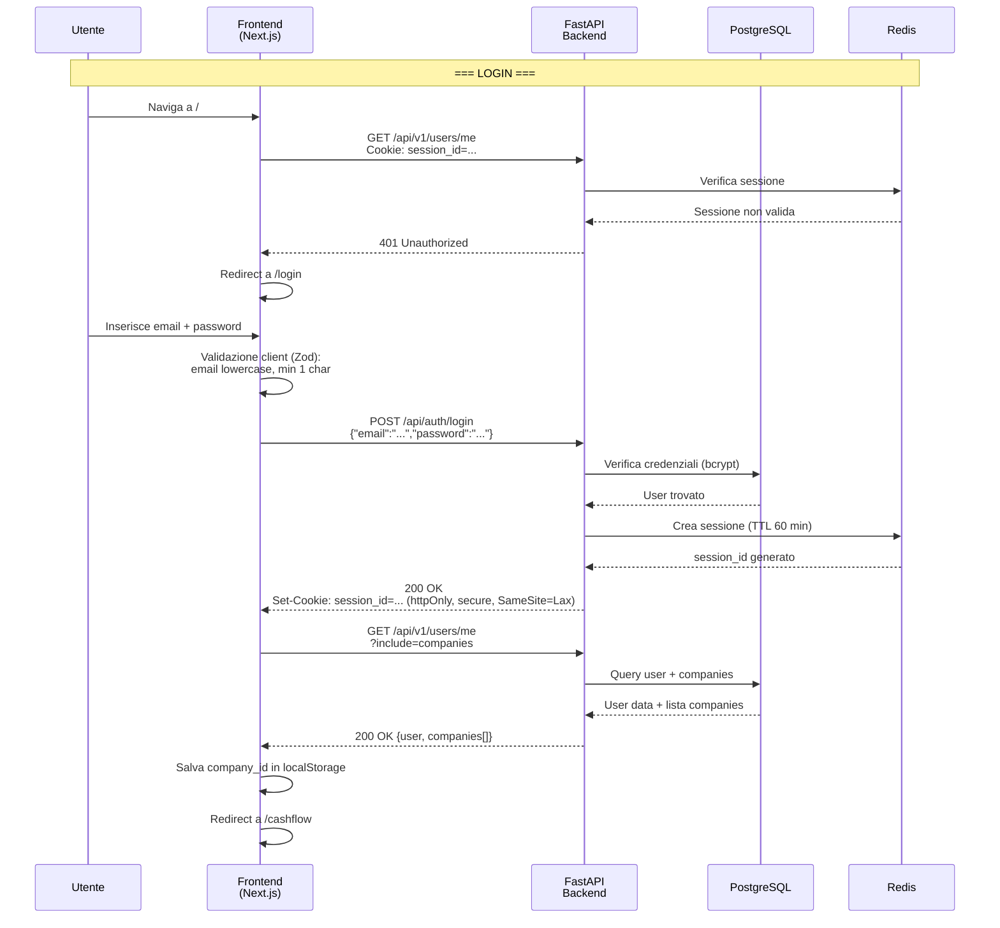
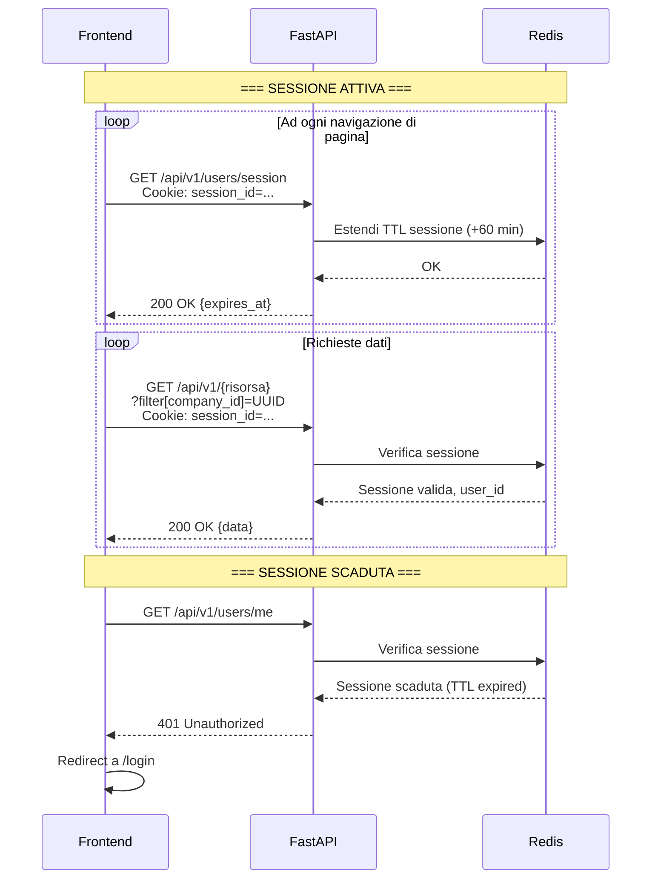
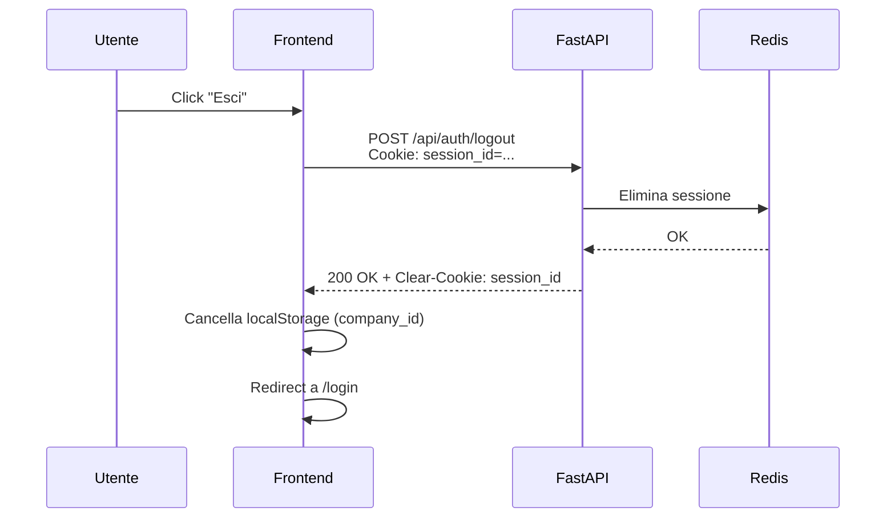
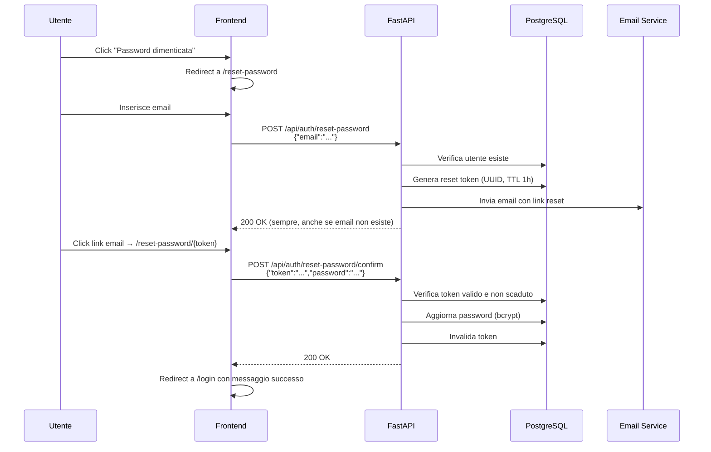
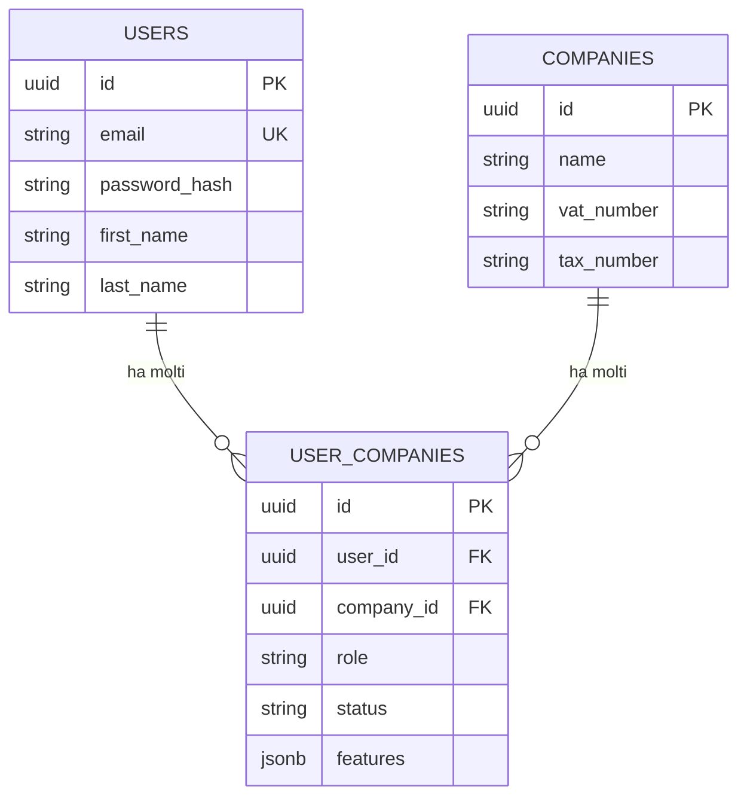

# PRD-01: Autenticazione, Utenti e Multi-Azienda

**Versione:** 1.0
**Data:** 10 febbraio 2026
**Basato su:** RE Sibill — docs/02-auth-sessioni.md, docs/03-data-model.md, docs/12-javascript-analysis.md, docs/13-regole-business.md
**Stack:** Next.js 14+ (App Router), FastAPI, PostgreSQL 16+, Redis

---

## 1. Panoramica

Questo documento definisce i requisiti funzionali per il modulo di autenticazione, gestione utenti, multi-azienda e controllo accessi del gestionale di tesoreria. Il design e' basato sui pattern osservati in Sibill (cookie-based session, multi-company con filtro query param, RBAC con ruoli ADMIN/VIEWER) e li migliora dove indicato.

### 1.1 Entita' coinvolte

| Entita' | Tabella DB | Descrizione |
|---------|-----------|-------------|
| User | `users` | Utente della piattaforma |
| Company | `companies` | Azienda/organizzazione |
| UserCompany | `user_companies` | Relazione N:M utente-azienda con ruolo |
| Session | Redis | Sessione attiva (cookie-based) |
| AuditLog | `audit_log` | Log operazioni [MIGLIORAMENTO] |

---

## 2. Flusso di Autenticazione

### 2.1 Sequence Diagram — Login



### 2.2 Sequence Diagram — Refresh e Sessione Attiva



### 2.3 Sequence Diagram — Logout



### 2.4 Sequence Diagram — Password Reset



---

## 3. Gestione Sessione

### 3.1 Cookie di Sessione

| Proprieta' | Valore | Motivazione |
|-----------|--------|-------------|
| **Nome** | `session_id` | Chiaro e descrittivo |
| **Dominio** | `api.{domain}` | Solo API backend, non frontend statico |
| **httpOnly** | `true` | Protezione XSS — JS non puo' leggerlo |
| **Secure** | `true` | Solo HTTPS |
| **SameSite** | `Lax` | Protezione CSRF parziale |
| **Path** | `/` | Tutto il backend |
| **Max-Age** | `3600` (1 ora) | Rinnovato ad ogni richiesta autenticata |

### 3.2 Sessione in Redis

```
Key:    session:{session_id}
Value:  {
    "user_id": "uuid",
    "created_at": "ISO 8601",
    "last_activity": "ISO 8601",
    "ip_address": "x.x.x.x",
    "user_agent": "..."
}
TTL:    3600 secondi (1 ora), rinnovato ad ogni richiesta
```

### 3.3 CSRF Protection

[MIGLIORAMENTO] Sibill usa solo `SameSite=Lax` senza token CSRF esplicito. Il gestionale aggiunge:
- Header custom `X-CSRF-Token` per operazioni mutative (POST, PATCH, DELETE)
- Token generato dal server e passato nel body della risposta di login
- Verificato lato middleware FastAPI

---

## 4. Multi-Company

### 4.1 Modello

Un utente puo' appartenere a piu' aziende. La relazione e' gestita dalla tabella `user_companies` che include il ruolo.



### 4.2 Selezione Azienda

**Pattern osservato in Sibill:**
1. Al login, `GET /api/v1/users/me?include=companies` restituisce la lista delle aziende
2. Il frontend salva il `company_id` selezionato in `localStorage`
3. Tutte le chiamate API includono `filter[company_id]=UUID` come query parameter

**Pattern per il gestionale:**
- Stesso approccio — il `company_id` e' un parametro esplicito in tutte le query
- Il middleware FastAPI verifica che l'utente abbia accesso alla company indicata
- Se non specificato, il backend usa la company di default (prima nella lista o ultima usata)

### 4.3 Company Context Header

[MIGLIORAMENTO] In aggiunta al query param, supportare un header `X-Company-ID` per semplificare le chiamate API:

```
X-Company-ID: 14196c00-6ac1-4bab-9874-9b01c2fe17a7
```

Il middleware risolve in ordine: header > query param > default.

---

## 5. RBAC (Role-Based Access Control)

### 5.1 Ruoli Osservati in Sibill

| Ruolo | Livello | Osservato |
|-------|---------|-----------|
| `ADMIN` | Pieno accesso | 🟢 Confermato da `userRole` in company |
| `VIEWER` | Sola lettura | 🟢 Confermato da `company-user.role` |

### 5.2 Ruoli per il Gestionale

| Ruolo | Permessi | Descrizione |
|-------|---------|-------------|
| `OWNER` | Tutto + eliminazione company | Proprietario dell'azienda |
| `ADMIN` | Tutto tranne eliminazione company | Amministratore operativo |
| `EDITOR` | Lettura + scrittura dati operativi, no settings | [MIGLIORAMENTO] Operatore di tesoreria |
| `VIEWER` | Sola lettura su tutti i moduli | Consultazione |

### 5.3 Matrice Permessi per Modulo

| Modulo | OWNER | ADMIN | EDITOR | VIEWER |
|--------|-------|-------|--------|--------|
| Dashboard cash flow | R | R | R | R |
| Movimenti | RW | RW | RW | R |
| Categorizzazione | RW | RW | RW | R |
| Regole | CRUD | CRUD | CRUD | R |
| Scadenzario | CRUD | CRUD | CRUD | R |
| Pagamenti | CRUD+Approve | CRUD+Approve | CRUD | R |
| Fatturazione | CRUD | CRUD | CRUD | R |
| Riconciliazione | RW | RW | RW | R |
| Budget/Previsioni | CRUD | CRUD | CRUD | R |
| Controparti | CRUD | CRUD | CRUD | R |
| Conti bancari | CRUD | CRUD | R | R |
| Team/Utenti | CRUD | CRUD | - | - |
| Settings azienda | RW | RW | - | R |
| Audit log | R | R | - | - |

### 5.4 Feature Gating

Sibill implementa feature gating a due livelli:
- `features` sulla company → funzionalita' abilitate per l'azienda (basate sulla configurazione aziendale)
- `userFeatures` sull'utente → funzionalita' abilitate per il singolo utente

Il gestionale replica questo pattern:

| Livello | Tabella | Campo | Esempio |
|---------|---------|-------|---------|
| Company | `companies` | `features` (jsonb) | `["cashflow", "budget", "sdi", "f24"]` |
| User | `user_companies` | `features` (jsonb) | `["cashflow", "budget"]` |

La feature e' abilitata **solo se** presente in ENTRAMBI i livelli (company AND user).

---

## 6. Team Management

### 6.1 Invito Utenti

**Flusso:**
1. ADMIN/OWNER inserisce email del nuovo membro + ruolo
2. Backend crea record in `user_companies` con `status=INVITED`
3. Backend invia email con link di invito
4. L'invitato clicca il link → registrazione/conferma
5. Status diventa `ACTIVE`

### 6.2 Stati Utente in Company

| Stato | Descrizione |
|-------|-------------|
| `INVITED` | Invito inviato, non ancora accettato |
| `ACTIVE` | Membro attivo |
| `SUSPENDED` | Temporaneamente disabilitato |
| `REMOVED` | Rimosso dall'azienda (soft delete) |

---

## 7. Functional Requirements

### FR-AUTH-001: Login con Email e Password

**Titolo:** Login utente con credenziali email e password

**Descrizione:** L'utente deve poter accedere al sistema inserendo email e password. L'email viene normalizzata a lowercase. Al successo, il server imposta un cookie di sessione httpOnly.

**Acceptance Criteria:**
- **Given** un utente registrato con email "test@example.com" e password valida
- **When** l'utente inserisce "Test@Example.com" e la password corretta nel form di login
- **Then** l'email viene normalizzata a lowercase, il server verifica le credenziali, imposta il cookie `session_id` (httpOnly, secure, SameSite=Lax), e l'utente viene reindirizzato a `/cashflow`

- **Given** un utente che inserisce credenziali errate
- **When** il server risponde con 401
- **Then** viene mostrato il messaggio "Credenziali errate" e il form resta sulla pagina login

**Priorita':** P0

---

### FR-AUTH-002: Validazione Client-Side Login

**Titolo:** Validazione form di login lato client con Zod

**Descrizione:** Il form di login deve validare i campi prima dell'invio al server. Schema: email obbligatoria con formato email valido, password obbligatoria con almeno 1 carattere.

**Acceptance Criteria:**
- **Given** un form di login vuoto
- **When** l'utente clicca "Accedi" senza compilare i campi
- **Then** vengono mostrati messaggi di errore inline per email e password

- **Given** un'email non valida (es. "abc")
- **When** l'utente prova a inviare il form
- **Then** viene mostrato il messaggio "Inserisci un'email valida"

- **Given** l'utente inserisce "Test@Example.COM"
- **When** il campo email perde il focus o viene inviato
- **Then** il valore viene normalizzato a "test@example.com"

**Priorita':** P0

---

### FR-AUTH-003: Gestione Sessione Cookie-Based

**Titolo:** Sessione autenticata tramite cookie httpOnly con refresh automatico

**Descrizione:** Dopo il login, tutte le richieste API inviano automaticamente il cookie di sessione. La sessione ha un TTL di 60 minuti in Redis, rinnovato ad ogni richiesta autenticata (sliding expiration).

**Acceptance Criteria:**
- **Given** un utente autenticato
- **When** naviga tra le pagine dell'applicazione
- **Then** ogni richiesta API include il cookie `session_id` e il TTL della sessione viene rinnovato

- **Given** un utente che non interagisce per oltre 60 minuti
- **When** tenta una nuova richiesta API
- **Then** il server risponde con 401 e il frontend reindirizza a `/login`

**Priorita':** P0

---

### FR-AUTH-004: Logout

**Titolo:** Logout volontario con pulizia sessione

**Descrizione:** L'utente deve poter terminare la sessione. Il server elimina la sessione da Redis, cancella il cookie, e il frontend pulisce il localStorage.

**Acceptance Criteria:**
- **Given** un utente autenticato
- **When** clicca "Esci" nel menu utente
- **Then** il server elimina la sessione da Redis, cancella il cookie `session_id`, il frontend cancella `company_id` dal localStorage, e l'utente viene reindirizzato a `/login`

**Priorita':** P0

---

### FR-AUTH-005: Password Reset via Email

**Titolo:** Recupero password tramite email con token a scadenza

**Descrizione:** L'utente puo' richiedere il reset della password inserendo la propria email. Il sistema invia un'email con un link contenente un token UUID valido per 1 ora. Il link porta a un form dove inserire la nuova password.

**Acceptance Criteria:**
- **Given** un utente registrato che ha dimenticato la password
- **When** inserisce la propria email nel form di reset
- **Then** il server risponde sempre con 200 (per non rivelare se l'email esiste) e, se l'email esiste, invia un'email con link di reset

- **Given** un link di reset valido (token non scaduto)
- **When** l'utente inserisce una nuova password (min 8 caratteri, almeno 1 maiuscola, 1 numero)
- **Then** la password viene aggiornata, il token invalidato, e l'utente reindirizzato al login

- **Given** un link di reset con token scaduto (> 1 ora)
- **When** l'utente tenta di usarlo
- **Then** viene mostrato un messaggio "Link scaduto, richiedi un nuovo reset"

**Priorita':** P1

---

### FR-AUTH-006: Multi-Company — Selezione Azienda

**Titolo:** Selezione e switch tra aziende per utenti multi-company

**Descrizione:** Un utente puo' appartenere a piu' aziende. Dopo il login, se l'utente ha piu' aziende, puo' selezionare quella attiva da un dropdown. Il `company_id` viene salvato in localStorage e inviato in tutte le richieste API.

**Acceptance Criteria:**
- **Given** un utente che appartiene a 3 aziende (A, B, C)
- **When** effettua il login
- **Then** l'API `/users/me?include=companies` restituisce le 3 aziende, il frontend seleziona automaticamente l'ultima usata (o la prima se primo accesso)

- **Given** un utente con azienda A selezionata
- **When** clicca sull'azienda B nel dropdown company
- **Then** il `company_id` in localStorage viene aggiornato, tutte le query API vengono rieseguite con il nuovo `company_id`, e la dashboard si aggiorna

- **Given** un utente con una sola azienda
- **When** effettua il login
- **Then** l'azienda viene selezionata automaticamente e il dropdown company non e' visibile (o e' disabilitato)

**Priorita':** P0

---

### FR-AUTH-007: Company Data Isolation

**Titolo:** Segregazione completa dei dati per azienda

**Descrizione:** Ogni richiesta API che restituisce dati operativi (movimenti, fatture, scadenze, ecc.) DEVE filtrare per `company_id`. Il middleware backend verifica che l'utente abbia accesso alla company richiesta.

**Acceptance Criteria:**
- **Given** un utente con accesso alle aziende A e B
- **When** richiede movimenti con `company_id=A`
- **Then** riceve solo i movimenti dell'azienda A

- **Given** un utente con accesso solo all'azienda A
- **When** tenta di richiedere dati con `company_id=C` (a cui non ha accesso)
- **Then** il server risponde con 403 Forbidden

- **Given** una richiesta API senza `company_id`
- **When** il backend processa la richiesta
- **Then** usa la company di default dell'utente (prima nella lista se non specificata)

**Priorita':** P0

---

### FR-AUTH-008: RBAC — Ruoli e Permessi

**Titolo:** Controllo accessi basato su ruoli per modulo

**Descrizione:** Ogni utente ha un ruolo per azienda (OWNER, ADMIN, EDITOR, VIEWER). I permessi determinano le operazioni consentite per ogni modulo.

**Acceptance Criteria:**
- **Given** un utente con ruolo VIEWER nell'azienda A
- **When** tenta di creare un nuovo movimento (POST)
- **Then** il server risponde con 403 Forbidden e il frontend nasconde i pulsanti di creazione

- **Given** un utente con ruolo EDITOR
- **When** tenta di accedere a Settings/Team
- **Then** il menu Team non e' visibile e l'accesso diretto via URL restituisce 403

- **Given** un utente con ruolo ADMIN
- **When** tenta di eliminare l'azienda
- **Then** l'opzione non e' visibile — solo OWNER puo' eliminare l'azienda

**Priorita':** P1

---

### FR-AUTH-009: Feature Gating

**Titolo:** Abilitazione/disabilitazione funzionalita' per configurazione aziendale e utente

**Descrizione:** Le funzionalita' sono controllate a due livelli: company (`companies.features` — moduli attivi configurati dall'amministratore) e utente (`user_companies.features`). Una feature e' accessibile solo se abilitata in ENTRAMBI i livelli. Pattern osservato in Sibill: `features` e `userFeatures`.

**Acceptance Criteria:**
- **Given** un'azienda con `features=["cashflow", "transactions"]` che non include `"budget"`
- **When** un utente tenta di accedere alla sezione Budget
- **Then** viene mostrata una pagina informativa "Modulo non attivo — Contattare l'amministratore per l'abilitazione"

- **Given** un'azienda con `features` che include `"budget"` e un utente con `userFeatures=["cashflow"]` (senza budget)
- **When** l'utente tenta di accedere alla sezione Budget
- **Then** la funzionalita' non e' disponibile (feature non in `userFeatures`)

- **Given** un'azienda con tutti i moduli attivi e un utente con tutte le feature abilitate
- **When** l'utente naviga nell'app
- **Then** tutte le sezioni sono visibili e accessibili

**Priorita':** P1

---

### FR-AUTH-010: Team Management — Invito Utenti

**Titolo:** Invito nuovi membri al team aziendale

**Descrizione:** Un ADMIN o OWNER puo' invitare nuovi utenti all'azienda, specificando email e ruolo. L'invitato riceve un'email con link di conferma.

**Acceptance Criteria:**
- **Given** un ADMIN dell'azienda A
- **When** inserisce l'email "nuovo@example.com" con ruolo "EDITOR" e clicca "Invita"
- **Then** viene creato un record `user_companies` con `status=INVITED`, viene inviata un'email all'invitato, e nella lista team appare il nuovo membro con badge "Invitato"

- **Given** un invitato che clicca il link di invito
- **When** e' gia' registrato sulla piattaforma
- **Then** viene aggiunto automaticamente all'azienda con `status=ACTIVE`

- **Given** un invitato che clicca il link di invito
- **When** non e' ancora registrato
- **Then** viene reindirizzato a un form di registrazione pre-compilato con l'email

- **Given** un utente con ruolo VIEWER
- **When** tenta di invitare un nuovo membro
- **Then** il pulsante "Invita" non e' visibile e l'endpoint API restituisce 403

**Priorita':** P2

---

### FR-AUTH-011: Sessione — Verifica Iniziale

**Titolo:** Verifica sessione al caricamento dell'app

**Descrizione:** Al primo caricamento, il frontend verifica se esiste una sessione valida chiamando `GET /api/v1/users/me`. Se la sessione non e' valida (401), l'utente viene reindirizzato al login.

**Acceptance Criteria:**
- **Given** un utente che apre l'app con un cookie di sessione valido
- **When** il frontend esegue `GET /api/v1/users/me`
- **Then** riceve 200 con i dati utente e le aziende associate, e procede al rendering della dashboard

- **Given** un utente che apre l'app senza cookie (o con cookie scaduto)
- **When** il frontend esegue `GET /api/v1/users/me`
- **Then** riceve 401, il frontend esegue `POST /api/auth/logout` (pulizia), e reindirizza a `/login`

**Priorita':** P0

---

### FR-AUTH-012: Redirect Post-Login

**Titolo:** Redirect alla pagina originale dopo login

**Descrizione:** Se l'utente viene reindirizzato al login da una pagina protetta, dopo il login deve tornare alla pagina originale. Pattern osservato in Sibill: parametro `?rd=` nell'URL.

**Acceptance Criteria:**
- **Given** un utente non autenticato che naviga a `/transactions/movements`
- **When** viene reindirizzato al login
- **Then** l'URL di login contiene `?rd=/transactions/movements`

- **Given** un utente che effettua il login con `?rd=/transactions/movements`
- **When** il login ha successo
- **Then** viene reindirizzato a `/transactions/movements` invece che a `/cashflow`

- **Given** un utente che effettua il login senza parametro `rd`
- **When** il login ha successo
- **Then** viene reindirizzato alla dashboard (`/cashflow`)

**Priorita':** P1

---

### FR-AUTH-013: Audit Log Operazioni Autenticazione

**Titolo:** Logging di tutti gli eventi di autenticazione

**Descrizione:** [MIGLIORAMENTO] Ogni operazione di autenticazione viene registrata nell'audit log: login riuscito, login fallito, logout, reset password, cambio ruolo, invito utente.

**Acceptance Criteria:**
- **Given** un utente che effettua il login
- **When** il login ha successo
- **Then** viene scritto un record in `audit_log` con: `action=LOGIN`, `user_id`, `ip_address`, `user_agent`, `timestamp`, `company_id=null`

- **Given** un tentativo di login con credenziali errate
- **When** il server risponde con 401
- **Then** viene scritto un record in `audit_log` con: `action=LOGIN_FAILED`, `email` (senza password), `ip_address`, `user_agent`, `timestamp`

- **Given** un ADMIN che cambia il ruolo di un utente
- **When** l'operazione ha successo
- **Then** viene scritto un record con: `action=ROLE_CHANGED`, `target_user_id`, `old_role`, `new_role`, `company_id`

**Priorita':** P2

---

### FR-AUTH-014: Rate Limiting Login

**Titolo:** Protezione brute-force con rate limiting sugli endpoint di autenticazione

**Descrizione:** [MIGLIORAMENTO] Gli endpoint di autenticazione sono protetti da rate limiting per prevenire attacchi brute-force.

**Acceptance Criteria:**
- **Given** un IP che ha effettuato 5 tentativi di login falliti negli ultimi 15 minuti
- **When** tenta un ulteriore login
- **Then** il server risponde con 429 Too Many Requests e il messaggio indica il tempo di attesa

- **Given** un'email che ha ricevuto 3 richieste di reset password nell'ultima ora
- **When** viene richiesto un ulteriore reset
- **Then** il server risponde con 429

**Priorita':** P1

---

### FR-AUTH-015: Registrazione Nuovo Utente

**Titolo:** Registrazione utente con creazione azienda

**Descrizione:** Un nuovo utente puo' registrarsi creando un account e un'azienda contemporaneamente. Viene richiesto: email, password, nome, cognome, nome azienda, P.IVA.

**Acceptance Criteria:**
- **Given** un utente non registrato
- **When** compila il form di registrazione con tutti i campi obbligatori
- **Then** viene creato un record `users`, un record `companies`, un record `user_companies` con ruolo OWNER, e l'utente viene autenticato automaticamente

- **Given** un'email gia' registrata
- **When** l'utente tenta di registrarsi
- **Then** viene mostrato il messaggio "Email gia' in uso. Accedi o recupera la password."

- **Given** una P.IVA gia' registrata
- **When** l'utente tenta di creare l'azienda
- **Then** viene mostrato un avviso "Azienda gia' presente. Vuoi richiedere l'accesso?" con opzione di invio richiesta

**Priorita':** P1
