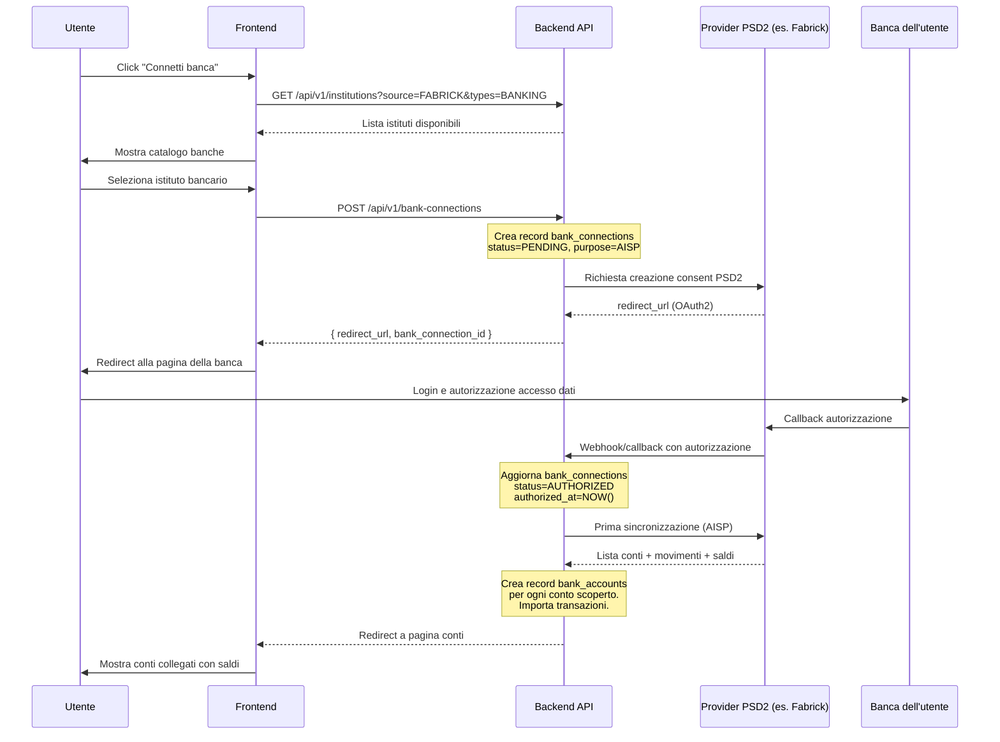
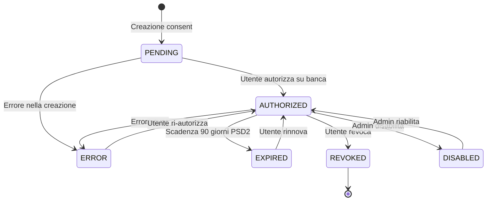

# PRD-03 — Conti Bancari e Connessione Bancaria

**Versione:** 1.0
**Data:** 10 febbraio 2026
**Basato su:** RE Sibill (docs/04, docs/09, docs/10, docs/13), DB Schema (.tmp/db-schema.md)
**Stato:** Draft

---

## 1. Panoramica Modulo

Il modulo Conti Bancari gestisce la **centralizzazione dei conti bancari dell'azienda**, la connessione tramite Open Banking (PSD2), l'import manuale di movimenti da file bancari, e il monitoraggio dei saldi in tempo reale. E' il fondamento su cui si basano tutti gli altri moduli (movimenti, riconciliazione, cash flow, pagamenti).

### 1.1 Obiettivi

- Permettere la gestione di conti bancari su banche diverse (multi-banca, multi-conto)
- Supportare la connessione automatica via PSD2 Open Banking (AISP/PISP)
- **[MIGLIORAMENTO]** Supportare l'import manuale di movimenti da file CBI, CSV, MT940/MT942
- Fornire una dashboard aggregata dei saldi contabili e disponibili
- Gestire il ciclo di vita dei consensi Open Banking (creazione, autorizzazione, rinnovo, revoca)

### 1.2 Tabelle DB coinvolte

| Tabella | Ruolo |
|---------|-------|
| `bank_accounts` | Conti bancari dell'azienda |
| `bank_connections` | Consensi Open Banking (PSD2) |
| `institutions` | Catalogo istituti bancari |
| `integration_configs` | Configurazioni di integrazione (Open Banking, CBI, SEPA) |
| `import_batches` | Tracciamento import file bancari |
| `audit_log` | Log operazioni |
| `notifications` | Notifiche (consent in scadenza, sync fallita, ecc.) |

---

## 2. CRUD Conti Bancari

### 2.1 Creazione manuale

Un conto bancario puo' essere creato manualmente (senza connessione Open Banking) per banche non supportate dal provider PSD2.

**Campi obbligatori** (da tabella `bank_accounts`):

| Campo | Tipo DB | Vincoli | Note |
|-------|---------|---------|------|
| `company_id` | UUID FK | NOT NULL | Azienda di appartenenza |
| `nickname` | VARCHAR(255) | - | Nome personalizzato del conto |
| `iban` | VARCHAR(34) | Validazione IBAN | IBAN completo |
| `currency` | VARCHAR(3) | NOT NULL, DEFAULT 'EUR' | ISO 4217 |
| `status` | `account_status` | NOT NULL, DEFAULT 'ACTIVE' | ACTIVE, INACTIVE, HIDDEN, CLOSED |

**Campi opzionali:**

| Campo | Tipo DB | Note |
|-------|---------|------|
| `bic` | VARCHAR(11) | BIC/SWIFT (derivabile da IBAN per banche italiane) |
| `account_number` | VARCHAR(50) | Per conti senza IBAN |
| `current_balance` | NUMERIC(15,2) | Saldo contabile iniziale |
| `available_balance` | NUMERIC(15,2) | Saldo disponibile iniziale |
| `balance_date` | TIMESTAMPTZ | Data del saldo inserito |
| `credit_limit` | NUMERIC(15,2) | Fido bancario |
| `allow_balance_change` | BOOLEAN | DEFAULT TRUE, modifica manuale saldo |
| `ignore_balance` | BOOLEAN | DEFAULT FALSE, escludi da aggregati |

### 2.2 Modifica conto

Campi modificabili dall'utente:

- `nickname` — Nome personalizzato
- `current_balance` / `available_balance` — Solo se `allow_balance_change = TRUE`
- `credit_limit` — Fido bancario
- `ignore_balance` — Inclusione/esclusione da saldi aggregati
- `status` — Cambio stato (ACTIVE -> INACTIVE, HIDDEN, CLOSED)

Per conti collegati via Open Banking, i saldi sono aggiornati automaticamente dalla sincronizzazione. La modifica manuale del saldo e' possibile solo come override temporaneo.

### 2.3 Archiviazione e nascondimento

- **Nascondimento** (`hidden_at`): il conto resta nel sistema ma non e' visibile nella lista. I movimenti restano accessibili. Corrisponde allo stato HIDDEN.
- **Chiusura** (`status = CLOSED`): il conto e' chiuso. Non accetta nuovi movimenti. I dati storici restano.
- **Soft delete**: non previsto per i conti bancari (hanno troppi dati collegati). Si usa CLOSED.

### 2.4 Eliminazione

L'eliminazione di un conto bancario e' un'operazione distruttiva con side-effects significativi:

- Tutte le `transactions` del conto vengono eliminate (CASCADE)
- Le `reconciliation_matches` associate vengono eliminate
- Le `transaction_allocations` vengono eliminate
- I `payment_orders` restano ma perdono il riferimento al conto (RESTRICT — blocca l'eliminazione se ci sono ordini di pagamento)

Per questo motivo, l'eliminazione e' bloccata se ci sono `payment_orders` associati. L'utente deve prima annullare/completare tutti i pagamenti.

---

## 3. Connessione PSD2 Open Banking

### 3.1 Panoramica

La connessione Open Banking permette l'acquisizione automatica di movimenti e saldi tramite API PSD2. Sibill utilizza SWAN come provider. Il gestionale supportera' provider multipli tramite la tabella `integration_configs`.

### 3.2 Flusso di collegamento conto



### 3.3 Entita' `bank_connections` (consent)

| Campo | Tipo | Descrizione |
|-------|------|-------------|
| `id` | UUID PK | Identificativo unico |
| `company_id` | UUID FK | Azienda |
| `user_id` | UUID FK | Utente che ha creato il consent |
| `institution_id` | UUID FK | Istituto bancario |
| `status` | `consent_status` | PENDING, AUTHORIZED, EXPIRED, REVOKED, DISABLED, ERROR |
| `purpose` | `consent_purpose` | AISP (lettura), PISP (pagamenti), BOTH |
| `provider_source_id` | VARCHAR(255) | ID dal provider Open Banking |
| `provider_name` | VARCHAR(50) | Nome provider |
| `redirect_url` | VARCHAR(500) | URL redirect OAuth |
| `authorized_at` | TIMESTAMPTZ | Data autorizzazione |
| `first_sync_at` | TIMESTAMPTZ | Prima sincronizzazione |
| `last_sync_at` | TIMESTAMPTZ | Ultima sincronizzazione |
| `next_sync_at` | TIMESTAMPTZ | Prossima sync pianificata |
| `expires_at` | TIMESTAMPTZ | Scadenza consent (max 90 giorni PSD2) |

### 3.4 Ciclo di vita del consent



### 3.5 Scadenza e rinnovo

I consensi PSD2 hanno una scadenza massima di 90 giorni. Il sistema deve:

1. Monitorare `expires_at` per ogni `bank_connections` attivo
2. Inviare notifica `CONSENT_EXPIRING` 7 giorni prima della scadenza
3. Inviare notifica `CONSENT_EXPIRED` alla scadenza
4. Bloccare la sincronizzazione per consent scaduti
5. Permettere il rinnovo tramite nuovo flusso OAuth2

---

## 4. [MIGLIORAMENTO] Import CBI/CSV/MT940

Sibill acquisisce i movimenti **esclusivamente** via Open Banking (SWAN). Il gestionale aggiunge il supporto per l'import manuale di file bancari, necessario per:

- Banche non coperte dal provider PSD2
- Importazione di dati storici
- Clienti che preferiscono il flusso file tradizionale

### 4.1 Formati supportati

| Formato | Estensione | Standard | Descrizione |
|---------|------------|----------|-------------|
| **CSV generico** | `.csv` | - | Formato libero con mapping campi configurabile |
| **MT940** | `.sta`, `.mt940` | SWIFT | Estratto conto SWIFT, standard internazionale |
| **MT942** | `.mt942` | SWIFT | Estratto conto infragiornaliero SWIFT |
| **CBI / camt.053** | `.xml` | ISO 20022 | Estratto conto fine giornata, standard italiano |
| **CBI / camt.054** | `.xml` | ISO 20022 | Notifica accredito/addebito |

### 4.2 Mapping campi per CSV generico

L'utente deve poter configurare il mapping tra colonne CSV e campi della tabella `transactions`:

| Campo destinazione | Tipo | Obbligatorio | Note |
|--------------------|------|-------------|------|
| `transaction_date` | DATE | Si | Data operazione |
| `value_date` | DATE | No | Data valuta |
| `amount` | NUMERIC | Si | Importo (positivo=entrata, negativo=uscita) |
| `description` | TEXT | No | Descrizione/causale |
| `counterpart_name` | VARCHAR | No | Nome controparte |
| `counterpart_iban` | VARCHAR | No | IBAN controparte |
| `remittance_info` | TEXT | No | Causale/riferimento |

Il mapping viene salvato per riuso futuro in `integration_configs` con `integration_type = 'CSV_MAPPING'`.

### 4.3 Mapping campi MT940

| Tag MT940 | Campo `transactions` | Descrizione |
|-----------|---------------------|-------------|
| `:61:` (Value Date) | `value_date` | Data valuta |
| `:61:` (Entry Date) | `transaction_date` | Data operazione |
| `:61:` (Amount) | `amount` | Importo con segno (C=credito, D=debito) |
| `:61:` (Transaction Type) | `transaction_type` | Tipo transazione |
| `:86:` | `description` | Informazioni supplementari |
| `:60F:` / `:62F:` | saldo iniziale/finale | Per verifica coerenza |

### 4.4 Flusso import

1. Utente seleziona il conto bancario di destinazione
2. Utente carica il file (upload)
3. Il sistema rileva il formato (CSV, MT940, CBI)
4. Viene creato un record `import_batches` con `status = PENDING`
5. Il sistema processa il file: parsing, validazione, deduplicazione
6. Per ogni record valido, crea una `transactions` con `categorization_source = 'IMPORT'`
7. Aggiorna `import_batches` con contatori (`total_records`, `imported_records`, `skipped_records`, `error_records`)
8. Esegue la categorizzazione automatica (regole da `categorization_rules`)
9. Aggiorna i saldi del conto

### 4.5 Deduplicazione

Per evitare import duplicati, il sistema controlla:

- `bank_account_id` + `transaction_date` + `amount` + `description` (hash)
- Se esiste gia' una transazione con lo stesso hash, la riga viene saltata (contata in `skipped_records`)

---

## 5. Multi-banca e Dashboard Aggregata Saldi

### 5.1 Gestione multi-banca

Il sistema supporta (come osservato in Sibill):

- Un'azienda (`companies`) puo' avere N conti (`bank_accounts`)
- Ogni conto puo' essere presso una banca diversa
- Ogni conto collegato via Open Banking ha un `bank_connections` dedicato
- Un `bank_connections` puo' avere N conti (una connessione a una banca scopre tutti i conti)

### 5.2 Dashboard saldi aggregati

Formula di aggregazione (basata su RE Sibill, LB-CB-04):

```pseudocode
// Calcolo saldi aggregati
function calcolaSaldiAggregati(company_id):
    conti = SELECT * FROM bank_accounts
            WHERE company_id = :company_id
            AND status = 'ACTIVE'
            AND ignore_balance = FALSE
            AND hidden_at IS NULL

    saldo_contabile = SUM(conti.current_balance)
    saldo_disponibile = SUM(conti.available_balance)
    differenza = saldo_contabile - saldo_disponibile
    num_conti = COUNT(conti)

    RETURN {
        count: num_conti,
        current_balance: saldo_contabile,
        available_balance: saldo_disponibile,
        difference: differenza
    }
```

Filtri applicati (come in Sibill):
- `ignore_balance = FALSE` — esclude conti esplicitamente esclusi
- `status = 'ACTIVE'` — solo conti attivi
- `hidden_at IS NULL` — esclude conti nascosti

### 5.3 Fido bancario

Se un conto ha `credit_limit` impostato, il saldo disponibile effettivo e':

```
saldo_disponibile_effettivo = available_balance + credit_limit
```

Il fido viene mostrato nella UI come informazione aggiuntiva accanto al saldo.

---

## 6. Saldi

### 6.1 Saldo contabile vs disponibile

| Tipo saldo | Campo DB | Descrizione |
|------------|----------|-------------|
| **Contabile** (`current_balance`) | `bank_accounts.current_balance` | Include operazioni in attesa di esecuzione |
| **Disponibile** (`available_balance`) | `bank_accounts.available_balance` | Saldo effettivamente utilizzabile |
| **Differenza** | Calcolato | Operazioni in transito (contabile - disponibile) |

### 6.2 Aggiornamento saldi

| Modalita' | Trigger | Descrizione |
|-----------|---------|-------------|
| **Automatico (Open Banking)** | Sincronizzazione periodica | Saldi aggiornati dal provider PSD2 |
| **Automatico (Import)** | Import file completato | Ricalcolo da ultimo saldo noto + movimenti importati |
| **Manuale** | Utente modifica saldo | Solo se `allow_balance_change = TRUE` |

### 6.3 Storico saldi

Lo storico dei saldi e' ricostruibile dalla tabella `cash_flow_entries` che contiene `balance_start` e `balance_end` per ogni mese. Per uno storico giornaliero, si utilizza la somma cumulativa delle transazioni a partire dal saldo iniziale noto.

---

## 7. Sincronizzazione Open Banking

### 7.1 Frequenza

| Tipo | Frequenza | Note |
|------|-----------|------|
| **Automatica periodica** | Ogni 4-6 ore | Standard PSD2: max 4 richieste/giorno per AISP |
| **Su richiesta** | On-demand | L'utente forza una sincronizzazione |
| **Prima sync** | Al momento dell'autorizzazione | Importa storico movimenti disponibile |

### 7.2 Gestione conflitti

Durante la sincronizzazione, il sistema deve gestire:

- **Nuovi movimenti**: inseriti nella tabella `transactions`
- **Movimenti modificati** (status change): aggiornati (es. PENDING -> BOOKED)
- **Saldi aggiornati**: sovrascritti con i valori dal provider
- **Movimenti gia' presenti**: skip (deduplicazione tramite `provider_transaction_id`)

### 7.3 Stati sincronizzazione

| Stato | Descrizione | Azione |
|-------|-------------|--------|
| **Idle** | Nessuna sync in corso | Attende `next_sync_at` |
| **Syncing** | Sincronizzazione in corso | Mostra indicatore di caricamento |
| **Success** | Sync completata | Aggiorna `last_sync_at`, pianifica `next_sync_at` |
| **Error** | Sync fallita | Notifica `SYNC_FAILED`, retry dopo intervallo crescente |

### 7.4 Gestione errori sync

```pseudocode
function handleSyncError(bank_connection_id, error):
    connection = GET bank_connections WHERE id = bank_connection_id

    IF error.type == "CONSENT_EXPIRED":
        connection.status = 'EXPIRED'
        NOTIFY user CONSENT_EXPIRED
    ELIF error.type == "CONSENT_REVOKED":
        connection.status = 'REVOKED'
        NOTIFY user CONSENT_EXPIRED
    ELIF error.type == "TEMPORARY_ERROR":
        connection.next_sync_at = NOW() + exponential_backoff(retry_count)
        NOTIFY user SYNC_FAILED (se retry_count > 3)
    ELIF error.type == "PROVIDER_DOWN":
        connection.next_sync_at = NOW() + 1 hour
        LOG warning

    AUDIT_LOG action=SYNC_FAILED, entity=bank_connections, entity_id=connection.id
```

---

## 8. API Endpoints

### 8.1 Conti bancari

| Metodo | Path | Descrizione | Parametri principali |
|--------|------|-------------|---------------------|
| `GET` | `/api/v1/bank-accounts` | Lista conti dell'azienda | `company_id`, `status`, `include=bankConnection.institution` |
| `GET` | `/api/v1/bank-accounts/:id` | Dettaglio conto | `include=bankConnection.institution` |
| `POST` | `/api/v1/bank-accounts` | Creazione conto manuale | Body: nickname, iban, currency, status |
| `PATCH` | `/api/v1/bank-accounts/:id` | Modifica conto | Body: nickname, status, credit_limit, ignore_balance |
| `DELETE` | `/api/v1/bank-accounts/:id` | Eliminazione conto | Bloccato se ci sono payment_orders |
| `GET` | `/api/v1/bank-accounts/metadata` | Saldi aggregati | `company_id`, `ignore_balance=false`, `status=ACTIVE` |
| `PATCH` | `/api/v1/bank-accounts/:id/balance` | Modifica manuale saldo | Body: current_balance, available_balance, balance_date |

### 8.2 Connessioni bancarie (consent)

| Metodo | Path | Descrizione | Parametri principali |
|--------|------|-------------|---------------------|
| `GET` | `/api/v1/bank-connections` | Lista consent | `company_id`, `status` |
| `POST` | `/api/v1/bank-connections` | Avvia connessione Open Banking | Body: institution_id, purpose |
| `GET` | `/api/v1/bank-connections/:id` | Dettaglio consent | `include=bankAccounts` |
| `DELETE` | `/api/v1/bank-connections/:id` | Revoca consent | Aggiorna status=REVOKED |
| `POST` | `/api/v1/bank-connections/:id/sync` | Forza sincronizzazione | - |
| `POST` | `/api/v1/bank-connections/:id/renew` | Rinnova consent scaduto | Avvia nuovo flusso OAuth2 |

### 8.3 Istituti bancari

| Metodo | Path | Descrizione | Parametri principali |
|--------|------|-------------|---------------------|
| `GET` | `/api/v1/institutions` | Catalogo banche | `source`, `types`, `country`, `hidden=false` |

### 8.4 [MIGLIORAMENTO] Import file

| Metodo | Path | Descrizione | Parametri principali |
|--------|------|-------------|---------------------|
| `POST` | `/api/v1/bank-accounts/:id/import` | Upload file movimenti | Multipart: file, format (CSV/MT940/CBI) |
| `GET` | `/api/v1/import-batches` | Lista import eseguiti | `company_id`, `status`, `format` |
| `GET` | `/api/v1/import-batches/:id` | Dettaglio import | Include errori per riga |

---

## 9. Functional Requirements

### FR-CONTI-001: Creazione conto manuale

**Given** un utente con ruolo ADMIN o OWNER in un'azienda
**When** compila il form di creazione conto con nickname, IBAN e valuta
**Then** viene creato un record in `bank_accounts` con `status = ACTIVE`, `bank_connection_id = NULL`, `allow_balance_change = TRUE`

### FR-CONTI-002: Validazione IBAN

**Given** un utente che inserisce un IBAN nel form di creazione/modifica conto
**When** l'IBAN viene inviato
**Then** il sistema verifica: lunghezza corretta per il paese, check digit valido, codice BIC derivato (per IBAN italiani). Se non valido, mostra errore di validazione.

### FR-CONTI-003: Connessione Open Banking

**Given** un utente con ruolo ADMIN o OWNER
**When** seleziona un istituto bancario dal catalogo e avvia la connessione
**Then** viene creato un record `bank_connections` con `status = PENDING`, l'utente viene reindirizzato alla pagina OAuth2 della banca, e al ritorno il consent viene aggiornato a `AUTHORIZED` con prima sincronizzazione automatica

### FR-CONTI-004: Sincronizzazione automatica

**Given** un `bank_connections` con `status = AUTHORIZED` e `next_sync_at <= NOW()`
**When** il job di sincronizzazione viene eseguito
**Then** vengono importati i nuovi movimenti nella tabella `transactions`, i saldi del conto vengono aggiornati, `last_sync_at` viene aggiornato, e `next_sync_at` viene pianificato per la prossima esecuzione

### FR-CONTI-005: Scadenza consent PSD2

**Given** un `bank_connections` con `expires_at` tra meno di 7 giorni
**When** il job di monitoraggio consent viene eseguito
**Then** viene inviata una notifica `CONSENT_EXPIRING` all'utente con link per il rinnovo

### FR-CONTI-006: Saldi aggregati

**Given** un'azienda con N conti bancari attivi
**When** viene richiesta la dashboard saldi
**Then** vengono aggregati i saldi di tutti i conti dove `ignore_balance = FALSE` AND `status = 'ACTIVE'` AND `hidden_at IS NULL`, mostrando saldo contabile totale, saldo disponibile totale, e differenza

### FR-CONTI-007: Nascondimento conto

**Given** un utente con ruolo ADMIN o OWNER
**When** nasconde un conto dalla lista
**Then** `hidden_at` viene impostato a `NOW()`, il conto non appare nella lista principale, i movimenti restano accessibili, il saldo viene escluso dagli aggregati

### FR-CONTI-008: Modifica manuale saldo

**Given** un conto con `allow_balance_change = TRUE`
**When** l'utente modifica il saldo contabile e/o disponibile
**Then** i campi `current_balance` e/o `available_balance` vengono aggiornati, `balance_date` viene impostato a `NOW()`, viene creato un record in `audit_log`

### FR-CONTI-009: [MIGLIORAMENTO] Import file CSV

**Given** un utente che carica un file CSV per un conto bancario
**When** il file viene processato con il mapping campi selezionato
**Then** viene creato un `import_batches` con stato `PROCESSING`, ogni riga valida genera una `transactions` con `categorization_source = 'IMPORT'`, le righe duplicate vengono saltate, alla fine il batch passa a `COMPLETED` o `PARTIAL` (se ci sono errori)

### FR-CONTI-010: [MIGLIORAMENTO] Import file MT940

**Given** un utente che carica un file MT940 per un conto bancario
**When** il file viene processato
**Then** il sistema parsa il formato SWIFT MT940, estrae movimenti e saldi, verifica la coerenza dei saldi (saldo iniziale + movimenti = saldo finale), importa i movimenti come `transactions`, segnala eventuali discrepanze

### FR-CONTI-011: Eliminazione conto con vincoli

**Given** un conto bancario con `payment_orders` associati non completati
**When** l'utente tenta di eliminare il conto
**Then** l'operazione viene bloccata con messaggio che indica di completare/annullare prima i pagamenti in corso

### FR-CONTI-012: Catalogo istituti bancari

**Given** un utente che vuole connettere una nuova banca
**When** apre il catalogo istituti
**Then** vengono mostrati tutti gli istituti bancari disponibili dal provider PSD2 con `hidden = FALSE`, filtrabili per nome e paese, con logo e nome dell'istituto

### FR-CONTI-013: Esclusione conto da saldi

**Given** un conto bancario attivo
**When** l'utente imposta `ignore_balance = TRUE`
**Then** il saldo del conto non viene incluso nel calcolo dei saldi aggregati, il conto resta visibile nella lista ma con indicazione che e' escluso dagli aggregati

### FR-CONTI-014: Fido bancario

**Given** un conto bancario con `credit_limit` impostato
**When** vengono calcolati i saldi
**Then** il fido viene mostrato come informazione aggiuntiva nella UI, il saldo disponibile effettivo tiene conto del fido: `available_balance + credit_limit`
