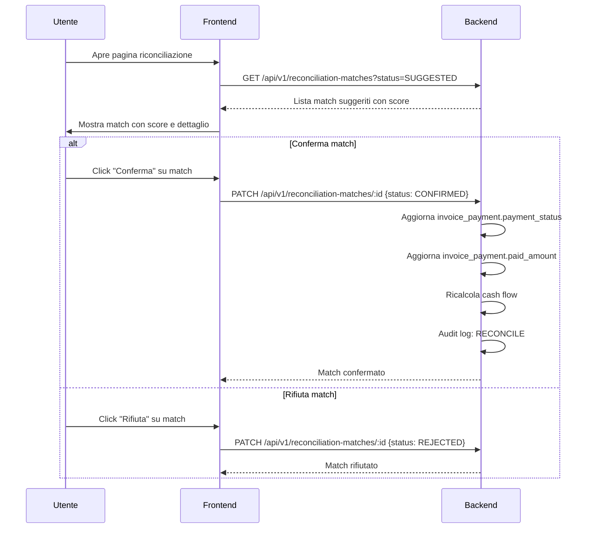
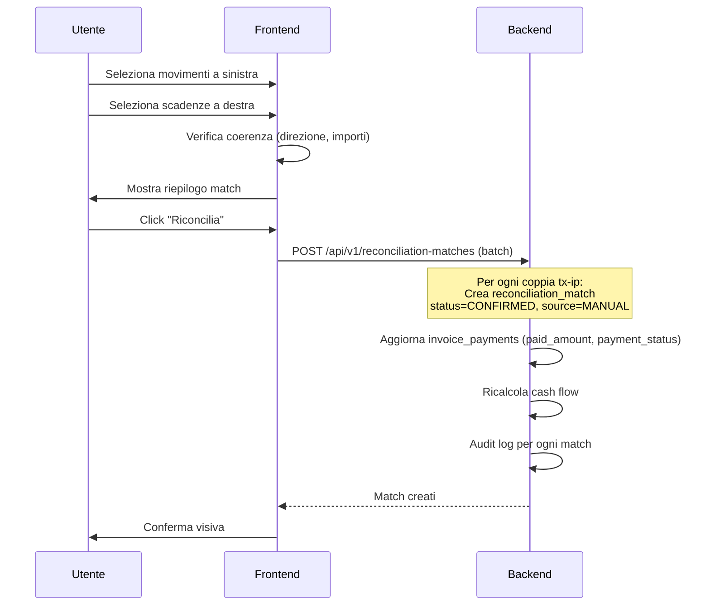

# PRD-05 — Riconciliazione Bancaria

**Versione:** 1.0
**Data:** 10 febbraio 2026
**Basato su:** RE Sibill (docs/04, docs/06, docs/13), DB Schema (.tmp/db-schema.md)
**Stato:** Draft

---

## 1. Panoramica

La riconciliazione bancaria e' il processo di **matching tra movimenti bancari (transactions) e documenti contabili (invoices tramite invoice_payments)**. L'obiettivo e' verificare che ogni incasso o pagamento registrato sul conto corrisponda a un documento contabile, individuando discrepanze e garantendo la coerenza tra la contabilita' e i dati bancari.

### 1.1 Obiettivi

- Proporre match automatici con scoring di confidenza configurabile
- Supportare matching 1:1, 1:N, N:1 e N:M
- Permettere la riconciliazione manuale con interfaccia a due colonne
- Gestire regole di riconciliazione personalizzabili
- Fornire metriche sul tasso di riconciliazione automatica e aging partite aperte
- Eseguire riconciliazione automatica schedulata (batch)

### 1.2 Tabelle DB coinvolte

| Tabella | Ruolo |
|---------|-------|
| `transactions` | Movimenti bancari (lato sinistro della riconciliazione) |
| `invoice_payments` | Scadenze di pagamento delle fatture (lato destro) |
| `invoices` | Fatture/documenti collegati alle scadenze |
| `reconciliation_matches` | Record di match tra transaction e invoice_payment |
| `reconciliation_rules` | Regole di riconciliazione personalizzabili |
| `counterparts` | Controparti per matching su nome/IBAN |
| `audit_log` | Log operazioni di riconciliazione |
| `notifications` | Notifiche per match suggeriti |

### 1.3 Entita' principali

```
transactions (Movimenti bancari)
    |
    |--- reconciliation_matches (N:M) ---|
    |                                     |
    |   matched_amount                    |
    |   confidence_score                  |
    |   status: SUGGESTED/CONFIRMED/REJECTED
    |   source: AUTOMATIC/MANUAL          |
    |                                     |
                                    invoice_payments (Scadenze)
                                        |
                                        |--- invoices (Fatture)
                                        |--- counterparts (Controparti)
```

---

## 2. Algoritmo di Matching Automatico

### 2.1 Panoramica algoritmo

L'algoritmo opera in 5 step sequenziali. Ogni step calcola uno score parziale. Lo score finale composito determina se il match viene accettato automaticamente (CONFIRMED), proposto per revisione (SUGGESTED), o scartato.

Confidenza: 🟡 Media (la logica di matching e' server-side in Sibill, non direttamente osservabile; questo algoritmo e' ricostruito dalle best practice del settore e dai pattern osservati nelle API).

### 2.2 Strutture dati

```pseudocode
// Input dell'algoritmo
STRUCT MatchCandidate:
    transaction: Transaction          // Movimento bancario
    invoice_payment: InvoicePayment   // Scadenza fattura
    scores: {
        amount_score: DECIMAL(5,2)    // 0-100
        date_score: DECIMAL(5,2)      // 0-100
        counterpart_score: DECIMAL(5,2) // 0-100
    }
    composite_score: DECIMAL(5,2)     // Score finale 0-100

// Parametri configurabili (da reconciliation_rules)
STRUCT MatchConfig:
    amount_tolerance: DECIMAL(15,2)   // DEFAULT 0.01 EUR
    date_tolerance_days: INTEGER      // DEFAULT 3 giorni
    match_amount: BOOLEAN             // DEFAULT TRUE
    match_date: BOOLEAN               // DEFAULT TRUE
    match_counterpart: BOOLEAN        // DEFAULT TRUE
    match_description: BOOLEAN        // DEFAULT FALSE
    auto_confirm_threshold: DECIMAL   // DEFAULT 80.0
    suggestion_threshold: DECIMAL     // DEFAULT 40.0
    // Pesi per score composito
    weight_amount: DECIMAL            // DEFAULT 0.50
    weight_date: DECIMAL              // DEFAULT 0.25
    weight_counterpart: DECIMAL       // DEFAULT 0.25
```

### 2.3 Step 1 — Match per importo

```pseudocode
function calcolaScoreImporto(transaction, invoice_payment, config):
    // L'importo della transazione deve avere stessa direzione del flow
    // INFLOW (entrate) -> scadenze con direction=INFLOW (da incassare)
    // OUTFLOW (uscite) -> scadenze con direction=OUTFLOW (da pagare)
    IF transaction.direction != invoice_payment.direction:
        RETURN 0  // Direzione incompatibile, nessun match possibile

    tx_amount = ABS(transaction.amount)
    ip_amount = invoice_payment.amount
    // Considera l'importo gia' pagato (per pagamenti parziali)
    remaining_amount = ip_amount - invoice_payment.paid_amount

    // 1. Match esatto
    IF ABS(tx_amount - remaining_amount) <= config.amount_tolerance:
        RETURN 100.0

    // 2. Match parziale (transazione copre parte della scadenza)
    IF tx_amount < remaining_amount AND tx_amount > 0:
        ratio = tx_amount / remaining_amount
        IF ratio >= 0.90:
            RETURN 85.0    // Copre almeno il 90%
        ELIF ratio >= 0.50:
            RETURN 60.0    // Copre almeno il 50%
        ELSE:
            RETURN 30.0    // Copre meno del 50%

    // 3. Match con eccedenza (transazione supera la scadenza)
    IF tx_amount > remaining_amount:
        ratio = remaining_amount / tx_amount
        IF ratio >= 0.90:
            RETURN 80.0    // Scadenza copre almeno il 90% della transazione
        ELIF ratio >= 0.50:
            RETURN 50.0
        ELSE:
            RETURN 20.0

    RETURN 0
```

### 2.4 Step 2 — Match per data

```pseudocode
function calcolaScoreData(transaction, invoice_payment, config):
    tx_date = transaction.transaction_date
    ip_date = invoice_payment.due_date

    diff_days = ABS(DATEDIFF(tx_date, ip_date))

    // Scoring per prossimita' temporale
    IF diff_days == 0:
        RETURN 100.0           // Stesso giorno
    ELIF diff_days <= 1:
        RETURN 90.0            // +/- 1 giorno
    ELIF diff_days <= config.date_tolerance_days:
        // Decadimento lineare entro la tolleranza
        RETURN 80.0 - (diff_days - 1) * (40.0 / config.date_tolerance_days)
    ELIF diff_days <= config.date_tolerance_days * 2:
        // Oltre la tolleranza ma entro il doppio
        RETURN 30.0 - (diff_days - config.date_tolerance_days) * (30.0 / config.date_tolerance_days)
    ELSE:
        RETURN 0               // Troppo lontano

    // Bonus: se il pagamento arriva DOPO la scadenza (tipico)
    IF tx_date > ip_date AND diff_days <= config.date_tolerance_days:
        score += 5.0  // Piccolo bonus, i pagamenti spesso arrivano dopo la scadenza
        RETURN MIN(score, 100.0)
```

### 2.5 Step 3 — Match per controparte

```pseudocode
function calcolaScoreControparte(transaction, invoice_payment, config):
    // Recupera la controparte della fattura
    invoice = GET invoices WHERE id = invoice_payment.invoice_id
    invoice_counterpart = GET counterparts WHERE id = invoice.counterpart_id

    IF invoice_counterpart IS NULL:
        RETURN 0  // Nessuna controparte sulla fattura

    score = 0

    // 1. Match per IBAN (match forte)
    IF transaction.counterpart_iban IS NOT NULL
       AND invoice_counterpart.bank_identifier IS NOT NULL:
        IF NORMALIZE_IBAN(transaction.counterpart_iban) == NORMALIZE_IBAN(invoice_counterpart.bank_identifier):
            RETURN 100.0  // Match IBAN esatto

    // 2. Match per controparte gia' associata
    IF transaction.counterpart_id IS NOT NULL
       AND transaction.counterpart_id == invoice.counterpart_id:
        RETURN 95.0  // Stessa controparte nel sistema

    // 3. Match per P.IVA
    IF invoice_counterpart.vat_number IS NOT NULL:
        IF transaction.description CONTAINS invoice_counterpart.vat_number:
            score = MAX(score, 80.0)

    // 4. Match per nome (fuzzy)
    IF transaction.counterpart_name IS NOT NULL
       AND invoice_counterpart.company_name IS NOT NULL:
        similarity = TRIGRAM_SIMILARITY(
            LOWER(transaction.counterpart_name),
            LOWER(invoice_counterpart.company_name)
        )
        IF similarity >= 0.8:
            score = MAX(score, 90.0)
        ELIF similarity >= 0.5:
            score = MAX(score, 60.0)
        ELIF similarity >= 0.3:
            score = MAX(score, 30.0)

    // 5. Match per riferimento fattura nella causale
    IF transaction.remittance_info IS NOT NULL
       AND invoice.number IS NOT NULL:
        IF transaction.remittance_info CONTAINS invoice.number:
            score = MAX(score, 85.0)  // Numero fattura nella causale

    RETURN score
```

### 2.6 Step 4 — Scoring composito

```pseudocode
function calcolaScoreComposito(scores, config):
    // Score composito pesato
    composite = 0.0
    total_weight = 0.0

    IF config.match_amount:
        composite += scores.amount_score * config.weight_amount
        total_weight += config.weight_amount

    IF config.match_date:
        composite += scores.date_score * config.weight_date
        total_weight += config.weight_date

    IF config.match_counterpart:
        composite += scores.counterpart_score * config.weight_counterpart
        total_weight += config.weight_counterpart

    IF total_weight == 0:
        RETURN 0

    // Normalizza a 0-100
    composite = composite / total_weight

    // Penalita' se lo score importo e' 0 (importo non matcha per niente)
    IF config.match_amount AND scores.amount_score == 0:
        composite = composite * 0.3  // Penalita' del 70%

    // Bonus se tutti gli score sono alti (convergenza)
    IF scores.amount_score >= 80 AND scores.date_score >= 80 AND scores.counterpart_score >= 80:
        composite = MIN(composite * 1.1, 100.0)  // Bonus 10%

    RETURN ROUND(composite, 2)
```

### 2.7 Step 5 — Soglia accettazione

```pseudocode
function determinaAzione(composite_score, config):
    IF composite_score >= config.auto_confirm_threshold:
        // Score alto -> conferma automatica
        IF config.auto_confirm:
            RETURN 'CONFIRMED'   // Auto-conferma abilitata
        ELSE:
            RETURN 'SUGGESTED'   // Proposto per revisione manuale
    ELIF composite_score >= config.suggestion_threshold:
        // Score medio -> suggerito per revisione
        RETURN 'SUGGESTED'
    ELSE:
        // Score basso -> scartato
        RETURN NULL  // Non creare match
```

### 2.8 Algoritmo completo — Orchestrazione

```pseudocode
function eseguiRiconciliazioneAutomatica(company_id, config):
    // 1. Recupera movimenti non riconciliati
    unreconciled_transactions = SELECT t.*
        FROM transactions t
        LEFT JOIN reconciliation_matches rm
            ON rm.transaction_id = t.id AND rm.status != 'REJECTED'
        WHERE t.company_id = company_id
        AND t.status = 'BOOKED'
        AND t.hidden_at IS NULL
        AND rm.id IS NULL  // Nessun match attivo
        ORDER BY t.transaction_date DESC

    // 2. Recupera scadenze non pagate o parzialmente pagate
    unpaid_payments = SELECT ip.*
        FROM invoice_payments ip
        JOIN invoices i ON ip.invoice_id = i.id
        WHERE ip.company_id = company_id
        AND ip.payment_status IN ('UNPAID', 'PARTIALLY_PAID')
        ORDER BY ip.due_date

    // 3. Per ogni transazione, calcola score con tutte le scadenze compatibili
    all_candidates = []

    FOR EACH tx IN unreconciled_transactions:
        FOR EACH ip IN unpaid_payments:
            // Pre-filtro: stessa direzione
            IF tx.direction != ip.direction:
                CONTINUE

            // Calcola scores
            scores = {
                amount_score: calcolaScoreImporto(tx, ip, config),
                date_score: calcolaScoreData(tx, ip, config),
                counterpart_score: calcolaScoreControparte(tx, ip, config)
            }

            composite = calcolaScoreComposito(scores, config)

            IF composite >= config.suggestion_threshold:
                all_candidates.APPEND({
                    transaction: tx,
                    invoice_payment: ip,
                    scores: scores,
                    composite_score: composite
                })

    // 4. Risolvi conflitti (una transazione non puo' matchare con troppe scadenze)
    resolved = risolviConflitti(all_candidates)

    // 5. Crea i record di riconciliazione
    FOR EACH candidate IN resolved:
        action = determinaAzione(candidate.composite_score, config)
        IF action IS NOT NULL:
            INSERT INTO reconciliation_matches (
                company_id,
                transaction_id = candidate.transaction.id,
                invoice_payment_id = candidate.invoice_payment.id,
                matched_amount = calcolaImportoMatchato(candidate),
                status = action,
                source = 'AUTOMATIC',
                confidence_score = candidate.composite_score
            )

            // Se auto-confermato, aggiorna lo stato della scadenza
            IF action == 'CONFIRMED':
                aggiornaStatoScadenza(candidate.invoice_payment)

    RETURN resolved.count
```

### 2.9 Risoluzione conflitti

```pseudocode
function risolviConflitti(candidates):
    // Ordina per score decrescente
    candidates.SORT_BY(composite_score, DESC)

    used_transactions = SET()
    used_payments = SET()
    resolved = []

    FOR EACH candidate IN candidates:
        tx_id = candidate.transaction.id
        ip_id = candidate.invoice_payment.id

        // Per match 1:1 semplice: ogni transazione e ogni scadenza usata una volta
        IF tx_id NOT IN used_transactions AND ip_id NOT IN used_payments:
            resolved.APPEND(candidate)
            used_transactions.ADD(tx_id)
            used_payments.ADD(ip_id)

    // Per match 1:N: una transazione puo' matchare piu' scadenze
    // se la somma degli importi delle scadenze <= importo transazione
    remaining_tx = candidates.FILTER(c => c.transaction.id NOT IN used_transactions)
    FOR EACH tx_group IN remaining_tx.GROUP_BY(transaction.id):
        tx = tx_group[0].transaction
        tx_amount = ABS(tx.amount)
        allocated = 0.0

        FOR EACH candidate IN tx_group.SORT_BY(composite_score, DESC):
            ip = candidate.invoice_payment
            ip_remaining = ip.amount - ip.paid_amount

            IF ip.id IN used_payments:
                CONTINUE

            IF allocated + ip_remaining <= tx_amount + config.amount_tolerance:
                candidate.matched_amount = ip_remaining
                resolved.APPEND(candidate)
                used_payments.ADD(ip.id)
                allocated += ip_remaining

            IF allocated >= tx_amount:
                BREAK  // Transazione completamente allocata

        IF allocated > 0:
            used_transactions.ADD(tx.id)

    RETURN resolved
```

---

## 3. Tipi di Matching

### 3.1 Matching 1:1

Un movimento bancario corrisponde a una singola scadenza.

```
Transaction (EUR -1.000,00 uscita)  ←→  InvoicePayment (EUR 1.000,00 da pagare)
```

Il caso piu' comune. Il `matched_amount` corrisponde all'intero importo della scadenza.

### 3.2 Matching 1:N (un movimento -> piu' scadenze)

Un singolo movimento copre piu' scadenze (es. pagamento cumulativo).

```
Transaction (EUR -3.000,00 uscita)
    ├── InvoicePayment #1 (EUR 1.000,00)  matched_amount = 1.000,00
    ├── InvoicePayment #2 (EUR 1.200,00)  matched_amount = 1.200,00
    └── InvoicePayment #3 (EUR 800,00)    matched_amount = 800,00
                                           Totale = 3.000,00 ✓
```

Evidenza da Sibill: l'endpoint `/api/v1/transactions/reconciliations` restituisce `flow_ids: ["uuid-1", "uuid-2"]` — confermando il supporto 1:N. Confidenza: 🟢 Alta.

### 3.3 Matching N:1 (piu' movimenti -> una scadenza)

Piu' movimenti corrispondono a una singola scadenza (es. pagamento rateale non formalizzato).

```
Transaction #1 (EUR -500,00)  ──┐
Transaction #2 (EUR -300,00)  ──┤── InvoicePayment (EUR 1.000,00)
Transaction #3 (EUR -200,00)  ──┘   Totale matchato = 1.000,00 ✓
```

### 3.4 Matching N:M (piu' movimenti -> piu' scadenze)

Combinazione dei casi precedenti. Richiede un'interfaccia piu' complessa.

```
Transaction #1 (EUR -2.000,00)  ──┬── InvoicePayment #1 (EUR 1.500,00)
Transaction #2 (EUR -1.500,00)  ──┴── InvoicePayment #2 (EUR 2.000,00)
```

Vincoli:
- La somma dei `matched_amount` per ogni transazione <= `ABS(transaction.amount)`
- La somma dei `matched_amount` per ogni invoice_payment <= `invoice_payment.amount - paid_amount`

---

## 4. UI Riconciliazione

### 4.1 Layout a due colonne

```
┌──────────────────────────────────────────────────────────────────┐
│  MOVIMENTI BANCARI (sinistra)    │  DOCUMENTI/SCADENZE (destra) │
│                                  │                               │
│  ☐ 10/02 -1.000,00 Fatt.123    │  ☐ Fatt.123 scad.08/02 1.000 │
│  ☐ 09/02 +5.000,00 Incasso     │  ☐ Fatt.456 scad.07/02 5.000 │
│  ☐ 08/02 -250,00 Utenze        │  ☐ Fatt.789 scad.10/02 250   │
│  ☐ 07/02 -3.200,00 Fornitore   │  ☐ Fatt.012 scad.05/02 3.200 │
│                                  │                               │
│  [Filtri: data, importo, conto] │  [Filtri: data, importo, dir] │
│                                  │                               │
│  Totale selezionato: EUR 0,00   │  Totale selezionato: EUR 0,00 │
│                                  │                               │
│           [  RICONCILIA SELEZIONATI  ]                           │
└──────────────────────────────────────────────────────────────────┘
```

### 4.2 Match suggeriti

I match suggeriti dall'algoritmo automatico vengono evidenziati visivamente:

- **Linea di collegamento** tra il movimento e la scadenza suggerita
- **Badge score** (es. "95%") accanto al match suggerito
- **Azioni rapide**: Conferma (✓) / Rifiuta (✗) per ogni suggerimento
- **Colore**: verde per score > 80, giallo per score 40-80

### 4.3 Riconciliazione manuale

L'utente puo':
1. Selezionare uno o piu' movimenti a sinistra (checkbox)
2. Selezionare una o piu' scadenze a destra (checkbox)
3. Il sistema verifica la coerenza (stessa direzione, importi compatibili)
4. Click "Riconcilia" per creare il match manuale

### 4.4 Stati visuaIi dei movimenti

| Stato | Indicatore visivo | Descrizione |
|-------|------------------|-------------|
| Non riconciliato | Nessuna icona | Movimento senza match |
| Match suggerito | Badge giallo/verde con score | Algoritmo ha proposto un match |
| Riconciliato | Icona verde ✓ | Match confermato |
| Match rifiutato | Icona grigia ✗ | Match proposto e rifiutato dall'utente |

---

## 5. Regole di Riconciliazione Custom

### 5.1 Tabella `reconciliation_rules`

| Campo | Tipo | Default | Descrizione |
|-------|------|---------|-------------|
| `id` | UUID PK | auto | Identificativo |
| `company_id` | UUID FK | - | Azienda |
| `name` | VARCHAR(255) | - | Nome descrittivo |
| `match_amount` | BOOLEAN | TRUE | Abilita match su importo |
| `amount_tolerance` | NUMERIC(15,2) | 0.01 | Tolleranza importo in EUR |
| `match_date` | BOOLEAN | TRUE | Abilita match su data |
| `date_tolerance_days` | INTEGER | 3 | Tolleranza in giorni |
| `match_description` | BOOLEAN | FALSE | Abilita match su descrizione/causale |
| `match_counterpart` | BOOLEAN | TRUE | Abilita match su controparte |
| `priority` | INTEGER | 0 | Ordine di applicazione |
| `is_active` | BOOLEAN | TRUE | Regola attiva/disattiva |
| `auto_confirm` | BOOLEAN | FALSE | Auto-conferma se score sopra soglia |
| `min_confidence` | NUMERIC(5,2) | 80.0 | Soglia minima per auto-conferma |

### 5.2 Regole predefinite (create alla registrazione azienda)

| Nome | Amount | Date (gg) | Counterpart | Auto-confirm | Soglia |
|------|--------|-----------|-------------|-------------|--------|
| "Standard" | SI (0.01) | SI (3) | SI | NO | 80.0 |
| "Tollerante" | SI (1.00) | SI (7) | SI | NO | 60.0 |
| "Solo importo" | SI (0.01) | NO | NO | NO | 90.0 |

---

## 6. Partite Aperte

### 6.1 Definizione

Le partite aperte sono movimenti bancari e scadenze non ancora riconciliati.

**Partite aperte lato movimenti:**
```sql
SELECT t.* FROM transactions t
LEFT JOIN reconciliation_matches rm
    ON rm.transaction_id = t.id AND rm.status = 'CONFIRMED'
WHERE t.company_id = :company_id
AND t.status = 'BOOKED'
AND t.hidden_at IS NULL
AND rm.id IS NULL
```

**Partite aperte lato scadenze:**
```sql
SELECT ip.* FROM invoice_payments ip
WHERE ip.company_id = :company_id
AND ip.payment_status IN ('UNPAID', 'PARTIALLY_PAID')
```

### 6.2 Aging (invecchiamento)

Le partite aperte vengono classificate per eta':

| Fascia | Definizione | Indicatore |
|--------|-------------|-----------|
| Correnti | Scadenza entro 30 giorni | Verde |
| 30 giorni | 31-60 giorni dalla scadenza | Giallo |
| 60 giorni | 61-90 giorni dalla scadenza | Arancione |
| 90+ giorni | Oltre 90 giorni dalla scadenza | Rosso |

### 6.3 Filtri partite aperte

| Filtro | Tipo | Descrizione |
|--------|------|-------------|
| Direzione | INFLOW/OUTFLOW | Entrate da incassare / uscite da pagare |
| Aging | Fascia temporale | Correnti, 30gg, 60gg, 90+gg |
| Controparte | Select | Filtra per cliente/fornitore |
| Importo | Range | Importo minimo/massimo |
| Conto | Select | Filtra per conto bancario |

---

## 7. Riconciliazione Manuale — Flusso Utente

### 7.1 Flusso conferma match suggerito



### 7.2 Flusso creazione match manuale



### 7.3 Annullamento riconciliazione

```pseudocode
function annullaRiconciliazione(match_id, user_id):
    match = GET reconciliation_matches WHERE id = match_id

    // 1. Elimina il match
    DELETE FROM reconciliation_matches WHERE id = match_id

    // 2. Ricalcola paid_amount della scadenza
    ip = GET invoice_payments WHERE id = match.invoice_payment_id
    total_paid = SELECT SUM(matched_amount)
                 FROM reconciliation_matches
                 WHERE invoice_payment_id = ip.id
                 AND status = 'CONFIRMED'
    ip.paid_amount = COALESCE(total_paid, 0)

    // 3. Aggiorna payment_status della scadenza
    IF ip.paid_amount == 0:
        ip.payment_status = 'UNPAID'
    ELIF ip.paid_amount < ip.amount:
        ip.payment_status = 'PARTIALLY_PAID'
    ELIF ip.paid_amount >= ip.amount:
        ip.payment_status = 'PAID'

    // 4. Ricalcola payment_status della fattura
    invoice = GET invoices WHERE id = ip.invoice_id
    ricalcolaStatoPagamentoFattura(invoice.id)

    // 5. Ricalcola cash flow
    ricalcolaCashFlow(match.company_id, ...)

    // 6. Audit log
    INSERT INTO audit_log (
        action='UNRECONCILE', entity_type='reconciliation_matches',
        entity_id=match_id, user_id=user_id,
        old_values={status: match.status, ...}
    )
```

---

## 8. Side-Effects della Riconciliazione

### 8.1 Alla conferma di un match

```pseudocode
function onMatchConfirmed(match):
    // 1. Aggiorna paid_amount della scadenza
    ip = GET invoice_payments WHERE id = match.invoice_payment_id
    ip.paid_amount += match.matched_amount
    ip.paid_date = match.transaction.transaction_date

    // 2. Aggiorna payment_status della scadenza
    IF ip.paid_amount >= ip.amount:
        ip.payment_status = 'PAID'
    ELIF ip.paid_amount > 0:
        ip.payment_status = 'PARTIALLY_PAID'

    // 3. Aggiorna payment_status della fattura
    invoice = GET invoices WHERE id = ip.invoice_id
    all_payments = SELECT * FROM invoice_payments WHERE invoice_id = invoice.id
    IF ALL(p.payment_status == 'PAID' FOR p IN all_payments):
        invoice.payment_status = 'PAID'
    ELIF ANY(p.payment_status IN ('PAID', 'PARTIALLY_PAID') FOR p IN all_payments):
        invoice.payment_status = 'PARTIALLY_PAID'

    // 4. Ricalcola cash flow (outstanding e pastdue cambiano)
    ricalcolaCashFlow(match.company_id, ip.due_date)

    // 5. Notifica (opzionale)
    IF match.source == 'AUTOMATIC':
        // Nessuna notifica per auto-conferma
    ELSE:
        LOG "Riconciliazione manuale confermata"

    // 6. Audit log
    INSERT INTO audit_log (action='RECONCILE', ...)
```

### 8.2 Impatto sul cash flow

La riconciliazione modifica le previsioni di cassa:
- Una scadenza riconciliata (PAID) esce dal **outstanding** (scadenze future da incassare/pagare)
- Una scadenza scaduta e riconciliata esce dal **pastdue** (scadenze passate non incassate/pagate)
- Il ricalcolo di `cash_flow_entries` e `cash_flow_categories` e' necessario

---

## 9. Riconciliazione Automatica Schedulata

### 9.1 Job periodico

```pseudocode
// Eseguito come cron job
// Frequenza: ogni 6 ore (o dopo ogni sincronizzazione Open Banking)
function jobRiconciliazioneAutomatica():
    companies = SELECT DISTINCT company_id FROM transactions
                WHERE created_at > NOW() - INTERVAL '24 hours'

    FOR EACH company_id IN companies:
        // Recupera le regole di riconciliazione attive
        rules = SELECT * FROM reconciliation_rules
                WHERE company_id = company_id AND is_active = TRUE
                ORDER BY priority DESC

        // Usa la regola con priorita' piu' alta come config
        config = rules[0] OR DEFAULT_CONFIG

        // Esegui l'algoritmo
        matched_count = eseguiRiconciliazioneAutomatica(company_id, config)

        // Log
        IF matched_count > 0:
            LOG "Riconciliazione automatica: {matched_count} match per company {company_id}"

            // Notifica utente se ci sono match suggeriti
            suggested_count = SELECT COUNT(*) FROM reconciliation_matches
                              WHERE company_id = company_id
                              AND status = 'SUGGESTED'
                              AND created_at > NOW() - INTERVAL '6 hours'
            IF suggested_count > 0:
                INSERT INTO notifications (
                    company_id, user_id=admin_user_id,
                    type='RECONCILIATION_SUGGESTED',
                    title="Nuovi match di riconciliazione",
                    body="{suggested_count} match suggeriti da verificare"
                )
```

### 9.2 Trigger post-sincronizzazione

Dopo ogni sincronizzazione Open Banking completata:

```pseudocode
function onSyncCompleted(bank_connection_id):
    connection = GET bank_connections WHERE id = bank_connection_id
    // ... (sync movimenti e saldi) ...

    // Trigger riconciliazione automatica per i nuovi movimenti
    QUEUE jobRiconciliazioneAutomatica(connection.company_id)
```

---

## 10. Metriche

### 10.1 Metriche disponibili

| Metrica | Calcolo | Descrizione |
|---------|---------|-------------|
| **Tasso riconciliazione automatica** | `COUNT(source=AUTOMATIC, status=CONFIRMED) / COUNT(status=CONFIRMED) * 100` | % match confermati che erano automatici |
| **Tasso riconciliazione totale** | `COUNT(tx riconciliate) / COUNT(tx totali BOOKED) * 100` | % movimenti riconciliati sul totale |
| **Tempo medio riconciliazione** | `AVG(match.created_at - transaction.transaction_date)` | Giorni medi tra arrivo movimento e riconciliazione |
| **Partite aperte per aging** | Count per fascia temporale | Distribuzione per eta' delle partite aperte |
| **Score medio** | `AVG(confidence_score) WHERE source=AUTOMATIC` | Score medio dei match automatici |
| **Importo non riconciliato** | `SUM(ABS(amount)) WHERE non riconciliato` | Valore totale movimenti non riconciliati |

---

## 11. API Endpoints

| Metodo | Path | Descrizione | Parametri principali |
|--------|------|-------------|---------------------|
| `GET` | `/api/v1/reconciliation-matches` | Lista match | company_id, status, source, transaction_id, invoice_payment_id |
| `GET` | `/api/v1/reconciliation-matches/:id` | Dettaglio match | include=transaction,invoicePayment.invoice |
| `POST` | `/api/v1/reconciliation-matches` | Creazione match manuale | Body: transaction_id, invoice_payment_id, matched_amount |
| `POST` | `/api/v1/reconciliation-matches/batch` | Creazione match multipli | Body: matches[] |
| `PATCH` | `/api/v1/reconciliation-matches/:id` | Aggiorna stato (conferma/rifiuta) | Body: status (CONFIRMED/REJECTED) |
| `DELETE` | `/api/v1/reconciliation-matches/:id` | Annulla riconciliazione | - |
| `GET` | `/api/v1/reconciliation-matches/suggested` | Match suggeriti da verificare | company_id, limit |
| `POST` | `/api/v1/reconciliation-matches/run` | Esegui riconciliazione automatica on-demand | company_id |
| `GET` | `/api/v1/reconciliation-matches/metrics` | Metriche di riconciliazione | company_id, period |
| `GET` | `/api/v1/reconciliation-rules` | Lista regole | company_id |
| `POST` | `/api/v1/reconciliation-rules` | Crea regola | Body: name, match_amount, amount_tolerance, ... |
| `PATCH` | `/api/v1/reconciliation-rules/:id` | Modifica regola | Body: parziale |
| `DELETE` | `/api/v1/reconciliation-rules/:id` | Elimina regola | - |
| `GET` | `/api/v1/open-items` | Partite aperte | company_id, direction, aging, counterpart_id |
| `GET` | `/api/v1/open-items/summary` | Riepilogo partite aperte per aging | company_id |
| `GET` | `/api/v1/transactions/reconciliation-status` | Stato riconciliazione per lista TX | transaction_ids[] |

---

## 12. Functional Requirements

### FR-RIC-001: Match automatico per importo esatto

**Given** un movimento OUTFLOW di EUR 1.000,00 e una scadenza OUTFLOW di EUR 1.000,00 per la stessa controparte
**When** l'algoritmo di riconciliazione automatica viene eseguito
**Then** viene creato un `reconciliation_matches` con `status = SUGGESTED` (o CONFIRMED se auto_confirm=TRUE), `source = AUTOMATIC`, `confidence_score >= 90`, `matched_amount = 1000.00`

### FR-RIC-002: Match automatico 1:N

**Given** un movimento OUTFLOW di EUR 3.000,00 e tre scadenze OUTFLOW (EUR 1.000, EUR 1.200, EUR 800) per la stessa controparte
**When** l'algoritmo viene eseguito e la somma delle scadenze (3.000) corrisponde all'importo del movimento
**Then** vengono creati 3 record `reconciliation_matches`, uno per ogni scadenza, con `matched_amount` rispettivamente di 1.000, 1.200 e 800

### FR-RIC-003: Match con tolleranza importo

**Given** una regola di riconciliazione con `amount_tolerance = 1.00` EUR, un movimento di EUR 999,50 e una scadenza di EUR 1.000,00
**When** l'algoritmo viene eseguito
**Then** il match viene proposto con `amount_score >= 85` perche' la differenza (EUR 0,50) e' entro la tolleranza configurata

### FR-RIC-004: Match con tolleranza data

**Given** una regola con `date_tolerance_days = 3`, un movimento datato 12/02 e una scadenza con due_date 10/02
**When** l'algoritmo viene eseguito
**Then** il match viene proposto con `date_score >= 80` perche' la differenza (2 giorni) e' entro la tolleranza

### FR-RIC-005: Match per controparte IBAN

**Given** un movimento con `counterpart_iban = IT60X054281101000000123456` e una scadenza la cui fattura ha una controparte con `bank_identifier = IT60X054281101000000123456`
**When** l'algoritmo viene eseguito
**Then** il `counterpart_score = 100` (match IBAN esatto)

### FR-RIC-006: Conferma manuale match suggerito

**Given** un match con `status = SUGGESTED`
**When** l'utente clicca "Conferma"
**Then** lo status diventa `CONFIRMED`, la scadenza `invoice_payments.paid_amount` viene aggiornata, il `payment_status` della scadenza viene ricalcolato, il cash flow viene ricalcolato, viene creato un `audit_log` con action `RECONCILE`

### FR-RIC-007: Rifiuto match suggerito

**Given** un match con `status = SUGGESTED`
**When** l'utente clicca "Rifiuta"
**Then** lo status diventa `REJECTED`, la scadenza non viene modificata, il match rifiutato non viene riproposto dall'algoritmo (indice unico su transaction_id + invoice_payment_id esclude REJECTED)

### FR-RIC-008: Riconciliazione manuale

**Given** un utente nella pagina riconciliazione con un movimento non riconciliato a sinistra e una scadenza non pagata a destra
**When** seleziona entrambi e clicca "Riconcilia"
**Then** viene creato un `reconciliation_matches` con `status = CONFIRMED`, `source = MANUAL`, `matched_amount` calcolato, e tutti i side-effects (aggiornamento scadenza, cash flow, audit) vengono eseguiti

### FR-RIC-009: Annullamento riconciliazione

**Given** un match confermato tra un movimento e una scadenza
**When** l'utente annulla la riconciliazione
**Then** il match viene eliminato, la scadenza torna a `payment_status = UNPAID` (o PARTIALLY_PAID se ci sono altri match), `paid_amount` viene ricalcolato, il cash flow viene ricalcolato, viene creato un `audit_log` con action `UNRECONCILE`

### FR-RIC-010: Auto-conferma con soglia

**Given** una regola con `auto_confirm = TRUE` e `min_confidence = 80`
**When** l'algoritmo trova un match con `composite_score = 92`
**Then** il match viene creato direttamente con `status = CONFIRMED` (senza passare per SUGGESTED), e tutti i side-effects vengono eseguiti automaticamente

### FR-RIC-011: Riconciliazione schedulata post-sync

**Given** una sincronizzazione Open Banking completata con successo con 10 nuovi movimenti
**When** il job di sync termina
**Then** viene automaticamente eseguita la riconciliazione automatica sui nuovi movimenti, i match trovati vengono creati come SUGGESTED o CONFIRMED (in base alla config), e una notifica viene inviata se ci sono match SUGGESTED da verificare

### FR-RIC-012: Partite aperte con aging

**Given** un'azienda con scadenze non pagate di diverse eta'
**When** l'utente accede alla vista "Partite aperte"
**Then** le scadenze sono raggruppate per fascia di aging (correnti, 30gg, 60gg, 90+gg), con totali per fascia e indicazione visiva del livello di urgenza

### FR-RIC-013: Metriche di riconciliazione

**Given** un'azienda con attivita' di riconciliazione nel periodo selezionato
**When** l'utente accede alla dashboard metriche
**Then** vengono mostrati: tasso di riconciliazione automatica (%), tasso di riconciliazione totale (%), tempo medio di riconciliazione (giorni), importo totale non riconciliato, distribuzione partite aperte per aging

### FR-RIC-014: Regola di riconciliazione custom

**Given** un utente ADMIN
**When** crea una regola con `amount_tolerance = 5.00, date_tolerance_days = 7, match_counterpart = FALSE, auto_confirm = TRUE, min_confidence = 90`
**Then** la regola viene salvata in `reconciliation_rules`, i successivi match automatici usano questa configurazione, i match con score >= 90 vengono auto-confermati

### FR-RIC-015: Pagamento parziale via riconciliazione

**Given** una scadenza di EUR 1.000,00 non pagata e un movimento di EUR 600,00
**When** l'utente crea un match manuale
**Then** `matched_amount = 600.00`, la scadenza passa a `payment_status = PARTIALLY_PAID`, `paid_amount = 600.00`, il residuo (EUR 400,00) resta come partita aperta
