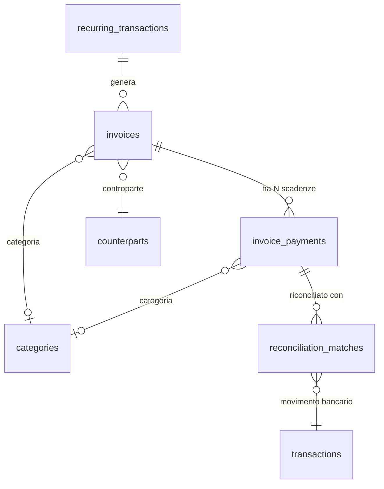
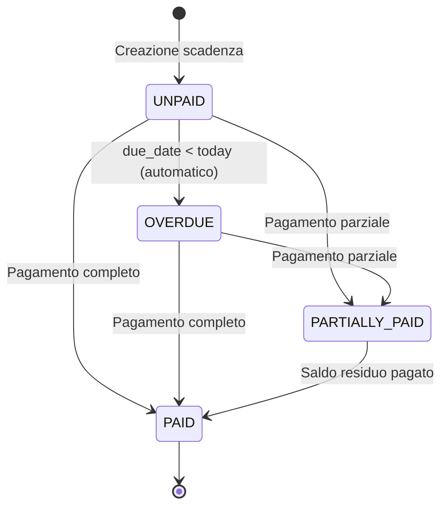

# PRD-06: Scadenzario e Fatture

**Versione:** 1.0
**Data:** 10 febbraio 2026
**Modulo:** Scadenzario e Fatture
**Basato su:** RE Sibill docs/07-scadenzario.md, docs/04-api-reference.md (sezioni 7, 8, 11), docs/13-regole-business.md
**Contratto DB:** `.tmp/db-schema.md`

---

## 1. Panoramica

Lo Scadenzario e' il modulo di gestione delle scadenze attive (incassi da ricevere) e passive (pagamenti da effettuare). Ogni scadenza e' legata a un documento/fattura tramite la relazione `invoices` -> `invoice_payments`.

In Sibill questo modulo corrisponde a `/outstanding` (scadenzario), `/outstanding/recurrences` (ricorrenze) e alla gestione fatture in `/invoices`.

---

## 2. Relazione Document -> Flow (invoices -> invoice_payments)

### 2.1 Modello Concettuale

In Sibill un "document" (fattura) ha N "flow" (scadenze/rate). Nel nostro DB:



### 2.2 Regole di Relazione

- Una fattura (`invoices`) puo' avere 1 o piu' scadenze (`invoice_payments`) — tipico: pagamento unico, 30/60/90 giorni, rate personalizzate
- Ogni scadenza ha: `amount`, `due_date`, `payment_status`, `direction`
- La somma degli `amount` delle scadenze dovrebbe corrispondere al `gross_amount` della fattura
- Lo stato pagamento della fattura (`invoices.payment_status`) e' un campo calcolato derivato dallo stato aggregato delle scadenze:

```
Se TUTTE le invoice_payments hanno payment_status = 'PAID':
    invoices.payment_status = 'PAID'
Se ALMENO UNA ha payment_status = 'PAID' o 'PARTIALLY_PAID' ma non tutte:
    invoices.payment_status = 'PARTIALLY_PAID'
Se NESSUNA ha payment_status diverso da 'UNPAID':
    invoices.payment_status = 'UNPAID'
Se ALMENO UNA ha due_date < CURRENT_DATE e payment_status != 'PAID':
    invoices.payment_status = 'OVERDUE'
```

Confidenza: 🟡 Media (docs/07 LB-SC-01, LB-SC-02 — stato derivato dedotto dal comportamento osservato)

### 2.3 Direzione delle Scadenze (LB-SC-06)

Confidenza: 🟢 Alta

```
Se invoices.direction = 'ISSUED':
    invoice_payments.direction = 'INFLOW'  (incasso da ricevere — scadenza attiva)

Se invoices.direction = 'RECEIVED':
    invoice_payments.direction = 'OUTFLOW' (pagamento da effettuare — scadenza passiva)
```

---

## 3. Tabella Scadenzario

### 3.1 Vista Principale (`/outstanding`)

La tabella scadenzario mostra tutti i `invoice_payments` + `scheduled_payments` (se presenti) con i seguenti dati:

| Colonna | Fonte DB | Descrizione |
|---|---|---|
| Controparte | `invoices.counterpart_name` o `counterparts.company_name` | Nome cliente/fornitore |
| Numero documento | `invoices.number` | Numero fattura |
| Importo scadenza | `invoice_payments.amount` | Importo della rata |
| Importo pagato | `invoice_payments.paid_amount` | Importo gia' pagato |
| Residuo | `amount - paid_amount` | Importo ancora da pagare/incassare |
| Data scadenza | `invoice_payments.due_date` | Data scadenza |
| Stato | `invoice_payments.payment_status` | UNPAID / PARTIALLY_PAID / PAID / OVERDUE |
| Direzione | `invoice_payments.direction` | INFLOW (incasso) / OUTFLOW (pagamento) |
| Categoria | `categories.name` / `subcategories.name` | Categorizzazione |
| Metodo pagamento | `invoice_payments.payment_method` | Bonifico, RiBa, SDD, etc. |

### 3.2 Filtri

| Filtro | Tipo | Campo DB | Default |
|---|---|---|---|
| Direzione | Tab toggle | `direction` | Tutti |
| Periodo | Date range | `due_date BETWEEN :start AND :end` | Prossimi 3 mesi |
| Stato | Multi-select | `payment_status IN (...)` | UNPAID, PARTIALLY_PAID, OVERDUE |
| Controparte | Autocomplete + select | `invoice_id -> counterpart_id` | Tutti |
| Importo | Range numerico | `amount BETWEEN :min AND :max` | Nessun filtro |
| Conto | Multi-select | `invoice_payments` JOIN `invoices` -> filtro custom | Tutti |
| Categoria | Select | `category_id` | Tutte |

### 3.3 Ordinamento

Default: `due_date ASC` (scadenze piu' imminenti prima).
Opzioni: per data, per importo, per controparte, per stato.

### 3.4 Raggruppamento

Opzione di raggruppare per:
- **Stato** — Sezioni: Scadute, In scadenza questa settimana, Questo mese, Prossimi mesi
- **Controparte** — Raggruppamento per cliente/fornitore
- **Periodo** — Raggruppamento per mese

---

## 4. Creazione Documento (Fattura)

### 4.1 Form Creazione

Basato sulla tabella `invoices` del DB:

| Campo | Tipo input | Campo DB | Obbligatorio | Validazione |
|---|---|---|---|---|
| Tipo documento | Select | `document_type` | Si | Enum: INVOICE, CREDIT_NOTE, DEBIT_NOTE, PARCEL, SELF_INVOICE, BILL, OTHER |
| Direzione | Toggle | `direction` | Si | ISSUED / RECEIVED |
| Numero | Text | `number` | Si | Max 50 char, unico per company+controparte+data |
| Data documento | Date picker | `creation_date` | Si | — |
| Controparte | Autocomplete | `counterpart_id` | No | Ricerca su `counterparts.company_name` |
| Importo netto | Currency input | `net_amount` | Si | NUMERIC(15,2), > 0 |
| IVA | Currency input | `vat_amount` | Si | NUMERIC(15,2), >= 0 |
| Importo lordo | Calcolato | `gross_amount` | Auto | `net_amount + vat_amount` |
| Categoria | Select | `category_id` | No | Da `categories` |
| Sottocategoria | Select | `subcategory_id` | No | Da `subcategories` (filtrate per category_id) |
| Note | Textarea | `notes` | No | — |
| Fattura elettronica | Checkbox | `is_e_invoice` | No | Default: false |
| Tipo FE | Select | `e_invoice_type` | No (si se `is_e_invoice`) | TD01, TD04, TD24, etc. |
| Ritenuta d'acconto % | Percentage input | `withholding_tax_rate` | No | 0-100 |
| Ritenuta importo | Calcolato | `withholding_tax_amount` | Auto | `gross_amount * withholding_tax_rate / 100` |
| Reverse charge | Checkbox | `subject_to_reverse_charge` | No | Default: false |

### 4.2 Logica di Calcolo Importi

```
gross_amount = net_amount + vat_amount
withholding_tax_amount = gross_amount * (withholding_tax_rate / 100)  [se presente]

is_inflow:
  Se direction = 'ISSUED' AND document_type IN ('INVOICE', 'PARCEL', 'DEBIT_NOTE', 'BILL'):
    is_inflow = TRUE
  Se direction = 'RECEIVED' AND document_type = 'CREDIT_NOTE':
    is_inflow = TRUE
  Altrimenti:
    is_inflow = FALSE
```

Confidenza: 🟢 Alta (docs/13 sezione 3.13, docs/04 sezione 7)

---

## 5. Creazione Scadenza (invoice_payment)

### 5.1 Form Aggiunta Rata

All'interno del form fattura, sezione "Scadenze":

| Campo | Tipo input | Campo DB | Obbligatorio | Validazione |
|---|---|---|---|---|
| Data scadenza | Date picker | `due_date` | Si | >= creation_date della fattura |
| Importo | Currency input | `amount` | Si | NUMERIC(15,2), > 0 |
| Metodo pagamento | Select | `payment_method` | No | Bonifico, RiBa, SDD, F24, Contanti, Altro |
| Note | Text | `notes` | No | — |

### 5.2 Validazione Rate

```
Regola: SUM(invoice_payments.amount) per la fattura <= invoices.gross_amount

Se SUM(rate) < gross_amount:
  Warning: "L'importo delle rate ({sum}) e' inferiore all'importo fattura ({gross})"

Se SUM(rate) > gross_amount:
  Errore bloccante: "L'importo delle rate non puo' superare l'importo della fattura"
```

### 5.3 Presets Rate

- **Pagamento unico**: 1 rata con importo = gross_amount, data = creation_date + default_payment_days della controparte (o 30gg)
- **30/60/90**: 3 rate uguali (gross_amount / 3) a 30, 60, 90 giorni
- **Custom**: aggiunta manuale

---

## 6. Stati del Flow (invoice_payment)

### 6.1 Macchina a Stati



### 6.2 Transizioni

| Transizione | Trigger | Effetto su invoice_payments | Effetto su invoices |
|---|---|---|---|
| UNPAID -> PAID | Riconciliazione confermata o pagamento manuale | `payment_status = 'PAID'`, `paid_amount = amount`, `paid_date = data_pagamento` | Ricalcolo `payment_status` |
| UNPAID -> PARTIALLY_PAID | Riconciliazione parziale | `payment_status = 'PARTIALLY_PAID'`, `paid_amount += importo_match` | Ricalcolo `payment_status` |
| UNPAID -> OVERDUE | Job schedulato (daily) | `payment_status = 'OVERDUE'` se `due_date < CURRENT_DATE` | Ricalcolo `payment_status` |
| OVERDUE -> PAID | Pagamento completo | Come UNPAID -> PAID | Ricalcolo `payment_status` |
| PARTIALLY_PAID -> PAID | Saldo residuo pagato | `paid_amount = amount` | Ricalcolo `payment_status` |

Confidenza: 🟡 Media (docs/07 LB-SC-02 — stati ToPay confermato, altri dedotti)

---

## 7. Ricorrenze

### 7.1 Modello Dati

Tabella `recurring_transactions`:

| Campo | Tipo | Descrizione |
|---|---|---|
| `description` | TEXT | Descrizione della ricorrenza (es. "Affitto ufficio") |
| `amount` | NUMERIC(15,2) | Importo fisso della ricorrenza |
| `direction` | flow_direction | INFLOW / OUTFLOW |
| `frequency` | recurrence_frequency | DAILY, WEEKLY, BIWEEKLY, MONTHLY, QUARTERLY, SEMIANNUAL, ANNUAL |
| `start_date` | DATE | Data inizio ricorrenza |
| `end_date` | DATE | Data fine (NULL = infinita) |
| `next_occurrence` | DATE | Prossima data prevista |
| `bank_account_id` | UUID | Conto associato |
| `counterpart_id` | UUID | Controparte |
| `category_id` | UUID | Categoria |
| `subcategory_id` | UUID | Sottocategoria |
| `status` | recurrence_status | ACTIVE, PAUSED, COMPLETED, CANCELLED |

### 7.2 Generazione Automatica Prossima Occorrenza

```
Quando una ricorrenza raggiunge next_occurrence:
  1. Genera un nuovo invoice_payment (o document con invoice_payment) con:
     - amount = recurring_transactions.amount
     - due_date = recurring_transactions.next_occurrence
     - direction = recurring_transactions.direction
     - category_id = recurring_transactions.category_id
     - La fattura generata ha is_from_recurrence = TRUE

  2. Calcola next_occurrence successiva:
     DAILY:      next_occurrence + 1 giorno
     WEEKLY:     next_occurrence + 7 giorni
     BIWEEKLY:   next_occurrence + 14 giorni
     MONTHLY:    next_occurrence + 1 mese (ultimo giorno del mese se overflow)
     QUARTERLY:  next_occurrence + 3 mesi
     SEMIANNUAL: next_occurrence + 6 mesi
     ANNUAL:     next_occurrence + 1 anno

  3. Se end_date != NULL AND next_occurrence > end_date:
     status = 'COMPLETED'

  4. Incrementa occurrences_generated += 1
```

Confidenza: 🟢 Alta (docs/07 LB-SC-04, LB-SC-05, docs/04 sezione 11)

### 7.3 Form Creazione Ricorrenza

| Campo | Tipo input | Obbligatorio |
|---|---|---|
| Descrizione | Text | Si |
| Importo | Currency input | Si |
| Direzione | Toggle INFLOW/OUTFLOW | Si |
| Frequenza | Select | Si |
| Data inizio | Date picker | Si |
| Data fine | Date picker | No |
| Conto bancario | Select | No |
| Controparte | Autocomplete | No |
| Categoria | Select | No |
| Sottocategoria | Select | No |
| Note | Textarea | No |

### 7.4 Tab Ricorrenze

Come in Sibill (docs/07), le ricorrenze sono divise in due sotto-tab:
- **Pagamenti ricorrenti** (`direction = 'OUTFLOW'`) — affitti, utenze, stipendi
- **Incassi ricorrenti** (`direction = 'INFLOW'`) — canoni, servizi periodici

---

## 8. Integrazione con Cash Flow

### 8.1 Scadenze -> Previsionale (LB-SC-03)

Confidenza: 🟢 Alta

Le scadenze aperte alimentano il cash flow previsionale:

```
Per ogni mese futuro nel cash flow:
  outstanding_inflow = SUM(invoice_payments.amount)
    WHERE direction = 'INFLOW'
    AND payment_status IN ('UNPAID', 'PARTIALLY_PAID')
    AND due_date BETWEEN primo_giorno_mese AND ultimo_giorno_mese

  outstanding_outflow = SUM(invoice_payments.amount)
    WHERE direction = 'OUTFLOW'
    AND payment_status IN ('UNPAID', 'PARTIALLY_PAID')
    AND due_date BETWEEN primo_giorno_mese AND ultimo_giorno_mese

Per gli scaduti:
  pastdue_inflow = SUM(invoice_payments.amount - invoice_payments.paid_amount)
    WHERE direction = 'INFLOW'
    AND payment_status IN ('UNPAID', 'PARTIALLY_PAID', 'OVERDUE')
    AND due_date < primo_giorno_mese

  pastdue_outflow = SUM(invoice_payments.amount - invoice_payments.paid_amount)
    WHERE direction = 'OUTFLOW'
    AND payment_status IN ('UNPAID', 'PARTIALLY_PAID', 'OVERDUE')
    AND due_date < primo_giorno_mese
```

Questi valori corrispondono ai campi `outstanding_inflow`, `outstanding_outflow`, `pastdue_inflow`, `pastdue_outflow` nella tabella `cash_flow_entries`.

### 8.2 Ricorrenze -> Previsionale

Le ricorrenze attive con `next_occurrence` nel futuro generano previsioni:

```
Per ogni ricorrenza con status = 'ACTIVE':
  Per ogni occorrenza futura fino a fine periodo cash flow:
    Aggiungi importo al mese corrispondente come outstanding
```

---

## 9. Integrazione con Pagamenti

### 9.1 Da Scadenza a Disposizione di Pagamento

Da una scadenza passiva (`direction = 'OUTFLOW'`) l'utente puo' creare una disposizione di pagamento:

```
Azione: "Paga" su una invoice_payment con direction = 'OUTFLOW'

Effetto:
  1. Crea un payment_order con:
     - company_id = invoice_payments.company_id
     - bank_account_id = selezionato dall'utente
     - counterpart_id = invoices.counterpart_id
     - amount = invoice_payments.amount - invoice_payments.paid_amount (residuo)
     - beneficiary_name = counterparts.company_name
     - beneficiary_iban = counterparts.bank_identifier
     - reference = "Fattura {invoices.number} del {invoices.creation_date}"
     - status = 'DRAFT'
     - execution_date = selezionata dall'utente (default: invoice_payments.due_date)

  2. L'utente puo' modificare i campi prima di confermare

  3. Dopo l'esecuzione del pagamento (status = 'SUCCEEDED'):
     - Se il pagamento genera una transazione:
       La riconciliazione automatica collega transazione <-> invoice_payment
```

---

## 10. Integrazione con Riconciliazione

### 10.1 Effetto Riconciliazione sullo Stato

Quando un `reconciliation_match` viene confermato tra una `transaction` e un `invoice_payment`:

```
matched_amount = reconciliation_matches.matched_amount

invoice_payments.paid_amount += matched_amount

Se invoice_payments.paid_amount >= invoice_payments.amount:
    invoice_payments.payment_status = 'PAID'
    invoice_payments.paid_date = transactions.transaction_date
Altrimenti:
    invoice_payments.payment_status = 'PARTIALLY_PAID'

Poi ricalcola invoices.payment_status (vedi sezione 2.2)
```

### 10.2 Annullamento Riconciliazione

```
Se reconciliation_match.status viene cambiato a 'REJECTED':
    invoice_payments.paid_amount -= reconciliation_matches.matched_amount

    Se invoice_payments.paid_amount <= 0:
        invoice_payments.payment_status = 'UNPAID' (o 'OVERDUE' se due_date < today)
        invoice_payments.paid_date = NULL
    Altrimenti:
        invoice_payments.payment_status = 'PARTIALLY_PAID'
```

---

## 11. Import Fatture

### 11.1 Import da CSV

| Campo CSV | Mapping DB | Obbligatorio |
|---|---|---|
| `tipo` | `document_type` | Si |
| `direzione` | `direction` | Si |
| `numero` | `number` | Si |
| `data` | `creation_date` | Si |
| `controparte` | `counterpart_name` + lookup `counterpart_id` | Si |
| `p_iva_controparte` | `counterpart_identifier` + lookup | No |
| `importo_netto` | `net_amount` | Si |
| `iva` | `vat_amount` | No (default: 0) |
| `importo_lordo` | `gross_amount` | Si |
| `data_scadenza` | `invoice_payments.due_date` | No |
| `importo_scadenza` | `invoice_payments.amount` | No |
| `categoria` | lookup `category_id` | No |

Processo:
1. Upload file CSV
2. Parsing e validazione
3. Preview con errori evidenziati
4. Conferma import
5. Creazione `import_batch` con tracciabilita'
6. Creazione `invoices` + `invoice_payments`

### 11.2 [MIGLIORAMENTO] Import da XML FatturaPA/SDI

Sibill supporta l'import via SDI (Cassetto Fiscale). Nel nostro gestionale aggiungiamo il supporto per l'import diretto di file XML FatturaPA:

- Parsing del formato XML FatturaPA (namespace `urn:www.agenziaentrate.gov.it:specificheTecniche:sdi:fatturapa:v1.2.2`)
- Estrazione automatica: tipo documento, numero, data, controparte (P.IVA, ragione sociale), importi, scadenze
- Gestione allegati PDF embedded
- Formato `import_batches.format = 'FATTURAPA_XML'`

---

## 12. API Endpoints

### 12.1 GET /api/v1/invoice-payments

**Descrizione:** Lista scadenze (vista scadenzario).

| Parametro | Tipo | Obbligatorio | Descrizione |
|---|---|---|---|
| `company_id` | UUID | Si | ID azienda |
| `direction` | enum | No | INFLOW / OUTFLOW |
| `payment_status` | enum[] | No | Filtro stato |
| `due_date_from` | date | No | Da data scadenza |
| `due_date_to` | date | No | A data scadenza |
| `counterpart_id` | UUID | No | Filtro controparte |
| `category_id` | UUID | No | Filtro categoria |
| `amount_min` | decimal | No | Importo minimo |
| `amount_max` | decimal | No | Importo massimo |
| `sort` | string | No | Default: `due_date` ASC |
| `page_size` | integer | No | Default: 50 |
| `page_cursor` | string | No | Cursore paginazione |
| `include` | string | No | `invoice,invoice.counterpart,category,subcategory` |

**Response (200):**

```json
{
  "data": [
    {
      "id": "uuid",
      "invoice_id": "uuid",
      "due_date": "2026-02-28",
      "amount": { "amount": "1500.00", "currency": "EUR" },
      "paid_amount": { "amount": "0.00", "currency": "EUR" },
      "direction": "OUTFLOW",
      "payment_status": "UNPAID",
      "payment_method": "CREDIT_TRANSFER",
      "invoice": {
        "number": "FT-2026/001",
        "counterpart_name": "Fornitore SRL",
        "gross_amount": { "amount": "1500.00", "currency": "EUR" }
      },
      "category": { "name": "Gestione", "color": "#3b82f6" }
    }
  ],
  "meta": { "total": 45, "page": { "size": 50, "cursor": null } }
}
```

### 12.2 GET /api/v1/invoices

**Descrizione:** Lista fatture.

| Parametro | Tipo | Obbligatorio | Descrizione |
|---|---|---|---|
| `company_id` | UUID | Si | ID azienda |
| `direction` | enum | No | ISSUED / RECEIVED |
| `document_type` | enum[] | No | Filtro tipo |
| `status` | enum[] | No | Filtro stato documento |
| `payment_status` | enum[] | No | Filtro stato pagamento |
| `creation_date_from` | date | No | — |
| `creation_date_to` | date | No | — |
| `counterpart_id` | UUID | No | — |
| `include` | string | No | `invoice_payments,counterpart,category,subcategory` |
| `sort` | string | No | Default: `-creation_date,-created_at` |
| `page_size` | integer | No | Default: 50 |

### 12.3 POST /api/v1/invoices

**Descrizione:** Creazione fattura con scadenze.

**Request body:**

```json
{
  "document_type": "INVOICE",
  "direction": "RECEIVED",
  "number": "FT-2026/001",
  "creation_date": "2026-02-10",
  "counterpart_id": "uuid",
  "net_amount": 1000.00,
  "vat_amount": 220.00,
  "gross_amount": 1220.00,
  "category_id": "uuid",
  "subcategory_id": "uuid",
  "notes": "Fattura fornitore",
  "payments": [
    {
      "due_date": "2026-03-10",
      "amount": 610.00,
      "payment_method": "CREDIT_TRANSFER"
    },
    {
      "due_date": "2026-04-10",
      "amount": 610.00,
      "payment_method": "CREDIT_TRANSFER"
    }
  ]
}
```

### 12.4 GET /api/v1/recurring-transactions

**Descrizione:** Lista ricorrenze.

| Parametro | Tipo | Obbligatorio | Descrizione |
|---|---|---|---|
| `company_id` | UUID | Si | ID azienda |
| `direction` | enum | No | INFLOW / OUTFLOW |
| `status` | enum | No | ACTIVE, PAUSED, COMPLETED, CANCELLED |
| `include` | string | No | `bank_account,category,subcategory,counterpart` |
| `page_size` | integer | No | Default: 100 |

### 12.5 POST /api/v1/recurring-transactions

**Descrizione:** Creazione ricorrenza.

**Request body:**

```json
{
  "description": "Affitto ufficio",
  "amount": 1500.00,
  "direction": "OUTFLOW",
  "frequency": "MONTHLY",
  "start_date": "2026-03-01",
  "end_date": null,
  "bank_account_id": "uuid",
  "counterpart_id": "uuid",
  "category_id": "uuid",
  "subcategory_id": "uuid"
}
```

### 12.6 POST /api/v1/import/invoices

**Descrizione:** Import batch fatture (CSV o XML FatturaPA).

**Request:** multipart/form-data con file + parametri.

**Response (202 Accepted):**

```json
{
  "batch_id": "uuid",
  "status": "PROCESSING",
  "total_records": 50,
  "message": "Import avviato, i risultati saranno disponibili a breve"
}
```

---

## 13. Requisiti Funzionali

### FR-SCAD-001: Vista Scadenzario

**Priorita':** P0

**Given** un utente autenticato con fatture che hanno scadenze
**When** accede alla pagina scadenzario
**Then** visualizza una tabella con tutte le scadenze (`invoice_payments`) filtrabili per direzione, stato, periodo, controparte, importo. Default: scadenze future non pagate, ordinate per data crescente

---

### FR-SCAD-002: Filtro Direzione (Tab)

**Priorita':** P0

**Given** l'utente e' nella pagina scadenzario
**When** seleziona il tab "Incassi" o "Pagamenti" o "Tutti"
**Then** la tabella mostra solo le scadenze con `direction = 'INFLOW'` (incassi), `direction = 'OUTFLOW'` (pagamenti), o entrambe

---

### FR-SCAD-003: Creazione Fattura con Scadenze

**Priorita':** P0

**Given** un utente con ruolo OWNER, ADMIN o EDITOR
**When** compila il form di creazione fattura e aggiunge una o piu' scadenze
**Then** il sistema crea un record `invoices` e N record `invoice_payments` associati. La somma degli importi delle scadenze deve essere <= `gross_amount`. Lo stato iniziale delle scadenze e' `UNPAID`

---

### FR-SCAD-004: Validazione Rate

**Priorita':** P0

**Given** l'utente aggiunge rate a una fattura
**When** la somma delle rate supera l'importo lordo della fattura
**Then** il sistema mostra un errore bloccante e impedisce il salvataggio

**Given** la somma delle rate e' inferiore all'importo lordo
**When** l'utente salva
**Then** il sistema mostra un warning non bloccante

---

### FR-SCAD-005: Transizione di Stato Scadenza

**Priorita':** P0

**Given** una scadenza con stato UNPAID
**When** viene riconciliata con un movimento bancario (intero importo) o marcata come pagata manualmente
**Then** lo stato diventa PAID, `paid_amount` = `amount`, `paid_date` = data del pagamento, e `invoices.payment_status` viene ricalcolato

**Given** una scadenza con stato UNPAID e `due_date < CURRENT_DATE`
**When** il job di check giornaliero viene eseguito
**Then** lo stato diventa OVERDUE

---

### FR-SCAD-006: Creazione Ricorrenza

**Priorita':** P1

**Given** un utente con ruolo OWNER, ADMIN o EDITOR
**When** compila il form di creazione ricorrenza con descrizione, importo, frequenza e data inizio
**Then** il sistema crea un record `recurring_transactions` con `status = 'ACTIVE'` e `next_occurrence = start_date`

---

### FR-SCAD-007: Generazione Automatica da Ricorrenza

**Priorita':** P1

**Given** una ricorrenza attiva con `next_occurrence <= CURRENT_DATE`
**When** il job schedulato viene eseguito
**Then** il sistema genera una nuova fattura con `is_from_recurrence = TRUE` e una scadenza con l'importo e la data della ricorrenza, poi calcola la prossima `next_occurrence` in base alla frequenza

**Given** la ricorrenza ha `end_date` definita e la prossima occorrenza supera `end_date`
**When** l'occorrenza corrente viene generata
**Then** lo stato della ricorrenza diventa COMPLETED

---

### FR-SCAD-008: Integrazione Cash Flow

**Priorita':** P0

**Given** scadenze aperte (UNPAID, PARTIALLY_PAID) con date future
**When** il modulo cash flow calcola il previsionale per un mese
**Then** le scadenze aperte vengono incluse come `outstanding_inflow` (incassi) e `outstanding_outflow` (pagamenti) per il mese corrispondente alla `due_date`

---

### FR-SCAD-009: Creazione Pagamento da Scadenza

**Priorita':** P1

**Given** una scadenza passiva (OUTFLOW) con stato UNPAID o PARTIALLY_PAID
**When** l'utente clicca "Paga"
**Then** si apre il form di creazione disposizione di pagamento pre-compilato con: importo residuo, controparte, IBAN controparte, causale con numero fattura, data esecuzione = due_date

---

### FR-SCAD-010: Import Fatture da CSV

**Priorita':** P1

**Given** un utente con ruolo OWNER, ADMIN o EDITOR
**When** carica un file CSV con fatture nel formato previsto
**Then** il sistema valida il file, mostra una preview con eventuali errori, e dopo conferma importa le fatture e le scadenze, creando un `import_batch` per tracciabilita'

---

### FR-SCAD-011: [MIGLIORAMENTO] Import Fatture da XML FatturaPA

**Priorita':** P2

**Given** un utente con ruolo OWNER, ADMIN o EDITOR
**When** carica uno o piu' file XML nel formato FatturaPA
**Then** il sistema esegue il parsing del XML, estrae automaticamente tutti i dati (tipo, numero, data, controparte, importi, scadenze), mostra preview e importa dopo conferma

---

### FR-SCAD-012: Effetto Riconciliazione su Scadenza

**Priorita':** P0

**Given** un `reconciliation_match` confermato tra una transazione e una scadenza
**When** il match viene confermato
**Then** `invoice_payments.paid_amount` viene incrementato di `matched_amount`, lo stato viene ricalcolato (PAID se paid_amount >= amount, PARTIALLY_PAID altrimenti), e `invoices.payment_status` viene ricalcolato

---

## 14. Tabelle DB Coinvolte

| Tabella | Ruolo nel Modulo |
|---|---|
| `invoices` | Fatture e documenti fiscali |
| `invoice_payments` | Scadenze di pagamento (flow) |
| `counterparts` | Controparti (clienti e fornitori) |
| `categories` | Categorizzazione |
| `subcategories` | Sotto-categorizzazione |
| `recurring_transactions` | Ricorrenze |
| `bank_accounts` | Conto associato alle ricorrenze |
| `reconciliation_matches` | Match riconciliazione |
| `transactions` | Movimenti bancari (per riconciliazione) |
| `payment_orders` | Disposizioni di pagamento |
| `import_batches` | Tracciabilita' import |
| `cash_flow_entries` | Dati previsionali aggregati |
