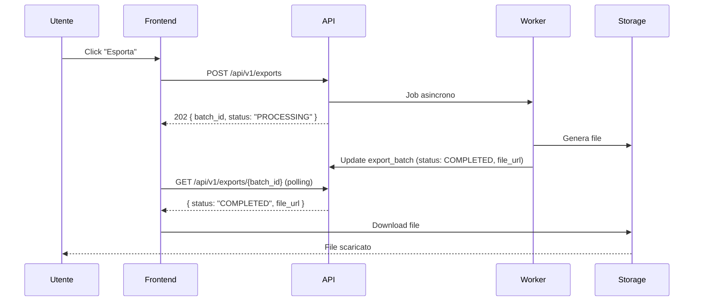

# PRD-09: Reportistica e Analytics

**Versione:** 1.0
**Data:** 10 febbraio 2026
**Modulo:** Reportistica e Analytics
**Basato su:** RE Sibill docs/11-reportistica.md (dashboard fatture, 6 formule LB-REP), docs/04-api-reference.md (sezioni 5-8), docs/13-regole-business.md
**Contratto DB:** `.tmp/db-schema.md`

---

## 1. Panoramica

Il modulo Reportistica aggrega dati da tutto il gestionale per offrire viste analitiche, report predefiniti ed export multi-formato. In Sibill la reportistica e' distribuita su due dashboard:

1. **Dashboard Cash Flow** (`/cashflow`) — descritta nel PRD-08
2. **Dashboard Fatture** (`/invoices/dashboard`) — riepilogo ricavi, costi, IVA, ranking clienti/fornitori

Nel nostro gestionale estendiamo questa base con report predefiniti aggiuntivi, export multi-formato e grafici interattivi.

---

## 2. Dashboard Fatture

### 2.1 Layout

Corrisponde a `/invoices/dashboard` in Sibill (docs/11 LB-REP-01, LB-REP-02).

```
+------------------------------------------------------------------+
| Header: "Situazione fatture" + Selettore anno                    |
+------------------------------------------------------------------+
| KPI Cards (4 card in fila)                                       |
| [Ricavi tot] [Costi tot] [Netto] [IVA netta]                    |
+------------------------------------------------------------------+
| Grafico Ricavi/Costi mensile (Recharts BarChart)                 |
+------------------------------------------------------------------+
| +---------------------------+ +--------------------------------+ |
| | Top 5 Clienti             | | Top 5 Fornitori                | |
| | (ranking per fatturato)   | | (ranking per costi)            | |
| +---------------------------+ +--------------------------------+ |
+------------------------------------------------------------------+
| Riepilogo IVA (Debito/Credito per periodo)                       |
+------------------------------------------------------------------+
```

### 2.2 KPI Fatture

#### KPI Ricavi Totali

| Proprieta' | Dettaglio |
|---|---|
| **Titolo** | "Ricavi" |
| **Calcolo** | SUM(`invoices.gross_amount`) WHERE `direction = 'ISSUED'` AND `document_type IN ('INVOICE', 'PARCEL', 'DEBIT_NOTE', 'BILL')` AND `status NOT IN ('DRAFT', 'DISCARDED')` AND `hidden_at IS NULL` - SUM(gross_amount) WHERE `direction = 'ISSUED'` AND `document_type = 'CREDIT_NOTE'` |
| **Periodo** | Anno selezionato (default: anno corrente) |
| **Tabella DB** | `invoices` |
| **Confidenza** | 🟢 Alta (docs/11 LB-REP-01) |

#### KPI Costi Totali

| Proprieta' | Dettaglio |
|---|---|
| **Titolo** | "Costi" |
| **Calcolo** | SUM(`invoices.gross_amount`) WHERE `direction = 'RECEIVED'` AND `document_type IN ('INVOICE', 'DEBIT_NOTE')` AND `status NOT IN ('DRAFT', 'DISCARDED')` AND `hidden_at IS NULL` |
| **Tabella DB** | `invoices` |

#### KPI Netto

| Proprieta' | Dettaglio |
|---|---|
| **Titolo** | "Netto" |
| **Calcolo** | Ricavi - Costi |
| **Colore** | Verde se positivo, rosso se negativo |

#### KPI IVA Netta

| Proprieta' | Dettaglio |
|---|---|
| **Titolo** | "IVA netta" |
| **Calcolo** | IVA a debito - IVA a credito |
| **IVA a debito** | SUM(`invoices.vat_amount`) WHERE `direction = 'ISSUED'` |
| **IVA a credito** | SUM(`invoices.vat_amount`) WHERE `direction = 'RECEIVED'` |

### 2.3 Formule Dashboard Fatture (LB-REP-01)

Confidenza: 🟢 Alta

```
Ricavi = SUM(gross_amount) WHERE direction='ISSUED'
         AND document_type IN ('INVOICE','PARCEL','DEBIT_NOTE','BILL','SELF_INVOICE')
         AND status NOT IN ('DRAFT','DISCARDED')
         AND hidden_at IS NULL
         AND creation_date BETWEEN :anno_start AND :anno_end
       - SUM(gross_amount) WHERE direction='ISSUED' AND document_type='CREDIT_NOTE'
         (stessi filtri)

Costi  = SUM(gross_amount) WHERE direction='RECEIVED'
         AND document_type IN ('INVOICE','DEBIT_NOTE')
         AND status NOT IN ('DRAFT','DISCARDED')
         AND hidden_at IS NULL
         AND creation_date BETWEEN :anno_start AND :anno_end

Netto  = Ricavi - Costi

IVA_debito  = SUM(vat_amount) WHERE direction='ISSUED' (stessi filtri sopra)
IVA_credito = SUM(vat_amount) WHERE direction='RECEIVED' (stessi filtri sopra)
IVA_netta   = IVA_debito - IVA_credito
```

### 2.4 Grafico Ricavi/Costi Mensile

| Proprieta' | Valore |
|---|---|
| **Tipo** | BarChart (Recharts) |
| **Barre** | Ricavi (verde) e Costi (rosso) per ogni mese dell'anno |
| **Asse X** | Mesi (Gen, Feb, ..., Dic) |
| **Asse Y** | Importi in EUR |
| **Tooltip** | Ricavi, Costi, Netto per il mese |
| **Periodo** | Anno selezionato |

Dati per mese:
```
Per ogni mese M dell'anno selezionato:
  ricavi_mese = Ricavi formula (filtrata per creation_date nel mese M)
  costi_mese  = Costi formula (filtrata per creation_date nel mese M)
```

### 2.5 Top Clienti e Fornitori (LB-REP-02)

Confidenza: 🟢 Alta

```
Per ogni controparte (cliente o fornitore):
  amount = SUM(invoices.gross_amount)
           WHERE counterpart_id = :cid
           AND creation_date BETWEEN :start AND :end
           AND status NOT IN ('DRAFT','DISCARDED')
           AND hidden_at IS NULL

  Per clienti: WHERE direction = 'ISSUED'
  Per fornitori: WHERE direction = 'RECEIVED'

  amount_percentage = (amount / totale_ricavi_o_costi) * 100
  number_of_documents = COUNT(invoices) con stessi filtri

Ordinamento: amount DESC
Limite: TOP 5 (o 10)
```

Visualizzazione:

| Posizione | Nome Controparte | P.IVA | Importo | % | N. Documenti |
|---|---|---|---|---|---|
| 1 | Fornitore Alpha SRL | 01234567890 | 25.000 EUR | 32% | 5 |
| 2 | Fornitore Beta SpA | 09876543210 | 18.000 EUR | 23% | 3 |

---

## 3. Metadata Pattern

### 3.1 Come Sibill Usa i Metadata

Sibill utilizza endpoint `/metadata` per fornire KPI rapidi senza scaricare tutti i record. Pattern osservato (docs/11 LB-REP-03, docs/04 sezione 4):

| Endpoint | Dato fornito |
|---|---|
| `/api/v1/transactions/metadata` | Totale transazioni, somma entrate/uscite, conteggio non categorizzate |
| `/api/v1/documents/metadata` | Conteggi per tipo documento |
| `/api/v1/counterparts/metadata` | Conteggio controparti |
| `/api/v1/payments/metadata` | Conteggio per stato pagamento |
| `/api/v1/accounts/metadata` | Saldi aggregati |

### 3.2 Pattern per il Nostro Gestionale

Replicare questo pattern con endpoint `/metadata` dedicati che restituiscono solo conteggi e aggregati, senza il payload completo delle entita'. Vantaggi:
- Performance: query COUNT/SUM veloci
- Bandwidth: risposte piccole (< 1KB)
- Cache: facili da cacheare (staleTime: 30s per metadata, 500ms per cashflow)

---

## 4. Report Predefiniti

### 4.1 Estratto Conto per Periodo e Conto

| Proprieta' | Dettaglio |
|---|---|
| **Nome** | Estratto conto |
| **Descrizione** | Lista movimenti per un conto in un periodo, con saldo progressivo |
| **Filtri** | Conto bancario (obbligatorio), data inizio, data fine |
| **Colonne** | Data, Data valuta, Descrizione, Tipo, Categoria, Importo, Saldo progressivo |
| **Ordinamento** | `transaction_date ASC` |
| **Tabella DB** | `transactions` JOIN `bank_accounts` JOIN `categories` |
| **Export** | Excel, CSV, [MIGLIORAMENTO] PDF |

**Query base:**

```sql
SELECT
  t.transaction_date,
  t.value_date,
  t.description,
  t.transaction_type,
  c.name as category_name,
  t.amount,
  SUM(t.amount) OVER (ORDER BY t.transaction_date, t.created_at) as running_balance
FROM transactions t
LEFT JOIN categories c ON t.category_id = c.id
WHERE t.bank_account_id = :account_id
  AND t.company_id = :company_id
  AND t.transaction_date BETWEEN :start AND :end
  AND t.status = 'BOOKED'
  AND t.hidden_at IS NULL
ORDER BY t.transaction_date ASC, t.created_at ASC
```

### 4.2 Aging Crediti/Debiti

| Proprieta' | Dettaglio |
|---|---|
| **Nome** | Aging crediti e debiti |
| **Descrizione** | Analisi scadenze per fascia temporale |
| **Filtri** | Direzione (INFLOW/OUTFLOW), controparte, data riferimento |
| **Fasce** | 0-30gg, 31-60gg, 61-90gg, >90gg |
| **Tabella DB** | `invoice_payments` JOIN `invoices` JOIN `counterparts` |

**Query:**

```sql
SELECT
  cp.company_name as controparte,
  COUNT(*) FILTER (WHERE ip.due_date >= :ref_date - 30) as fascia_0_30_count,
  SUM(ip.amount - ip.paid_amount) FILTER (WHERE ip.due_date >= :ref_date - 30) as fascia_0_30_amount,
  COUNT(*) FILTER (WHERE ip.due_date BETWEEN :ref_date - 60 AND :ref_date - 31) as fascia_31_60_count,
  SUM(ip.amount - ip.paid_amount) FILTER (WHERE ip.due_date BETWEEN :ref_date - 60 AND :ref_date - 31) as fascia_31_60_amount,
  COUNT(*) FILTER (WHERE ip.due_date BETWEEN :ref_date - 90 AND :ref_date - 61) as fascia_61_90_count,
  SUM(ip.amount - ip.paid_amount) FILTER (WHERE ip.due_date BETWEEN :ref_date - 90 AND :ref_date - 61) as fascia_61_90_amount,
  COUNT(*) FILTER (WHERE ip.due_date < :ref_date - 90) as fascia_over_90_count,
  SUM(ip.amount - ip.paid_amount) FILTER (WHERE ip.due_date < :ref_date - 90) as fascia_over_90_amount
FROM invoice_payments ip
JOIN invoices i ON ip.invoice_id = i.id
LEFT JOIN counterparts cp ON i.counterpart_id = cp.id
WHERE ip.company_id = :company_id
  AND ip.payment_status IN ('UNPAID', 'PARTIALLY_PAID', 'OVERDUE')
  AND ip.direction = :direction
GROUP BY cp.company_name
ORDER BY SUM(ip.amount - ip.paid_amount) DESC
```

### 4.3 Movimenti per Categoria

| Proprieta' | Dettaglio |
|---|---|
| **Nome** | Analisi per categoria |
| **Descrizione** | Distribuzione movimenti per categoria con pie chart |
| **Filtri** | Periodo, direzione, conti |
| **Visualizzazione** | Pie chart (Recharts PieChart) + tabella dettaglio |
| **Tabella DB** | `transactions` JOIN `categories` |

**Query:**

```sql
SELECT
  c.name as categoria,
  c.color,
  COUNT(*) as num_transazioni,
  SUM(ABS(t.amount)) as totale,
  (SUM(ABS(t.amount)) / SUM(SUM(ABS(t.amount))) OVER ()) * 100 as percentuale
FROM transactions t
LEFT JOIN categories c ON t.category_id = c.id
WHERE t.company_id = :company_id
  AND t.transaction_date BETWEEN :start AND :end
  AND t.direction = :direction
  AND t.status = 'BOOKED'
  AND t.hidden_at IS NULL
GROUP BY c.id, c.name, c.color
ORDER BY totale DESC
```

### 4.4 Cash Flow Consuntivo vs Previsionale vs Budget

| Proprieta' | Dettaglio |
|---|---|
| **Nome** | Cash flow comparativo |
| **Descrizione** | Confronto tra consuntivo, previsionale e budget per periodo |
| **Filtri** | Periodo, conti, categorie |
| **Visualizzazione** | Tabella + grafico a barre raggruppate |
| **Tabelle DB** | `cash_flow_entries`, `cash_flow_categories`, `budgets` |

Per ogni mese:
```
consuntivo   = cash_flow_entries.transactions_inflow - cash_flow_entries.transactions_outflow
previsionale = outstanding_inflow - outstanding_outflow + pastdue_inflow - pastdue_outflow
budget       = SUM(budgets.amount WHERE direction='INFLOW') - SUM(budgets.amount WHERE direction='OUTFLOW')

varianza_budget    = consuntivo - budget
varianza_pct       = (varianza_budget / ABS(budget)) * 100  [se budget != 0]
```

### 4.5 Top Controparti per Volume

| Proprieta' | Dettaglio |
|---|---|
| **Nome** | Top controparti |
| **Descrizione** | Ranking controparti per volume di transazioni |
| **Filtri** | Periodo, direzione |
| **Visualizzazione** | Tabella con barra percentuale |
| **Tabelle DB** | `transactions` JOIN `counterparts` |

**Query:**

```sql
SELECT
  cp.company_name,
  cp.vat_number,
  COUNT(*) as num_transazioni,
  SUM(ABS(t.amount)) as volume_totale,
  (SUM(ABS(t.amount)) / SUM(SUM(ABS(t.amount))) OVER ()) * 100 as percentuale
FROM transactions t
JOIN counterparts cp ON t.counterpart_id = cp.id
WHERE t.company_id = :company_id
  AND t.transaction_date BETWEEN :start AND :end
  AND t.direction = :direction
  AND t.status = 'BOOKED'
  AND t.hidden_at IS NULL
GROUP BY cp.id, cp.company_name, cp.vat_number
ORDER BY volume_totale DESC
LIMIT 20
```

---

## 5. Export Multi-Formato

### 5.1 Formati Supportati

| Formato | Sibill | Nostro Gestionale | Note |
|---|---|---|---|
| Excel (XLSX) | Si (cashflow export) | Si | Con formule e formattazione |
| CSV | Si (transazioni) | Si | Formato semplice |
| PDF | No | [MIGLIORAMENTO] Si | Layout professionale |

### 5.2 [MIGLIORAMENTO] Export PDF

Sibill supporta solo CSV/Excel. Aggiungiamo export PDF con:

- **Header**: logo azienda, nome azienda, titolo report, periodo
- **Tabella**: stile professionale con bordi, alternanza colori righe, totali in grassetto
- **Footer**: pagina X di Y, data generazione, "Generato da [Nome Gestionale]"
- **Layout**: A4 portrait per report semplici, A4 landscape per tabelle larghe (cashflow)
- Libreria suggerita: `@react-pdf/renderer` o generazione server-side con `puppeteer`/`weasyprint`

### 5.3 [MIGLIORAMENTO] Export Excel con Formule

- Le celle totale contengono formule SUM reali (non valori statici)
- Formattazione condizionale: rosso per negativi, verde per positivi
- Freeze pane sulla prima colonna e prima riga
- Auto-fit larghezza colonne

### 5.4 Processo Export



Record in `export_batches`:
- `format`: XLSX, CSV, PDF
- `entity_type`: "cashflow", "transactions", "invoices", "aging"
- `filters`: JSON con filtri applicati (per riproducibilita')
- `expires_at`: 24 ore dopo la generazione (pulizia automatica)

---

## 6. Grafici Interattivi

### 6.1 Libreria: Recharts

Tutti i grafici usano Recharts (come Sibill, docs/11). Funzionalita':

| Feature | Implementazione |
|---|---|
| **Tooltip** | `<Tooltip>` con formatter personalizzato per EUR |
| **Zoom temporale** | [MIGLIORAMENTO] `<Brush>` component per zoom su range temporale |
| **Drill-down** | Click su barra/segmento → apre dettaglio (aside panel o pagina dedicata) |
| **Responsive** | `<ResponsiveContainer>` per adattamento viewport |
| **Legenda** | `<Legend>` con toggle per mostrare/nascondere serie |

### 6.2 Tipi di Grafico per Report

| Report | Tipo Grafico | Serie |
|---|---|---|
| Cash flow trend | ComposedChart (Bar + Line) | Entrate, Uscite, Saldo |
| Ricavi/Costi mensile | BarChart | Ricavi, Costi |
| Movimenti per categoria | PieChart | Una fetta per categoria |
| Aging | BarChart orizzontale | Fasce temporali |
| Top controparti | BarChart orizzontale | Volume per controparte |
| Consuntivo vs Budget | BarChart raggruppato | Consuntivo, Budget, Varianza |

---

## 7. Filtri Report

### 7.1 Filtri Comuni

| Filtro | Tipo | Applicabile a | Default |
|---|---|---|---|
| Periodo | Date range o anno | Tutti | Anno corrente |
| Conto bancario | Multi-select | Estratto conto, Cash flow | Tutti i conti attivi |
| Categoria | Select/Multi-select | Movimenti per cat., Cash flow | Tutte |
| Controparte | Autocomplete | Aging, Top controparti | Tutte |
| Direzione | Toggle INFLOW/OUTFLOW | Aging, Top controparti | Entrambe |

### 7.2 Filtri Dashboard Fatture (LB-REP-06)

Confidenza: 🟢 Alta

```
Filtri default (come Sibill):
  filter[company_id]        = UUID azienda corrente
  filter[creation_date_gte] = primo giorno anno corrente (es. 2026-01-01)
  filter[creation_date_lte] = ultimo giorno anno corrente (es. 2026-12-31)
  filter[document_type_in]  = INVOICE, CREDIT_NOTE, DEBIT_NOTE, BILL, SELF_INVOICE, PARCEL
  filter[status_not_in]     = DRAFT, DISCARDED
  filter[hidden_at_empty]   = true

Il periodo default e' l'anno corrente. [MIGLIORAMENTO] Aggiungere selezione per trimestre e semestre.
```

---

## 8. [MIGLIORAMENTO] Report Schedulati (P3)

Sibill non offre report schedulati. Aggiungiamo (priorita' bassa):

### 8.1 Configurazione

| Campo | Tipo | Descrizione |
|---|---|---|
| Report | Select | Quale report generare |
| Formato | Select | XLSX, CSV, PDF |
| Frequenza | Select | Giornaliero, Settimanale, Mensile |
| Destinatari | Multi-select email | Chi riceve il report |
| Filtri | Dinamici | Filtri specifici del report |

### 8.2 Processo

```
Job schedulato (cron):
  1. Legge configurazioni attive da tabella `scheduled_reports`
  2. Per ogni configurazione:
     a. Genera il report (come export normale)
     b. Salva su object storage
     c. Invia email con allegato (se < 10MB) o link download
     d. Crea record in audit_log
```

Tabella DB aggiuntiva (se implementato):

```sql
CREATE TABLE scheduled_reports (
    id              UUID PRIMARY KEY DEFAULT gen_random_uuid(),
    company_id      UUID NOT NULL REFERENCES companies(id) ON DELETE CASCADE,
    created_by      UUID NOT NULL REFERENCES users(id) ON DELETE CASCADE,
    report_type     VARCHAR(50) NOT NULL,
    format          integration_format NOT NULL,
    frequency       recurrence_frequency NOT NULL,
    filters         JSONB DEFAULT '{}',
    recipients      JSONB NOT NULL DEFAULT '[]',  -- ["email1@example.com", ...]
    next_run_at     TIMESTAMPTZ NOT NULL,
    is_active       BOOLEAN NOT NULL DEFAULT TRUE,
    last_run_at     TIMESTAMPTZ,
    last_status     batch_status,
    created_at      TIMESTAMPTZ NOT NULL DEFAULT NOW(),
    updated_at      TIMESTAMPTZ NOT NULL DEFAULT NOW()
);
```

---

## 9. API Endpoints

### 9.1 GET /api/v1/reports/invoices-dashboard

**Descrizione:** Dati per la dashboard fatture. Corrisponde a Sibill `/api/v1/documents-dashboard/summary`.

| Parametro | Tipo | Obbligatorio | Descrizione |
|---|---|---|---|
| `company_id` | UUID | Si | ID azienda |
| `creation_date_from` | date | Si | Inizio periodo (YYYY-MM-DD) |
| `creation_date_to` | date | Si | Fine periodo (YYYY-MM-DD) |
| `document_types` | enum[] | No | Default: tutti tranne OTHER |
| `exclude_statuses` | enum[] | No | Default: DRAFT, DISCARDED |

**Response (200):**

```json
{
  "revenue_summary": {
    "data": [
      {
        "month": 1, "year": 2026,
        "revenues_amount": { "amount": "15000.00", "currency": "EUR" },
        "costs_amount": { "amount": "8000.00", "currency": "EUR" },
        "vat_debit_amount": { "amount": "3300.00", "currency": "EUR" },
        "vat_credit_amount": { "amount": "1760.00", "currency": "EUR" }
      }
    ],
    "totals": {
      "revenues_amount": { "amount": "180000.00", "currency": "EUR" },
      "costs_amount": { "amount": "96000.00", "currency": "EUR" },
      "net_amount": { "amount": "84000.00", "currency": "EUR" }
    }
  },
  "taxes_summary": {
    "totals": {
      "vat_debit": { "amount": "39600.00", "currency": "EUR" },
      "vat_credit": { "amount": "21120.00", "currency": "EUR" },
      "vat_net": { "amount": "18480.00", "currency": "EUR" }
    }
  },
  "customers": [
    {
      "counterpart_id": "uuid",
      "counterpart_name": "Cliente Alpha SRL",
      "counterpart_identifier": "01234567890",
      "amount": { "amount": "45000.00", "currency": "EUR" },
      "amount_percentage": 25.0,
      "number_of_documents": 12
    }
  ],
  "suppliers": []
}
```

### 9.2 GET /api/v1/reports/account-statement

**Descrizione:** Estratto conto per periodo e conto.

| Parametro | Tipo | Obbligatorio | Descrizione |
|---|---|---|---|
| `company_id` | UUID | Si | — |
| `bank_account_id` | UUID | Si | ID conto bancario |
| `date_from` | date | Si | — |
| `date_to` | date | Si | — |
| `page_size` | integer | No | Default: 100 |

**Response (200):**

```json
{
  "account": {
    "nickname": "Conto principale",
    "iban": "IT60X0542811101000000123456",
    "opening_balance": { "amount": "10000.00", "currency": "EUR" }
  },
  "data": [
    {
      "id": "uuid",
      "transaction_date": "2026-01-05",
      "value_date": "2026-01-05",
      "description": "Bonifico da Cliente SRL",
      "transaction_type": "CREDIT_TRANSFER",
      "category_name": "Incassi",
      "amount": { "amount": "1200.00", "currency": "EUR" },
      "running_balance": { "amount": "11200.00", "currency": "EUR" }
    }
  ],
  "closing_balance": { "amount": "12500.00", "currency": "EUR" },
  "meta": { "total": 150 }
}
```

### 9.3 GET /api/v1/reports/aging

**Descrizione:** Report aging crediti/debiti.

| Parametro | Tipo | Obbligatorio | Descrizione |
|---|---|---|---|
| `company_id` | UUID | Si | — |
| `direction` | enum | No | INFLOW / OUTFLOW (default: entrambe) |
| `reference_date` | date | No | Default: CURRENT_DATE |
| `counterpart_id` | UUID | No | Filtro controparte |

**Response (200):**

```json
{
  "reference_date": "2026-02-10",
  "data": [
    {
      "counterpart_name": "Fornitore SRL",
      "counterpart_id": "uuid",
      "direction": "OUTFLOW",
      "bands": {
        "0_30": { "count": 3, "amount": { "amount": "4500.00", "currency": "EUR" } },
        "31_60": { "count": 1, "amount": { "amount": "1200.00", "currency": "EUR" } },
        "61_90": { "count": 0, "amount": { "amount": "0.00", "currency": "EUR" } },
        "over_90": { "count": 1, "amount": { "amount": "800.00", "currency": "EUR" } }
      },
      "total": { "count": 5, "amount": { "amount": "6500.00", "currency": "EUR" } }
    }
  ],
  "totals": {
    "0_30": { "count": 10, "amount": { "amount": "15000.00", "currency": "EUR" } },
    "31_60": { "count": 5, "amount": { "amount": "8000.00", "currency": "EUR" } },
    "61_90": { "count": 2, "amount": { "amount": "3000.00", "currency": "EUR" } },
    "over_90": { "count": 1, "amount": { "amount": "800.00", "currency": "EUR" } }
  }
}
```

### 9.4 GET /api/v1/reports/category-breakdown

**Descrizione:** Movimenti per categoria.

| Parametro | Tipo | Obbligatorio | Descrizione |
|---|---|---|---|
| `company_id` | UUID | Si | — |
| `date_from` | date | Si | — |
| `date_to` | date | Si | — |
| `direction` | enum | No | INFLOW / OUTFLOW |
| `account_ids` | UUID[] | No | Filtro conti |

**Response (200):**

```json
{
  "data": [
    {
      "category_id": "uuid",
      "category_name": "Gestione",
      "color": "#3b82f6",
      "transaction_count": 25,
      "total_amount": { "amount": "15000.00", "currency": "EUR" },
      "percentage": 35.2,
      "subcategories": [
        {
          "subcategory_id": "uuid",
          "subcategory_name": "Affitto",
          "transaction_count": 12,
          "total_amount": { "amount": "9000.00", "currency": "EUR" },
          "percentage": 21.1
        }
      ]
    },
    {
      "category_id": null,
      "category_name": "Non categorizzato",
      "color": "#9ca3af",
      "transaction_count": 7,
      "total_amount": { "amount": "3200.00", "currency": "EUR" },
      "percentage": 7.5,
      "subcategories": []
    }
  ]
}
```

### 9.5 GET /api/v1/reports/top-counterparts

**Descrizione:** Top controparti per volume.

| Parametro | Tipo | Obbligatorio | Descrizione |
|---|---|---|---|
| `company_id` | UUID | Si | — |
| `date_from` | date | Si | — |
| `date_to` | date | Si | — |
| `direction` | enum | No | INFLOW / OUTFLOW |
| `limit` | integer | No | Default: 20 |

### 9.6 POST /api/v1/exports

**Descrizione:** Avvia generazione export.

**Request body:**

```json
{
  "company_id": "uuid",
  "entity_type": "cashflow",
  "format": "XLSX",
  "filters": {
    "date_from": "2025-09-01",
    "date_to": "2026-08-31",
    "account_ids": ["uuid1", "uuid2"]
  }
}
```

**Response (202):**

```json
{
  "id": "uuid",
  "status": "PROCESSING",
  "message": "Export in corso"
}
```

### 9.7 GET /api/v1/exports/{id}

**Descrizione:** Stato e download export.

**Response (200 - completato):**

```json
{
  "id": "uuid",
  "status": "COMPLETED",
  "format": "XLSX",
  "file_url": "https://storage.example.com/exports/...",
  "file_size": 45320,
  "total_records": 150,
  "expires_at": "2026-02-11T10:00:00Z"
}
```

### 9.8 Endpoint Metadata (Pattern)

Endpoint leggeri per KPI rapidi:

| Endpoint | Response |
|---|---|
| `GET /api/v1/transactions/metadata` | `{ total, totals: { positive, negative }, totalUncategorized }` |
| `GET /api/v1/invoices/metadata` | `{ total, by_type: { INVOICE: n, CREDIT_NOTE: n, ... } }` |
| `GET /api/v1/counterparts/metadata` | `{ total }` |
| `GET /api/v1/bank-accounts/metadata` | `{ total_current_balance, total_available_balance, accounts_count }` |

---

## 10. Requisiti Funzionali

### FR-REP-001: Dashboard Fatture — KPI

**Priorita':** P0

**Given** un utente autenticato con fatture nel sistema
**When** accede alla pagina reportistica fatture
**Then** visualizza 4 KPI: Ricavi totali, Costi totali, Netto (Ricavi - Costi), IVA netta (debito - credito), calcolati per l'anno selezionato (default: anno corrente), escludendo fatture in stato DRAFT e DISCARDED e fatture nascoste

---

### FR-REP-002: Dashboard Fatture — Grafico Mensile

**Priorita':** P0

**Given** un utente sulla dashboard fatture
**When** la pagina viene caricata
**Then** visualizza un grafico a barre con ricavi e costi per ogni mese dell'anno selezionato, con tooltip al hover che mostra i dettagli

---

### FR-REP-003: Top Clienti e Fornitori (LB-REP-02)

**Priorita':** P1

**Given** un utente sulla dashboard fatture con controparti
**When** la pagina viene caricata
**Then** visualizza le top 5 controparti per volume:
- Clienti: ordinati per importo fatture emesse decrescente, con percentuale sul totale ricavi e numero documenti
- Fornitori: ordinati per importo fatture ricevute decrescente, con percentuale sul totale costi e numero documenti

---

### FR-REP-004: Report Estratto Conto

**Priorita':** P1

**Given** un utente seleziona un conto bancario e un periodo
**When** genera il report estratto conto
**Then** visualizza la lista movimenti del conto nel periodo con: data, descrizione, tipo, categoria, importo e saldo progressivo (running balance). Saldo di apertura calcolato dalla somma movimenti precedenti al periodo

---

### FR-REP-005: Report Aging

**Priorita':** P1

**Given** un utente accede al report aging
**When** seleziona la direzione (crediti/debiti) e opzionalmente una controparte
**Then** visualizza una tabella con le partite aperte raggruppate per controparte e suddivise in fasce temporali (0-30gg, 31-60gg, 61-90gg, >90gg), con conteggio e importo per fascia, piu' i totali per colonna

---

### FR-REP-006: Report Movimenti per Categoria

**Priorita':** P1

**Given** un utente seleziona un periodo e una direzione
**When** genera il report per categoria
**Then** visualizza un pie chart con la distribuzione per categoria + una tabella con: nome categoria, colore, numero transazioni, importo totale, percentuale. Include una riga "Non categorizzato" per le transazioni senza categoria

---

### FR-REP-007: Report Cash Flow Comparativo

**Priorita':** P2

**Given** un utente seleziona un periodo
**When** genera il report cash flow comparativo
**Then** visualizza per ogni mese: consuntivo (movimenti effettivi), previsionale (scadenze), budget (previsioni manuali), varianza budget (consuntivo - budget) con percentuale

---

### FR-REP-008: Export Multi-Formato

**Priorita':** P1

**Given** un utente ha generato un report
**When** clicca "Esporta" e seleziona il formato
**Then** viene generato il file nel formato scelto:
- Excel: con formattazione, formule SUM, freeze pane
- CSV: formato tabulare semplice
- [MIGLIORAMENTO] PDF: con header aziendale, tabella formattata, footer con paginazione

La generazione e' asincrona (202 Accepted) con polling sullo stato del batch

---

### FR-REP-009: Filtri Dashboard Fatture (LB-REP-06)

**Priorita':** P0

**Given** un utente sulla dashboard fatture
**When** seleziona un anno diverso
**Then** tutti i KPI, il grafico e i ranking si aggiornano per l'anno selezionato. I filtri applicati sono: anno selezionato, tutti i tipi documento tranne OTHER, esclusi DRAFT e DISCARDED, esclusi nascosti

---

### FR-REP-010: Metriche Movimenti (LB-REP-03)

**Priorita':** P1

**Given** un utente sulla pagina movimenti
**When** la pagina viene caricata
**Then** visualizza le metriche aggregate: totale movimenti, totale entrate, totale uscite, numero movimenti non categorizzati. Dati calcolati solo su transazioni con `status = 'BOOKED'`

---

### FR-REP-011: [MIGLIORAMENTO] Report Schedulati (P3)

**Priorita':** P3

**Given** un utente con ruolo OWNER o ADMIN
**When** configura un report schedulato con tipo, formato, frequenza, destinatari
**Then** il sistema genera automaticamente il report alla frequenza impostata e lo invia via email ai destinatari configurati

---

### FR-REP-012: Grafici Interattivi

**Priorita':** P1

**Given** un utente visualizza un grafico in un report
**When** interagisce con il grafico (hover, click)
**Then** il grafico risponde con: tooltip al hover con dati formattati, [MIGLIORAMENTO] zoom temporale con brush component, drill-down al click che apre il dettaglio della categoria/mese/controparte selezionata

---

## 11. Tabelle DB Coinvolte

| Tabella | Ruolo nel Modulo |
|---|---|
| `invoices` | Dati fatture per dashboard fatture, KPI ricavi/costi, IVA |
| `invoice_payments` | Dati per aging crediti/debiti |
| `transactions` | Movimenti per estratto conto, per categoria, metriche |
| `bank_accounts` | Filtro conto, saldi |
| `categories` | Raggruppamento per categoria |
| `subcategories` | Dettaglio sottocategorie |
| `counterparts` | Ranking clienti/fornitori, aging per controparte |
| `cash_flow_entries` | Dati aggregati per report comparativo |
| `budgets` | Budget per report comparativo |
| `export_batches` | Tracciabilita' export |
