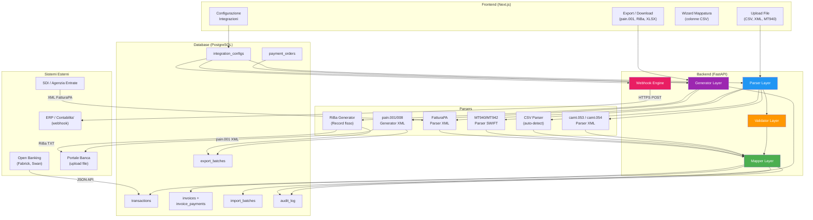
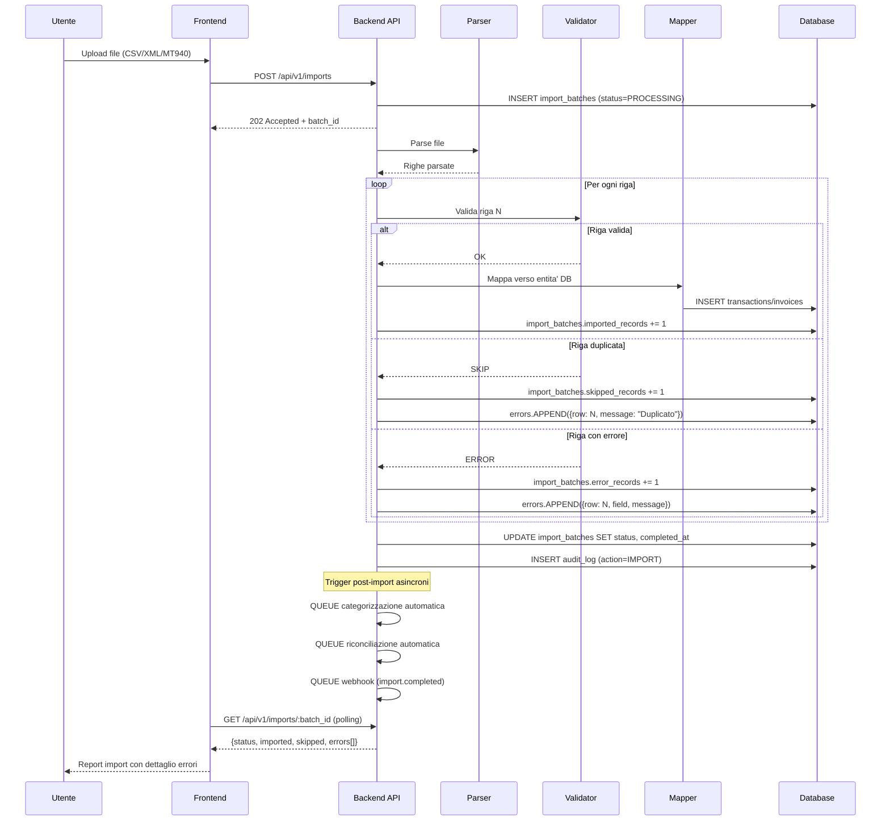
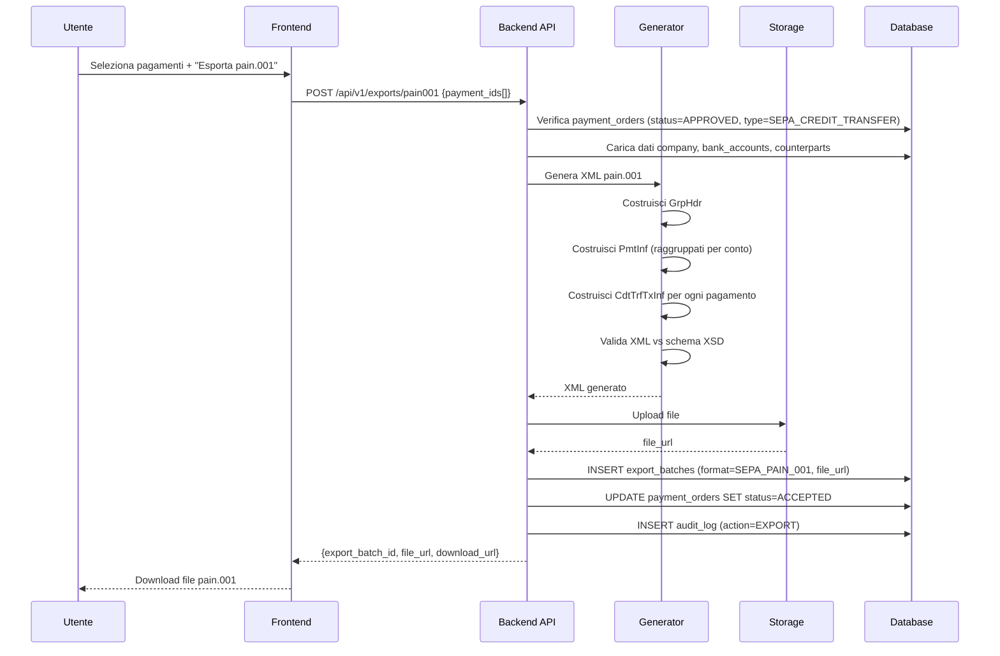

# PRD-10 — Integrazioni Bancarie e Formati

**Versione:** 1.0
**Data:** 10 febbraio 2026
**Basato su:** RE Sibill (docs/10-formati-cbi-sepa.md, docs/15-mapping-gestionale.md), DB Schema (.tmp/db-schema.md), PRD-07 Pagamenti
**Stato:** Draft

---

## Indice

1. [Panoramica](#1-panoramica)
2. [SEPA XML — Standard ISO 20022](#2-sepa-xml--standard-iso-20022)
3. [CBI — Tracciati italiani](#3-cbi--tracciati-italiani)
4. [[MIGLIORAMENTO] SDI / FatturaPA](#4-miglioramento-sdi--fatturapa)
5. [Import generici](#5-import-generici)
6. [[MIGLIORAMENTO] Webhook](#6-miglioramento-webhook)
7. [Architettura integrazioni](#7-architettura-integrazioni)
8. [Functional Requirements](#8-functional-requirements)

---

## 1. Panoramica

### 1.1 Contesto

Sibill e' una piattaforma cloud-native che gestisce le integrazioni bancarie **esclusivamente** tramite API Open Banking (PSD2) via SWAN. Non genera ne' consuma file CBI o SEPA XML. I movimenti arrivano in formato JSON:API proprietario, i pagamenti sono eseguiti via PISP, le fatture elettroniche sono acquisite dal Cassetto Fiscale.

Il gestionale target deve supportare un ecosistema piu' ampio:
- **Banche tradizionali** che comunicano tramite file CBI/SEPA XML
- **Clienti senza Open Banking** che importano movimenti da file CSV/MT940
- **Commercialisti** che gestiscono fatture XML FatturaPA in bulk
- **Sistemi ERP** che si integrano via webhook

> Confidenza: 🟢 Alta — L'assenza di file CBI/SEPA in Sibill e' confermata dall'analisi completa di JS, API e UI (docs/10 sezione 9.1). Tutte le specifiche di formato in questo PRD sono basate sugli standard ISO 20022, CBI e ABI vigenti.

### 1.2 Tabelle DB coinvolte

| Tabella | Ruolo nel modulo |
|---------|-----------------|
| `integration_configs` | Configurazioni per canale (CBI, SEPA, SDI, Open Banking) |
| `import_batches` | Tracciabilita' import file con gestione errori riga per riga |
| `export_batches` | Tracciabilita' export file generati |
| `payment_orders` | Disposizioni di pagamento (input per pain.001, RiBa, F24) |
| `bank_accounts` | Conti di addebito/accredito (IBAN, BIC) |
| `counterparts` | Controparti (beneficiari, debitori) |
| `transactions` | Movimenti importati da camt.053, CSV, MT940 |
| `invoices` | Fatture importate da XML FatturaPA |
| `invoice_payments` | Scadenze generate dall'import fatture |
| `audit_log` | Log di tutte le operazioni import/export |

### 1.3 Formati supportati — Riepilogo

| # | Formato | Direzione | Standard | Priorita' |
|---|---------|-----------|----------|-----------|
| 1 | pain.001.001.03 | Export | ISO 20022 | Alta |
| 2 | pain.008.001.02 | Export | ISO 20022 | Media |
| 3 | camt.053.001.02 | Import | ISO 20022 | Alta |
| 4 | camt.054.001.02 | Import | ISO 20022 | Media |
| 5 | Tracciato RiBa | Export | CBI | Media |
| 6 | Tracciato F24 | Export | ABI/CBI | Media |
| 7 | XML FatturaPA | Import | SDI | Alta |
| 8 | CSV movimenti | Import | Proprietario | Alta |
| 9 | MT940/MT942 | Import | SWIFT | Bassa |
| 10 | CSV fatture | Import | Proprietario | Media |
| 11 | XLSX/CSV | Export | Proprietario | Alta |

---

## 2. SEPA XML — Standard ISO 20022

### 2.1 pain.001 — Customer Credit Transfer Initiation (Bonifici SEPA)

#### Namespace e versione

```
urn:iso:std:iso:20022:tech:xsd:pain.001.001.03
```

Il namespace DEVE essere dichiarato nell'elemento root `Document`. La versione .03 e' lo standard adottato dal circuito CBI italiano e dalla maggior parte delle banche europee.

#### Gerarchia XML

```
Document
 └── CstmrCdtTrfInitn (Customer Credit Transfer Initiation)
      ├── GrpHdr (Group Header) ────────────────── 1 per file
      │    ├── MsgId ──────────────────────────── ID univoco messaggio (max 35 char)
      │    ├── CreDtTm ────────────────────────── Data/ora creazione ISO 8601
      │    ├── NbOfTxs ────────────────────────── Numero totale transazioni nel file
      │    ├── CtrlSum ────────────────────────── Somma di controllo (somma importi)
      │    └── InitgPty ───────────────────────── Soggetto iniziatore
      │         ├── Nm ────────────────────────── Nome (max 70 char)
      │         └── Id > OrgId > Othr > Id ────── P.IVA o codice fiscale
      │
      └── PmtInf (Payment Information) ─────────── 1..N per file (1 per conto di addebito)
           ├── PmtInfId ──────────────────────── ID blocco pagamento (max 35 char)
           ├── PmtMtd ────────────────────────── "TRF" (Transfer)
           ├── BtchBookg ─────────────────────── true = booking singolo, false = dettaglio
           ├── NbOfTxs ───────────────────────── Numero transazioni nel blocco
           ├── CtrlSum ───────────────────────── Somma importi del blocco
           ├── PmtTpInf ──────────────────────── Informazioni tipo pagamento
           │    ├── InstrPrty ─────────────────── "NORM" o "HIGH"
           │    └── SvcLvl > Cd ───────────────── "SEPA"
           ├── ReqdExctnDt ───────────────────── Data esecuzione richiesta (YYYY-MM-DD)
           ├── Dbtr ──────────────────────────── Debitore (ordinante)
           │    └── Nm ───────────────────────── Nome (max 70 char)
           ├── DbtrAcct > Id > IBAN ──────────── IBAN ordinante
           ├── DbtrAgt > FinInstnId > BIC ────── BIC banca ordinante
           │
           └── CdtTrfTxInf (Credit Transfer Transaction Information) ── 1..N per PmtInf
                ├── PmtId ────────────────────── Identificativi
                │    ├── InstrId ──────────────── ID istruzione (max 35, opzionale)
                │    └── EndToEndId ───────────── ID end-to-end (max 35, obbligatorio)
                ├── Amt > InstdAmt ───────────── Importo con attributo Ccy="EUR"
                ├── CdtrAgt > FinInstnId > BIC ── BIC banca beneficiario (opzionale SEPA)
                ├── Cdtr ─────────────────────── Creditore (beneficiario)
                │    └── Nm ──────────────────── Nome (max 70 char)
                ├── CdtrAcct > Id > IBAN ─────── IBAN beneficiario
                └── RmtInf ───────────────────── Informazioni rimessa
                     └── Ustrd ────────────────── Causale non strutturata (max 140 char)
```

#### Mapping verso il DB

| Campo XML | Tabella.colonna | Note |
|-----------|----------------|------|
| `MsgId` | Auto-generato | `{company_vat}_{YYYYMMDD}_{seq}` (max 35) |
| `CreDtTm` | NOW() | ISO 8601: `2026-02-10T14:30:00` |
| `NbOfTxs` | COUNT(payment_orders selezionati) | Intero |
| `CtrlSum` | SUM(`payment_orders.amount`) | NUMERIC(18,2) |
| `InitgPty/Nm` | `companies.name` | Troncato a 70 char |
| `InitgPty/Id` | `companies.vat_number` | P.IVA senza prefisso IT |
| `PmtInfId` | Auto-generato | `{company_vat}_{account_iban_last8}_{seq}` |
| `PmtMtd` | Costante | "TRF" |
| `SvcLvl/Cd` | Costante | "SEPA" |
| `ReqdExctnDt` | `payment_orders.execution_date` | DATE, formato YYYY-MM-DD |
| `Dbtr/Nm` | `companies.name` | Troncato a 70 char |
| `DbtrAcct/IBAN` | `bank_accounts.iban` | Validato (27 char per IT) |
| `DbtrAgt/BIC` | `bank_accounts.bic` o derivato | 8 o 11 char |
| `EndToEndId` | `payment_orders.id` (UUID troncato) | Max 35 char, univoco |
| `InstdAmt[@Ccy]` | `payment_orders.currency` | ISO 4217 |
| `InstdAmt` | `payment_orders.amount` | Punto decimale, 2 cifre |
| `Cdtr/Nm` | `payment_orders.beneficiary_name` | Troncato a 70 char |
| `CdtrAcct/IBAN` | `payment_orders.beneficiary_iban` | Validato |
| `CdtrAgt/BIC` | `payment_orders.beneficiary_bic` | Opzionale in SEPA |
| `RmtInf/Ustrd` | `payment_orders.reference` | Max 140 char |

#### Esempio XML scheletro

```xml
<?xml version="1.0" encoding="UTF-8"?>
<Document xmlns="urn:iso:std:iso:20022:tech:xsd:pain.001.001.03"
          xmlns:xsi="http://www.w3.org/2001/XMLSchema-instance">
  <CstmrCdtTrfInitn>
    <!-- GROUP HEADER — 1 per file -->
    <GrpHdr>
      <MsgId>COMPANY123_20260210_001</MsgId>
      <CreDtTm>2026-02-10T14:30:00</CreDtTm>
      <NbOfTxs>2</NbOfTxs>
      <CtrlSum>3500.00</CtrlSum>
      <InitgPty>
        <Nm>Azienda Esempio S.r.l.</Nm>
        <Id>
          <OrgId>
            <Othr>
              <Id>01234567890</Id>
              <SchmeNm>
                <Cd>TXID</Cd>
              </SchmeNm>
            </Othr>
          </OrgId>
        </Id>
      </InitgPty>
    </GrpHdr>

    <!-- PAYMENT INFORMATION — 1 per conto di addebito -->
    <PmtInf>
      <PmtInfId>01234567890_IT12345_001</PmtInfId>
      <PmtMtd>TRF</PmtMtd>
      <BtchBookg>true</BtchBookg>
      <NbOfTxs>2</NbOfTxs>
      <CtrlSum>3500.00</CtrlSum>
      <PmtTpInf>
        <InstrPrty>NORM</InstrPrty>
        <SvcLvl>
          <Cd>SEPA</Cd>
        </SvcLvl>
      </PmtTpInf>
      <ReqdExctnDt>2026-02-15</ReqdExctnDt>
      <Dbtr>
        <Nm>Azienda Esempio S.r.l.</Nm>
      </Dbtr>
      <DbtrAcct>
        <Id>
          <IBAN>IT60X0542811101000000123456</IBAN>
        </Id>
      </DbtrAcct>
      <DbtrAgt>
        <FinInstnId>
          <BIC>BPMOIT22XXX</BIC>
        </FinInstnId>
      </DbtrAgt>

      <!-- TRANSAZIONE 1 -->
      <CdtTrfTxInf>
        <PmtId>
          <InstrId>INSTR-001</InstrId>
          <EndToEndId>a1b2c3d4-e5f6-7890-abcd</EndToEndId>
        </PmtId>
        <Amt>
          <InstdAmt Ccy="EUR">2000.00</InstdAmt>
        </Amt>
        <CdtrAgt>
          <FinInstnId>
            <BIC>UNCRITM1XXX</BIC>
          </FinInstnId>
        </CdtrAgt>
        <Cdtr>
          <Nm>Fornitore Alpha S.p.A.</Nm>
        </Cdtr>
        <CdtrAcct>
          <Id>
            <IBAN>IT40S0300203280284975661141</IBAN>
          </Id>
        </CdtrAcct>
        <RmtInf>
          <Ustrd>Pagamento fattura 2026/001 del 15/01/2026</Ustrd>
        </RmtInf>
      </CdtTrfTxInf>

      <!-- TRANSAZIONE 2 -->
      <CdtTrfTxInf>
        <PmtId>
          <EndToEndId>f7g8h9i0-j1k2-3456-efgh</EndToEndId>
        </PmtId>
        <Amt>
          <InstdAmt Ccy="EUR">1500.00</InstdAmt>
        </Amt>
        <Cdtr>
          <Nm>Consulente Beta</Nm>
        </Cdtr>
        <CdtrAcct>
          <Id>
            <IBAN>IT07O0306909606100000016346</IBAN>
          </Id>
        </CdtrAcct>
        <RmtInf>
          <Ustrd>Parcella 2026/010</Ustrd>
        </RmtInf>
      </CdtTrfTxInf>
    </PmtInf>
  </CstmrCdtTrfInitn>
</Document>
```

#### Validazioni obbligatorie

| Validazione | Regola | Errore |
|-------------|--------|--------|
| MsgId univoco | Non deve esistere in `export_batches` precedenti | "ID messaggio duplicato" |
| NbOfTxs coerente | Deve corrispondere al conteggio effettivo di CdtTrfTxInf | "Conteggio transazioni non coerente" |
| CtrlSum coerente | Deve corrispondere alla somma degli InstdAmt | "Somma di controllo non coerente" |
| IBAN valido | Lunghezza corretta per paese + check digit | "IBAN non valido: {iban}" |
| Importo > 0 | InstdAmt deve essere positivo | "Importo deve essere positivo" |
| Importo max | InstdAmt <= 999999999.99 | "Importo eccede il massimo consentito" |
| Causale max 140 | RmtInf/Ustrd <= 140 char | "Causale eccede 140 caratteri" |
| Nome max 70 | Tutti i Nm <= 70 char | "Nome eccede 70 caratteri" |
| EndToEndId univoco | Univoco all'interno del file | "EndToEndId duplicato" |
| Data esecuzione >= oggi | ReqdExctnDt non nel passato | "Data esecuzione nel passato" |
| Valuta EUR per SEPA | Ccy deve essere "EUR" | "Solo EUR supportato per SEPA" |

---

### 2.2 pain.008 — Customer Direct Debit Initiation (SDD)

#### Namespace e versione

```
urn:iso:std:iso:20022:tech:xsd:pain.008.001.02
```

#### Differenze rispetto a pain.001

Il pain.008 ha la stessa struttura base del pain.001 ma con differenze significative dovute alla natura dell'addebito diretto: il creditore (chi emette il file) **addebita** il conto del debitore, invece di trasferire fondi dal proprio conto.

| Aspetto | pain.001 (Bonifico) | pain.008 (SDD) |
|---------|--------------------|--------------------|
| Direzione | Ordinante → Beneficiario | Creditore addebita → Debitore |
| Root element | `CstmrCdtTrfInitn` | `CstmrDrctDbtInitn` |
| Blocco transazione | `CdtTrfTxInf` | `DrctDbtTxInf` |
| Metodo pagamento | `TRF` (Transfer) | `DD` (Direct Debit) |
| Conto nell'header | `DbtrAcct` (ordinante) | `CdtrAcct` (creditore) |
| Conto nella transazione | `CdtrAcct` (beneficiario) | `DbtrAcct` (debitore) |
| Mandato | Non presente | **Obbligatorio** (`MndtRltdInf`) |
| Tipo SDD | Non applicabile | `CORE` o `B2B` |
| Data | `ReqdExctnDt` (esecuzione) | `ReqdColltnDt` (incasso) |
| Sequenza | Non applicabile | `FRST`, `RCUR`, `FNAL`, `OOFF` |

#### Gerarchia XML (differenze chiave)

```
Document
 └── CstmrDrctDbtInitn
      ├── GrpHdr ──────────────────────── Identico a pain.001
      └── PmtInf
           ├── PmtInfId
           ├── PmtMtd ────────────────── "DD" (Direct Debit)
           ├── PmtTpInf
           │    ├── SvcLvl > Cd ──────── "SEPA"
           │    ├── LclInstrm > Cd ───── "CORE" o "B2B"
           │    └── SeqTp ────────────── "FRST" | "RCUR" | "FNAL" | "OOFF"
           ├── ReqdColltnDt ──────────── Data di incasso richiesta
           ├── Cdtr > Nm ────────────── Creditore (chi emette il file)
           ├── CdtrAcct > Id > IBAN ──── IBAN creditore
           ├── CdtrAgt > FinInstnId ──── BIC banca creditore
           ├── CdtrSchmeId ──────────── ID schema creditore (Creditor ID)
           │    └── Id > PrvtId > Othr > Id ── Codice SDD (CUC)
           │
           └── DrctDbtTxInf ──────────── 1..N per PmtInf
                ├── PmtId > EndToEndId
                ├── InstdAmt
                ├── DrctDbtTx
                │    └── MndtRltdInf ───── MANDATO (obbligatorio)
                │         ├── MndtId ────── ID mandato firmato dal debitore
                │         ├── DtOfSgntr ─── Data firma mandato
                │         └── AmdmntInd ─── true/false (modifica mandato)
                ├── DbtrAgt > FinInstnId
                ├── Dbtr > Nm ──────────── Nome debitore
                ├── DbtrAcct > Id > IBAN ── IBAN debitore
                └── RmtInf > Ustrd
```

#### Mapping verso il DB — Campi aggiuntivi rispetto a pain.001

Il pain.008 richiede campi non presenti nel pain.001. Questi sono gestiti nel campo `payment_orders.metadata` (JSONB):

| Campo XML | Mapping DB | Note |
|-----------|-----------|------|
| `LclInstrm/Cd` | `payment_orders.metadata.sdd_type` | "CORE" o "B2B" |
| `SeqTp` | `payment_orders.metadata.sdd_sequence` | "FRST", "RCUR", "FNAL", "OOFF" |
| `ReqdColltnDt` | `payment_orders.execution_date` | Data incasso (non esecuzione) |
| `CdtrSchmeId` | `companies.metadata.creditor_id` o `integration_configs.config.creditor_id` | Codice CUC/SDD |
| `MndtId` | `payment_orders.metadata.mandate_id` | ID mandato firmato |
| `DtOfSgntr` | `payment_orders.metadata.mandate_date` | Data firma mandato |
| `AmdmntInd` | `payment_orders.metadata.mandate_amended` | Boolean |

#### Validazioni aggiuntive rispetto a pain.001

| Validazione | Regola | Errore |
|-------------|--------|--------|
| Mandato obbligatorio | `metadata.mandate_id` NOT NULL | "Mandato SDD obbligatorio" |
| Data mandato | `metadata.mandate_date` non futura | "Data firma mandato non valida" |
| Creditor ID | `creditor_id` presente nella configurazione | "Codice creditore SDD non configurato" |
| Tipo SDD | `metadata.sdd_type` IN ('CORE', 'B2B') | "Tipo SDD non valido" |
| Sequenza | `metadata.sdd_sequence` coerente con storico | "FRST non ammesso: mandato gia' utilizzato" |
| Data incasso CORE | >= oggi + 5 giorni lavorativi (FRST) o + 2 (RCUR) | "Data incasso troppo ravvicinata per CORE" |
| Data incasso B2B | >= oggi + 1 giorno lavorativo | "Data incasso troppo ravvicinata per B2B" |

---

### 2.3 camt.053 — Bank to Customer Statement (Estratto Conto)

#### Namespace e versione

```
urn:iso:std:iso:20022:tech:xsd:camt.053.001.02
```

#### Struttura per import movimenti

```
Document
 └── BkToCstmrStmt
      └── Stmt (Statement) ────────────── 1..N (1 per conto)
           ├── Id ──────────────────────── ID estratto conto
           ├── CreDtTm ────────────────── Data creazione
           ├── Acct ───────────────────── Conto intestatario
           │    ├── Id > IBAN
           │    └── Ccy ──────────────── Valuta
           ├── Bal (Balance) ──────────── 1..N (saldo iniziale, finale)
           │    ├── Tp > CdOrPrtry > Cd ── "OPBD" (apertura) | "CLBD" (chiusura)
           │    ├── Amt ──────────────── Importo saldo
           │    └── CdtDbtInd ────────── "CRDT" | "DBIT"
           │
           └── Ntry (Entry) ──────────── 0..N (movimenti)
                ├── Amt ──────────────── Importo
                ├── CdtDbtInd ────────── "CRDT" (entrata) | "DBIT" (uscita)
                ├── Sts ──────────────── "BOOK" (contabilizzato) | "PDNG" (pendente)
                ├── BookgDt > Dt ─────── Data contabile
                ├── ValDt > Dt ────────── Data valuta
                ├── AcctSvcrRef ──────── Riferimento banca (per dedup)
                ├── BkTxCd ───────────── Codice operazione bancaria
                │    └── Domn > Cd ────── Dominio (es. "PMNT")
                │    └── Fmly > Cd ────── Famiglia (es. "RCDT" per bonifico ricevuto)
                │    └── SubFmlyCd ────── Sottofamiglia
                └── NtryDtls ─────────── Dettagli
                     └── TxDtls ──────── 1..N
                          ├── Refs ──────── Riferimenti (EndToEndId, TxId)
                          ├── RltdPties ──── Parti coinvolte
                          │    ├── Dbtr > Nm ──── Nome debitore
                          │    ├── DbtrAcct > Id > IBAN
                          │    ├── Cdtr > Nm ──── Nome creditore
                          │    └── CdtrAcct > Id > IBAN
                          ├── RmtInf > Ustrd ── Causale
                          └── AddtlTxInf ──── Info aggiuntive
```

#### Mapping import camt.053 → `transactions`

| Campo XML (camt.053) | Colonna `transactions` | Trasformazione |
|----------------------|----------------------|----------------|
| `Stmt/Acct/Id/IBAN` | `bank_account_id` | Lookup: `SELECT id FROM bank_accounts WHERE iban = :iban AND company_id = :company_id` |
| `Ntry/Amt` | `amount` | Se DBIT: negativo; se CRDT: positivo |
| `Ntry/Amt[@Ccy]` | `currency` | ISO 4217 |
| `Ntry/CdtDbtInd` | `direction` | "CRDT" → INFLOW, "DBIT" → OUTFLOW |
| `Ntry/BookgDt/Dt` | `transaction_date` | DATE |
| `Ntry/ValDt/Dt` | `value_date` | DATE |
| `Ntry/Sts` | `status` | "BOOK" → BOOKED, "PDNG" → PENDING |
| `Ntry/AcctSvcrRef` | `provider_transaction_id` | Usato per deduplicazione |
| `NtryDtls/TxDtls/RmtInf/Ustrd` | `description` | Concatenato se multiplo |
| `NtryDtls/TxDtls/Refs/EndToEndId` | `remittance_info` | ID end-to-end |
| `RltdPties/Cdtr/Nm` o `Dbtr/Nm` | `counterpart_name` | Controparte (chi e' l'altro) |
| `RltdPties/CdtrAcct` o `DbtrAcct` | `counterpart_iban` | IBAN controparte |
| `BkTxCd/Domn+Fmly+SubFmly` | `transaction_type` | Mapping codici → enum (vedi sotto) |

#### Mapping codici BkTxCd → `transaction_type`

| Domn | Fmly | SubFmly | `transaction_type` |
|------|------|---------|-------------------|
| PMNT | RCDT | * | CREDIT_TRANSFER |
| PMNT | ICDT | * | CREDIT_TRANSFER |
| PMNT | RDDT | * | DIRECT_DEBIT |
| PMNT | IDDT | * | DIRECT_DEBIT |
| CAMT | MDOP | * | FEE |
| ACMT | * | * | FEE |
| LDAS | INTR | * | INTEREST |
| XTND | * | * | OTHER |
| (altro) | * | * | OTHER |

#### Gestione duplicati

L'import camt.053 puo' sovrapporsi a movimenti gia' presenti (da Open Banking o da import precedenti). La deduplicazione avviene su:

```pseudocode
function isDuplicate(entry, bank_account_id, company_id):
    // Strategia 1: AcctSvcrRef (piu' affidabile)
    IF entry.AcctSvcrRef IS NOT NULL:
        existing = SELECT id FROM transactions
                   WHERE provider_transaction_id = entry.AcctSvcrRef
                   AND bank_account_id = :bank_account_id
        IF existing: RETURN TRUE

    // Strategia 2: Combinazione data + importo + causale (fallback)
    existing = SELECT id FROM transactions
               WHERE bank_account_id = :bank_account_id
               AND transaction_date = entry.BookgDt
               AND amount = entry.amount (con segno)
               AND (description LIKE '%' || entry.Ustrd || '%'
                    OR remittance_info = entry.EndToEndId)
    IF existing: RETURN TRUE

    RETURN FALSE
```

#### Aggiornamento saldi

Dopo l'import, i saldi del conto vengono aggiornati dai `Bal` dello statement:

```pseudocode
function aggiornaSaldiDaCamt053(stmt, bank_account_id):
    FOR EACH bal IN stmt.Bal:
        IF bal.Tp == "CLBD":  // Saldo di chiusura
            amount = bal.Amt
            IF bal.CdtDbtInd == "DBIT": amount = -amount
            UPDATE bank_accounts
            SET current_balance = amount,
                balance_date = stmt.CreDtTm
            WHERE id = bank_account_id
```

---

### 2.4 camt.054 — Bank to Customer Debit/Credit Notification

#### Namespace

```
urn:iso:std:iso:20022:tech:xsd:camt.054.001.02
```

#### Uso vs camt.053

| Aspetto | camt.053 | camt.054 |
|---------|----------|----------|
| **Contenuto** | Estratto conto completo (tutti i movimenti del periodo) | Singola notifica (1 o pochi movimenti) |
| **Frequenza** | Fine giornata (1/giorno) | In tempo reale o infragiornaliero |
| **Saldi** | Include saldi apertura/chiusura | NON include saldi |
| **Uso tipico** | Riconciliazione batch a fine giornata | Notifica immediata di accredito/addebito |
| **Priorita' import** | Alta — fonte primaria per import massivo | Media — integrativo per aggiornamenti in giornata |

La struttura XML e' quasi identica a camt.053. La differenza principale:
- Root element: `BkToCstmrDbtCdtNtfctn` invece di `BkToCstmrStmt`
- Nessun elemento `Bal` (saldi)
- Tipicamente 1-2 `Ntry` per notifica (vs decine/centinaia nel camt.053)

Il mapping verso `transactions` e' **identico** a camt.053 (sezione 2.3). La stessa logica di deduplicazione si applica per evitare doppioni tra camt.054 ricevuti durante il giorno e il camt.053 serale.

---

## 3. CBI — Tracciati italiani

### 3.1 Tracciato RiBa (Ricevuta Bancaria)

> Riferimento: gia' introdotto in PRD-07 sezione 7 per la generazione. Qui si approfondisce la struttura del tracciato.

#### Struttura record (120 caratteri a lunghezza fissa)

Il tracciato RiBa CBI e' composto da record ASCII a lunghezza fissa di 120 caratteri, terminati da CRLF. Ogni tipo record ha un codice identificativo nelle prime 2 posizioni.

| Tipo | Codice | Occ. | Descrizione | Campi chiave |
|------|--------|------|-------------|-------------|
| Header flusso | ` IB` | 1 | Intestazione generale | Mittente SIA, data creazione, nome file |
| Testata disposizione | ` 14` | 1/disp. | Dati della RiBa | Numero progressivo, data scadenza, importo (centesimi), codice SIA |
| Dati debitore | ` 20` | 1/disp. | Anagrafica debitore | Nome (max 60), codice fiscale |
| Indirizzo debitore | ` 30` | 1/disp. | Domicilio debitore | Indirizzo, CAP, citta', ABI/CAB banca domiciliataria |
| Dati aggiuntivi | ` 40` | 1/disp. | Riferimenti | Descrizione causale (max 80) |
| Creditore | ` 50` | 1/disp. | Dati del creditore | Nome (max 60), codice fiscale creditore |
| Importo/Bolli | ` 51` | 1/disp. | Importo e spese | Numero ricevuta, importo bollo |
| Info aggiuntive | ` 70` | 0-1/disp. | Note libere | Testo aggiuntivo (max 80) |
| Coda flusso | ` EF` | 1 | Chiusura e controlli | Numero disposizioni, totale importi, numero record |

#### Mapping DB → Record RiBa

| Campo record | Posizione | Lung. | Tabella.colonna | Trasformazione |
|-------------|-----------|-------|----------------|----------------|
| **Record 14** | | | | |
| Data scadenza | 11-16 | 6 | `payment_orders.execution_date` | GGMMAA |
| Importo | 21-33 | 13 | `payment_orders.amount` | Centesimi, right-aligned, zero-padded |
| Codice SIA | 74-78 | 5 | `integration_configs.config.sia_code` | Codice assegnato dalla banca |
| ABI banca assuntrice | 79-83 | 5 | `bank_accounts.iban` (pos 6-10) | Estratto da IBAN |
| CAB banca assuntrice | 84-88 | 5 | `bank_accounts.iban` (pos 11-15) | Estratto da IBAN |
| Conto corrente | 89-100 | 12 | `bank_accounts.iban` (pos 16-27) | Estratto da IBAN |
| **Record 20** | | | | |
| Nome debitore | 21-80 | 60 | `payment_orders.beneficiary_name` | Troncato, left-aligned |
| Codice fiscale | 101-116 | 16 | `counterparts.tax_number` | Left-aligned |
| **Record 30** | | | | |
| Indirizzo debitore | 21-50 | 30 | `counterparts.address` | Troncato |
| CAP | 51-55 | 5 | `counterparts.postal_code` | |
| Citta' | 56-78 | 23 | `counterparts.city` | Troncato |
| ABI domiciliataria | 79-83 | 5 | `counterparts.bank_identifier` → ABI | Derivato da IBAN controparte |
| CAB domiciliataria | 84-88 | 5 | `counterparts.bank_identifier` → CAB | Derivato da IBAN controparte |
| **Record 40** | | | | |
| Descrizione | 21-100 | 80 | `payment_orders.reference` | Troncato |
| **Record 50** | | | | |
| Nome creditore | 21-80 | 60 | `companies.name` | Troncato |
| CF creditore | 101-116 | 16 | `companies.tax_number` | |
| **Record 51** | | | | |
| Numero ricevuta | 11-20 | 10 | `payment_orders.id` (ultimi 10 char) | Riferimento univoco |
| **Record EF** | | | | |
| Numero disposizioni | 11-17 | 7 | COUNT(payments) | Zero-padded |
| Totale importi | 18-30 | 13 | SUM(amount) in centesimi | Zero-padded |
| Numero record | 31-37 | 7 | Contatore record (escluso IB/EF) | Zero-padded |

#### Validazioni

| Validazione | Regola | Errore |
|-------------|--------|--------|
| Codice SIA | Presente in `integration_configs` | "Codice SIA non configurato" |
| Importo | > 0, max 13 cifre (centesimi) | "Importo non valido per RiBa" |
| ABI/CAB debitore | Validi (5 cifre ciascuno) | "ABI/CAB banca domiciliataria non valido" |
| Codice fiscale | Presente per il debitore | "Codice fiscale debitore obbligatorio" |
| IBAN creditore | Valido e corrispondente al conto | "IBAN creditore non valido" |

---

### 3.2 Tracciato F24

Il modello F24 telematico segue il tracciato ABI per la trasmissione bancaria. I dati sono strutturati nelle sezioni standard del modello.

#### Sezioni del modello F24

| Sezione | Tipo record | Campi principali | Mapping DB |
|---------|-------------|-----------------|-----------|
| **Erario** | Tributi erariali | codice_tributo, anno_riferimento, importo_debito, importo_credito | `payment_orders.metadata.sezioni[tipo=ERARIO].righe[]` |
| **INPS** | Contributi previdenziali | codice_sede, causale_contributo, matricola, periodo_da/a, importo | `payment_orders.metadata.sezioni[tipo=INPS].righe[]` |
| **Regioni** | Tributi regionali | codice_regione, codice_tributo, anno_riferimento, importo | `payment_orders.metadata.sezioni[tipo=REGIONI].righe[]` |
| **IMU / altri enti locali** | Tributi comunali | codice_ente, codice_tributo, immobili, importo, detrazione | `payment_orders.metadata.sezioni[tipo=IMU].righe[]` |
| **INAIL** | Premi assicurativi | codice_sede, codice_ditta, cc, numero_riferimento, importo | `payment_orders.metadata.sezioni[tipo=INAIL].righe[]` |
| **Identificativo** | Contribuente | codice_fiscale, dati_anagrafici, domicilio_fiscale | `companies.tax_number`, `companies.name`, `companies.address` |

#### Struttura metadata F24 in `payment_orders.metadata`

> Coerente con quanto gia' definito in PRD-07 sezione 8.1.

```json
{
  "tipo_f24": "ORDINARIO",
  "data_versamento": "2026-02-16",
  "contribuente": {
    "codice_fiscale": "01234567890",
    "ragione_sociale": "Azienda Esempio S.r.l.",
    "domicilio_fiscale": {
      "comune": "Milano",
      "provincia": "MI"
    }
  },
  "sezioni": [
    {
      "tipo": "ERARIO",
      "righe": [
        {
          "codice_tributo": "6001",
          "rateazione": "0101",
          "anno_riferimento": "2026",
          "importo_debito": 5000.00,
          "importo_credito": 0
        }
      ],
      "totale_debito": 5000.00,
      "totale_credito": 0
    },
    {
      "tipo": "INPS",
      "righe": [
        {
          "codice_sede": "0100",
          "causale": "DM10",
          "matricola": "1234567890",
          "periodo_da": "01/2026",
          "periodo_a": "01/2026",
          "importo_debito": 3000.00,
          "importo_credito": 0
        }
      ],
      "totale_debito": 3000.00,
      "totale_credito": 0
    }
  ],
  "totale_debito": 8000.00,
  "totale_credito": 0,
  "saldo": 8000.00
}
```

#### Differenze CBI tradizionale vs Sibill

| Aspetto | CBI (Tracciato F24 telematico) | Sibill |
|---------|-------------------------------|--------|
| Formato | Record a lunghezza fissa (tracciato ABI) | API interna Sibill → SWAN |
| Trasmissione | File caricato su portale banca / CBI | API REST |
| Validazione | Codici tributo da tabella ABI | Non osservato |
| Esecuzione | Banca esegue alla data di versamento | Banca esegue via API |

Per il gestionale target: il pagamento F24 viene creato nell'UI (come PRD-07 sezione 8), salvato in `payment_orders` con `payment_type = 'F24'` e metadata completi. L'esportazione in tracciato CBI e' un'opzione per banche che non supportano l'invio API.

---

### 3.3 Tracciato CBI Bonifici — Differenze vs SEPA XML

Il tracciato CBI "tradizionale" per bonifici e' un formato a record fisso (120 caratteri) ormai largamente sostituito dal pain.001 SEPA XML. Tuttavia alcune banche italiane minori o configurazioni legacy potrebbero ancora richiederlo.

| Aspetto | pain.001 XML | CBI Record Fisso |
|---------|-------------|-----------------|
| Formato | XML strutturato | Record 120 char ASCII |
| Standard | ISO 20022 internazionale | CBI italiano |
| Leggibilita' | Alta (tag XML) | Bassa (posizionale) |
| Adozione attuale | Universale | In dismissione |
| Supporto gestionale | **Implementato (priorita' Alta)** | **Non implementato** (bassa priorita') |

> Per il gestionale target, si implementa **solo** il pain.001 XML per i bonifici SEPA. Il tracciato CBI a record fisso per bonifici non viene implementato salvo richiesta specifica di un cliente. La RiBa rimane in formato CBI record fisso perche' non esiste un equivalente SEPA XML per le ricevute bancarie.

---

## 4. [MIGLIORAMENTO] SDI / FatturaPA

### 4.1 Import XML FatturaPA → `invoices` + `invoice_payments`

Sibill acquisisce le fatture elettroniche dal Cassetto Fiscale via API delegata (docs/10 sezione 4). Il gestionale supporta anche l'import diretto di file XML FatturaPA.

#### Formati accettati

| Formato | Estensione | Descrizione |
|---------|-----------|-------------|
| FatturaPA XML | `.xml` | Fattura singola, schema 1.2.1 |
| FatturaPA firmata | `.xml.p7m` | Fattura con firma digitale CAdES |
| ZIP di fatture | `.zip` | Archivio contenente multipli XML |

#### Mapping XML FatturaPA → DB

| XPath FatturaPA | Tabella.colonna | Trasformazione |
|-----------------|----------------|----------------|
| **Dati generali** | | |
| `FatturaElettronicaHeader/CedentePrestatore/DatiAnagrafici/IdFiscaleIVA/IdCodice` | `counterparts.vat_number` | Lookup o auto-creazione |
| `FatturaElettronicaHeader/CedentePrestatore/DatiAnagrafici/CodiceFiscale` | `counterparts.tax_number` | |
| `FatturaElettronicaHeader/CedentePrestatore/DatiAnagrafici/Anagrafica/Denominazione` | `counterparts.company_name` | |
| `FatturaElettronicaHeader/CedentePrestatore/Sede/*` | `counterparts.address`, `city`, `postal_code`, `province_code` | |
| `FatturaElettronicaBody/DatiGenerali/DatiGeneraliDocumento/TipoDocumento` | `invoices.e_invoice_type` | TD01, TD04, TD05, etc. |
| `DatiGeneraliDocumento/Numero` | `invoices.number` | |
| `DatiGeneraliDocumento/Data` | `invoices.creation_date` | DATE |
| `DatiGeneraliDocumento/ImportoTotaleDocumento` | `invoices.gross_amount` | Se presente; altrimenti calcolato |
| **Importi** | | |
| `DatiBeniServizi/DatiRiepilogo/ImponibileImporto` (somma) | `invoices.net_amount` | SUM di tutti i DatiRiepilogo |
| `DatiBeniServizi/DatiRiepilogo/Imposta` (somma) | `invoices.vat_amount` | SUM |
| Calcolo: net + vat | `invoices.gross_amount` | Se non presente ImportoTotaleDocumento |
| **Ritenuta d'acconto** | | |
| `DatiGeneraliDocumento/DatiRitenuta/ImportoRitenuta` | `invoices.withholding_tax_amount` | |
| `DatiGeneraliDocumento/DatiRitenuta/AliquotaRitenuta` | `invoices.withholding_tax_rate` | Percentuale |
| **Pagamento** | | |
| `DatiPagamento/DettaglioPagamento/ModalitaPagamento` | `invoice_payments.payment_method` | Codice MP01-MP22 |
| `DatiPagamento/DettaglioPagamento/DataScadenzaPagamento` | `invoice_payments.due_date` | DATE |
| `DatiPagamento/DettaglioPagamento/ImportoPagamento` | `invoice_payments.amount` | NUMERIC |
| `DatiPagamento/DettaglioPagamento/IBAN` | `counterparts.bank_identifier` | IBAN per pagamento |
| **Stato e flags** | | |
| Costante | `invoices.is_e_invoice` | TRUE |
| Costante | `invoices.source` | "IMPORT" |
| Costante | `invoices.format` | "XML" |
| Mapping TipoDocumento | `invoices.document_type` | Vedi tabella sotto |

#### Mapping TipoDocumento → `document_type`

| TipoDocumento | `document_type` | `direction` |
|---------------|----------------|-------------|
| TD01 | INVOICE | Dipende da contesto (RECEIVED per import) |
| TD02 | INVOICE | (acconto/anticipo) |
| TD04 | CREDIT_NOTE | Come fattura originale |
| TD05 | DEBIT_NOTE | Come fattura originale |
| TD06 | PARCEL | RECEIVED |
| TD16-TD19 | SELF_INVOICE | ISSUED |
| TD20 | SELF_INVOICE | ISSUED |
| TD24-TD28 | SELF_INVOICE | ISSUED |

#### Mapping ModalitaPagamento → `payment_method`

| Codice | Descrizione | Valore suggerito |
|--------|-------------|-----------------|
| MP01 | Contanti | "contanti" |
| MP02 | Assegno | "assegno" |
| MP05 | Bonifico | "bonifico" |
| MP06 | Vaglia cambiario | "vaglia" |
| MP08 | Carta di pagamento | "carta" |
| MP12 | RiBa | "riba" |
| MP13 | MAV | "mav" |
| MP14 | Quietanza erario | "erario" |
| MP15 | Giroconto | "giroconto" |
| MP16 | Domiciliazione bancaria | "sdd" |
| MP19 | SDD CORE | "sdd_core" |
| MP20 | SDD B2B | "sdd_b2b" |
| MP21 | Addebito diretto | "addebito_diretto" |
| MP22 | PagoPA | "pagopa" |
| MP23 | PagoPA + RPT | "pagopa" |

#### Validazioni import FatturaPA

| Validazione | Regola | Azione su errore |
|-------------|--------|-----------------|
| Schema XML | Conforme a Schema_VFPR12.xsd | Rifiuta file |
| TipoDocumento | In lista valori consentiti (TD01-TD28) | Rifiuta documento |
| P.IVA presente | IdCodice o CodiceFiscale presenti | Rifiuta documento |
| Importo coerente | ImportoTotaleDocumento == SUM(ImponibileImporto) + SUM(Imposta) +- 0.01 | Warning, importa con flag |
| Duplicato | Stesso Numero + P.IVA + Data gia' presente | Skip + log in errori batch |
| Data futura | creation_date > oggi | Warning, importa |
| Scadenze coerenti | SUM(ImportoPagamento) == ImportoTotaleDocumento (tolleranza 0.01) | Warning, usa ImportoTotaleDocumento |

#### Flusso import FatturaPA

```pseudocode
function importFatturaPA(file, company_id, user_id):
    // 1. Crea batch di import
    batch = INSERT INTO import_batches (
        company_id, user_id, format='FATTURAPA_XML',
        filename=file.name, file_size=file.size,
        status='PROCESSING', started_at=NOW()
    )

    // 2. Parse XML
    IF file.extension == '.p7m':
        xml = rimuoviFirmaCAdES(file)
    ELSE IF file.extension == '.zip':
        files = unzip(file)
        FOR EACH f IN files: importFatturaPA(f, company_id, user_id)
        RETURN
    ELSE:
        xml = parse(file)

    // 3. Valida schema
    IF NOT validaSchemaFatturaPA(xml):
        batch.status = 'FAILED'
        batch.errors = [{"row": 0, "field": "schema", "message": "XML non conforme"}]
        RETURN

    // 4. Estrai dati cedente/prestatore
    cedente = xml.CedentePrestatore
    counterpart = findOrCreateCounterpart(cedente, company_id)

    // 5. Check duplicato
    IF isDuplicateInvoice(xml.Numero, counterpart.vat_number, xml.Data, company_id):
        batch.status = 'COMPLETED'
        batch.skipped_records = 1
        batch.errors = [{"row": 0, "field": "numero", "message": "Fattura duplicata"}]
        RETURN

    // 6. Crea fattura
    invoice = INSERT INTO invoices (
        company_id, counterpart_id=counterpart.id,
        document_type=mapTipoDocumento(xml.TipoDocumento),
        direction='RECEIVED',
        number=xml.Numero,
        creation_date=xml.Data,
        net_amount=calcolaNetAmount(xml),
        vat_amount=calcolaVatAmount(xml),
        gross_amount=calcolaGrossAmount(xml),
        is_e_invoice=TRUE,
        e_invoice_type=xml.TipoDocumento,
        source='IMPORT',
        format='XML',
        status='CREATED'
    )

    // 7. Crea scadenze da DettaglioPagamento
    FOR EACH dp IN xml.DatiPagamento.DettaglioPagamento:
        INSERT INTO invoice_payments (
            company_id, invoice_id=invoice.id,
            due_date=dp.DataScadenzaPagamento OR invoice.creation_date + 30,
            amount=dp.ImportoPagamento,
            direction='OUTFLOW',
            payment_method=mapModalitaPagamento(dp.ModalitaPagamento),
            payment_status='UNPAID'
        )

    // 8. Se nessun DettaglioPagamento, crea scadenza unica
    IF xml.DatiPagamento IS NULL OR xml.DatiPagamento.DettaglioPagamento.length == 0:
        INSERT INTO invoice_payments (
            company_id, invoice_id=invoice.id,
            due_date=invoice.creation_date + 30,
            amount=invoice.gross_amount,
            direction='OUTFLOW',
            payment_status='UNPAID'
        )

    // 9. Salva file originale come allegato
    file_url = STORAGE.upload(file, "invoices/{invoice.id}/original.xml")
    INSERT INTO attachments (
        company_id, entity_type='invoices', entity_id=invoice.id,
        filename=file.name, file_url, file_size=file.size,
        mime_type='application/xml', uploaded_by=user_id
    )

    // 10. Aggiorna batch
    batch.status = 'COMPLETED'
    batch.total_records = 1
    batch.imported_records = 1
    batch.completed_at = NOW()

    // 11. Audit
    INSERT INTO audit_log (action='IMPORT', entity_type='invoices', entity_id=invoice.id, user_id)

    RETURN invoice
```

---

## 5. Import generici

### 5.1 CSV Movimenti

#### Template colonne

Il sistema accetta file CSV con le seguenti colonne. L'utente puo' mappare le colonne durante l'import (wizard di mappatura).

| # | Nome colonna template | Obbligatorio | Tipo | Mapping DB | Note |
|---|----------------------|-------------|------|-----------|------|
| 1 | `data_operazione` | Si | DATE (DD/MM/YYYY o YYYY-MM-DD) | `transactions.transaction_date` | |
| 2 | `data_valuta` | No | DATE | `transactions.value_date` | |
| 3 | `importo` | Si | NUMERIC | `transactions.amount` | Positivo = entrata, negativo = uscita |
| 4 | `valuta` | No | VARCHAR(3) | `transactions.currency` | Default: EUR |
| 5 | `descrizione` | Si | TEXT | `transactions.description` | |
| 6 | `causale` | No | TEXT | `transactions.remittance_info` | |
| 7 | `controparte` | No | VARCHAR(255) | `transactions.counterpart_name` | |
| 8 | `iban_controparte` | No | VARCHAR(34) | `transactions.counterpart_iban` | |
| 9 | `tipo_operazione` | No | VARCHAR(50) | `transactions.transaction_type` | Mapping libero → enum |
| 10 | `riferimento_banca` | No | VARCHAR(255) | `transactions.provider_transaction_id` | Per deduplicazione |

#### Formati data accettati

Il parser deve gestire i formati piu' comuni usati dalle banche italiane:

| Formato | Esempio | Regex |
|---------|---------|-------|
| DD/MM/YYYY | 15/01/2026 | `\d{2}/\d{2}/\d{4}` |
| YYYY-MM-DD | 2026-01-15 | `\d{4}-\d{2}-\d{2}` |
| DD-MM-YYYY | 15-01-2026 | `\d{2}-\d{2}-\d{4}` |
| DD.MM.YYYY | 15.01.2026 | `\d{2}\.\d{2}\.\d{4}` |

#### Formati importo accettati

| Formato | Esempio | Regex | Note |
|---------|---------|-------|------|
| Italiano (virgola) | 1.234,56 | `[\d.]+,\d{2}` | Punto = migliaia, virgola = decimali |
| Internazionale (punto) | 1,234.56 | `[\d,]+\.\d{2}` | Virgola = migliaia, punto = decimali |
| Senza separatore migliaia | 1234,56 / 1234.56 | `\d+[,.]\d{2}` | |
| Negativo con segno | -1234.56 | `-[\d.,]+` | |
| Negativo tra parentesi | (1234.56) | `\([\d.,]+\)` | Comune in export bancari |

#### Wizard di mappatura (UI)

Quando le colonne del CSV non corrispondono al template, l'utente accede a un wizard:

1. **Upload**: caricamento file, rilevamento automatico separatore (`,`, `;`, `\t`) e encoding (UTF-8, ISO-8859-1)
2. **Anteprima**: mostra le prime 5 righe con colonne rilevate
3. **Mappatura**: per ogni colonna del CSV, l'utente seleziona il campo di destinazione (dropdown con i 10 campi template)
4. **Conto**: selezione del conto bancario di destinazione (`bank_accounts.id`)
5. **Conferma**: riepilogo con numero di righe, importo totale, periodo date
6. **Risultato**: report con righe importate, skippate (duplicati), errori

#### Validazioni

| Validazione | Regola | Azione |
|-------------|--------|--------|
| Colonne obbligatorie | data_operazione, importo, descrizione mappate | Blocca import |
| Data valida | Parsing riuscito in almeno un formato | Skip riga + errore |
| Importo valido | Parsing numerico riuscito | Skip riga + errore |
| Importo != 0 | Importo diverso da zero | Skip riga + errore |
| IBAN valido | Se presente, formato corretto | Warning, importa |
| Duplicato | Stessa data + importo + descrizione + conto | Skip riga + log |
| Encoding | File leggibile | Blocca import se illeggibile |

#### Flusso import CSV

```pseudocode
function importCSVMovimenti(file, bank_account_id, column_mapping, company_id, user_id):
    batch = INSERT INTO import_batches (
        company_id, user_id, format='CSV',
        filename=file.name, status='PROCESSING'
    )

    rows = parseCSV(file, detectSeparator(file), detectEncoding(file))
    batch.total_records = rows.length

    FOR i, row IN ENUMERATE(rows):
        TRY:
            // Applica mapping colonne
            data = applyMapping(row, column_mapping)

            // Parse e validazione
            tx_date = parseDate(data.data_operazione)
            amount = parseAmount(data.importo)
            IF tx_date IS NULL OR amount IS NULL OR amount == 0:
                RAISE "Dati obbligatori non validi"

            // Deduplicazione
            IF isDuplicateTransaction(tx_date, amount, data.descrizione, bank_account_id):
                batch.skipped_records += 1
                batch.errors.APPEND({row: i+1, field: "*", message: "Duplicato"})
                CONTINUE

            // Determina direzione
            direction = IF amount > 0 THEN 'INFLOW' ELSE 'OUTFLOW'

            // Insert transazione
            INSERT INTO transactions (
                company_id, bank_account_id,
                amount, currency=data.valuta OR 'EUR',
                direction, transaction_date=tx_date,
                value_date=parseDate(data.data_valuta),
                description=data.descrizione,
                remittance_info=data.causale,
                counterpart_name=data.controparte,
                counterpart_iban=data.iban_controparte,
                provider_transaction_id=data.riferimento_banca,
                status='BOOKED',
                categorization_source='IMPORT'
            )
            batch.imported_records += 1

        CATCH error:
            batch.error_records += 1
            batch.errors.APPEND({row: i+1, field: error.field, message: error.message})

    batch.status = IF batch.error_records == 0 THEN 'COMPLETED'
                   ELSE IF batch.imported_records > 0 THEN 'PARTIAL'
                   ELSE 'FAILED'
    batch.completed_at = NOW()

    // Trigger post-import
    QUEUE applicaRegoliCategorizzazione(batch.id)
    QUEUE riconciliazioneAutomatica(bank_account_id)

    RETURN batch
```

---

### 5.2 MT940 / MT942 (SWIFT)

#### Struttura formato SWIFT

L'MT940 (Customer Statement Message) e l'MT942 (Interim Transaction Report) sono formati SWIFT a testo strutturato, usati per lo scambio di estratti conto tra banche e clienti corporate.

| Tag SWIFT | Nome | Occ. | Descrizione | Mapping DB |
|-----------|------|------|-------------|-----------|
| `:20:` | Transaction Reference | 1 | Riferimento messaggio | `import_batches.metadata.ref` |
| `:25:` | Account Identification | 1 | IBAN o numero conto | Lookup → `bank_accounts.id` |
| `:28C:` | Statement Number/Sequence | 1 | Numero estratto conto | `import_batches.metadata.stmt_number` |
| `:60F:` / `:60M:` | Opening Balance | 1 | Saldo iniziale (F=first, M=intermediate) | Usato per verifica |
| `:61:` | Statement Line | 0..N | Singolo movimento | → `transactions` |
| `:86:` | Information to Account Owner | 0..N | Dettaglio del movimento (segue :61:) | → `transactions.description` |
| `:62F:` / `:62M:` | Closing Balance | 1 | Saldo finale | → `bank_accounts.current_balance` |
| `:64:` | Closing Available Balance | 0-1 | Saldo disponibile | → `bank_accounts.available_balance` |

#### Parsing tag `:61:` (Statement Line)

Il tag `:61:` contiene i dati del singolo movimento in formato compatto:

```
:61:2602100210C2000,00NTRFNONREF//BANKREF123
     ^      ^  ^    ^    ^    ^       ^
     |      |  |    |    |    |       +-- Riferimento banca
     |      |  |    |    |    +---------- Riferimento cliente
     |      |  |    |    +--------------- Tipo transazione (NTRF = Transfer)
     |      |  |    +-------------------- Importo (virgola per decimali)
     |      |  +------------------------- C = Credit, D = Debit, RC = Reversal Credit, RD = Reversal Debit
     |      +---------------------------- Data valuta (YYMMDD) — opzionale
     +----------------------------------- Data contabile (YYMMDD)
```

#### Mapping MT940 → `transactions`

| Campo MT940 | Colonna `transactions` | Trasformazione |
|-------------|----------------------|----------------|
| `:25:` | `bank_account_id` | Lookup per IBAN |
| `:61:` data contabile | `transaction_date` | YYMMDD → DATE |
| `:61:` data valuta | `value_date` | YYMMDD → DATE |
| `:61:` C/D | `direction` | C/RC → INFLOW, D/RD → OUTFLOW |
| `:61:` importo | `amount` | C → positivo, D → negativo |
| `:61:` tipo | `transaction_type` | NTRF→CREDIT_TRANSFER, NDDT→DIRECT_DEBIT, ecc. |
| `:61:` rif. banca | `provider_transaction_id` | Per deduplicazione |
| `:86:` | `description` | Testo libero, multilinea |
| `:61:` rif. cliente | `remittance_info` | |

#### Mapping tipo transazione MT940

| Codice MT940 | Descrizione SWIFT | `transaction_type` |
|-------------|-------------------|-------------------|
| NTRF | Transfer | CREDIT_TRANSFER |
| NDDT | Direct Debit | DIRECT_DEBIT |
| NCHG | Charges | FEE |
| NINT | Interest | INTEREST |
| NMSC | Miscellaneous | OTHER |
| NCHK | Cheques | OTHER |
| NCOL | Collections | OTHER |

#### Differenze MT940 vs MT942

| Aspetto | MT940 | MT942 |
|---------|-------|-------|
| Contenuto | Estratto conto completo | Report infragiornaliero |
| Saldi | Include apertura + chiusura | Include saldo disponibile |
| Frequenza | Fine giornata | Piu' volte al giorno |
| Uso | Riconciliazione batch | Aggiornamento posizione intraday |
| Priorita' gestionale | Bassa (import) | Bassa (import) |

---

### 5.3 CSV Fatture — Import massivo

Per commercialisti e aziende che gestiscono molte fatture non elettroniche (es. fornitori esteri, fatture cartacee digitalizzate).

#### Template colonne

| # | Nome colonna | Obbligatorio | Tipo | Mapping DB |
|---|-------------|-------------|------|-----------|
| 1 | `numero` | Si | VARCHAR(50) | `invoices.number` |
| 2 | `data` | Si | DATE | `invoices.creation_date` |
| 3 | `tipo` | Si | VARCHAR(20) | `invoices.document_type` | Valori: fattura, nota_credito, nota_debito, parcella |
| 4 | `direzione` | Si | VARCHAR(10) | `invoices.direction` | Valori: emessa, ricevuta |
| 5 | `ragione_sociale` | Si | VARCHAR(255) | Lookup/create → `counterparts` |
| 6 | `partita_iva` | Si* | VARCHAR(20) | `counterparts.vat_number` | *Obbligatorio se italiana |
| 7 | `codice_fiscale` | No | VARCHAR(20) | `counterparts.tax_number` |
| 8 | `importo_netto` | Si | NUMERIC | `invoices.net_amount` |
| 9 | `importo_iva` | No | NUMERIC | `invoices.vat_amount` | Default: 0 |
| 10 | `importo_lordo` | Si | NUMERIC | `invoices.gross_amount` |
| 11 | `data_scadenza` | No | DATE | `invoice_payments.due_date` | Default: data + 30gg |
| 12 | `metodo_pagamento` | No | VARCHAR(50) | `invoice_payments.payment_method` |
| 13 | `note` | No | TEXT | `invoices.notes` |

#### Mapping tipo → enum

| Valore CSV | `document_type` |
|-----------|----------------|
| `fattura` | INVOICE |
| `nota_credito` | CREDIT_NOTE |
| `nota_debito` | DEBIT_NOTE |
| `parcella` | PARCEL |
| `autofattura` | SELF_INVOICE |
| `corrispettivo` | BILL |

#### Mapping direzione → enum

| Valore CSV | `document_direction` |
|-----------|---------------------|
| `emessa` | ISSUED |
| `ricevuta` | RECEIVED |

---

## 6. [MIGLIORAMENTO] Webhook

Sibill non espone webhook osservabili (docs/10, docs/15 sezione 5.3). Il gestionale implementa un sistema di webhook in uscita per permettere integrazioni con ERP, sistemi contabili e tool di automazione.

### 6.1 Eventi supportati

| Evento | Payload chiave | Trigger |
|--------|---------------|---------|
| `transaction.created` | transaction_id, amount, direction, bank_account_id | Nuovo movimento (sync o import) |
| `transaction.categorized` | transaction_id, category_id, subcategory_id, source | Categorizzazione (manuale o automatica) |
| `transaction.reconciled` | transaction_id, invoice_payment_id, match_id | Riconciliazione confermata |
| `invoice.created` | invoice_id, document_type, direction, gross_amount | Nuova fattura (import o SDI) |
| `invoice.status_changed` | invoice_id, old_status, new_status | Cambio stato fattura |
| `payment_order.status_changed` | payment_order_id, old_status, new_status | Cambio stato pagamento |
| `payment_order.succeeded` | payment_order_id, transaction_id, amount | Pagamento eseguito con successo |
| `payment_order.failed` | payment_order_id, error_message, retry_count | Pagamento fallito |
| `sync.completed` | bank_connection_id, bank_account_id, new_transactions_count | Sincronizzazione Open Banking completata |
| `sync.failed` | bank_connection_id, error_message | Sincronizzazione fallita |
| `consent.expiring` | bank_connection_id, expires_at, days_remaining | Consenso PSD2 in scadenza (7gg, 3gg, 1gg) |
| `import.completed` | import_batch_id, format, total, imported, errors | Import file completato |
| `budget.exceeded` | budget_id, category_id, month, budget_amount, actual_amount | Budget mensile superato |

### 6.2 Payload standard

Tutti i webhook seguono una struttura uniforme:

```json
{
  "id": "evt_a1b2c3d4-e5f6-7890-abcd-ef1234567890",
  "type": "transaction.created",
  "created_at": "2026-02-10T14:30:00Z",
  "company_id": "comp_...",
  "data": {
    "transaction_id": "tx_...",
    "amount": 2500.00,
    "currency": "EUR",
    "direction": "INFLOW",
    "bank_account_id": "ba_...",
    "description": "Bonifico da Fornitore Alpha",
    "transaction_date": "2026-02-10"
  }
}
```

### 6.3 Retry e affidabilita'

| Parametro | Valore | Note |
|-----------|--------|------|
| Timeout risposta | 10 secondi | Se il server non risponde entro 10s, conta come fallimento |
| Tentativi retry | 5 | Backoff esponenziale |
| Intervalli retry | 30s, 2min, 15min, 1h, 6h | Esponenziale con jitter |
| Status code successo | 2xx | Qualsiasi 2xx e' considerato successo |
| Status code retry | 5xx, timeout, connection error | 4xx NON vengono ritentati (errore permanente) |
| Disattivazione automatica | Dopo 50 fallimenti consecutivi | Webhook disabilitato + notifica admin |
| Retention log | 30 giorni | Log di tutti i tentativi per debug |

### 6.4 Firma HMAC

Ogni richiesta webhook include una firma HMAC-SHA256 per verificare l'autenticita':

```pseudocode
function firmaWebhook(payload, secret):
    timestamp = UNIX_TIMESTAMP()
    signature_payload = "{timestamp}.{JSON.stringify(payload)}"
    signature = HMAC_SHA256(signature_payload, secret)

    // Headers inviati con il webhook
    headers = {
        "X-Webhook-Id": payload.id,
        "X-Webhook-Timestamp": timestamp,
        "X-Webhook-Signature": "v1={signature}"
    }
    RETURN headers
```

**Verifica lato ricevente:**
```pseudocode
function verificaWebhook(body, timestamp, signature, secret):
    // 1. Verifica timestamp (tolleranza 5 minuti)
    IF ABS(NOW() - timestamp) > 300:
        REJECT "Timestamp troppo vecchio"

    // 2. Calcola firma attesa
    expected = HMAC_SHA256("{timestamp}.{body}", secret)

    // 3. Confronto timing-safe
    IF NOT timing_safe_compare("v1={expected}", signature):
        REJECT "Firma non valida"

    ACCEPT
```

### 6.5 Configurazione webhook — Tabella DB

I webhook sono configurati in `integration_configs` con `integration_type = 'WEBHOOK'`:

```json
{
  "integration_type": "WEBHOOK",
  "provider": "CUSTOM",
  "config": {
    "url": "https://erp.azienda.com/api/webhooks/sibill",
    "events": ["transaction.created", "payment_order.succeeded"],
    "secret": "whsec_...",
    "headers": {
      "Authorization": "Bearer custom-token"
    },
    "active": true,
    "consecutive_failures": 0,
    "last_delivery_at": "2026-02-10T14:30:00Z",
    "last_failure_at": null
  }
}
```

---

## 7. Architettura integrazioni

### 7.1 Diagramma del layer di integrazione



### 7.2 Tabella `integration_configs`

Gia' definita in `.tmp/db-schema.md` (tabella 23). Configurazioni per tipo di integrazione:

| `integration_type` | `provider` | Campi `config` (JSONB) |
|-------------------|-----------|----------------------|
| `OPEN_BANKING` | `FABRICK`, `SWAN` | `api_key_ref`, `environment`, `callback_url` |
| `CBI` | `MANUAL` | `sia_code`, `abi_code`, `cab_code` |
| `SDI` | `ARUBA`, `MANUAL` | `codice_destinatario`, `pec`, `api_key_ref` |
| `SEPA_FILE` | `MANUAL` | `default_bic`, `batch_booking`, `instruction_priority` |
| `WEBHOOK` | `CUSTOM` | `url`, `events[]`, `secret`, `headers{}`, `active`, `consecutive_failures` |
| `CSV_TEMPLATE` | `CUSTOM` | `separator`, `encoding`, `date_format`, `amount_format`, `column_mapping{}` |

### 7.3 Tabella `import_batches`

Gia' definita in `.tmp/db-schema.md` (tabella 24). Campi chiave per gestione errori riga per riga:

```sql
-- Struttura errori JSONB (in import_batches.errors)
-- Esempio:
-- [
--   {"row": 3,  "field": "importo",   "message": "Formato importo non riconosciuto: '1.234.56'"},
--   {"row": 7,  "field": "data",      "message": "Data non valida: '31/02/2026'"},
--   {"row": 12, "field": "*",         "message": "Riga duplicata (tx gia' presente)"},
--   {"row": 45, "field": "iban",      "message": "IBAN non valido: 'IT1234'"}
-- ]
```

### 7.4 Tabella `export_batches`

Gia' definita in `.tmp/db-schema.md` (tabella 25). Registra ogni file generato (pain.001, RiBa, XLSX, CSV, PDF).

### 7.5 Flusso import con gestione errori riga per riga



### 7.6 Flusso export



---

## 8. Functional Requirements

### FR-INT-001: Import camt.053 — Estratto conto SEPA

**Given** un file XML camt.053 conforme allo standard ISO 20022 contenente 50 movimenti per il conto IT60X0542811101000000123456
**When** l'utente carica il file tramite la pagina di import
**Then** il sistema identifica il conto bancario dall'IBAN, importa i movimenti in `transactions` con date, importi e causali corretti, applica la deduplicazione (skip se `AcctSvcrRef` gia' presente), aggiorna il saldo del conto dal tag `Bal/CLBD`, crea un `import_batches` con status COMPLETED e conteggio corretto

### FR-INT-002: Import camt.053 — Gestione duplicati

**Given** un camt.053 con 30 movimenti, di cui 10 gia' presenti (importati precedentemente via Open Banking con stesso `provider_transaction_id`)
**When** il file viene importato
**Then** vengono inseriti solo 20 nuovi movimenti, i 10 duplicati sono conteggiati in `import_batches.skipped_records`, il report mostra i duplicati con riferimento alla riga

### FR-INT-003: Import camt.054 — Notifica accredito

**Given** un file XML camt.054 con 2 notifiche di accredito
**When** il file viene importato
**Then** vengono creati 2 movimenti in `transactions` con stessa logica di camt.053, la deduplicazione verifica anche movimenti importati dal camt.053 dello stesso giorno

### FR-INT-004: Export pain.001 — Bonifici SEPA

**Given** 5 payment_orders con status APPROVED, type SEPA_CREDIT_TRANSFER, su 2 conti bancari diversi
**When** l'utente esporta come file SEPA pain.001
**Then** viene generato un XML con namespace `urn:iso:std:iso:20022:tech:xsd:pain.001.001.03`, un GrpHdr con NbOfTxs=5 e CtrlSum corretto, 2 PmtInf (uno per conto), rispettivamente 3 e 2 CdtTrfTxInf; il file e' validabile contro lo schema XSD; i pagamenti passano a status ACCEPTED; viene creato un `export_batches`

### FR-INT-005: Export pain.001 — Validazione XML

**Given** un pagamento APPROVED con IBAN beneficiario malformato (lunghezza errata)
**When** si tenta l'export pain.001
**Then** il sistema rifiuta l'export con errore "IBAN beneficiario non valido per payment {id}", nessun file viene generato, il pagamento resta in APPROVED

### FR-INT-006: Export pain.008 — SDD

**Given** 3 payment_orders con type SEPA_DIRECT_DEBIT, con mandato SDD compilato (mandate_id, mandate_date)
**When** l'utente esporta come file SEPA pain.008
**Then** viene generato un XML con namespace `urn:iso:std:iso:20022:tech:xsd:pain.008.001.02`, root `CstmrDrctDbtInitn`, ogni DrctDbtTxInf contiene `MndtRltdInf` con i dati del mandato, il `CdtrSchmeId` e' presente

### FR-INT-007: Export pain.008 — Mandato mancante

**Given** un pagamento SDD senza metadata.mandate_id
**When** si tenta l'export pain.008
**Then** il sistema rifiuta con errore "Mandato SDD obbligatorio per payment {id}"

### FR-INT-008: Export RiBa — Tracciato CBI

**Given** 4 payment_orders con type RIBA, con dati debitore completi (nome, CF, ABI/CAB banca domiciliataria)
**When** l'utente esporta come file RiBa
**Then** viene generato un file di testo con record a 120 caratteri: 1 header IB, 7 record per disposizione (14,20,30,40,50,51,70), 1 footer EF; il footer contiene numero disposizioni=4 e somma importi corretta; il codice SIA e' letto da `integration_configs`

### FR-INT-009: Pagamento F24 — Creazione e struttura metadata

**Given** un utente che compila un F24 con sezione Erario (codice tributo 6001, EUR 5.000) e sezione INPS (causale DM10, EUR 3.000)
**When** crea il pagamento F24
**Then** viene creato un `payment_orders` con payment_type='F24', amount=8000.00, metadata contenente le sezioni compilate con totali corretti (totale_debito=8000, saldo=8000)

### FR-INT-010: [MIGLIORAMENTO] Import FatturaPA XML — Fattura singola

**Given** un file XML FatturaPA valido (TD01) con ImportoTotaleDocumento EUR 1.220,00, 2 DettaglioPagamento (scadenza a 30gg EUR 610, scadenza a 60gg EUR 610)
**When** il file viene caricato nell'import fatture
**Then** viene creata 1 riga in `invoices` (type=INVOICE, direction=RECEIVED, gross_amount=1220.00, is_e_invoice=TRUE, e_invoice_type='TD01', source='IMPORT'), 2 righe in `invoice_payments` con date e importi corrispondenti, la controparte viene creata automaticamente se non esiste (lookup per P.IVA), il file XML originale viene salvato come `attachments`

### FR-INT-011: [MIGLIORAMENTO] Import FatturaPA — Nota di credito

**Given** un file XML FatturaPA di tipo TD04 (nota di credito) per EUR 244,00
**When** il file viene importato
**Then** viene creata una riga in `invoices` con document_type=CREDIT_NOTE, la scadenza generata ha direction corretto (INFLOW se la nota e' a nostro favore)

### FR-INT-012: [MIGLIORAMENTO] Import FatturaPA — Duplicato

**Given** una fattura gia' presente con numero "2026/001", P.IVA "01234567890", data "2026-01-15"
**When** si importa un XML con gli stessi dati
**Then** il file viene skippato, l'import_batch registra skipped_records=1, l'errore riporta "Fattura duplicata"

### FR-INT-013: [MIGLIORAMENTO] Import FatturaPA — ZIP multiplo

**Given** un file ZIP contenente 10 fatture XML FatturaPA
**When** il file viene caricato
**Then** il sistema decomprime lo ZIP, processa ogni XML singolarmente, l'import_batch riporta total_records=10 con dettaglio per-file di importati/skippati/errori

### FR-INT-014: Import CSV Movimenti — Successo

**Given** un file CSV con separatore ";", encoding UTF-8, 100 righe di movimenti con colonne: Data;Valuta;Importo;Descrizione;Controparte
**When** l'utente mappa le colonne (Data→data_operazione, Valuta→data_valuta, Importo→importo, Descrizione→descrizione, Controparte→controparte) e seleziona il conto bancario
**Then** vengono importati i movimenti in `transactions`, l'importo "1.234,56" viene parsato correttamente come 1234.56, le date "15/01/2026" vengono parsate come 2026-01-15, il report mostra imported=100

### FR-INT-015: Import CSV Movimenti — Errori parziali

**Given** un CSV con 50 righe, di cui 3 con data non valida "31/02/2026" e 2 con importo non parsabile "abc"
**When** il file viene importato
**Then** vengono importati 45 movimenti, import_batch.error_records=5, import_batch.status='PARTIAL', il campo errors contiene 5 oggetti con row, field e message specifici

### FR-INT-016: Import CSV Movimenti — Wizard mappatura colonne

**Given** un CSV con colonne non standard: "Dt.Operazione", "Dt.Valuta", "Dare/Avere", "Descr."
**When** il file viene caricato
**Then** il sistema mostra un wizard con anteprima delle prime 5 righe, l'utente puo' mappare ogni colonna CSV a un campo di destinazione tramite dropdown, la mappatura puo' essere salvata come template in `integration_configs` (type='CSV_TEMPLATE') per riutilizzo futuro

### FR-INT-017: Import MT940 — Estratto conto SWIFT

**Given** un file MT940 con tag :25: contenente IBAN IT60X0542811101000000123456, 30 movimenti (:61:), saldo chiusura (:62F:) EUR 15.432,10
**When** il file viene importato
**Then** il conto bancario viene identificato dall'IBAN, 30 transazioni vengono create con date, importi, direzione e tipo corretti, il saldo del conto viene aggiornato a 15432.10, deduplicazione applciata sul riferimento banca

### FR-INT-018: [MIGLIORAMENTO] Webhook — Configurazione

**Given** un utente ADMIN nella pagina configurazione integrazioni
**When** configura un nuovo webhook con URL "https://erp.azienda.com/hooks", eventi ["transaction.created", "payment_order.succeeded"], e genera un secret
**Then** viene creata una riga in `integration_configs` con type='WEBHOOK', il secret e' generato come stringa crittograficamente sicura (whsec_...), il webhook e' attivo e pronto a ricevere eventi

### FR-INT-019: [MIGLIORAMENTO] Webhook — Delivery con firma HMAC

**Given** un webhook configurato per l'evento "transaction.created"
**When** un nuovo movimento viene importato
**Then** il sistema invia una POST all'URL configurato con: payload JSON standard (id, type, data), header X-Webhook-Timestamp con timestamp UNIX, header X-Webhook-Signature con firma HMAC-SHA256 del payload

### FR-INT-020: [MIGLIORAMENTO] Webhook — Retry con backoff

**Given** un webhook che riceve risposta HTTP 500
**When** la delivery fallisce
**Then** il sistema ritenta con backoff esponenziale (30s, 2min, 15min, 1h, 6h), fino a 5 tentativi, dopo 50 fallimenti consecutivi il webhook viene disattivato con notifica all'admin

### FR-INT-021: [MIGLIORAMENTO] Import CSV Fatture — Bulk

**Given** un file CSV con 200 fatture (template sezione 5.3)
**When** il file viene importato
**Then** per ogni riga viene creata una fattura in `invoices` e una scadenza in `invoice_payments`, le controparti vengono cercate per P.IVA e create automaticamente se non esistenti, il report mostra il dettaglio per-riga

### FR-INT-022: Configurazione integrazione CBI

**Given** un utente ADMIN nella pagina configurazione integrazioni
**When** configura l'integrazione CBI con codice SIA "12345"
**Then** viene creata una riga in `integration_configs` con type='CBI', config contenente sia_code, il codice SIA viene usato nella generazione dei file RiBa

### FR-INT-023: Export XLSX — Movimenti

**Given** una lista di movimenti filtrata per conto, periodo e categoria
**When** l'utente clicca "Esporta Excel"
**Then** viene generato un file XLSX con: foglio "Movimenti", colonne data/valuta/importo/descrizione/categoria/controparte/stato, filtri coerenti con la vista corrente, il file viene tracciato in `export_batches` con format='XLSX'

### FR-INT-024: Export CSV — Movimenti

**Given** una lista di movimenti con filtri applicati
**When** l'utente clicca "Esporta CSV"
**Then** viene generato un file CSV con separatore ";", encoding UTF-8-BOM (per compatibilita' Excel), stesse colonne dell'XLSX, tracciato in `export_batches` con format='CSV'

### FR-INT-025: [MIGLIORAMENTO] Webhook — Test manuale

**Given** un webhook configurato e attivo
**When** l'utente clicca "Invia test"
**Then** il sistema invia un evento di test con `type: "webhook.test"` e payload di esempio, il risultato (status code, tempo di risposta) viene mostrato all'utente, il test non viene conteggiato nei fallimenti

### FR-INT-026: Import camt.053 — Conto non trovato

**Given** un file camt.053 con IBAN non presente nei conti configurati dell'azienda
**When** il file viene importato
**Then** l'import fallisce con errore "Conto bancario non trovato per IBAN {iban}", import_batch.status='FAILED', nessun movimento viene importato

### FR-INT-027: Export pain.001 — Raggruppamento per conto

**Given** 6 pagamenti APPROVED: 4 dal conto A e 2 dal conto B
**When** viene esportato il pain.001
**Then** il file XML contiene 2 blocchi PmtInf: il primo con NbOfTxs=4 e DbtrAcct con IBAN conto A, il secondo con NbOfTxs=2 e DbtrAcct con IBAN conto B; il GrpHdr ha NbOfTxs=6 e CtrlSum uguale alla somma di tutti gli importi

### FR-INT-028: [MIGLIORAMENTO] Webhook — Disattivazione automatica

**Given** un webhook che ha accumulato 50 fallimenti consecutivi
**When** il 50mo fallimento viene registrato
**Then** il webhook viene disattivato (config.active=false), viene creata una notifica di tipo 'SYNC_FAILED' (o custom) per gli admin dell'azienda, i log degli ultimi 50 tentativi sono consultabili nella pagina configurazione

---

## Note finali

### Gap colmati rispetto a Sibill

| Funzionalita' | Sibill | Gestionale target |
|--------------|--------|------------------|
| Import movimenti da file | Solo Open Banking (SWAN) | CBI camt.053, CSV, MT940/MT942 |
| Export disposizioni | Solo API SWAN (PISP) | pain.001 XML, RiBa CBI, PISP |
| SDD (addebiti diretti) | Non osservato | pain.008 XML con mandato |
| Import fatture | Solo Cassetto Fiscale | XML FatturaPA + CSV bulk |
| Export movimenti | Solo cashflow XLSX | XLSX, CSV per tutti i moduli |
| Webhook | Non presenti | Sistema completo con firma HMAC |
| Tracciabilita' import/export | Non osservata | import_batches + export_batches con errori riga per riga |
| F24 | Servizio Sibill dedicato | Gestione metadata + opzione tracciato CBI |

### Dipendenze da altri PRD

| PRD | Dipendenza |
|-----|-----------|
| PRD-07 Pagamenti | pain.001 e RiBa generati da payment_orders (sezioni 6.2 e 7) |
| PRD-04 Movimenti | Import camt.053/CSV/MT940 producono transactions |
| PRD-06 Scadenzario | Import FatturaPA genera invoice_payments |
| PRD-03 Conti Bancari | Tutti gli import richiedono un bank_accounts.id di destinazione |
| PRD-01 Auth | Webhook configurabili solo da ADMIN/OWNER |
