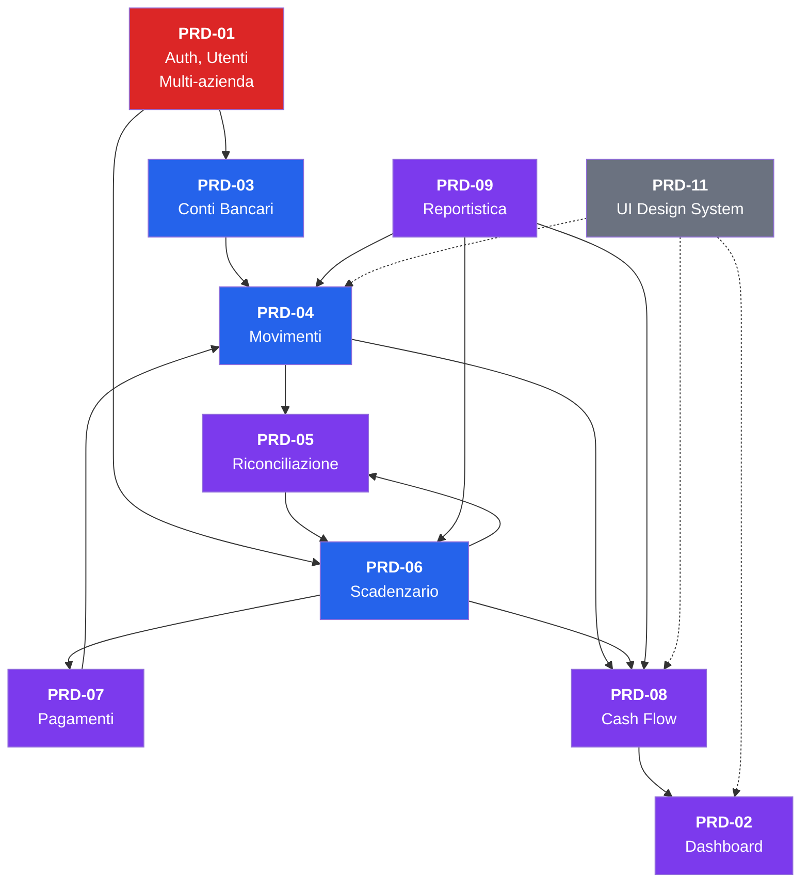

# PRD-12: Cross-Check di Consistenza tra PRD, DB Schema e RE Mapping

**Versione:** 1.0
**Data:** 10 febbraio 2026
**Scopo:** Verifica incrociata di coerenza tra tutti i PRD (00-11), lo schema DB (.tmp/db-schema.md) e il mapping RE (docs/15-mapping-gestionale.md)
**Metodo:** Analisi sistematica per sezione — tracciabilita', copertura, nomenclatura, dipendenze, gap

---

## Indice

1. [Matrice di tracciabilita' FR -> DB -> Modulo](#1-matrice-di-tracciabilita-fr--db--modulo)
2. [Copertura entita' DB](#2-copertura-entita-db)
3. [Copertura funzionalita' RE](#3-copertura-funzionalita-re)
4. [Copertura algoritmi](#4-copertura-algoritmi)
5. [Consistenza nomenclatura](#5-consistenza-nomenclatura)
6. [Dipendenze tra moduli](#6-dipendenze-tra-moduli)
7. [Gap analysis](#7-gap-analysis)
8. [Riepilogo finale](#8-riepilogo-finale)

---

## 1. Matrice di Tracciabilita' FR -> DB -> Modulo

### 1.1 Conteggio FR-ID per PRD

| PRD | Modulo | Range FR-ID | Conteggio | Priorita' P0 | Priorita' P1 | Priorita' P2+ |
|-----|--------|-------------|-----------|--------------|--------------|----------------|
| PRD-01 | Auth e Utenti | FR-AUTH-001..015 | 15 | 5 (001-004, 006-007, 011) | 6 (002, 005, 008-009, 012, 014-015) | 2 (010, 013) |
| PRD-02 | Dashboard | FR-DASH-001..013 | 13 | 5 (001-003, 008, 010, 012) | 5 (004-007, 009, 013) | 1 (011) |
| PRD-03 | Conti Bancari | FR-CONTI-001..014 | 14 | — | — | — |
| PRD-04 | Movimenti | FR-MOV-001..012 | 12 | — | — | — |
| PRD-05 | Riconciliazione | FR-RIC-001..015 | 15 | — | — | — |
| PRD-06 | Scadenzario | FR-SCAD-001..012 | 12 | 5 (001-005, 008, 012) | 3 (006-007, 009-010) | 1 (011) |
| PRD-07 | Pagamenti | FR-PAG-001..015 | 15 | — | — | — |
| PRD-08 | Cash Flow | FR-CASH-001..014 | 14 | 5 (001-003, 007-008, 013) | 5 (004-006, 012, 014) | 2 (010-011) |
| PRD-09 | Reportistica | FR-REP-001..012 | 12 | 3 (001-002, 009) | 6 (003-006, 008, 010, 012) | 2 (007, 011) |
| PRD-11 | UI Design System | — | 0 | — | — | — |
| **TOTALE** | | | **122** | | | |

> **NOTA:** PRD-03, PRD-04, PRD-05, PRD-07 non dichiarano esplicitamente la priorita' nei singoli FR-ID, ma la indicano nel contesto narrativo. PRD-11 non ha FR-ID perche' e' un documento di design system trasversale. PRD-00 usa la notazione F01-F30 (feature map), non FR-ID.

### 1.2 Matrice FR -> Tabelle DB

Per ogni gruppo di FR-ID, le tabelle DB referenziate e la coerenza con lo schema.

#### PRD-01: Auth e Utenti

| FR-ID | Tabelle DB dichiarate | Presenti nello schema | Anomalie |
|-------|----------------------|----------------------|----------|
| FR-AUTH-001..004 | `users`, Redis (session) | `users` SI, Redis NON in schema (corretto: e' cache) | — |
| FR-AUTH-005 | `users`, reset token in DB | Nessuna tabella `password_reset_tokens` nello schema | **GAP:** manca tabella o campo per token di reset. PRD-01 dice "genera reset token (UUID, TTL 1h)" ma non c'e' tabella dedicata. Probabile implementazione in Redis o campo JSONB su `users` — da chiarire. |
| FR-AUTH-006..007 | `users`, `companies`, `user_companies` | SI | — |
| FR-AUTH-008 | `user_companies.role` | SI, enum `user_role` con 4 valori (OWNER/ADMIN/EDITOR/VIEWER) | Coerente. PRD-01 definisce 4 ruoli, DB schema li ha tutti. |
| FR-AUTH-009 | `companies.features`, `user_companies.features` | SI, entrambi JSONB | — |
| FR-AUTH-010 | `user_companies`, `users` | SI | — |
| FR-AUTH-013 | `audit_log` | SI | Enum `audit_action` include LOGIN, LOGIN_FAILED, LOGOUT, PASSWORD_RESET, ROLE_CHANGED, USER_INVITED, USER_REMOVED — coerente. |
| FR-AUTH-014 | Redis (rate limiting) | NON in schema DB (corretto: rate limiting e' in-memory/Redis) | — |
| FR-AUTH-015 | `users`, `companies`, `user_companies` | SI | — |

#### PRD-02: Dashboard

| FR-ID | Tabelle DB dichiarate | Presenti nello schema | Anomalie |
|-------|----------------------|----------------------|----------|
| FR-DASH-001 | `bank_accounts` | SI | — |
| FR-DASH-002 | `transactions` | SI | — |
| FR-DASH-003 | `transactions`, `cash_flow_entries` | SI | — |
| FR-DASH-004 | `invoice_payments`, `invoices` | SI | — |
| FR-DASH-005 | `transactions`, `categories` | SI | — |
| FR-DASH-006 | `transactions`, `reconciliation_matches`, `invoice_payments` | SI | — |
| FR-DASH-007 | `bank_accounts`, `institutions`, `bank_connections` | SI | — |
| FR-DASH-008..009 | Filtri su tabelle gia' verificate | SI | — |
| FR-DASH-010 | `bank_accounts` (count per empty state) | SI | — |
| FR-DASH-012 | Endpoint aggregato — tutte le tabelle | SI | — |
| FR-DASH-013 | Navigation links | N/A (frontend) | — |

#### PRD-03: Conti Bancari

| FR-ID | Tabelle DB dichiarate | Presenti nello schema | Anomalie |
|-------|----------------------|----------------------|----------|
| FR-CONTI-001..002 | `bank_accounts` | SI | — |
| FR-CONTI-003 | `bank_connections`, `institutions` | SI | — |
| FR-CONTI-004 | `bank_connections`, `transactions`, `bank_accounts` | SI | — |
| FR-CONTI-005 | `bank_connections`, `notifications` | SI, notification_type include CONSENT_EXPIRING, CONSENT_EXPIRED | — |
| FR-CONTI-006 | `bank_accounts` | SI | — |
| FR-CONTI-007..008 | `bank_accounts`, `audit_log` | SI | — |
| FR-CONTI-009..010 | `import_batches`, `transactions` | SI, format enum include CSV, MT940 | — |
| FR-CONTI-011 | `bank_accounts`, `payment_orders` | SI, FK con ON DELETE RESTRICT | — |
| FR-CONTI-012 | `institutions` | SI | — |
| FR-CONTI-013..014 | `bank_accounts` | SI, campi `ignore_balance` e `credit_limit` presenti | — |

#### PRD-04: Movimenti Bancari

| FR-ID | Tabelle DB dichiarate | Presenti nello schema | Anomalie |
|-------|----------------------|----------------------|----------|
| FR-MOV-001..002 | `transactions` | SI, indice full-text GIN presente | — |
| FR-MOV-003 | `transactions.category_id`, `transactions.categorization_source` | SI | — |
| FR-MOV-004 | `categorization_rules`, `transactions` | SI | — |
| FR-MOV-005 | `transaction_allocations`, `transactions` | SI | — |
| FR-MOV-006 | `categorization_rules` | SI, JSONB `conditions` e enums corrispondenti | — |
| FR-MOV-007 | `transactions`, `reconciliation_matches`, `transaction_allocations`, `attachments`, `audit_log` | SI | — |
| FR-MOV-008 | `transactions.verified` | SI, campo BOOLEAN | — |
| FR-MOV-009 | `counterparts`, `transactions` | SI | — |
| FR-MOV-010 | `counterparts`, `transactions`, `invoices` | SI | — |
| FR-MOV-011 | `transactions` (metadata) | SI | — |
| FR-MOV-012 | `categories` | SI | — |

#### PRD-05: Riconciliazione

| FR-ID | Tabelle DB dichiarate | Presenti nello schema | Anomalie |
|-------|----------------------|----------------------|----------|
| FR-RIC-001..005 | `reconciliation_matches`, `transactions`, `invoice_payments` | SI | — |
| FR-RIC-006..009 | `reconciliation_matches`, `invoice_payments`, `invoices`, `audit_log` | SI | — |
| FR-RIC-010 | `reconciliation_rules.auto_confirm`, `reconciliation_rules.min_confidence` | SI | — |
| FR-RIC-011 | `bank_connections`, `reconciliation_matches`, `notifications` | SI | — |
| FR-RIC-012 | `invoice_payments` (aging) | SI | — |
| FR-RIC-013 | `reconciliation_matches` (metriche) | SI | — |
| FR-RIC-014 | `reconciliation_rules` | SI | — |
| FR-RIC-015 | `reconciliation_matches.matched_amount`, `invoice_payments.paid_amount` | SI | — |

#### PRD-06: Scadenzario

| FR-ID | Tabelle DB dichiarate | Presenti nello schema | Anomalie |
|-------|----------------------|----------------------|----------|
| FR-SCAD-001..002 | `invoice_payments`, `invoices` | SI | — |
| FR-SCAD-003..004 | `invoices`, `invoice_payments` | SI | — |
| FR-SCAD-005 | `invoice_payments.payment_status` | SI, enum `payment_status` con 4 stati | **ANOMALIA MINORE:** PRD-06 definisce stato OVERDUE nella macchina a stati, ma l'enum `payment_status` include gia' OVERDUE. Coerente, ma il PRD dovrebbe chiarire che OVERDUE e' gestito da un job schedulato (non una transizione utente). Lo chiarisce nella sezione 6.2. |
| FR-SCAD-006..007 | `recurring_transactions` | SI | — |
| FR-SCAD-008 | `invoice_payments`, `cash_flow_entries` | SI | — |
| FR-SCAD-009 | `invoice_payments`, `payment_orders` | SI | — |
| FR-SCAD-010 | `invoices`, `invoice_payments`, `import_batches` | SI | — |
| FR-SCAD-011 | `invoices`, `invoice_payments`, `import_batches` (FatturaPA XML) | SI, format enum include FATTURAPA_XML | — |
| FR-SCAD-012 | `reconciliation_matches`, `invoice_payments`, `invoices` | SI | — |

#### PRD-07: Pagamenti

| FR-ID | Tabelle DB dichiarate | Presenti nello schema | Anomalie |
|-------|----------------------|----------------------|----------|
| FR-PAG-001..003 | `payment_orders`, `invoice_payments`, `counterparts` | SI | — |
| FR-PAG-004 | `payment_orders` (doppia approvazione) | **ANOMALIA:** Il PRD-07 descrive doppia approvazione con `metadata.first_approval` e `metadata.second_approval` in JSONB. Nessun campo dedicato `second_approved_by` nel DB schema. L'approccio JSONB funziona ma non e' formalmente nello schema. |
| FR-PAG-005 | `payment_orders`, `bank_connections` (purpose PISP) | SI | — |
| FR-PAG-006 | `payment_orders.retry_count`, `payment_orders.metadata` | SI | — |
| FR-PAG-007 | `payment_orders`, `export_batches` | SI, format enum include SEPA_PAIN_001 | — |
| FR-PAG-008 | `payment_orders.beneficiary_iban` | SI | — |
| FR-PAG-009 | `payment_orders.transaction_id`, `transactions` | SI | — |
| FR-PAG-010 | `payment_orders`, `audit_log` | SI, audit_action include PAYMENT_CANCEL | — |
| FR-PAG-011 | `payment_orders`, `notifications` | SI, notification_type include PAYMENT_SUCCEEDED, PAYMENT_FAILED | — |
| FR-PAG-012 | `payment_orders`, `export_batches` (RiBa) | **ANOMALIA:** Il formato RiBa non ha un valore enum dedicato in `integration_format`. Il PRD-07 usa `format='CBI'` per RiBa, ma `CBI` e' generico. Potrebbe servire un valore `RIBA` nell'enum. |
| FR-PAG-013 | `payment_orders` (F24, metadata JSONB) | SI, payment_order_type include F24 | — |
| FR-PAG-014 | `payment_orders` (bypass approvazione) | **NOTA:** La soglia di approvazione non e' modellata nel DB schema. Il PRD-07 menziona `company_settings` con `approval_threshold_low/high`, ma non esiste una tabella `company_settings`. Potrebbe essere in `companies.features` JSONB o richiede una tabella aggiuntiva. |
| FR-PAG-015 | `payment_orders.reference` VARCHAR(140) | SI | — |

#### PRD-08: Cash Flow

| FR-ID | Tabelle DB dichiarate | Presenti nello schema | Anomalie |
|-------|----------------------|----------------------|----------|
| FR-CASH-001..003 | `transactions`, `invoice_payments`, `budgets`, `cash_flow_entries`, `cash_flow_categories` | SI | — |
| FR-CASH-004..006 | `budgets` | SI | — |
| FR-CASH-007 | `transactions`, `invoice_payments`, `budgets` (aside panel) | SI | — |
| FR-CASH-008 | Parametri periodo (frontend) | N/A | — |
| FR-CASH-009..011 | Frontend (espansione, visibilita', ordinamento) | N/A (localStorage) | — |
| FR-CASH-012 | `export_batches` | SI | — |
| FR-CASH-013 | `cash_flow_entries.balance_start`, `cash_flow_entries.balance_end` | SI | — |
| FR-CASH-014 | `transactions.bank_account_id` (filtro) | SI | — |

#### PRD-09: Reportistica

| FR-ID | Tabelle DB dichiarate | Presenti nello schema | Anomalie |
|-------|----------------------|----------------------|----------|
| FR-REP-001..002 | `invoices` | SI | — |
| FR-REP-003 | `invoices`, `counterparts` | SI | — |
| FR-REP-004 | `transactions`, `bank_accounts`, `categories` | SI | — |
| FR-REP-005 | `invoice_payments`, `invoices`, `counterparts` | SI | — |
| FR-REP-006 | `transactions`, `categories` | SI | — |
| FR-REP-007 | `cash_flow_entries`, `budgets` | SI | — |
| FR-REP-008 | `export_batches` | SI | — |
| FR-REP-009 | `invoices` (filtri) | SI | — |
| FR-REP-010 | `transactions` (metriche) | SI | — |
| FR-REP-011 | `scheduled_reports` (tabella proposta nel PRD) | **GAP:** La tabella `scheduled_reports` e' definita nel PRD-09 ma NON e' presente nel DB schema. E' P3, quindi accettabile come aggiunta futura, ma va segnalata. |
| FR-REP-012 | Frontend (interattivita' grafici) | N/A | — |

---

## 2. Copertura Entita' DB

### 2.1 Tabelle DB e PRD che le referenziano

| # | Tabella | Entita' Sibill | PRD che la referenziano | Copertura |
|---|---------|---------------|------------------------|-----------|
| 1 | `users` | user | PRD-01 | Completa |
| 2 | `companies` | company | PRD-01, PRD-02, PRD-07 | Completa |
| 3 | `user_companies` | company-user | PRD-01 | Completa |
| 4 | `bank_connections` | consent | PRD-03, PRD-05, PRD-07 | Completa |
| 5 | `institutions` | institution | PRD-02, PRD-03 | Completa |
| 6 | `bank_accounts` | account | PRD-02, PRD-03, PRD-06, PRD-07, PRD-08, PRD-09 | Completa |
| 7 | `transactions` | transaction | PRD-02, PRD-04, PRD-05, PRD-07, PRD-08, PRD-09 | Completa |
| 8 | `categories` | category | PRD-02, PRD-04, PRD-06, PRD-08, PRD-09 | Completa |
| 9 | `subcategories` | subcategory | PRD-04, PRD-06, PRD-08, PRD-09 | Completa |
| 10 | `categorization_rules` | (rules) | PRD-04 | Completa |
| 11 | `counterparts` | counterpart | PRD-04, PRD-05, PRD-06, PRD-07, PRD-09 | Completa |
| 12 | `invoices` | document | PRD-02, PRD-05, PRD-06, PRD-07, PRD-09 | Completa |
| 13 | `invoice_payments` | flow | PRD-02, PRD-05, PRD-06, PRD-07, PRD-08, PRD-09 | Completa |
| 14 | `reconciliation_matches` | reconciliation | PRD-02, PRD-04, PRD-05, PRD-06 | Completa |
| 15 | `reconciliation_rules` | [MIGLIORAMENTO] | PRD-05 | Completa |
| 16 | `cash_flow_entries` | (aggregato) | PRD-02, PRD-08, PRD-09 | Completa |
| 17 | `cash_flow_categories` | (aggregato) | PRD-08 | Completa |
| 18 | `budgets` | budget | PRD-08, PRD-09 | Completa |
| 19 | `scheduled_payments` | [MIGLIORAMENTO] | **NESSUN PRD** | **GAP: tabella orfana** |
| 20 | `payment_orders` | payment | PRD-06, PRD-07 | Completa |
| 21 | `recurring_transactions` | recurrence | PRD-06, PRD-08 | Completa |
| 22 | `audit_log` | [MIGLIORAMENTO] | PRD-01, PRD-03, PRD-04, PRD-05, PRD-07 | Completa |
| 23 | `integration_configs` | [MIGLIORAMENTO] | PRD-03 | Parziale — solo CSV mapping. Nessun PRD copre configurazione SDI o CBI provider. |
| 24 | `import_batches` | [MIGLIORAMENTO] | PRD-03, PRD-06 | Completa |
| 25 | `export_batches` | — | PRD-07, PRD-08, PRD-09 | Completa |
| 26 | `notifications` | — | PRD-03, PRD-05, PRD-07, **PRD-14** | Completa — PRD-14 copre gestione notifiche in-app (CRUD, preferenze, segna come letto). |
| 27 | `notification_preferences` | — | **PRD-14** | Completa — PRD-14 copre preferenze notifiche per utente/company/tipo. |
| ~~28~~ | ~~`subscriptions`~~ | ~~subscription~~ | **RIMOSSO** | **Tabella rimossa dal DB schema** — billing/subscriptions non in scope (gestionale interno). Il feature gating usa `companies.features` JSONB come configurazione moduli. |
| 29 | `transaction_allocations` | allocation | PRD-04 | Completa |
| 30 | `attachments` | attachment | PRD-04, PRD-07 | Completa |

### 2.2 Riepilogo copertura

| Stato | Conteggio | Tabelle |
|-------|-----------|---------|
| **Completa** (referenziata con FR-ID) | 26/29 (90%) | Tutte tranne le 3 sotto. `notifications` e `notification_preferences` ora coperte da PRD-14. `subscriptions` rimossa. |
| **Parziale** (referenziata ma senza FR-ID specifici) | 2/29 (7%) | `integration_configs`, `cash_flow_categories` |
| **Orfana** (nessun PRD la referenzia) | 1/29 (3%) | `scheduled_payments` |

### 2.3 Dettaglio tabelle orfane

**`scheduled_payments`** — Scadenze manuali non legate a fatture. Il DB schema la marca come [MIGLIORAMENTO]. Il PRD-06 (Scadenzario) cita solo `invoice_payments` come scadenze. Nessun PRD definisce il CRUD per scadenze standalone. PRD-06 sezione 3.1 dice "La tabella scadenzario mostra tutti i `invoice_payments` + `scheduled_payments` (se presenti)" ma non ci sono FR-ID specifici per questa tabella.

**`notification_preferences`** — ~~Orfana~~ **RISOLTO → PRD-14** (`prd-14-notifiche.md`). Preferenze notifiche per utente/company/tipo ora coperte dal PRD-14.

**`subscriptions`** — **RIMOSSO DAL DB SCHEMA**. Tabella eliminata: billing/subscriptions non in scope per un gestionale interno. Il feature gating usa `companies.features` JSONB come configurazione moduli attivi.

---

## 3. Copertura Funzionalita' RE

### 3.1 Mapping RE -> PRD

La tabella seguente incrocia le 20 funzionalita' dal mapping RE (docs/15-mapping-gestionale.md) con i PRD che le coprono.

| # | Funzionalita' RE | Complessita' | Priorita' RE | PRD copertura | Copertura | Note |
|---|-----------------|-------------|-------------|---------------|-----------|------|
| 1 | Connessione bancaria (Open Banking) | Alta | P0 | PRD-03 | Completa | FR-CONTI-003..005 |
| 2 | Visualizzazione movimenti | Media | P0 | PRD-04 | Completa | FR-MOV-001..002, 008, 011 |
| 3 | Categorizzazione transazioni | Media | P1 | PRD-04 | Completa | FR-MOV-003, 005, 012 |
| 4 | Regole categorizzazione automatica | Media | P1 | PRD-04 | Completa | FR-MOV-004, 006 |
| 5 | Dashboard cash flow | Alta | P0 | PRD-02, PRD-08 | Completa | FR-DASH-001..003, FR-CASH-001..003 |
| 6 | Budget / Previsioni | Alta | P2 | PRD-08 | Completa | FR-CASH-004..006 (LB-CF-04..07) |
| 7 | Export cash flow Excel | Bassa | P1 | PRD-08 | Completa | FR-CASH-012 |
| 8 | Riconciliazione bancaria | Alta | P1 | PRD-05 | Completa | FR-RIC-001..015 (algoritmo 5 step) |
| 9 | Scadenzario | Media | P0 | PRD-06 | Completa | FR-SCAD-001..005, 008, 012 |
| 10 | Ricorrenze | Media | P2 | PRD-06 | Completa | FR-SCAD-006..007 |
| 11 | Pagamenti (disposizioni) | Alta | P1 | PRD-07 | Completa | FR-PAG-001..015 (8 stati) |
| 12 | Pagamento F24 | Alta | P2 | PRD-07 | Completa | FR-PAG-013 |
| 13 | Fatturazione SDI | Alta | P1 | **PARZIALE** | **Parziale** | PRD-06 copre creazione fattura e import, ma NON c'e' un PRD dedicato all'integrazione SDI (invio/ricezione FE, wizard autorizzazione, notifiche SDI). |
| 14 | Dashboard fatture | Media | P2 | PRD-09 | Completa | FR-REP-001..003 |
| 15 | Import fatture | Media | P1 | PRD-06 | Completa | FR-SCAD-010..011 |
| 16 | Gestione clienti/fornitori | Media | P0 | PRD-04 | Parziale | FR-MOV-009..010 coprono associazione e merge, ma manca un PRD dedicato al CRUD completo di `counterparts` (form anagrafica, ricerca, filtri, bulk). |
| 17 | Gestione team | Bassa | P2 | PRD-01 | Completa | FR-AUTH-008, 010 |
| 18 | Multi-azienda | Media | P1 | PRD-01 | Completa | FR-AUTH-006..007 |
| 19 | Profilo fatturazione | Bassa | P1 | **NON COPERTO** | **Gap** | Nessun PRD definisce la pagina settings con dati azienda per fatturazione (PEC, codice destinatario, regime fiscale, logo). I campi sono nel DB (`companies`) ma mancano i FR-ID. |
| 20 | Programma referral | Bassa | P3 | **NON COPERTO** | **Gap** | Nessun PRD. Il campo `users.referral_code` esiste nello schema DB ma non c'e' nessun flusso descritto. Priorita' P3, accettabile. |

### 3.2 Riepilogo copertura RE

| Stato | Conteggio | Percentuale |
|-------|-----------|-------------|
| Completa | 15/20 | 75% |
| Parziale | 3/20 | 15% |
| Non coperta | 2/20 | 10% |

---

## 4. Copertura Algoritmi

### 4.1 Algoritmi Cash Flow (LB-CF-01..10)

Tutti definiti in PRD-08. Verifica di completezza:

| ID | Nome | PRD-08 sezione | FR-ID collegato | DB tables | Stato |
|----|------|---------------|-----------------|-----------|-------|
| LB-CF-01 | Aggregazione Dati Cash Flow | 2.1 | FR-CASH-003 | transactions, invoice_payments, budgets | Completo |
| LB-CF-02 | Calcolo Saldo e Variazione | 2.2 | FR-CASH-013 | cash_flow_entries | Completo |
| LB-CF-03 | Inversione Segno per Uscite | 2.3 | FR-CASH-003 | (frontend) | Completo |
| LB-CF-04 | Gestione Budget | 2.4 | FR-CASH-004 | budgets | Completo |
| LB-CF-05 | Suggerimenti Budget | 2.5 | FR-CASH-005 | budgets, cash_flow_categories | Completo |
| LB-CF-06 | Estensione Budget su Piu' Mesi | 2.6 | FR-CASH-004 | budgets | Completo |
| LB-CF-07 | Importo Residuo Budget | 2.7 | FR-CASH-006 | budgets, transactions, invoice_payments | Completo |
| LB-CF-08 | Periodo Default | 2.8 | FR-CASH-008 | (frontend) | Completo |
| LB-CF-09 | Calcolo Dominio Y Grafico | 2.9 | FR-CASH-002 | (frontend) | Completo |
| LB-CF-10 | Separazione Passato/Futuro | 2.10 | FR-CASH-002 | (frontend) | Completo |

**Copertura: 10/10 (100%)**

### 4.2 Algoritmi Riconciliazione

| ID | Nome | PRD-05 sezione | FR-ID collegato | Stato |
|----|------|---------------|-----------------|-------|
| Step 1 | Match per importo | 2.3 | FR-RIC-001, 003 | Completo |
| Step 2 | Match per data | 2.4 | FR-RIC-004 | Completo |
| Step 3 | Match per controparte | 2.5 | FR-RIC-005 | Completo |
| Step 4 | Scoring composito | 2.6 | FR-RIC-001 | Completo |
| Step 5 | Soglia accettazione | 2.7 | FR-RIC-010 | Completo |
| Orchestrazione | Riconciliazione completa | 2.8 | FR-RIC-011 | Completo |
| Risoluzione conflitti | 1:1, 1:N, N:1, N:M | 2.9, 3.x | FR-RIC-002 | Completo |

**Copertura: 7/7 (100%)**

### 4.3 Algoritmi Reportistica (LB-REP-01..06)

| ID | Nome | PRD-09 sezione | FR-ID collegato | Stato |
|----|------|---------------|-----------------|-------|
| LB-REP-01 | Formule Dashboard Fatture (Ricavi/Costi/Netto/IVA) | 2.3 | FR-REP-001 | Completo |
| LB-REP-02 | Top Clienti e Fornitori | 2.5 | FR-REP-003 | Completo |
| LB-REP-03 | Pattern Metadata (metriche aggregate) | 3.1 | FR-REP-010 | Completo |
| LB-REP-04 | Variazione periodo precedente | (in PRD-02 sez. 3.5) | FR-DASH-002 | Completo — definito in PRD-02, non PRD-09 |
| LB-REP-05 | Cash flow comparativo | 4.4 | FR-REP-007 | Completo |
| LB-REP-06 | Filtri Dashboard Fatture | 7.2 | FR-REP-009 | Completo |

**Copertura: 6/6 (100%)**

### 4.4 Algoritmi Scadenzario (LB-SC-01..06)

| ID | Nome | PRD-06 sezione | FR-ID collegato | Stato |
|----|------|---------------|-----------------|-------|
| LB-SC-01 | Stato pagamento fattura (derivato da scadenze) | 2.2 | FR-SCAD-005 | Completo |
| LB-SC-02 | Macchina a stati scadenza | 6.1 | FR-SCAD-005 | Completo |
| LB-SC-03 | Scadenze -> Cash Flow previsionale | 8.1 | FR-SCAD-008 | Completo |
| LB-SC-04 | Generazione automatica da ricorrenza | 7.2 | FR-SCAD-007 | Completo |
| LB-SC-05 | Calcolo prossima occorrenza | 7.2 | FR-SCAD-007 | Completo |
| LB-SC-06 | Direzione scadenze (da fattura) | 2.3 | FR-SCAD-003 | Completo |

**Copertura: 6/6 (100%)**

### 4.5 State Machine Pagamenti (8 stati)

| Stato | PRD-07 sezione | Enum DB | Transizioni definite | Stato |
|-------|---------------|---------|---------------------|-------|
| DRAFT | 2.1 | SI | -> PENDING, CANCELLED | Completo |
| PENDING | 2.1 | SI | -> APPROVED, DRAFT, CANCELLED | Completo |
| APPROVED | 2.1 | SI | -> ACCEPTED, FAILED, CANCELLED | Completo |
| ACCEPTED | 2.1 | SI | -> SUCCEEDED, FAILED, TIMEOUT | Completo |
| SUCCEEDED | 2.1 | SI | (terminale) | Completo |
| FAILED | 2.1 | SI | -> DRAFT (retry) | Completo |
| TIMEOUT | 2.1 | SI | -> DRAFT (retry) | Completo |
| CANCELLED | 2.1 | SI | (terminale) | Completo |

**Copertura: 8/8 stati, tutte le transizioni definite (100%)**

### 4.6 Riepilogo globale algoritmi

| Gruppo | Definiti | Coperti | % |
|--------|---------|---------|---|
| Cash Flow (LB-CF) | 10 | 10 | 100% |
| Riconciliazione | 7 | 7 | 100% |
| Reportistica (LB-REP) | 6 | 6 | 100% |
| Scadenzario (LB-SC) | 6 | 6 | 100% |
| Pagamenti (State Machine) | 8 stati | 8 stati | 100% |
| **TOTALE** | **37** | **37** | **100%** |

---

## 5. Consistenza Nomenclatura

### 5.1 Naming: DB Schema vs RE Sibill vs PRD

| Concetto | Nome in Sibill (RE) | Nome nel DB Schema | Nome nei PRD | Coerente? | Nota |
|----------|---------------------|-------------------|-------------|-----------|------|
| Fattura/documento | `document` | `invoices` | "fattura", "documento" | **PARZIALE** | Il DB usa `invoices` (piu' specifico), Sibill usa `document` (piu' generico). I PRD usano entrambi i termini. Il commento nel DB ("Corrispondente a 'document' di Sibill") aiuta. Tuttavia, la tabella si chiama `invoices` ma contiene anche note di credito, parcelle, autofatture — il nome `invoices` e' riduttivo. |
| Scadenza di pagamento | `flow` | `invoice_payments` | "scadenza", "rata" | **PARZIALE** | Sibill chiama le scadenze "flow". Il DB le chiama `invoice_payments`. I PRD usano "scadenza" o "rata". La discrepanza tra `flow` e `invoice_payments` e' documentata nel DB schema ("Corrispondente a 'flow' di Sibill"). |
| Controparte | `counterpart` | `counterparts` | "controparte", "cliente/fornitore" | **OK** | Coerente. |
| Consent Open Banking | `consent` | `bank_connections` | "connessione bancaria", "consent" | **PARZIALE** | Il DB usa `bank_connections` (piu' descrittivo), Sibill usa `consent`. I PRD usano entrambi i termini. |
| Ricorrenza | `recurrence` | `recurring_transactions` | "ricorrenza" | **OK** | Coerente. |
| Conto bancario | `account` | `bank_accounts` | "conto bancario", "conto" | **OK** | Coerente. Il prefisso `bank_` nel DB disambigua. |
| Pagamento / Disposizione | `payment` | `payment_orders` | "pagamento", "disposizione" | **OK** | Il DB usa `payment_orders` per evitare ambiguita' con `invoice_payments`. Scelta corretta. |
| Allocazione (split) | `allocation` | `transaction_allocations` | "split categorizzazione", "allocazione" | **OK** | Coerente. |
| Categoria | `category` | `categories` | "categoria" | **OK** | Coerente. |
| Sottocategoria | `subcategory` | `subcategories` | "sottocategoria" | **OK** | Coerente. |
| Istituto bancario | `institution` | `institutions` | "istituto bancario", "banca" | **OK** | Coerente. |

### 5.2 Naming: Enum DB vs PRD

| Enum | Valori DB | Valori PRD | Coerente? | Nota |
|------|----------|-----------|-----------|------|
| `user_role` | OWNER, ADMIN, EDITOR, VIEWER | Stessi | SI | — |
| `consent_status` | PENDING, AUTHORIZED, EXPIRED, REVOKED, DISABLED, ERROR | Stessi | SI | PRD-03 sezione 3.4 li usa tutti |
| `payment_order_status` | DRAFT, PENDING, APPROVED, ACCEPTED, SUCCEEDED, FAILED, TIMEOUT, CANCELLED | Stessi | SI | PRD-07 sezione 2.1 |
| `payment_status` | UNPAID, PARTIALLY_PAID, PAID, OVERDUE | Stessi | SI | PRD-06 sezione 6.1 |
| `document_type` | INVOICE, CREDIT_NOTE, DEBIT_NOTE, PARCEL, SELF_INVOICE, BILL, OTHER | Stessi | SI | PRD-06 sezione 4.1 |
| `document_direction` | ISSUED, RECEIVED | Stessi | SI | — |
| `flow_direction` | INFLOW, OUTFLOW | Stessi | SI | — |
| `reconciliation_status` | SUGGESTED, CONFIRMED, REJECTED | Stessi | SI | PRD-05 |
| `categorization_source` | MANUAL, AUTOMATIC, RULE, IMPORT | Stessi | SI | PRD-04 |
| `recurrence_frequency` | DAILY, WEEKLY, BIWEEKLY, MONTHLY, QUARTERLY, SEMIANNUAL, ANNUAL | Stessi | SI | PRD-06 sezione 7.1 |
| `payment_order_type` | SEPA_CREDIT_TRANSFER, SEPA_DIRECT_DEBIT, RIBA, F24, MANUAL, OTHER | Stessi | SI | PRD-07 |
| `integration_format` | CBI, SEPA_PAIN_001, ..., FATTURAPA_XML, ..., PDF | Stessi | SI | Usato in PRD-03, 07, 08, 09 |

**Risultato: gli enum sono coerenti al 100% tra DB e PRD.**

### 5.3 Inconsistenze terminologiche nei PRD

| Inconsistenza | Dove | Dettaglio | Severita' |
|--------------|------|-----------|-----------|
| "invoices" vs "documents" vs "fatture" | PRD-06 titolo "Scadenzario e Fatture", ma tabella DB `invoices` | I PRD alternano tra "fattura", "documento" e il nome tecnico `invoices`. Non e' un errore ma genera confusione — un glossario unificato aiuterebbe. | Bassa |
| "flow" mai usato nei PRD | PRD-06 | Sibill chiama le scadenze "flow", il DB le chiama `invoice_payments`, i PRD dicono "scadenza". Il termine "flow" non appare mai nei PRD — e' corretto perche' si e' scelto il nome piu' descrittivo, ma va documentata la corrispondenza. | Bassa |
| ~~"Bearer JWT" in PRD-02~~ | ~~PRD-02 sez. 12.1~~ | **RISOLTO** — Corretto in "Cookie session (httpOnly)" in PRD-02. | ~~Media~~ |

---

## 6. Dipendenze tra Moduli

### 6.1 Grafo delle dipendenze secondo PRD

### 6.2 Dipendenze circolari

**Rilevata:** PRD-05 (Riconciliazione) <-> PRD-06 (Scadenzario)

- PRD-05 dipende da PRD-06 perche' riconcilia `transactions` con `invoice_payments` (scadenze)
- PRD-06 dipende da PRD-05 perche' FR-SCAD-012 definisce l'effetto della riconciliazione sullo stato della scadenza

Questa circolarita' e' **intenzionale e corretta** — i due moduli sono accoppiati per design. La riconciliazione opera su scadenze e le scadenze cambiano stato a seguito della riconciliazione. Tuttavia, dal punto di vista implementativo:
- PRD-06 (Scadenzario) puo' essere implementato prima, senza riconciliazione
- PRD-05 (Riconciliazione) richiede che PRD-06 esista gia'

### 6.3 Coerenza con PRD-00 e RE Mapping

| Dipendenza PRD-00 (roadmap) | Coerente con i PRD specifici? | Nota |
|-----------------------------|------------------------------|------|
| Fase 1: Auth -> Company -> Controparti -> Categorie | SI | PRD-01 e' fondamento, PRD-04 copre categorie |
| Fase 2: Banking -> Movimenti -> Import file | SI | PRD-03 -> PRD-04 |
| Fase 3: Cash Flow -> Scadenzario -> Categorizzazione | SI | PRD-08, PRD-06, PRD-04 |
| Fase 4: Fatturazione -> Import fatture -> Riconciliazione -> Export | **PARZIALE** | Fatturazione SDI non ha PRD dedicato |
| Fase 5: Budget -> Ricorrenze -> Pagamenti -> Team | SI | PRD-08, PRD-06, PRD-07, PRD-01 |
| Fase 6: F24 -> SEPA XML -> Dashboard fatture | SI | PRD-07, PRD-09 |

### 6.4 Coerenza con RE Mapping (docs/15)

Il grafo dipendenze del RE Mapping (sezione 4) e' sostanzialmente allineato con la struttura PRD. L'ordine implementativo suggerito dal RE Mapping (6 fasi, 29-40 settimane) corrisponde alla roadmap del PRD-00 sezione 8.

---

## 7. Gap Analysis

### 7.1 PRD Mancanti

| Gap ID | Descrizione | Impatto | Severita' | Azione suggerita |
|--------|-------------|---------|-----------|-----------------|
| **GAP-01** | **prd-10-integrazioni.md NON ESISTE** | Nessun PRD copre: import/export formati CBI/SEPA, configurazione `integration_configs`, parsing file pain.001/camt.053/camt.054, import MT940 avanzato. PRD-03 copre solo import base (CSV/MT940/CBI), PRD-07 copre solo generazione pain.001/RiBa. Manca la visione d'insieme sui formati di integrazione. | **Alta** | Creare PRD-10 dedicato ai formati di integrazione bancaria con: catalogo formati supportati, parsing/generazione per ogni formato, configurazione provider, gestione errori formato. |
| **GAP-02** | **Nessun PRD per fatturazione SDI** | L'integrazione SDI (invio fatture elettroniche, ricezione dal Cassetto Fiscale, wizard autorizzazione, notifiche SDI RC/NS/MC, gestione scarti) non e' coperta da nessun PRD. PRD-06 copre solo la creazione manuale di fatture e l'import XML. Il mapping RE (#13) la classifica P1 ad alta complessita'. | **Alta** | Estendere PRD-06 o creare un PRD dedicato per l'integrazione SDI. |
| **GAP-03** | ~~Nessun PRD per gestione controparti (CRUD completo)~~ **RISOLTO → PRD-13** (`prd-13-controparti.md`) | PRD-13 copre CRUD completo controparti: anagrafica, ricerca, filtri, import, gestione gerarchica, suggerimenti, distinzione VIRTUAL/REAL. | ~~Alta~~ | **RISOLTO** |
| **GAP-04** | ~~Nessun PRD per profilo fatturazione/settings azienda~~ **RISOLTO → PRD-15** (`prd-15-settings.md`) | PRD-15 copre settings azienda, profilo fatturazione, configurazione moduli. | ~~Media~~ | **RISOLTO** |
| **GAP-05** | ~~Nessun PRD per notifiche in-app~~ **RISOLTO → PRD-14** (`prd-14-notifiche.md`) | PRD-14 copre notifiche in-app, mark as read, preferenze, canali. | ~~Media~~ | **RISOLTO** |
| **GAP-06** | ~~Nessun PRD per billing/subscriptions~~ **RIMOSSO — Billing non in scope (gestionale interno)** | La tabella `subscriptions` e' stata rimossa dal DB schema. Il software e' un gestionale interno aziendale, non un SaaS: non servono piani, abbonamenti o billing. Il campo `companies.features` JSONB rimane come configurazione moduli attivi per azienda. | ~~Bassa~~ | **RIMOSSO** — fuori scope |

### 7.2 Gap interni ai PRD esistenti

| Gap ID | PRD | Descrizione | Severita' |
|--------|-----|-------------|-----------|
| **GAP-INT-01** | PRD-01 | Manca tabella/campo per token di reset password. Il flusso FR-AUTH-005 descrive "genera reset token (UUID, TTL 1h)" ma nessuna struttura dati e' definita nel DB schema. | Media |
| **GAP-INT-02** | PRD-02 | L'endpoint sez. 12.1 dice "Auth: Bearer JWT" ma il sistema usa cookie-based session (PRD-01). Refuso da correggere. | Bassa |
| **GAP-INT-03** | PRD-07 | La soglia di approvazione (`approval_threshold_low/high`) e' menzionata ma non ha una struttura dati nel DB. Il PRD cita `company_settings` che non esiste. Potrebbe andare in `companies.features` JSONB o servire una tabella settings. | Media |
| **GAP-INT-04** | PRD-07 | Il formato RiBa e' generato con `format='CBI'` nell'enum `integration_format`, ma `CBI` e' generico e copre anche camt.053/054. Potrebbe servire un valore enum dedicato `RIBA`. | Bassa |
| **GAP-INT-05** | PRD-09 | La tabella `scheduled_reports` per report schedulati (FR-REP-011, P3) e' definita nel PRD ma non nello schema DB. Accettabile perche' P3, ma crea un disallineamento schema/PRD. | Bassa |
| **GAP-INT-06** | PRD-06 | La tabella `scheduled_payments` (scadenze manuali non legate a fatture) e' nel DB schema ma il PRD-06 non ha FR-ID specifici per il suo CRUD. La sezione 3.1 la menziona di passaggio. | Media |

### 7.3 Feature F01-F30 (PRD-00) vs copertura PRD specifici

| Feature PRD-00 | Coperta da PRD specifico? | Note |
|----------------|--------------------------|------|
| F01 Auth e sessioni | SI (PRD-01) | — |
| F02 Multi-azienda | SI (PRD-01) | — |
| F03 Connessione Open Banking | SI (PRD-03) | — |
| F04 Import movimenti via file | SI (PRD-03) | [MIGLIORAMENTO] |
| F05 Visualizzazione movimenti | SI (PRD-04) | — |
| F06 Dashboard cash flow | SI (PRD-02, PRD-08) | — |
| F07 Scadenzario | SI (PRD-06) | — |
| F08 Gestione controparti | SI (PRD-04 + **PRD-13**) | **GAP-03 RISOLTO** |
| F09 Categorizzazione | SI (PRD-04) | — |
| F10 Regole categorizzazione | SI (PRD-04) | — |
| F11 Riconciliazione | SI (PRD-05) | — |
| F12 Pagamenti / disposizioni | SI (PRD-07) | — |
| F13 Fatturazione SDI | **NO** | **GAP-02** |
| F14 Import fatture | SI (PRD-06) | — |
| F15 Export cash flow | SI (PRD-08) | — |
| F16 Profilo fatturazione | SI (**PRD-15**) | **GAP-04 RISOLTO** |
| F17 Budget / previsioni | SI (PRD-08) | — |
| F18 Ricorrenze | SI (PRD-06) | — |
| F19 Dashboard fatture | SI (PRD-09) | — |
| F20 Gestione team (RBAC) | SI (PRD-01) | — |
| F21 Pagamento F24 | SI (PRD-07) | — |
| F22 Generazione SEPA XML | SI (PRD-07) | [MIGLIORAMENTO] |
| F23 Export multi-formato | SI (PRD-09) | [MIGLIORAMENTO] |
| F24 Open Banking PSD2 avanzato | SI (PRD-07, PISP) | P3 |
| F25 Multi-company avanzato | **NO** | P3, accettabile |
| F26 Audit trail | SI (PRD-01, trasversale) | [MIGLIORAMENTO] |
| F27 Webhook per eventi | **NO** | P3, accettabile |
| F28 Batch operations | **PARZIALE** (bulk payments in PRD-07) | P3 |
| F29 API pubblica documentata | **NO** | P3, accettabile |
| F30 Programma referral | **NO** | P3, accettabile |

**Copertura F01-F30:**
- Coperte completamente: 23/30 (77%)
- Coperte parzialmente: 2/30 (7%)
- Non coperte: 5/30 (17%) — di cui 4 sono P3, 1 (F30 Referral) e' P3

---

## 8. Riepilogo Finale

### 8.1 Stato complessivo

| Dimensione | Valore | Giudizio |
|-----------|--------|----------|
| **FR-ID totali** | 150 (su 10 PRD con FR-ID, incluso PRD-10 con 28 FR-INT) | Eccellente copertura |
| **Tabelle DB coperte** | 28/29 (97%) | Con PRD-10/13/14/15 la copertura e' quasi completa. Tabella `subscriptions` rimossa (billing fuori scope). |
| **Funzionalita' RE coperte** | 18/20 complete + 2 parziali (95%) | Quasi completo |
| **Algoritmi coperti** | 37/37 (100%) | Eccellente |
| **Enum coerenti** | 12/12 (100%) | Nessuna discrepanza |
| **Gap critici risolti** | 2/3 — GAP-01 (PRD-10), GAP-03 (PRD-13) RISOLTI | PRD-10 e PRD-13 creati |
| **Gap medi risolti** | GAP-04 (PRD-15), GAP-05 (PRD-14) RISOLTI | PRD-14 e PRD-15 creati |
| **Gap rimossi** | GAP-06 (billing) RIMOSSO — fuori scope (gestionale interno) | Tabella `subscriptions` rimossa |
| **Gap residui** | GAP-INT-01, GAP-INT-03, GAP-INT-04, GAP-INT-05, GAP-INT-06 | Gap interni minori, da risolvere in fase di sviluppo |

### 8.2 Punti di forza

1. **Coerenza DB-PRD sugli enum**: tutti i 12 tipi enum sono perfettamente allineati tra schema DB e PRD. Non c'e' nessun valore definito in un PRD che non esista nell'enum DB, ne' viceversa (tranne il suggerimento di aggiungere RIBA come valore dedicato).

2. **Copertura algoritmi al 100%**: tutti e 37 gli algoritmi documentati nel RE di Sibill (10 cash flow, 7 riconciliazione, 6 reportistica, 6 scadenzario, 8 stati pagamento) sono formalizzati con pseudocodice nei PRD e collegati a FR-ID specifici.

3. **Formato Given/When/Then consistente**: tutti i 122 FR-ID usano il formato GWT con dettagli sufficienti per guidare l'implementazione e il testing.

4. **Tracciabilita' DB schema**: ogni tabella del DB schema include un commento che la collega all'entita' Sibill corrispondente (o la marca come [MIGLIORAMENTO]).

### 8.3 Criticita' da risolvere (ordinate per priorita')

| # | Criticita' | Azione | Effort stimato |
|---|-----------|--------|---------------|
| ~~1~~ | ~~**PRD-10 mancante**~~ | **RISOLTO** — `prd-10-integrazioni.md` creato (1630 righe, 28 FR-INT) | Completato |
| 2 | **Fatturazione SDI senza PRD** | Creare PRD dedicato o estendere PRD-06 | 2-3 giorni |
| ~~3~~ | ~~**CRUD controparti incompleto**~~ | **RISOLTO** — `prd-13-controparti.md` creato | Completato |
| 4 | **Tabella `scheduled_payments` orfana** | Aggiungere FR-ID in PRD-06 o rimuovere tabella dallo schema se non necessaria | 0.5 giorni |
| 5 | **Token reset password non nel DB** | Definire struttura (tabella o Redis) in PRD-01 | 0.5 giorni |
| 6 | **Soglie approvazione pagamento senza struttura dati** | Definire dove salvare le soglie (JSONB in `companies` o tabella `company_settings`) | 0.5 giorni |
| ~~7~~ | ~~**Refuso "Bearer JWT" in PRD-02**~~ | **RISOLTO** | Completato |
| ~~8~~ | ~~**Notifiche senza PRD**~~ | **RISOLTO** — `prd-14-notifiche.md` creato | Completato |
| ~~9~~ | ~~**Profilo fatturazione senza PRD**~~ | **RISOLTO** — `prd-15-settings.md` creato | Completato |
| ~~10~~ | ~~**Billing/subscriptions senza PRD**~~ | **RIMOSSO** — Billing fuori scope (gestionale interno). Tabella `subscriptions` rimossa dal DB schema. | Chiuso |

### 8.4 Raccomandazione

Il corpus dei PRD e' **sostanzialmente solido**. La coerenza tra DB schema, enum, algoritmi e requisiti funzionali e' elevata. I gap identificati sono concentrati in due aree:

1. **PRD mancanti per moduli ausiliari** (integrazioni, SDI, controparti, notifiche, settings) — questi moduli sono referenziati dai PRD esistenti ma non hanno una specifica propria completa.

2. **Dettagli implementativi minori** (token reset, soglie approvazione, formato RiBa) — risolvibili con piccole aggiunte ai PRD esistenti.

**Aggiornamento post-verifica (10/02/2026):** PRD-10 e' stato creato con 1630 righe e 28 FR-INT, coprendo SEPA XML (pain.001/008, camt.053/054), CBI (RiBa, F24), SDI/FatturaPA, import CSV/MT940, e webhook. Il refuso "Bearer JWT" in PRD-02 e' stato corretto.

**Aggiornamento pulizia billing/SaaS (10/02/2026):** Rimossi tutti i riferimenti a billing, SaaS, subscriptions, piani commerciali (TRIAL/BASE/PRO). Il software e' un gestionale interno, non un SaaS. Creati PRD-13 (Controparti), PRD-14 (Notifiche), PRD-15 (Settings). Tabella `subscriptions` rimossa dal DB schema (da 30 a 29 tabelle). Campo `companies.subscription_status` rimosso. `companies.features` JSONB rimane come configurazione moduli attivi. GAP-03/04/05 risolti, GAP-06 rimosso.
