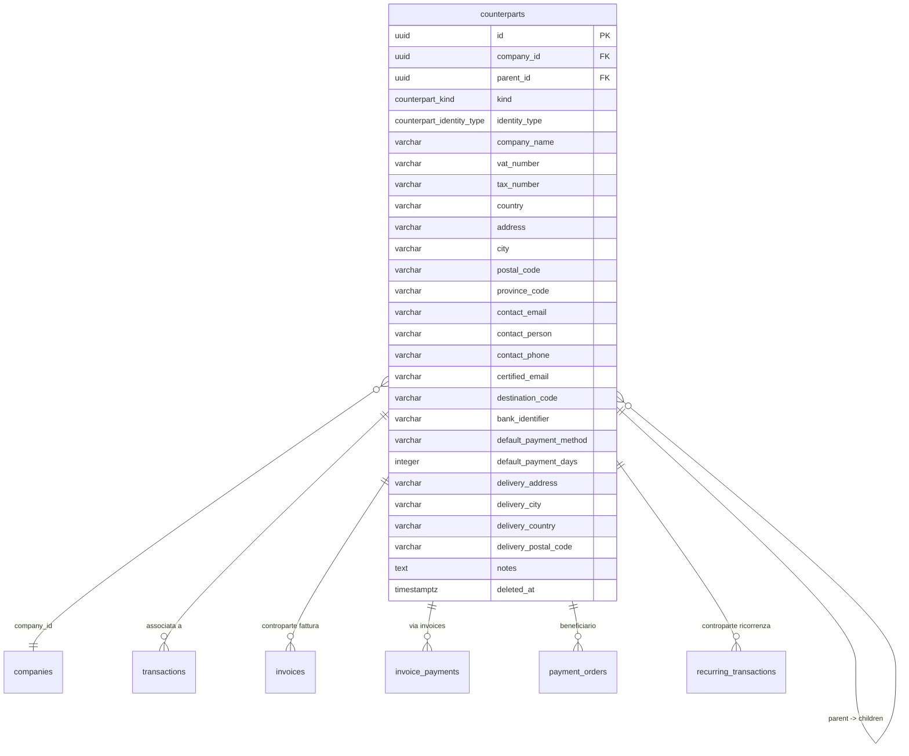

# PRD-13: Gestione Controparti (Clienti e Fornitori)

**Versione:** 1.0
**Data:** 10 febbraio 2026
**Modulo:** Controparti
**Basato su:** RE Sibill docs/03-data-model.md (sezione 2.11), docs/04-api-reference.md (sezione 8), docs/15-mapping-gestionale.md (F08/F16)
**Contratto DB:** `.tmp/db-schema.md`
**Risolve:** GAP-03 (prd-12-cross-check.md)
**Dipendenze:** PRD-01 (auth, RBAC), PRD-04 (associazione controparte a movimenti: FR-MOV-009/010)

---

## 1. Panoramica

Il modulo Controparti gestisce l'anagrafica completa di clienti e fornitori. Ogni controparte puo' essere utilizzata in: movimenti bancari (associazione automatica e manuale), fatture/scadenze, disposizioni di pagamento e riconciliazione.

In Sibill le controparti vivono sotto `/counterparts` e sono di due tipi: `VIRTUAL` (create automaticamente dai movimenti bancari) e `REAL` (create manualmente o da fatture). Il gestionale replica e migliora questo pattern.

**Utenti target:** OWNER, ADMIN, EDITOR (CRUD completo); VIEWER (sola lettura).

---

## 2. Modello Dati

### 2.1 Diagramma ER



### 2.2 Campi Anagrafici Completi

Basati sulla tabella `counterparts` del DB e sui 18+ campi osservati nell'entita' `counterpart` di Sibill (docs/03 sezione 2.11):

| Campo | Tipo DB | Descrizione | Obbligatorio |
|---|---|---|---|
| `company_name` | VARCHAR(255) | Ragione sociale o nome persona | Si |
| `kind` | `counterpart_kind` | REAL (manuale) o VIRTUAL (auto da movimenti) | Si (default: REAL) |
| `identity_type` | `counterpart_identity_type` | COMPANY o INDIVIDUAL | Si (default: COMPANY) |
| `vat_number` | VARCHAR(20) | Partita IVA | No |
| `tax_number` | VARCHAR(20) | Codice fiscale | No |
| `country` | VARCHAR(3) | Codice paese ISO (default: IT) | No |
| `address` | VARCHAR(255) | Indirizzo sede legale | No |
| `city` | VARCHAR(100) | Citta' | No |
| `postal_code` | VARCHAR(10) | CAP | No |
| `province_code` | VARCHAR(5) | Sigla provincia | No |
| `contact_email` | VARCHAR(255) | Email di contatto | No |
| `contact_person` | VARCHAR(255) | Referente / persona di contatto | No |
| `contact_phone` | VARCHAR(30) | Telefono | No |
| `certified_email` | VARCHAR(255) | PEC (fatturazione elettronica) | No |
| `destination_code` | VARCHAR(7) | Codice destinatario SDI | No |
| `bank_identifier` | VARCHAR(34) | IBAN per pagamenti | No |
| `default_payment_method` | VARCHAR(50) | Metodo pagamento predefinito | No |
| `default_payment_days` | INTEGER | Giorni pagamento predefiniti (es. 30, 60, 90) | No |
| `delivery_address` | VARCHAR(255) | Indirizzo consegna (se diverso) | No |
| `delivery_city` | VARCHAR(100) | Citta' consegna | No |
| `delivery_country` | VARCHAR(3) | Paese consegna | No |
| `delivery_postal_code` | VARCHAR(10) | CAP consegna | No |
| `parent_id` | UUID FK | Controparte padre (struttura gerarchica) | No |
| `notes` | TEXT | Note libere | No |

---

## 3. Gestione Anagrafica

### 3.1 Vista Lista Controparti

La pagina principale mostra tutte le controparti REAL dell'azienda (filtro default: `kind != 'VIRTUAL'` e `parent_id IS NULL`, come osservato in Sibill).

| Colonna | Fonte DB | Descrizione |
|---|---|---|
| Ragione sociale | `company_name` | Nome azienda o persona |
| P.IVA / CF | `vat_number` o `tax_number` | Identificativo fiscale |
| Tipo | `identity_type` | COMPANY / INDIVIDUAL |
| Email | `contact_email` | Email di contatto |
| PEC | `certified_email` | Posta certificata |
| IBAN | `bank_identifier` | IBAN predefinito |
| Tipo controparte | `kind` | Badge: REAL / VIRTUAL |
| Citta' | `city` | Citta' sede |

### 3.2 Filtri

| Filtro | Tipo UI | Campo DB | Default |
|---|---|---|---|
| Tipo (kind) | Toggle/Tab | `kind` | REAL (escludi VIRTUAL) |
| Ricerca testo | Input | `company_name ILIKE ...` + `vat_number` + `tax_number` | — |
| Tipo identita' | Select | `identity_type` | Tutti |
| Con email | Toggle | `contact_email IS NOT NULL` | No |
| Con PEC | Toggle | `certified_email IS NOT NULL` | No |
| Con IBAN | Toggle | `bank_identifier IS NOT NULL` | No |
| Solo radice | Toggle | `parent_id IS NULL` | Si |

Confidenza: 🟢 Alta — filtri osservati in Sibill: `kind__eq`, `kind__neq`, `parent.id__empty`, `contactEmail__empty`.

### 3.3 Ordinamento

Default: `company_name ASC` (alfabetico).
Opzioni: per nome, per data creazione, per P.IVA.

### 3.4 Contatore (Metadata)

Endpoint separato per il conteggio totale filtrato (come `/counterparts/metadata` di Sibill):

```json
{"total": 42}
```

---

## 4. Form Creazione / Modifica Controparte

### 4.1 Sezioni del Form

**Sezione 1 — Dati identificativi (obbligatori)**

| Campo | Tipo input | Validazione |
|---|---|---|
| Ragione sociale | Text | Max 255 char, obbligatorio |
| Tipo identita' | Select | COMPANY / INDIVIDUAL |
| P.IVA | Text | Max 20 char, formato italiano (11 cifre per COMPANY) |
| Codice fiscale | Text | Max 20 char, formato italiano (16 char alfanumerico) |
| Paese | Select | ISO 3166, default: IT |

**Sezione 2 — Indirizzo sede**

| Campo | Tipo input | Validazione |
|---|---|---|
| Indirizzo | Text | Max 255 char |
| Citta' | Text | Max 100 char |
| CAP | Text | Max 10 char, numerico per IT |
| Provincia | Text/Select | Max 5 char, sigla (es. MI, RM) |

**Sezione 3 — Contatti**

| Campo | Tipo input | Validazione |
|---|---|---|
| Email contatto | Email | Formato email valido |
| Persona di contatto | Text | Max 255 char |
| Telefono | Tel | Max 30 char |

**Sezione 4 — Fatturazione elettronica**

| Campo | Tipo input | Validazione |
|---|---|---|
| PEC | Email | Formato email valido, dominio PEC |
| Codice destinatario SDI | Text | Esattamente 7 char alfanumerici (o "0000000") |

**Sezione 5 — Default pagamento**

| Campo | Tipo input | Validazione |
|---|---|---|
| IBAN | Text | Max 34 char, formato IBAN (validazione checksum) |
| Metodo pagamento predefinito | Select | Bonifico, RiBa, SDD, F24, Contanti, Altro |
| Giorni pagamento predefiniti | Number | Intero positivo (es. 30, 60, 90) |

**Sezione 6 — Indirizzo consegna (opzionale)**

| Campo | Tipo input | Validazione |
|---|---|---|
| Indirizzo consegna | Text | Max 255 char |
| Citta' consegna | Text | Max 100 char |
| Paese consegna | Select | ISO 3166 |
| CAP consegna | Text | Max 10 char |

**Sezione 7 — Note**

| Campo | Tipo input | Validazione |
|---|---|---|
| Note | Textarea | Nessun limite |

### 4.2 Validazione P.IVA Italiana

```
Regola: P.IVA italiana = 11 cifre numeriche
Algoritmo di controllo (Luhn-like):
  1. Somma cifre in posizione dispari (1,3,5,7,9,11)
  2. Per cifre in posizione pari (2,4,6,8,10): raddoppia, se > 9 sottrai 9
  3. Somma totale mod 10 deve essere 0

Se country != 'IT', la validazione P.IVA segue le regole del paese specifico
(o non viene validata — 🟡 dipende dall'implementazione)
```

### 4.3 Validazione IBAN

```
Regola: IBAN italiano = IT + 2 cifre di controllo + 1 char CIN + 5 cifre ABI + 5 cifre CAB + 12 char conto
Totale: 27 caratteri

Validazione generica IBAN (qualsiasi paese):
  1. Sposta le prime 4 cifre alla fine
  2. Sostituisci lettere con numeri (A=10, B=11, ...)
  3. Calcola modulo 97: risultato deve essere 1
```

---

## 5. Dettaglio Controparte

### 5.1 Vista Dettaglio

La pagina di dettaglio mostra tutti i campi anagrafici e un set di tab con le operazioni collegate:

**Tab 1 — Movimenti collegati**
Lista dei `transactions` dove `counterpart_id = controparte.id`.
Colonne: Data, Descrizione, Importo, Conto, Categoria.

**Tab 2 — Fatture/scadenze collegate**
Lista delle `invoices` dove `counterpart_id = controparte.id`.
Colonne: Numero, Tipo, Data, Importo lordo, Stato pagamento.

**Tab 3 — Pagamenti collegati**
Lista dei `payment_orders` dove `counterpart_id = controparte.id`.
Colonne: Data, Importo, Tipo, Stato.

**Tab 4 — Ricorrenze collegate**
Lista delle `recurring_transactions` dove `counterpart_id = controparte.id`.
Colonne: Descrizione, Importo, Frequenza, Stato.

**Tab 5 — Figli (children)**
Se la controparte ha `children` (controparti con `parent_id = controparte.id`).
Utile per gruppi societari.

### 5.2 Statistiche Aggregate

Nel dettaglio controparte, mostrare:

| Statistica | Calcolo |
|---|---|
| Totale movimenti | COUNT(transactions) WHERE counterpart_id = :id |
| Volume entrate | SUM(amount) WHERE counterpart_id = :id AND direction = 'INFLOW' |
| Volume uscite | SUM(amount) WHERE counterpart_id = :id AND direction = 'OUTFLOW' |
| Fatture aperte | COUNT(invoices) WHERE counterpart_id = :id AND payment_status != 'PAID' |
| Importo scaduto | SUM(invoice_payments.amount - paid_amount) via invoices WHERE payment_status IN ('OVERDUE') |

---

## 6. Controparti VIRTUAL e Promozione a REAL

### 6.1 Creazione Automatica (VIRTUAL)

Le controparti VIRTUAL vengono create automaticamente dal modulo Movimenti Bancari quando un nuovo movimento importato ha un `counterpart_name` o `counterpart_iban` che non corrisponde a nessuna controparte esistente.

**Nota:** questa logica e' gia' definita in PRD-04 (FR-MOV-009). Il presente PRD non la duplica, ma definisce come gestire le controparti VIRTUAL dopo la creazione.

### 6.2 Promozione VIRTUAL -> REAL

L'utente puo' "promuovere" una controparte VIRTUAL a REAL compilando i campi anagrafici:

```
Azione: "Completa anagrafica" su una controparte VIRTUAL

Effetto:
  1. Apre il form di modifica pre-compilato con i dati disponibili
     (company_name, bank_identifier — dai movimenti)
  2. L'utente compila i campi mancanti (P.IVA, indirizzo, PEC, ecc.)
  3. Al salvataggio: kind = 'REAL'
  4. Tutte le transazioni e fatture collegate mantengono il collegamento
```

### 6.3 Suggerimenti Controparti

Endpoint dedicato (come `/counterparts/suggested` di Sibill) per l'autocompletamento nei form:

```
GET /api/v1/counterparts/suggested?q=mario&company_id=UUID

Response:
[
  {"id": "uuid", "company_name": "Mario Rossi SRL", "vat_number": "01234567890"},
  {"id": "uuid", "company_name": "Mario Bianchi", "vat_number": null}
]
```

Ricerca su: `company_name` (trigram fuzzy), `vat_number` (esatto), `tax_number` (esatto).

Confidenza: 🟢 Alta — endpoint `/counterparts/suggested` osservato in Sibill.

---

## 7. Struttura Gerarchica (Parent / Children)

### 7.1 Modello

Una controparte puo' avere un `parent_id` che punta a un'altra controparte. Questo supporta:
- **Gruppi societari**: Societa' madre → societa' figlie
- **Merge VIRTUAL**: Controparte VIRTUAL diventa figlia della controparte REAL corrispondente

Filtro osservato in Sibill: `filter[parent.id__empty]=true` per mostrare solo le controparti radice.

### 7.2 Regole

```
- Un figlio puo' avere al massimo 1 parent
- La profondita' massima e' 1 livello (parent → child, no ricorsione profonda)
- L'eliminazione di un parent NON elimina i figli (i figli diventano radice: parent_id = NULL)
- L'aggregazione nelle statistiche puo' includere i figli (opzionale, toggle UI)
```

---

## 8. Merge Controparti Duplicate

### 8.1 Flusso

**Nota:** la logica di merge di base e' gia' definita in PRD-04 (FR-MOV-010). Il presente PRD estende la funzionalita' con un'interfaccia dedicata.

L'utente accede alla funzione merge dalla pagina di dettaglio controparte o dalla lista:

```
Azione: "Unisci con altra controparte"

  1. L'utente seleziona la controparte SORGENTE (quella da eliminare)
  2. L'utente seleziona la controparte TARGET (quella da mantenere)
  3. Preview: mostra quante entita' verranno migrate
     - N movimenti
     - N fatture
     - N pagamenti
     - N ricorrenze
  4. Conferma: esecuzione atomica (transazione DB)

  Effetto:
    UPDATE transactions SET counterpart_id = :target WHERE counterpart_id = :source
    UPDATE invoices SET counterpart_id = :target WHERE counterpart_id = :source
    UPDATE invoices SET counterpart_name = target.company_name,
                        counterpart_identifier = target.vat_number
                  WHERE counterpart_id = :target
    UPDATE payment_orders SET counterpart_id = :target WHERE counterpart_id = :source
    UPDATE recurring_transactions SET counterpart_id = :target WHERE counterpart_id = :source
    -- Soft delete sorgente
    UPDATE counterparts SET deleted_at = NOW() WHERE id = :source
```

### 8.2 Rilevamento Duplicati

🟡 Il rilevamento automatico dei duplicati non e' stato osservato in Sibill. Funzionalita' aggiuntiva suggerita:

```
Criteri di rilevamento duplicati:
  1. Stessa P.IVA (match esatto) — alta confidenza
  2. Stesso nome (similarity > 0.8 via pg_trgm) — media confidenza
  3. Stesso IBAN — alta confidenza

Il sistema suggerisce periodicamente le coppie duplicate trovate.
L'utente conferma o ignora ogni suggerimento.
```

---

## 9. Import / Export Controparti

### 9.1 Import da CSV

| Campo CSV | Mapping DB | Obbligatorio |
|---|---|---|
| `ragione_sociale` | `company_name` | Si |
| `tipo` | `identity_type` | No (default: COMPANY) |
| `partita_iva` | `vat_number` | No |
| `codice_fiscale` | `tax_number` | No |
| `indirizzo` | `address` | No |
| `citta` | `city` | No |
| `cap` | `postal_code` | No |
| `provincia` | `province_code` | No |
| `email` | `contact_email` | No |
| `pec` | `certified_email` | No |
| `telefono` | `contact_phone` | No |
| `codice_sdi` | `destination_code` | No |
| `iban` | `bank_identifier` | No |
| `metodo_pagamento` | `default_payment_method` | No |
| `giorni_pagamento` | `default_payment_days` | No |
| `note` | `notes` | No |

**Processo:**
1. Upload file CSV
2. Parsing e validazione (formato P.IVA, IBAN, ecc.)
3. Controllo duplicati: match su P.IVA o codice fiscale
4. Preview con errori e duplicati evidenziati
5. Conferma import (con scelta per duplicati: aggiorna / ignora / crea nuovo)
6. Creazione `import_batch` con tracciabilita'
7. Creazione/aggiornamento `counterparts`

### 9.2 Export CSV

Export della lista filtrata corrente in formato CSV con gli stessi campi dell'import.

---

## 10. Regole di Auto-Matching per Riconciliazione

Le controparti supportano il matching automatico nella riconciliazione bancaria. Quando il modulo riconciliazione (PRD-05) confronta un movimento con una scadenza, la controparte e' uno dei criteri di matching:

```
Criterio matching controparte nella riconciliazione:
  1. Se transaction.counterpart_id == invoice.counterpart_id → match esatto (peso alto)
  2. Se transaction.counterpart_name ILIKE invoice.counterpart_name → match fuzzy (peso medio)
  3. Se transaction.counterpart_iban == counterpart.bank_identifier → match IBAN (peso alto)
```

Queste regole vengono utilizzate dal motore di riconciliazione (definito in PRD-05) come uno dei fattori di scoring.

---

## 11. API Endpoints

| Metodo | Path | Descrizione | Parametri principali |
|---|---|---|---|
| `GET` | `/api/v1/counterparts` | Lista controparti filtrata | company_id, kind, identity_type, parent_id, q (ricerca), sort, page |
| `GET` | `/api/v1/counterparts/:id` | Dettaglio controparte | include=children,transactions_summary |
| `GET` | `/api/v1/counterparts/metadata` | Conteggio filtrato | stessi filtri della lista |
| `GET` | `/api/v1/counterparts/suggested` | Autocompletamento | q (ricerca testo), company_id |
| `POST` | `/api/v1/counterparts` | Creazione controparte | Body: campi anagrafici |
| `PATCH` | `/api/v1/counterparts/:id` | Modifica controparte | Body: campi parziali |
| `DELETE` | `/api/v1/counterparts/:id` | Eliminazione (soft delete) | — |
| `POST` | `/api/v1/counterparts/merge` | Merge due controparti | Body: source_id, target_id |
| `GET` | `/api/v1/counterparts/duplicates` | 🟡 Suggerimenti duplicati | company_id |
| `POST` | `/api/v1/import/counterparts` | Import CSV controparti | Multipart: file CSV |
| `GET` | `/api/v1/export/counterparts` | Export CSV controparti | stessi filtri della lista |

### 11.1 GET /api/v1/counterparts

**Query parameters:**

| Parametro | Tipo | Obbligatorio | Descrizione |
|---|---|---|---|
| `company_id` | UUID | Si | ID azienda |
| `kind` | enum | No | REAL / VIRTUAL |
| `identity_type` | enum | No | COMPANY / INDIVIDUAL |
| `parent_id_empty` | boolean | No | `true` = solo radice |
| `q` | string | No | Ricerca testo (nome, P.IVA, CF) |
| `has_email` | boolean | No | Filtra per presenza email |
| `has_iban` | boolean | No | Filtra per presenza IBAN |
| `sort` | string | No | Default: `company_name` ASC |
| `page_size` | integer | No | Default: 50 |
| `page_cursor` | string | No | Cursore paginazione |

**Response (200):**

```json
{
  "data": [
    {
      "id": "uuid",
      "company_name": "Fornitore SRL",
      "kind": "REAL",
      "identity_type": "COMPANY",
      "vat_number": "01234567890",
      "tax_number": null,
      "country": "IT",
      "address": "Via Roma 1",
      "city": "Milano",
      "postal_code": "20100",
      "province_code": "MI",
      "contact_email": "info@fornitore.it",
      "certified_email": "fornitore@pec.it",
      "destination_code": "0000000",
      "bank_identifier": "IT60X0542811101000000123456",
      "default_payment_method": "CREDIT_TRANSFER",
      "default_payment_days": 30,
      "created_at": "2026-01-15T10:00:00Z"
    }
  ],
  "meta": { "total": 42, "page": { "size": 50, "cursor": null } }
}
```

### 11.2 POST /api/v1/counterparts

**Request body:**

```json
{
  "company_name": "Nuovo Fornitore SRL",
  "identity_type": "COMPANY",
  "vat_number": "09876543210",
  "country": "IT",
  "address": "Via Verdi 5",
  "city": "Roma",
  "postal_code": "00100",
  "province_code": "RM",
  "contact_email": "info@nuovofornitore.it",
  "certified_email": "nuovofornitore@pec.it",
  "destination_code": "ABCDEFG",
  "bank_identifier": "IT60X0542811101000000654321",
  "default_payment_method": "CREDIT_TRANSFER",
  "default_payment_days": 60
}
```

### 11.3 POST /api/v1/counterparts/merge

**Request body:**

```json
{
  "source_id": "uuid-controparte-da-eliminare",
  "target_id": "uuid-controparte-da-mantenere"
}
```

**Response (200):**

```json
{
  "merged": {
    "transactions_updated": 15,
    "invoices_updated": 8,
    "payment_orders_updated": 3,
    "recurring_transactions_updated": 1,
    "source_deleted": true
  }
}
```

---

## 12. Requisiti Funzionali

### FR-CTR-001: Vista Lista Controparti

**Priorita':** P0

**Given** un utente autenticato con controparti nell'azienda
**When** accede alla pagina controparti
**Then** visualizza una tabella con tutte le controparti REAL (default: `kind != 'VIRTUAL'` e `parent_id IS NULL`), filtrabili per tipo, ricerca testo, presenza email/PEC/IBAN. Ordinamento default: alfabetico per nome

---

### FR-CTR-002: Creazione Controparte

**Priorita':** P0

**Given** un utente con ruolo OWNER, ADMIN o EDITOR
**When** compila il form di creazione controparte con almeno la ragione sociale
**Then** il sistema crea un record `counterparts` con `kind = 'REAL'`. Se la P.IVA e' specificata e gia' presente per la stessa company, il sistema mostra un warning "Controparte con stessa P.IVA gia' esistente" con link alla controparte esistente (non bloccante)

---

### FR-CTR-003: Modifica Controparte

**Priorita':** P0

**Given** un utente con ruolo OWNER, ADMIN o EDITOR
**When** modifica i campi di una controparte esistente
**Then** i campi vengono aggiornati. Se la controparte era VIRTUAL e l'utente ha compilato campi significativi (P.IVA, indirizzo), il `kind` viene promosso automaticamente a REAL

---

### FR-CTR-004: Eliminazione Controparte (Soft Delete)

**Priorita':** P0

**Given** un utente con ruolo OWNER o ADMIN
**When** elimina una controparte
**Then** il sistema esegue soft delete (`deleted_at = NOW()`). Le entita' collegate (transactions, invoices, payment_orders) mantengono il `counterpart_id` ma non mostrano piu' la controparte nei filtri. I figli (children) diventano radice (`parent_id = NULL`). Un record `audit_log` viene creato

---

### FR-CTR-005: Validazione P.IVA

**Priorita':** P1

**Given** un utente che inserisce una P.IVA nel form controparte
**When** il campo P.IVA perde il focus o il form viene inviato
**Then** per P.IVA italiane (country = IT), il sistema valida il formato (11 cifre) e il checksum (algoritmo Luhn-like). Se non valida, mostra errore inline "P.IVA non valida"

---

### FR-CTR-006: Validazione IBAN

**Priorita':** P1

**Given** un utente che inserisce un IBAN nel campo `bank_identifier`
**When** il campo perde il focus o il form viene inviato
**Then** il sistema valida il formato IBAN (lunghezza corretta per il paese, checksum modulo 97). Se non valido, mostra errore inline "IBAN non valido"

---

### FR-CTR-007: Dettaglio Controparte con Storico Operazioni

**Priorita':** P1

**Given** un utente che apre il dettaglio di una controparte
**When** la pagina viene caricata
**Then** vengono mostrati tutti i dati anagrafici e tab con: movimenti collegati (ultimi 50), fatture collegate, pagamenti collegati, ricorrenze collegate, figli (se presenti). Per ogni tab viene mostrato il conteggio totale

---

### FR-CTR-008: Ricerca e Autocompletamento

**Priorita':** P0

**Given** un utente che compila un campo "controparte" in qualsiasi form (fattura, pagamento, scadenza)
**When** digita almeno 2 caratteri
**Then** il sistema mostra un dropdown con le controparti che matchano per nome (fuzzy), P.IVA (esatta) o codice fiscale (esatto), ordinate per rilevanza. L'endpoint `/counterparts/suggested` viene chiamato con debounce (300ms)

---

### FR-CTR-009: Merge Controparti

**Priorita':** P1

**Given** un utente con ruolo OWNER o ADMIN
**When** seleziona una controparte sorgente e una target e conferma il merge
**Then** tutte le transazioni, fatture, pagamenti e ricorrenze della sorgente vengono migrate alla target. La controparte sorgente viene soft-deleted. Il sistema mostra un riepilogo delle entita' migrate. L'operazione e' atomica (transazione DB). Un record `audit_log` viene creato

**Nota:** il merge di base (da movimenti) e' definito in FR-MOV-010 di PRD-04. Questo FR estende la funzionalita' con un'interfaccia dedicata e preview.

---

### FR-CTR-010: Import Controparti da CSV

**Priorita':** P2

**Given** un utente con ruolo OWNER, ADMIN o EDITOR
**When** carica un file CSV con controparti nel formato previsto
**Then** il sistema valida il file, rileva duplicati (match su P.IVA o CF), mostra una preview con errori e duplicati evidenziati. Dopo conferma, importa le controparti e crea un `import_batch` per tracciabilita'. Per i duplicati, l'utente sceglie: aggiorna dati / ignora / crea comunque

---

### FR-CTR-011: Export Controparti CSV

**Priorita':** P2

**Given** un utente autenticato nella pagina controparti con filtri applicati
**When** clicca "Esporta CSV"
**Then** il sistema genera un file CSV con i campi della tabella visibile, rispettando i filtri applicati, e lo scarica

---

### FR-CTR-012: Promozione VIRTUAL -> REAL

**Priorita':** P1

**Given** una controparte con `kind = 'VIRTUAL'` (creata automaticamente dai movimenti)
**When** l'utente clicca "Completa anagrafica" e compila almeno P.IVA o indirizzo
**Then** il `kind` diventa REAL, i dati inseriti vengono salvati, le associazioni esistenti (transazioni) rimangono intatte

---

### FR-CTR-013: 🟡 Rilevamento Duplicati Automatico

**Priorita':** P2

**Given** controparti nell'anagrafica aziendale
**When** il sistema esegue il check duplicati (periodico o su richiesta)
**Then** vengono suggerite coppie potenzialmente duplicate basate su: stessa P.IVA (confidenza alta), nome simile con `similarity > 0.8` (confidenza media), stesso IBAN (confidenza alta). L'utente puo' confermare il merge o ignorare il suggerimento

🟡 Funzionalita' non osservata in Sibill — aggiunta come miglioramento.

---

### FR-CTR-014: Statistiche Aggregate Controparte

**Priorita':** P2

**Given** un utente nel dettaglio di una controparte
**When** la pagina viene caricata
**Then** vengono mostrate statistiche aggregate: totale movimenti, volume entrate/uscite, numero fatture aperte, importo scaduto. I dati sono calcolati on-demand dall'endpoint dettaglio

---

## 13. Tabelle DB Coinvolte

| Tabella | Ruolo nel Modulo |
|---|---|
| `counterparts` | Entita' principale — anagrafica clienti e fornitori |
| `companies` | Company owner delle controparti |
| `transactions` | Movimenti associati (via counterpart_id) |
| `invoices` | Fatture associate (via counterpart_id) |
| `invoice_payments` | Scadenze (via invoices.counterpart_id) |
| `payment_orders` | Disposizioni di pagamento (via counterpart_id) |
| `recurring_transactions` | Ricorrenze (via counterpart_id) |
| `import_batches` | Tracciabilita' import CSV |
| `audit_log` | Log operazioni CRUD e merge |
