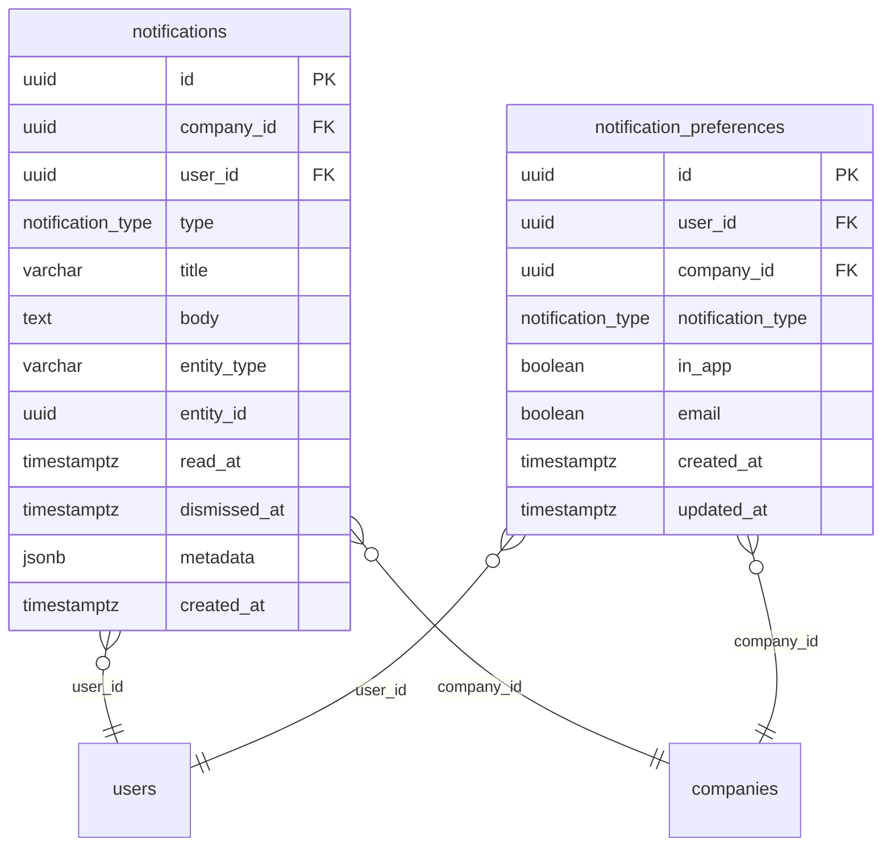

# PRD-14: Notifiche In-App

**Versione:** 1.0
**Data:** 10 febbraio 2026
**Modulo:** Notifiche
**Basato su:** DB schema `.tmp/db-schema.md` (tabelle `notifications`, `notification_preferences`, enum `notification_type`)
**Contratto DB:** `.tmp/db-schema.md`
**Risolve:** GAP-05 (prd-12-cross-check.md)
**Dipendenze:** PRD-01 (auth, utenti), PRD-03 (connessione bancaria: SYNC_COMPLETED, CONSENT_EXPIRING), PRD-05 (riconciliazione: RECONCILIATION_SUGGESTED), PRD-07 (pagamenti: PAYMENT_SUCCEEDED/FAILED), PRD-06 (fatture: INVOICE_RECEIVED)

---

## 1. Panoramica

Il modulo Notifiche gestisce la comunicazione in-app verso gli utenti per eventi rilevanti generati dagli altri moduli del gestionale: sincronizzazione bancaria, pagamenti, riconciliazione, scadenze, budget e team.

Le notifiche sono esclusivamente **in-app** — nessun canale email, SMS o push e' previsto in questa versione. La tabella `notification_preferences` prevede i campi `in_app` e `email`, ma il canale `email` resta disabilitato e riservato per sviluppi futuri.

**Utenti target:** tutti i ruoli (OWNER, ADMIN, EDITOR, VIEWER).

---

## 2. Modello Dati

### 2.1 Diagramma ER



### 2.2 Tipi di Notifica (Enum `notification_type`)

Basati sull'enum definito in `db-schema.md`:

| Tipo | Evento scatenante | Modulo sorgente | Descrizione |
|---|---|---|---|
| `SYNC_COMPLETED` | Sincronizzazione movimenti bancari completata | PRD-03 (Connessione bancaria) | "Sincronizzazione completata: 15 nuovi movimenti importati" |
| `SYNC_FAILED` | Sincronizzazione fallita | PRD-03 | "Sincronizzazione fallita per il conto UniCredit. Riprova." |
| `PAYMENT_SUCCEEDED` | Pagamento eseguito con successo | PRD-07 (Pagamenti) | "Pagamento di EUR 1.500,00 a Fornitore SRL eseguito" |
| `PAYMENT_FAILED` | Pagamento fallito | PRD-07 | "Pagamento di EUR 1.500,00 a Fornitore SRL fallito. Verifica i dati." |
| `CONSENT_EXPIRING` | Consenso Open Banking in scadenza | PRD-03 | "Il consenso per UniCredit scade tra 7 giorni. Rinnova." |
| `CONSENT_EXPIRED` | Consenso Open Banking scaduto | PRD-03 | "Il consenso per UniCredit e' scaduto. Riconnetti il conto." |
| `INVOICE_RECEIVED` | Fattura ricevuta (via SDI o import) | PRD-06 (Fatture) | "Nuova fattura ricevuta: FT-2026/001 da Fornitore SRL" |
| `INVOICE_DELIVERED` | Fattura consegnata al destinatario | PRD-06 | "Fattura FT-2026/042 consegnata tramite SDI" |
| `INVOICE_NOT_DELIVERED` | Fattura non consegnata (scarto SDI) | PRD-06 | "Fattura FT-2026/042 non consegnata. Verifica lo scarto." |
| `RECONCILIATION_SUGGESTED` | Nuovi suggerimenti di riconciliazione | PRD-05 (Riconciliazione) | "5 nuovi suggerimenti di riconciliazione disponibili" |
| `BUDGET_EXCEEDED` | Budget mensile superato per una categoria | PRD-08 (Cash flow / Budget) | "Budget 'Gestione' di febbraio superato: speso EUR 5.200 su EUR 4.000" |
| `TEAM_INVITE` | Nuovo membro invitato o ha accettato | PRD-01 (Auth / Team) | "Mario Rossi ha accettato l'invito al team" |

---

## 3. Centro Notifiche

### 3.1 Campanella con Badge (Header)

Nell'header dell'applicazione, accanto al menu utente, e' presente un'icona campanella con badge contatore:

```
Comportamento:
  - Il badge mostra il numero di notifiche non lette
  - Se il conteggio e' 0, il badge non e' visibile
  - Se il conteggio e' > 99, mostra "99+"
  - Il badge si aggiorna in tempo reale (polling ogni 60 secondi)
  - Click sulla campanella apre il pannello laterale (drawer)
```

### 3.2 Pannello Notifiche (Drawer Laterale)

Il click sulla campanella apre un drawer/panel laterale (lato destro) con la lista delle notifiche:

**Header del drawer:**
- Titolo: "Notifiche"
- Azione: "Segna tutte come lette" (link/button)
- Azione: Icona ingranaggio → naviga a preferenze notifiche

**Lista notifiche:**

| Elemento | Descrizione |
|---|---|
| Icona tipo | Icona specifica per tipo di notifica (sync, pagamento, fattura, ecc.) |
| Titolo | `notifications.title` — es. "Sincronizzazione completata" |
| Corpo | `notifications.body` — es. "15 nuovi movimenti importati" |
| Timestamp | Tempo relativo (es. "5 min fa", "2 ore fa", "Ieri") |
| Stato letto | Pallino colorato se non letta (`read_at IS NULL`) |

**Comportamento lista:**
- Ordinamento: `created_at DESC` (piu' recenti in alto)
- Paginazione: infinite scroll o "Carica precedenti"
- Le notifiche non lette hanno sfondo leggermente diverso (highlight)
- Page size: 20 notifiche per caricamento

### 3.3 Interazioni sulle Notifiche

| Azione | Effetto |
|---|---|
| **Click sulla notifica** | Marca come letta (`read_at = NOW()`) + naviga all'entita' collegata |
| **Swipe/dismiss** | Marca come dismissed (`dismissed_at = NOW()`) — rimossa dalla lista |
| **"Segna come letta"** (context menu) | `read_at = NOW()` senza navigazione |
| **"Segna come non letta"** (context menu) | `read_at = NULL` |
| **"Segna tutte come lette"** | Bulk update: tutte le notifiche non lette della company |

### 3.4 Navigazione al Contesto

Quando l'utente clicca su una notifica, viene portato alla pagina/entita' pertinente:

| Tipo notifica | `entity_type` | `entity_id` | Navigazione |
|---|---|---|---|
| `SYNC_COMPLETED` | `bank_connections` | ID connessione | `/transactions/movements` (con filtro data ultimo sync) |
| `SYNC_FAILED` | `bank_connections` | ID connessione | `/settings/banks` (pagina connessioni) |
| `PAYMENT_SUCCEEDED` | `payment_orders` | ID pagamento | `/payments/:id` (dettaglio pagamento) |
| `PAYMENT_FAILED` | `payment_orders` | ID pagamento | `/payments/:id` (dettaglio pagamento) |
| `CONSENT_EXPIRING` | `bank_connections` | ID connessione | `/settings/banks` (pagina connessioni) |
| `CONSENT_EXPIRED` | `bank_connections` | ID connessione | `/settings/banks` (pagina connessioni) |
| `INVOICE_RECEIVED` | `invoices` | ID fattura | `/invoices/:id` (dettaglio fattura) |
| `INVOICE_DELIVERED` | `invoices` | ID fattura | `/invoices/:id` |
| `INVOICE_NOT_DELIVERED` | `invoices` | ID fattura | `/invoices/:id` |
| `RECONCILIATION_SUGGESTED` | `reconciliation_matches` | null | `/reconciliation` (pagina riconciliazione) |
| `BUDGET_EXCEEDED` | `categories` | ID categoria | `/cashflow` (con mese e categoria evidenziati) |
| `TEAM_INVITE` | `user_companies` | ID relazione | `/settings/team` |

---

## 4. Preferenze Notifiche

### 4.1 Pagina Preferenze

Accessibile da: drawer notifiche (icona ingranaggio) o da `/settings/notifications`.

Per ogni tipo di notifica, l'utente puo' attivare o disattivare la ricezione in-app:

| Tipo notifica | Descrizione | Default in_app |
|---|---|---|
| Sincronizzazione completata | Quando l'import movimenti e' completato | `true` |
| Sincronizzazione fallita | Quando l'import movimenti fallisce | `true` |
| Pagamento eseguito | Quando un pagamento va a buon fine | `true` |
| Pagamento fallito | Quando un pagamento fallisce | `true` |
| Consenso in scadenza | Quando un consenso bancario sta per scadere | `true` |
| Consenso scaduto | Quando un consenso bancario e' scaduto | `true` |
| Fattura ricevuta | Quando una fattura viene importata | `true` |
| Fattura consegnata | Quando una fattura e' consegnata via SDI | `true` |
| Fattura non consegnata | Quando una fattura viene scartata da SDI | `true` |
| Suggerimenti riconciliazione | Quando ci sono nuovi match suggeriti | `true` |
| Budget superato | Quando una categoria supera il budget mensile | `true` |
| Attivita' team | Quando un membro accetta un invito | `true` |

### 4.2 Modello Preferenze

Se un record `notification_preferences` non esiste per una combinazione (user, company, type), il default e' `in_app = true`.

Le preferenze sono per **utente per azienda** (un utente con 2 aziende puo' avere preferenze diverse).

---

## 5. Generazione Notifiche

### 5.1 Logica di Creazione

Quando un modulo genera un evento, la notifica viene creata:

```
function creaNotifica(company_id, tipo, titolo, corpo, entity_type, entity_id, metadata):
    // 1. Recupera tutti gli utenti attivi della company
    utenti = SELECT user_id FROM user_companies
             WHERE company_id = :company_id
             AND status = 'ACTIVE'

    // 2. Per ogni utente, verifica le preferenze
    FOR EACH user_id IN utenti:
        pref = SELECT in_app FROM notification_preferences
               WHERE user_id = :user_id
               AND company_id = :company_id
               AND notification_type = :tipo

        // Se non esiste preferenza, default = true
        IF pref IS NULL OR pref.in_app = TRUE:
            INSERT INTO notifications (
                company_id, user_id, type, title, body,
                entity_type, entity_id, metadata
            ) VALUES (
                :company_id, :user_id, :tipo, :titolo, :corpo,
                :entity_type, :entity_id, :metadata
            )
```

### 5.2 Trigger per Modulo

| Modulo sorgente | Evento | Tipo notifica | Logica |
|---|---|---|---|
| Sync bancaria (PRD-03) | Sync completata con successo | `SYNC_COMPLETED` | Dopo completamento job sync, con conteggio movimenti in metadata |
| Sync bancaria (PRD-03) | Sync fallita | `SYNC_FAILED` | Dopo errore nel job sync, con messaggio errore in metadata |
| Pagamenti (PRD-07) | Status cambia a SUCCEEDED | `PAYMENT_SUCCEEDED` | Quando payment_orders.status = 'SUCCEEDED' |
| Pagamenti (PRD-07) | Status cambia a FAILED | `PAYMENT_FAILED` | Quando payment_orders.status = 'FAILED' |
| Connessione (PRD-03) | Consent scade tra <= 7 giorni | `CONSENT_EXPIRING` | Job schedulato giornaliero |
| Connessione (PRD-03) | Consent scaduto | `CONSENT_EXPIRED` | Job schedulato giornaliero |
| Fatture (PRD-06) | Fattura importata/ricevuta | `INVOICE_RECEIVED` | Dopo import o ricezione SDI |
| Fatture (PRD-06) | Fattura consegnata SDI | `INVOICE_DELIVERED` | Callback SDI |
| Fatture (PRD-06) | Fattura scartata SDI | `INVOICE_NOT_DELIVERED` | Callback SDI |
| Riconciliazione (PRD-05) | Nuovi suggerimenti generati | `RECONCILIATION_SUGGESTED` | Dopo esecuzione matching automatico |
| Budget (PRD-08) | Spesa supera budget | `BUDGET_EXCEEDED` | Dopo ogni transazione categorizzata nel mese |
| Team (PRD-01) | Membro accetta invito | `TEAM_INVITE` | Quando user_companies.status = 'ACTIVE' |

---

## 6. Polling e Aggiornamento

### 6.1 Strategia di Aggiornamento

Il frontend utilizza polling per aggiornare il contatore badge e la lista notifiche:

```
Polling contatore badge:
  - Endpoint: GET /api/v1/notifications/unread-count
  - Intervallo: 60 secondi
  - Payload: { "count": 5 }

Polling lista (solo quando il drawer e' aperto):
  - Endpoint: GET /api/v1/notifications
  - Intervallo: 30 secondi
  - Solo le nuove (created_at > ultima notifica visualizzata)
```

### 6.2 🟡 WebSocket (Futuro)

In una versione futura, il polling puo' essere sostituito da WebSocket per notifiche in tempo reale. La struttura dati e' gia' compatibile.

---

## 7. Pulizia e Retention

### 7.1 Regole di Retention

```
- Le notifiche lette (read_at IS NOT NULL) vengono eliminate dopo 90 giorni
- Le notifiche dismissed (dismissed_at IS NOT NULL) vengono eliminate dopo 30 giorni
- Le notifiche non lette vengono mantenute indefinitamente
- Job schedulato giornaliero per la pulizia
```

---

## 8. API Endpoints

| Metodo | Path | Descrizione | Parametri principali |
|---|---|---|---|
| `GET` | `/api/v1/notifications` | Lista notifiche dell'utente | company_id, read (boolean), type, page_size, page_cursor |
| `GET` | `/api/v1/notifications/unread-count` | Conteggio non lette | company_id |
| `PATCH` | `/api/v1/notifications/:id/read` | Marca come letta | — |
| `PATCH` | `/api/v1/notifications/:id/unread` | Marca come non letta | — |
| `PATCH` | `/api/v1/notifications/:id/dismiss` | Dismissa notifica | — |
| `POST` | `/api/v1/notifications/mark-all-read` | Marca tutte come lette | company_id |
| `GET` | `/api/v1/notification-preferences` | Preferenze utente | company_id |
| `PUT` | `/api/v1/notification-preferences` | Aggiorna preferenze | Body: lista tipo → in_app |

### 8.1 GET /api/v1/notifications

**Query parameters:**

| Parametro | Tipo | Obbligatorio | Descrizione |
|---|---|---|---|
| `company_id` | UUID | Si | ID azienda |
| `read` | boolean | No | `true` = solo lette, `false` = solo non lette |
| `type` | enum[] | No | Filtro per tipo (es. SYNC_COMPLETED,PAYMENT_FAILED) |
| `page_size` | integer | No | Default: 20 |
| `page_cursor` | string | No | Cursore paginazione |

**Response (200):**

```json
{
  "data": [
    {
      "id": "uuid",
      "type": "PAYMENT_SUCCEEDED",
      "title": "Pagamento eseguito",
      "body": "Pagamento di EUR 1.500,00 a Fornitore SRL eseguito con successo",
      "entity_type": "payment_orders",
      "entity_id": "uuid-pagamento",
      "read_at": null,
      "metadata": {
        "amount": "1500.00",
        "currency": "EUR",
        "counterpart_name": "Fornitore SRL"
      },
      "created_at": "2026-02-10T14:30:00Z"
    }
  ],
  "meta": { "total": 12, "page": { "size": 20, "cursor": null } }
}
```

### 8.2 GET /api/v1/notifications/unread-count

**Response (200):**

```json
{
  "count": 5
}
```

### 8.3 PUT /api/v1/notification-preferences

**Request body:**

```json
{
  "company_id": "uuid",
  "preferences": [
    { "notification_type": "SYNC_COMPLETED", "in_app": true },
    { "notification_type": "SYNC_FAILED", "in_app": true },
    { "notification_type": "PAYMENT_SUCCEEDED", "in_app": true },
    { "notification_type": "PAYMENT_FAILED", "in_app": true },
    { "notification_type": "CONSENT_EXPIRING", "in_app": true },
    { "notification_type": "CONSENT_EXPIRED", "in_app": true },
    { "notification_type": "INVOICE_RECEIVED", "in_app": false },
    { "notification_type": "RECONCILIATION_SUGGESTED", "in_app": true },
    { "notification_type": "BUDGET_EXCEEDED", "in_app": true },
    { "notification_type": "TEAM_INVITE", "in_app": true }
  ]
}
```

---

## 9. Requisiti Funzionali

### FR-NOT-001: Badge Contatore Non Lette

**Priorita':** P0

**Given** un utente autenticato con notifiche non lette
**When** naviga in qualsiasi pagina dell'applicazione
**Then** l'icona campanella nell'header mostra un badge con il conteggio delle notifiche non lette (`read_at IS NULL`). Se il conteggio e' 0, il badge non e' visibile. Se > 99, mostra "99+". Il conteggio viene aggiornato via polling ogni 60 secondi

---

### FR-NOT-002: Apertura Pannello Notifiche

**Priorita':** P0

**Given** un utente clicca sull'icona campanella
**When** il pannello si apre
**Then** un drawer laterale (lato destro) mostra la lista delle notifiche ordinate per data decrescente, con le non lette evidenziate. Le prime 20 notifiche vengono caricate. Scrollando verso il basso, vengono caricate le successive (infinite scroll)

---

### FR-NOT-003: Navigazione al Contesto

**Priorita':** P0

**Given** un utente clicca su una notifica nel pannello
**When** la notifica ha `entity_type` e `entity_id` valorizzati
**Then** la notifica viene marcata come letta (`read_at = NOW()`), il pannello si chiude, e l'utente viene navigato alla pagina dell'entita' collegata (es. dettaglio pagamento, dettaglio fattura, pagina riconciliazione)

---

### FR-NOT-004: Marca Come Letta / Non Letta

**Priorita':** P0

**Given** un utente visualizza una notifica non letta
**When** clicca "Segna come letta" dal context menu (o click destro)
**Then** `read_at` viene impostato a `NOW()`, il badge contatore diminuisce di 1, lo stile della notifica cambia (rimuove evidenziazione)

**Given** un utente visualizza una notifica gia' letta
**When** clicca "Segna come non letta"
**Then** `read_at` viene impostato a `NULL`, il badge contatore aumenta di 1, lo stile della notifica cambia (aggiunge evidenziazione)

---

### FR-NOT-005: Marca Tutte Come Lette

**Priorita':** P1

**Given** un utente con N notifiche non lette
**When** clicca "Segna tutte come lette" nell'header del pannello
**Then** tutte le notifiche non lette della company corrente vengono marcate come lette in un'unica operazione (`read_at = NOW()` WHERE `company_id = :id` AND `user_id = :id` AND `read_at IS NULL`). Il badge contatore diventa 0

---

### FR-NOT-006: Dismiss Notifica

**Priorita':** P1

**Given** un utente visualizza una notifica
**When** esegue swipe o clicca "Rimuovi"
**Then** la notifica viene dismissed (`dismissed_at = NOW()`) e rimossa dalla lista visibile. La notifica non viene eliminata dal DB (per audit), ma non viene piu' mostrata all'utente

---

### FR-NOT-007: Preferenze per Tipo

**Priorita':** P1

**Given** un utente accede alla pagina preferenze notifiche
**When** visualizza la lista dei tipi di notifica
**Then** per ogni tipo viene mostrato un toggle on/off per il canale in-app. Il default per tutti e' ON. L'utente puo' disattivare i tipi che non gli interessano. Il salvataggio e' immediato (o con pulsante "Salva")

---

### FR-NOT-008: Rispetto Preferenze alla Creazione

**Priorita':** P1

**Given** un utente ha disattivato la notifica `SYNC_COMPLETED` nelle preferenze
**When** una sincronizzazione bancaria viene completata
**Then** NON viene creata una notifica di tipo `SYNC_COMPLETED` per quell'utente. Gli altri utenti della company (con preferenza attiva) ricevono normalmente la notifica

---

### FR-NOT-009: Polling Automatico Badge

**Priorita':** P0

**Given** un utente autenticato con l'app aperta
**When** passano 60 secondi dall'ultimo check
**Then** il frontend chiama `GET /api/v1/notifications/unread-count` e aggiorna il badge. Se il conteggio e' aumentato, il badge mostra un'animazione breve (pulse). Se l'utente e' inattivo (tab non in focus), il polling viene sospeso

---

### FR-NOT-010: Generazione Notifica da Pagamento

**Priorita':** P1

**Given** una disposizione di pagamento con status che cambia a SUCCEEDED o FAILED
**When** il backend aggiorna lo stato
**Then** viene creata una notifica per tutti gli utenti attivi della company (rispettando le preferenze). Il `title` include l'importo e la controparte. Il `body` include dettagli aggiuntivi. `entity_type = 'payment_orders'`, `entity_id = ID del pagamento`

---

### FR-NOT-011: Generazione Notifica da Sync Bancaria

**Priorita':** P1

**Given** un job di sincronizzazione bancaria che si completa
**When** il risultato e' successo (con N movimenti importati) o fallimento
**Then** viene creata una notifica `SYNC_COMPLETED` (con `metadata.new_transactions_count = N`) o `SYNC_FAILED` (con `metadata.error_message`) per gli utenti della company

---

### FR-NOT-012: Generazione Notifica Consent in Scadenza

**Priorita':** P1

**Given** un consenso Open Banking con `expires_at` tra <= 7 giorni
**When** il job giornaliero di check scadenze viene eseguito
**Then** viene creata una notifica `CONSENT_EXPIRING` con il nome dell'istituto bancario e la data di scadenza. La notifica viene creata solo se non ne e' stata gia' creata una per lo stesso consent negli ultimi 3 giorni (deduplicazione)

---

## 10. Tabelle DB Coinvolte

| Tabella | Ruolo nel Modulo |
|---|---|
| `notifications` | Entita' principale — notifiche in-app |
| `notification_preferences` | Preferenze per utente per tipo |
| `users` | Destinatari delle notifiche |
| `companies` | Company context |
| `user_companies` | Per determinare utenti attivi della company |
| `payment_orders` | Entita' collegata (notifiche pagamento) |
| `bank_connections` | Entita' collegata (notifiche sync/consent) |
| `invoices` | Entita' collegata (notifiche fatture) |
| `reconciliation_matches` | Entita' collegata (notifiche riconciliazione) |
| `categories` | Entita' collegata (notifiche budget) |
