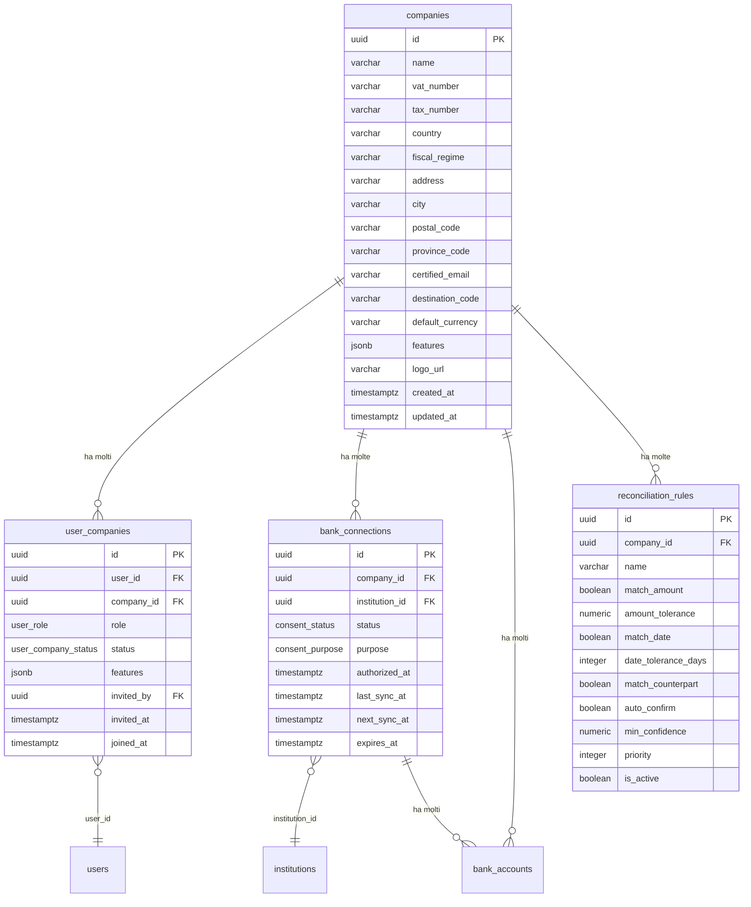

# PRD-15: Impostazioni e Configurazione

**Versione:** 1.0
**Data:** 10 febbraio 2026
**Modulo:** Settings
**Basato su:** RE Sibill docs/02-auth-sessioni.md (companyIdentity, companySettings), docs/04-api-reference.md (sezione 12), docs/15-mapping-gestionale.md (F16/F20)
**Contratto DB:** `.tmp/db-schema.md`
**Risolve:** GAP-04 (prd-12-cross-check.md)
**Dipendenze:** PRD-01 (auth, RBAC, team management), PRD-03 (connessioni bancarie), PRD-14 (preferenze notifiche)

---

## 1. Panoramica

Il modulo Settings centralizza tutte le configurazioni dell'azienda e dell'utente. In Sibill, le impostazioni sono distribuite tra `/settings/profile`, `/settings/team`, `/settings/banks` e le relazioni `companyIdentity` / `companySettings` incluse nell'entita' `company`.

Il gestionale raggruppa queste funzionalita' in un'unica area `/settings` con sezioni dedicate.

**Importante:** il campo `companies.features` JSONB serve come **configurazione dei moduli attivi** per l'azienda (es. `["cashflow", "budget", "sdi", "reconciliation"]`), NON come piano di billing. Non esistono piani tariffari, trial, upsell o subscription. Si tratta di un gestionale interno.

**Utenti target:**
- Dati aziendali e configurazione: OWNER, ADMIN (lettura/scrittura); VIEWER (sola lettura); EDITOR (nessun accesso)
- Gestione utenti: OWNER, ADMIN
- Connessioni bancarie: OWNER, ADMIN (CRUD); EDITOR (lettura)

---

## 2. Modello Dati

### 2.1 Diagramma ER



---

## 3. Struttura Navigazione Settings

La sezione `/settings` ha un menu laterale con le seguenti voci:

| Sezione | Path | Descrizione | Accesso |
|---|---|---|---|
| Dati aziendali | `/settings/company` | Anagrafica e dati fiscali | OWNER, ADMIN (RW); VIEWER (R) |
| Configurazione tesoreria | `/settings/treasury` | Soglie, tolleranze, automazioni | OWNER, ADMIN |
| Formato e preferenze | `/settings/preferences` | Date, numeri, valuta | OWNER, ADMIN |
| Connessioni bancarie | `/settings/banks` | Lista conti, stato sync | OWNER, ADMIN (CRUD); EDITOR (R) |
| Gestione utenti | `/settings/team` | Lista utenti, inviti, ruoli | OWNER, ADMIN |
| Moduli attivi | `/settings/modules` | Feature abilitate | OWNER |
| Notifiche | `/settings/notifications` | Preferenze notifiche | Tutti (per se stessi) |

---

## 4. Dati Aziendali (`/settings/company`)

### 4.1 Form Anagrafica Azienda

Basato sulla tabella `companies` del DB:

**Sezione 1 — Dati identificativi**

| Campo | Tipo input | Campo DB | Obbligatorio | Validazione |
|---|---|---|---|---|
| Nome azienda | Text | `name` | Si | Max 255 char |
| Partita IVA | Text | `vat_number` | No | 11 cifre (IT), checksum Luhn |
| Codice fiscale | Text | `tax_number` | No | 16 char alfanumerico (IT) |
| Paese | Select | `country` | Si | ISO 3166, default: IT |
| Regime fiscale | Select | `fiscal_regime` | No | Es. RF01 (ordinario), RF02 (contribuenti minimi), ecc. |

**Sezione 2 — Sede legale**

| Campo | Tipo input | Campo DB | Obbligatorio | Validazione |
|---|---|---|---|---|
| Indirizzo | Text | `address` | No | Max 255 char |
| Citta' | Text | `city` | No | Max 100 char |
| CAP | Text | `postal_code` | No | Max 10 char |
| Provincia | Text/Select | `province_code` | No | Max 5 char |

**Sezione 3 — Fatturazione elettronica**

| Campo | Tipo input | Campo DB | Obbligatorio | Validazione |
|---|---|---|---|---|
| PEC | Email | `certified_email` | No | Formato email valido |
| Codice destinatario SDI | Text | `destination_code` | No | 7 char alfanumerici |

**Sezione 4 — Logo**

| Campo | Tipo input | Campo DB | Obbligatorio | Validazione |
|---|---|---|---|---|
| Logo | File upload | `logo_url` | No | PNG/JPG/SVG, max 2MB |

Confidenza: 🟢 Alta — campi osservati nell'entita' `company` e `company-identity` di Sibill (docs/02, docs/03).

### 4.2 P.IVA di Gruppo

| Campo | Tipo input | Campo DB | Obbligatorio | Validazione |
|---|---|---|---|---|
| P.IVA di gruppo | Text | `group_vat_number` | No | Formato P.IVA |

🟡 Usato per il consolidamento multi-azienda. Funzionalita' non completamente osservata in Sibill.

---

## 5. Configurazione Tesoreria (`/settings/treasury`)

### 5.1 Soglie Alert Cassa

Configurazioni per gli alert sulla posizione di cassa:

| Impostazione | Tipo | Default | Descrizione | Storage |
|---|---|---|---|---|
| Soglia cassa minima | Currency input | 0 | Alert se saldo totale < soglia | `companies.features` JSONB `treasury_settings.min_cash_threshold` |
| Soglia cassa critica | Currency input | 0 | Alert critico (notifica immediata) | `companies.features` JSONB `treasury_settings.critical_cash_threshold` |
| Giorni anticipazione scadenze | Integer | 7 | Quanti giorni prima di una scadenza generare notifica | `companies.features` JSONB `treasury_settings.advance_notice_days` |

### 5.2 Tolleranze Riconciliazione

Basate sulla tabella `reconciliation_rules` del DB:

| Impostazione | Tipo | Default | Descrizione | Campo DB |
|---|---|---|---|---|
| Tolleranza importo | Currency input | 0.01 EUR | Margine di tolleranza per matching importi | `reconciliation_rules.amount_tolerance` |
| Tolleranza giorni | Integer | 3 | Margine di tolleranza in giorni per matching date | `reconciliation_rules.date_tolerance_days` |
| Match su importo | Toggle | Attivo | Abilita matching per importo | `reconciliation_rules.match_amount` |
| Match su data | Toggle | Attivo | Abilita matching per data | `reconciliation_rules.match_date` |
| Match su controparte | Toggle | Attivo | Abilita matching per controparte | `reconciliation_rules.match_counterpart` |
| Match su descrizione | Toggle | Disattivo | Abilita matching per descrizione/causale | `reconciliation_rules.match_description` |
| Auto-conferma | Toggle | Disattivo | Conferma automatica se score > soglia | `reconciliation_rules.auto_confirm` |
| Soglia minima auto-conferma | Percentage | 80% | Score minimo per conferma automatica | `reconciliation_rules.min_confidence` |

### 5.3 Automazioni

| Impostazione | Tipo | Default | Descrizione | Storage |
|---|---|---|---|---|
| Categorizzazione automatica | Toggle | Attivo | Applica regole di categorizzazione ai nuovi movimenti | `companies.features` JSONB `treasury_settings.auto_categorize` |
| Riconciliazione automatica | Toggle | Attivo | Esegui matching automatico dopo ogni sync | `companies.features` JSONB `treasury_settings.auto_reconcile` |
| Aggiornamento cash flow | Select | Automatico | Ricalcola cash flow: automatico (dopo ogni sync) o manuale | `companies.features` JSONB `treasury_settings.cashflow_update_mode` |

---

## 6. Formato e Preferenze (`/settings/preferences`)

### 6.1 Formato Date e Numeri

| Impostazione | Tipo | Default | Opzioni | Storage |
|---|---|---|---|---|
| Formato data | Select | `DD/MM/YYYY` | DD/MM/YYYY, MM/DD/YYYY, YYYY-MM-DD | `companies.features` JSONB `display_settings.date_format` |
| Separatore decimali | Select | `,` (virgola) | Virgola (1.000,00), Punto (1,000.00) | `companies.features` JSONB `display_settings.decimal_separator` |
| Separatore migliaia | Select | `.` (punto) | Punto, Virgola, Spazio | `companies.features` JSONB `display_settings.thousands_separator` |
| Valuta predefinita | Select | EUR | ISO 4217 (EUR, USD, GBP, CHF) | `companies.default_currency` |
| Fuso orario | Select | Europe/Rome | Lista timezone IANA | `companies.features` JSONB `display_settings.timezone` |
| Primo giorno settimana | Select | Lunedi' | Lunedi' / Domenica | `companies.features` JSONB `display_settings.first_day_of_week` |

---

## 7. Connessioni Bancarie (`/settings/banks`)

### 7.1 Lista Conti Collegati

Basata sulle tabelle `bank_connections` e `bank_accounts`:

| Colonna | Fonte DB | Descrizione |
|---|---|---|
| Istituto | `institutions.name` via `bank_connections.institution_id` | Nome banca (es. "UniCredit") |
| Logo | `institutions.icon_url` | Icona della banca |
| IBAN / Numero conto | `bank_accounts.iban` o `bank_accounts.account_number` | Identificativo conto |
| Nome conto | `bank_accounts.nickname` | Nome personalizzato |
| Saldo corrente | `bank_accounts.current_balance` | Ultimo saldo contabile |
| Saldo disponibile | `bank_accounts.available_balance` | Ultimo saldo disponibile |
| Stato connessione | `bank_connections.status` | Badge: AUTHORIZED / EXPIRED / ERROR |
| Ultima sincronizzazione | `bank_connections.last_sync_at` | Timestamp ultimo sync |
| Scadenza consenso | `bank_connections.expires_at` | Data scadenza PSD2 (max 90 giorni) |
| Stato conto | `bank_accounts.status` | ACTIVE / INACTIVE / HIDDEN |

### 7.2 Azioni sui Conti

| Azione | Condizione | Effetto |
|---|---|---|
| **Sincronizza ora** | Connessione AUTHORIZED | Forza sync immediata (`next_sync_at = NOW()`) |
| **Rinnova consenso** | Connessione EXPIRED o in scadenza | Avvia flow OAuth2 per rinnovo |
| **Nascondi conto** | Conto ACTIVE | `bank_accounts.hidden_at = NOW()`, escluso da dashboard |
| **Mostra conto** | Conto HIDDEN | `bank_accounts.hidden_at = NULL` |
| **Escludi da saldi** | Toggle | `bank_accounts.ignore_balance = true/false` |
| **Modifica nome** | Sempre | Aggiorna `bank_accounts.nickname` |
| **Rimuovi connessione** | Sempre | Revoca consenso, `bank_connections.status = 'REVOKED'` |

### 7.3 Stato Sincronizzazione

Per ogni connessione, mostrare un indicatore visuale dello stato sync:

| Stato | Icona | Descrizione |
|---|---|---|
| Sincronizzato | Cerchio verde | `last_sync_at` < 1 ora fa |
| In ritardo | Cerchio giallo | `last_sync_at` > 1 ora e < 24 ore |
| Errore | Cerchio rosso | `status = 'ERROR'` o `last_sync_at` > 24 ore |
| Scaduto | Badge rosso | `status = 'EXPIRED'` |
| In attesa | Cerchio grigio | `status = 'PENDING'` |

### 7.4 Aggiunta Nuova Connessione

Il flow di aggiunta nuova connessione bancaria (wizard OAuth2 PSD2) e' definito in PRD-03. Da questa pagina si accede al wizard tramite il pulsante "Collega conto".

---

## 8. Gestione Utenti (`/settings/team`)

### 8.1 Lista Utenti

La pagina mostra tutti gli utenti associati all'azienda corrente (tabella `user_companies`):

| Colonna | Fonte DB | Descrizione |
|---|---|---|
| Nome | `users.first_name` + `users.last_name` | Nome completo |
| Email | `users.email` | Email dell'utente |
| Ruolo | `user_companies.role` | OWNER / ADMIN / EDITOR / VIEWER |
| Stato | `user_companies.status` | Badge: ACTIVE / INVITED / SUSPENDED |
| Data ingresso | `user_companies.joined_at` | Quando ha accettato l'invito |
| Invitato da | `users.first_name` via `user_companies.invited_by` | Chi ha invitato |

### 8.2 Azioni sugli Utenti

| Azione | Chi puo' farla | Effetto |
|---|---|---|
| **Invita membro** | OWNER, ADMIN | Crea record `user_companies` con `status=INVITED`, invia email |
| **Modifica ruolo** | OWNER, ADMIN | Aggiorna `user_companies.role` (ADMIN non puo' promuovere a OWNER) |
| **Sospendi** | OWNER, ADMIN | `user_companies.status = 'SUSPENDED'` — l'utente non puo' accedere |
| **Riattiva** | OWNER, ADMIN | `user_companies.status = 'ACTIVE'` |
| **Rimuovi** | OWNER, ADMIN | `user_companies.status = 'REMOVED'` (soft delete) |
| **Reinvita** | OWNER, ADMIN | Se status = INVITED e l'invito e' scaduto, reinvia email |
| **Trasferisci ownership** | OWNER | Cambia il ruolo dell'OWNER corrente in ADMIN e promuove un altro utente a OWNER |

**Vincoli:**
- Un'azienda deve avere sempre almeno 1 OWNER
- Un ADMIN non puo' modificare il ruolo di un OWNER
- Un ADMIN non puo' promuovere un utente a OWNER
- Un utente non puo' rimuovere se stesso
- Il trasferimento di ownership richiede conferma con password

### 8.3 Form Invito

| Campo | Tipo input | Obbligatorio | Validazione |
|---|---|---|---|
| Email | Email | Si | Formato email valido, non gia' membro della company |
| Ruolo | Select | Si | ADMIN / EDITOR / VIEWER (non OWNER — solo trasferimento) |

**Nota:** i dettagli del flow di invito (email, accettazione, registrazione) sono definiti in PRD-01 (FR-AUTH-010). Il presente PRD definisce l'interfaccia di gestione.

---

## 9. Moduli Attivi (`/settings/modules`)

### 9.1 Configurazione Feature

Il campo `companies.features` JSONB contiene la lista dei moduli attivi per l'azienda. In un gestionale interno, questa lista e' configurabile dal proprietario (OWNER) senza vincoli di billing.

| Modulo | Feature key | Default | Descrizione |
|---|---|---|---|
| Cash Flow | `cashflow` | Attivo | Dashboard cash flow e previsioni |
| Budget | `budget` | Attivo | Budget per categoria/mese |
| Fatturazione SDI | `sdi` | Disattivo | Integrazione con Sistema di Interscambio |
| Riconciliazione | `reconciliation` | Attivo | Matching automatico movimenti-scadenze |
| Pagamenti PISP | `pisp` | Disattivo | Disposizione pagamenti via Open Banking |
| F24 | `f24` | Disattivo | Pagamento modello F24 |
| Import CBI | `cbi_import` | Disattivo | Import movimenti da file CBI |
| Export SEPA | `sepa_export` | Disattivo | Generazione file pain.001 / pain.008 |

### 9.2 Feature User-Level

Le feature possono essere anche limitate per utente tramite `user_companies.features`:

```
Regola di accesso:
  feature_abilitata = feature IN companies.features AND feature IN user_companies.features

Se user_companies.features e' vuoto/null → l'utente eredita tutte le feature della company
Se user_companies.features e' valorizzato → solo le feature elencate sono accessibili
```

Come definito in PRD-01 (sezione 5.4 Feature Gating).

---

## 10. API Endpoints

| Metodo | Path | Descrizione | Parametri principali |
|---|---|---|---|
| `GET` | `/api/v1/companies/:id` | Dettaglio azienda | include=companySettings |
| `PATCH` | `/api/v1/companies/:id` | Modifica dati aziendali | Body: campi parziali |
| `POST` | `/api/v1/companies/:id/logo` | Upload logo | Multipart: file |
| `DELETE` | `/api/v1/companies/:id/logo` | Rimuovi logo | — |
| `GET` | `/api/v1/companies/:id/settings` | Configurazione tesoreria e preferenze | — |
| `PATCH` | `/api/v1/companies/:id/settings` | Aggiorna configurazione | Body: settings parziali |
| `GET` | `/api/v1/bank-connections` | Lista connessioni bancarie | company_id, status, include=accounts,institution |
| `POST` | `/api/v1/bank-connections/:id/sync` | Forza sincronizzazione | — |
| `PATCH` | `/api/v1/bank-accounts/:id` | Modifica conto (nickname, hidden, ignore) | Body: campi parziali |
| `GET` | `/api/v1/company-users` | Lista utenti della company | company_id, include=user |
| `POST` | `/api/v1/company-users/invite` | Invita membro | Body: email, role |
| `PATCH` | `/api/v1/company-users/:id` | Modifica ruolo / stato | Body: role, status |
| `DELETE` | `/api/v1/company-users/:id` | Rimuovi membro | — |
| `POST` | `/api/v1/company-users/transfer-ownership` | Trasferisci ownership | Body: target_user_id, password |
| `GET` | `/api/v1/companies/:id/modules` | Lista moduli attivi | — |
| `PATCH` | `/api/v1/companies/:id/modules` | Attiva/disattiva moduli | Body: features[] |
| `GET` | `/api/v1/reconciliation-rules` | Regole riconciliazione | company_id |
| `PATCH` | `/api/v1/reconciliation-rules/:id` | Modifica regola riconciliazione | Body: campi parziali |

### 10.1 PATCH /api/v1/companies/:id

**Request body (esempio):**

```json
{
  "name": "WEISS S.R.L.",
  "vat_number": "01234567890",
  "tax_number": "RSSMRA80A01F205X",
  "country": "IT",
  "fiscal_regime": "RF01",
  "address": "Via Roma 1",
  "city": "Milano",
  "postal_code": "20100",
  "province_code": "MI",
  "certified_email": "weiss@pec.it",
  "destination_code": "ABCDEFG"
}
```

### 10.2 PATCH /api/v1/companies/:id/settings

**Request body (esempio):**

```json
{
  "treasury_settings": {
    "min_cash_threshold": 5000.00,
    "critical_cash_threshold": 1000.00,
    "advance_notice_days": 7,
    "auto_categorize": true,
    "auto_reconcile": true,
    "cashflow_update_mode": "automatic"
  },
  "display_settings": {
    "date_format": "DD/MM/YYYY",
    "decimal_separator": ",",
    "thousands_separator": ".",
    "timezone": "Europe/Rome",
    "first_day_of_week": "monday"
  }
}
```

### 10.3 POST /api/v1/company-users/invite

**Request body:**

```json
{
  "email": "nuovo@example.com",
  "role": "EDITOR"
}
```

**Response (201):**

```json
{
  "data": {
    "id": "uuid",
    "user_id": null,
    "company_id": "uuid",
    "role": "EDITOR",
    "status": "INVITED",
    "invited_at": "2026-02-10T15:00:00Z",
    "invited_by": "uuid-admin"
  }
}
```

### 10.4 PATCH /api/v1/companies/:id/modules

**Request body:**

```json
{
  "features": ["cashflow", "budget", "reconciliation", "sdi"]
}
```

---

## 11. Requisiti Funzionali

### FR-SET-001: Visualizzazione e Modifica Dati Aziendali

**Priorita':** P0

**Given** un utente con ruolo OWNER o ADMIN
**When** accede a `/settings/company`
**Then** visualizza il form con tutti i dati dell'azienda pre-compilati (nome, P.IVA, CF, indirizzo, PEC, codice SDI, regime fiscale). Puo' modificare i campi e salvare. Le validazioni vengono eseguite (P.IVA: checksum Luhn, PEC: formato email). Un VIEWER puo' visualizzare ma non modificare

---

### FR-SET-002: Upload Logo Azienda

**Priorita':** P2

**Given** un utente con ruolo OWNER o ADMIN
**When** carica un file immagine nella sezione logo
**Then** il file viene validato (PNG/JPG/SVG, max 2MB), ridimensionato se necessario, salvato su object storage, e `companies.logo_url` viene aggiornato. Il logo appare nell'header dell'app e nelle fatture generate

---

### FR-SET-003: Configurazione Soglie Alert Cassa

**Priorita':** P1

**Given** un utente con ruolo OWNER o ADMIN in `/settings/treasury`
**When** imposta una soglia cassa minima di EUR 5.000
**Then** il valore viene salvato in `companies.features` JSONB. Quando il saldo totale dei conti attivi scende sotto EUR 5.000, il sistema genera una notifica (tipo da definire o aggiungere all'enum) 🟡

---

### FR-SET-004: Configurazione Tolleranze Riconciliazione

**Priorita':** P1

**Given** un utente con ruolo OWNER o ADMIN in `/settings/treasury`
**When** modifica la tolleranza importo a EUR 0.50 e la tolleranza giorni a 5
**Then** i valori vengono salvati nella tabella `reconciliation_rules`. Il motore di riconciliazione automatica usa i nuovi valori per i match successivi. I match gia' suggeriti NON vengono ricalcolati automaticamente

---

### FR-SET-005: Configurazione Formato Date e Numeri

**Priorita':** P1

**Given** un utente con ruolo OWNER o ADMIN in `/settings/preferences`
**When** cambia il formato data da DD/MM/YYYY a YYYY-MM-DD e il separatore decimali da virgola a punto
**Then** i valori vengono salvati in `companies.features` JSONB. Tutte le date e gli importi nell'app vengono formattati secondo le nuove impostazioni per tutti gli utenti della company

---

### FR-SET-006: Lista Connessioni Bancarie con Stato

**Priorita':** P0

**Given** un utente con ruolo OWNER o ADMIN in `/settings/banks`
**When** la pagina viene caricata
**Then** mostra una lista di tutte le connessioni bancarie con: nome istituto, IBAN, saldo, stato connessione (badge colorato), ultima sincronizzazione, data scadenza consenso. Per ogni connessione sono disponibili le azioni: sincronizza ora, rinnova consenso, nascondi/mostra, modifica nome

---

### FR-SET-007: Forza Sincronizzazione Manuale

**Priorita':** P1

**Given** un conto bancario con connessione AUTHORIZED
**When** l'utente clicca "Sincronizza ora"
**Then** il sistema avvia un job di sincronizzazione immediata. Un indicatore di caricamento (spinner) viene mostrato sul conto. Al completamento, i nuovi movimenti appaiono nel modulo Movimenti e una notifica `SYNC_COMPLETED` viene generata (se prevista dalle preferenze)

---

### FR-SET-008: Lista Utenti del Team

**Priorita':** P1

**Given** un utente con ruolo OWNER o ADMIN in `/settings/team`
**When** la pagina viene caricata
**Then** mostra la lista degli utenti associati alla company: nome, email, ruolo (badge), stato (badge), data ingresso. Per ogni utente sono disponibili le azioni consentite in base al ruolo dell'utente corrente

---

### FR-SET-009: Invito Nuovo Membro

**Priorita':** P1

**Given** un utente con ruolo OWNER o ADMIN
**When** compila il form di invito con email e ruolo e clicca "Invita"
**Then** viene creato un record `user_companies` con `status=INVITED`, viene inviata un'email all'indirizzo specificato. Nella lista team appare il nuovo membro con stato "Invitato". Se l'email e' gia' associata alla company, viene mostrato un errore "Utente gia' membro"

**Nota:** il flow completo di invito/accettazione e' definito in PRD-01 (FR-AUTH-010). Questo FR definisce l'interfaccia.

---

### FR-SET-010: Modifica Ruolo Utente

**Priorita':** P1

**Given** un utente con ruolo OWNER o ADMIN
**When** modifica il ruolo di un altro utente (es. da VIEWER a EDITOR)
**Then** `user_companies.role` viene aggiornato. Le permissions dell'utente cambiano immediatamente. Un record `audit_log` viene creato con `action=ROLE_CHANGED`, `old_values={role: 'VIEWER'}`, `new_values={role: 'EDITOR'}`

**Vincoli:**
- Un ADMIN non puo' promuovere a OWNER (solo trasferimento ownership)
- Un ADMIN non puo' modificare il ruolo di un OWNER
- Un utente non puo' modificare il proprio ruolo

---

### FR-SET-011: Sospensione e Rimozione Utente

**Priorita':** P1

**Given** un utente con ruolo OWNER o ADMIN
**When** sospende un altro utente
**Then** `user_companies.status = 'SUSPENDED'`. L'utente sospeso non puo' accedere ai dati della company (il middleware restituisce 403). L'utente puo' essere riattivato

**Given** un utente con ruolo OWNER o ADMIN
**When** rimuove un altro utente
**Then** `user_companies.status = 'REMOVED'`. L'utente non appare piu' nella lista (o appare in una sezione "Rimossi"). L'operazione e' reversibile (ADMIN/OWNER puo' reinvitare)

---

### FR-SET-012: Gestione Moduli Attivi

**Priorita':** P2

**Given** un utente con ruolo OWNER in `/settings/modules`
**When** visualizza la pagina
**Then** mostra una lista di tutti i moduli disponibili con toggle on/off. L'utente puo' attivare/disattivare moduli. I moduli disattivati non appaiono nel menu di navigazione per nessun utente della company

---

### FR-SET-013: Nascondi/Mostra Conto Bancario

**Priorita':** P1

**Given** un utente con ruolo OWNER o ADMIN in `/settings/banks`
**When** clicca "Nascondi" su un conto
**Then** `bank_accounts.hidden_at = NOW()`. Il conto non appare nella lista conti della dashboard, nei filtri dei movimenti (default), e non e' incluso nei saldi aggregati. Il conto e' ancora visibile in Settings con stato "Nascosto" e puo' essere ripristinato

---

### FR-SET-014: Escludi Conto dai Saldi Aggregati

**Priorita':** P2

**Given** un utente con ruolo OWNER o ADMIN in `/settings/banks`
**When** attiva il toggle "Escludi dai saldi" su un conto
**Then** `bank_accounts.ignore_balance = true`. Il conto resta visibile nei movimenti e nei filtri, ma il suo saldo non viene incluso nei totali aggregati della dashboard (`/accounts/metadata`)

---

### FR-SET-015: Trasferimento Ownership

**Priorita':** P2

**Given** un utente con ruolo OWNER
**When** seleziona un altro utente ADMIN e clicca "Trasferisci ownership"
**Then** viene richiesta la conferma con inserimento password. Dopo conferma: l'OWNER corrente diventa ADMIN, l'utente selezionato diventa OWNER. Un record `audit_log` viene creato. L'operazione e' irreversibile senza intervento del nuovo OWNER

---

## 12. Tabelle DB Coinvolte

| Tabella | Ruolo nel Modulo |
|---|---|
| `companies` | Entita' principale — dati aziendali, features, settings |
| `users` | Dati utente (per team management) |
| `user_companies` | Relazione utente-azienda con ruolo e stato |
| `bank_connections` | Connessioni bancarie (stato, sync, scadenza) |
| `bank_accounts` | Conti bancari (saldi, stato, nickname, hidden) |
| `institutions` | Istituti bancari (nome, logo) |
| `reconciliation_rules` | Regole di riconciliazione configurabili |
| `audit_log` | Log operazioni su team e configurazione |
